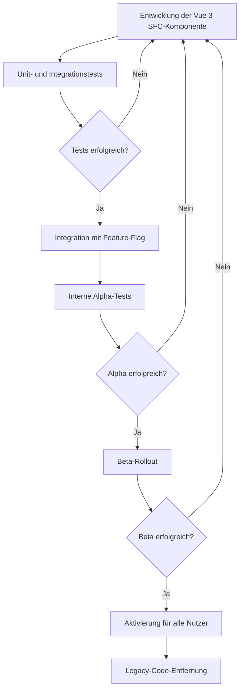

# Vue 3 SFC-Migrationsstrategie

Dieses Dokument beschreibt die umfassende Strategie zur Migration der nscale DMS Assist App von einer Vanilla-JavaScript-Implementierung zu einer modernen Vue 3 Single-File-Components-Architektur.

## Übersicht und Ziele

Die Migration zu Vue 3 SFC verfolgt folgende Hauptziele:

1. **Verbesserte Wartbarkeit und Erweiterbarkeit**
   - Klar definierte Komponentenstruktur
   - Isolierte und testbare Funktionalitäten
   - Bessere Codeorganisation und -lesbarkeit

2. **Moderne Entwicklungserfahrung**
   - Effiziente Entwicklung mit Hot Module Replacement
   - TypeScript-Integration für Typensicherheit
   - Nutzen der Vorteile moderner Toolchains (Vite, Pinia, Vue Test Utils)

3. **Leistungsoptimierung**
   - Verbesserte Rendering-Effizienz
   - Optimierte Bundle-Größen
   - Bessere UX durch reaktive Updates

4. **Technologische Modernisierung**
   - Nutzung der Vue 3 Composition API
   - Integration moderner UI-Praktiken
   - Verbesserte Zugänglichkeit und Benutzererfahrung

## Vorbereitungsphase

Die Vorbereitung ist weitgehend abgeschlossen und umfasst:

### 1. Technologie-Stack-Definition

- **Frontend-Framework**: Vue 3 mit Composition API
- **Build-Tool**: Vite für schnelle Entwicklung und optimierte Production Builds
- **Zustandsverwaltung**: Pinia für typsicheren und modularen Zustand
- **CSS-Strategie**: Scoped CSS mit CSS-Variablen für Theming
- **Typsystem**: TypeScript für Typensicherheit
- **Testing**: Vitest, Vue Test Utils, Cypress

### 2. Projektstruktur

```
/src
  /assets          # Bilder, Schriftarten, etc.
  /components      # Wiederverwendbare UI-Komponenten
    /admin         # Admin-spezifische Komponenten
    /chat          # Chat-bezogene Komponenten
    /common        # Allgemeine UI-Komponenten
  /composables     # Wiederverwendbare Logik (Composition API)
  /services        # API-Clients und andere Dienste
  /stores          # Pinia-Stores für Zustandsverwaltung
  /types           # TypeScript-Typdefinitionen
  /utils           # Allgemeine Hilfsfunktionen
  /views           # Seiten/Routen-Komponenten
  App.vue          # Haupt-App-Komponente
  main.ts          # Anwendungseinstiegspunkt
```

### 3. Migration-Tooling

- **Feature-Flags**: System zur kontrollierten Aktivierung neuer Komponenten
- **Bridge-System**: Kommunikation zwischen altem und neuem Code
- **Automatische Tests**: Validierung der Funktionsparität
- **Build-Konfiguration**: Vite mit optimierten Einstellungen

## Migrationsstrategie

Die Migration folgt einem stufenweisen, inkrementellen Ansatz:

### Phase 1: Infrastruktur (Abgeschlossen)

1. **Vite-Setup**
   - Installation und Konfiguration von Vite
   - Integration mit bestehendem Projekt
   - Optimierte Konfiguration für Entwicklung und Produktion

2. **TypeScript-Integration**
   - TypeScript-Konfiguration
   - Definition grundlegender Typen
   - Migration von JS zu TS für kritische Komponenten

3. **Grundlegendes CSS-System**
   - CSS-Variablen für Theming
   - Einheitliche Styling-Konventionen
   - Basis-Komponentenstile

### Phase 2: Basiskomponenten (In Bearbeitung)

1. **UI-Komponenten-Bibliothek**
   - Buttons, Inputs, Cards, etc.
   - Konsistentes API-Design
   - Vollständig typisiert und getestet

2. **Layout-Komponenten**
   - App-Layout
   - Navigations-Komponenten
   - Responsive Layouts

3. **Feedback-Komponenten**
   - Modals, Toasts, Alerts
   - Loading-Indikatoren
   - Fehleranzeigen

### Phase 3: Kern-Funktionalität (Geplant)

1. **Authentifizierung**
   - Login/Logout-Komponenten
   - Authentifizierungs-Store
   - Berechtigungssystem

2. **Chat-Interface**
   - Nachrichtenliste
   - Eingabekomponente
   - Nachrichtenformatierung

3. **Session-Management**
   - Session-Liste
   - Session-Verwaltung
   - Persistenz und Synchronisation

### Phase 4: Erweiterte Funktionen (Geplant)

1. **Admin-Bereich**
   - Benutzer-Management
   - System-Einstellungen
   - MOTD-Verwaltung

2. **Dokumentenkonverter**
   - Hochlade-Komponente
   - Konvertierungsschnittstelle
   - Ergebnisanzeige

3. **Einstellungen**
   - Benutzerpräferenzen
   - Theme-Switcher
   - Benachrichtigungseinstellungen

### Phase 5: Vollständige Migration (Geplant)

1. **Legacy-Code-Entfernung**
   - Schrittweise Entfernung veralteter Komponenten
   - Aufräumen von Bridge-Code
   - Konsolidierung der Codebasis

2. **Performance-Optimierung**
   - Lazy-Loading von Komponenten
   - Bundle-Optimierung
   - Caching-Strategien

3. **Erweiterte Tests**
   - Vollständige Testabdeckung
   - Leistungstests
   - Visuelle Regressionstests

## Technische Implementierungsdetails

### Feature-Flag-System

```typescript
// stores/featureToggles.ts
import { defineStore } from 'pinia';

export const useFeatureTogglesStore = defineStore('featureToggles', () => {
  const enabledFeatures = ref<Record<string, boolean>>(
    JSON.parse(localStorage.getItem('featureToggles') || '{}')
  );

  // Feature-Flag-Werte mit Standardwerten
  const features = computed(() => ({
    useSfcAuth: enabledFeatures.value.useSfcAuth ?? false,
    useSfcChat: enabledFeatures.value.useSfcChat ?? false,
    useSfcAdmin: enabledFeatures.value.useSfcAdmin ?? false,
    useSfcDocConverter: enabledFeatures.value.useSfcDocConverter ?? false,
    useSfcSettings: enabledFeatures.value.useSfcSettings ?? false,
  }));

  // Prüfen, ob ein Feature aktiviert ist
  function isEnabled(featureName: keyof typeof features.value): boolean {
    return features.value[featureName] ?? false;
  }

  // Ein Feature aktivieren
  function enableFeature(featureName: keyof typeof features.value): void {
    enabledFeatures.value = {
      ...enabledFeatures.value,
      [featureName]: true
    };
    persistFeatures();
  }

  // Ein Feature deaktivieren
  function disableFeature(featureName: keyof typeof features.value): void {
    enabledFeatures.value = {
      ...enabledFeatures.value, 
      [featureName]: false
    };
    persistFeatures();
  }

  // Features im localStorage speichern
  function persistFeatures(): void {
    localStorage.setItem('featureToggles', JSON.stringify(enabledFeatures.value));
  }

  return {
    features,
    isEnabled,
    enableFeature,
    disableFeature
  };
});
```

### Bridge-System zwischen Legacy und Vue 3 SFC

```typescript
// bridge/index.ts
import { watch } from 'vue';
import { useAuthStore } from '@/stores/auth';
import { useSessionStore } from '@/stores/sessions';
import { useUiStore } from '@/stores/ui';

// Typdefinition für globale API
interface NScaleGlobalApi {
  login: (email: string, password: string) => Promise<void>;
  logout: () => void;
  createSession: () => void;
  sendMessage: (sessionId: string, message: string) => Promise<void>;
  onMessagesUpdated?: (messages: any[]) => void;
  onSessionsUpdated?: (sessions: any[]) => void;
  onThemeChanged?: (theme: string) => void;
}

// Bridge initialisieren
export function setupBridge(): void {
  const authStore = useAuthStore();
  const sessionStore = useSessionStore();
  const uiStore = useUiStore();
  
  // Globale API für Legacy-Code
  const globalApi: NScaleGlobalApi = {
    // Authentifizierung
    login: async (email, password) => {
      await authStore.login(email, password);
    },
    logout: () => {
      authStore.logout();
    },
    
    // Sessions
    createSession: async () => {
      await sessionStore.createSession();
    },
    sendMessage: async (sessionId, message) => {
      await sessionStore.sendMessage(sessionId, message);
    }
  };
  
  // API am window-Objekt bereitstellen
  Object.assign(window, { nscaleApi: globalApi });
  
  // Zustandssynchronisation (Von Vue zu Legacy)
  watch(() => sessionStore.sessions, (newSessions) => {
    if (window.nscaleApi.onSessionsUpdated) {
      window.nscaleApi.onSessionsUpdated(newSessions);
    }
  }, { deep: true });
  
  watch(() => sessionStore.messages, (newMessages) => {
    if (window.nscaleApi.onMessagesUpdated) {
      window.nscaleApi.onMessagesUpdated(newMessages);
    }
  }, { deep: true });
  
  watch(() => uiStore.theme, (newTheme) => {
    if (window.nscaleApi.onThemeChanged) {
      window.nscaleApi.onThemeChanged(newTheme);
    }
    
    // Theme-Klasse am Body-Element aktualisieren
    document.body.classList.remove('theme-light', 'theme-dark', 'theme-contrast');
    document.body.classList.add(`theme-${newTheme}`);
  });
}
```

### Fallback-Mechanismus

```vue
<!-- components/common/ErrorBoundary.vue -->
<template>
  <slot v-if="!hasError && !useFallback" />
  <slot v-else-if="hasError" name="error" :error="error" :retry="resetError" />
  <slot v-else name="fallback" />
</template>

<script setup lang="ts">
import { ref, onErrorCaptured, provide } from 'vue';
import { useFeatureTogglesStore } from '@/stores/featureToggles';

const props = defineProps<{
  featureFlag?: string;
  fallbackComponent?: any;
}>();

const featureToggles = useFeatureTogglesStore();
const hasError = ref(false);
const error = ref<Error | null>(null);
const errorCount = ref(0);
const MAX_RETRIES = 3;

// Prüfen, ob Fallback verwendet werden soll
const useFallback = computed(() => {
  // Wenn Feature-Flag deaktiviert ist, Fallback verwenden
  if (props.featureFlag && !featureToggles.isEnabled(props.featureFlag as any)) {
    return true;
  }
  
  // Wenn Fehler zu oft auftritt, Fallback verwenden
  if (errorCount.value >= MAX_RETRIES) {
    return true;
  }
  
  return false;
});

// Fehler abfangen
onErrorCaptured((err) => {
  console.error('Fehler in Komponente:', err);
  error.value = err instanceof Error ? err : new Error(String(err));
  hasError.value = true;
  errorCount.value++;
  
  // Bei zu vielen Fehlern Feature deaktivieren
  if (errorCount.value >= MAX_RETRIES && props.featureFlag) {
    console.warn(`Feature "${props.featureFlag}" wurde nach ${MAX_RETRIES} Fehlern deaktiviert.`);
    featureToggles.disableFeature(props.featureFlag as any);
  }
  
  return false; // Fehlerausbreitung stoppen
});

// Fehler zurücksetzen und neu versuchen
function resetError() {
  hasError.value = false;
  error.value = null;
}

// Error-Boundary-Kontext für Kinder bereitstellen
provide('errorBoundary', {
  hasError,
  error,
  resetError
});
</script>
```

## Stufenweise Aktivierung

Die Aktivierung der Vue 3 SFC-Komponenten erfolgt schrittweise:

1. **Entwicklung & Test**: Komponenten werden isoliert entwickelt und getestet
2. **Parallelbetrieb**: Komponenten werden mit Feature-Flags integriert
3. **Alpha-Freigabe**: Komponenten werden für interne Nutzer aktiviert
4. **Beta-Freigabe**: Komponenten werden für eine größere Nutzergruppe aktiviert
5. **Vollständige Freigabe**: Komponenten werden für alle Nutzer aktiviert
6. **Legacy-Entfernung**: Alte Implementierungen werden entfernt

Für jede Komponente wird folgender Prozess durchlaufen:



## Implementierung des Migrationspfads

Um einen reibungslosen Übergang zu gewährleisten, werden folgende Prinzipien befolgt:

### 1. Komponente für Komponente

Jede Komponente wird einzeln migriert, ohne Abhängigkeiten zu anderen noch nicht migrierten Komponenten.

### 2. Vollständige Tests

Jede Komponente erhält umfangreiche Tests vor der Aktivierung:

```typescript
// tests/components/Button.spec.ts
import { mount } from '@vue/test-utils';
import Button from '@/components/common/Button.vue';
import { describe, it, expect } from 'vitest';

describe('Button.vue', () => {
  it('rendert korrekt mit Standardwerten', () => {
    const wrapper = mount(Button, {
      slots: {
        default: 'Test Button'
      }
    });
    
    expect(wrapper.text()).toBe('Test Button');
    expect(wrapper.classes()).toContain('nscale-btn');
    expect(wrapper.classes()).toContain('nscale-btn--primary');
  });
  
  it('rendert mit verschiedenen Varianten', async () => {
    const wrapper = mount(Button, {
      props: {
        variant: 'secondary'
      },
      slots: {
        default: 'Secondary Button'
      }
    });
    
    expect(wrapper.classes()).toContain('nscale-btn--secondary');
    
    await wrapper.setProps({ variant: 'danger' });
    expect(wrapper.classes()).toContain('nscale-btn--danger');
  });
  
  it('emittet click-Event', async () => {
    const wrapper = mount(Button);
    await wrapper.trigger('click');
    expect(wrapper.emitted('click')).toBeTruthy();
  });
  
  it('ist deaktiviert, wenn disabled=true', async () => {
    const wrapper = mount(Button, {
      props: {
        disabled: true
      }
    });
    
    expect(wrapper.attributes('disabled')).toBeDefined();
    await wrapper.trigger('click');
    expect(wrapper.emitted('click')).toBeFalsy();
  });
});
```

### 3. Parallelimplementierung mit Feature-Flag

Komponenten werden parallel implementiert und über Feature-Flags aktiviert:

```vue
<!-- App.vue -->
<template>
  <div class="app">
    <!-- Header mit Feature-Flag -->
    <error-boundary feature-flag="useSfcHeader">
      <header-component />
      <template #fallback>
        <div id="legacy-header-mount"></div>
      </template>
    </error-boundary>
    
    <!-- Hauptinhalt -->
    <main>
      <router-view />
    </main>
  </div>
</template>

<script setup lang="ts">
import { onMounted } from 'vue';
import { useFeatureTogglesStore } from '@/stores/featureToggles';
import HeaderComponent from '@/components/HeaderComponent.vue';
import ErrorBoundary from '@/components/common/ErrorBoundary.vue';

const featureToggles = useFeatureTogglesStore();

onMounted(() => {
  // Legacy-Code initialisieren, wenn Feature-Flag deaktiviert ist
  if (!featureToggles.isEnabled('useSfcHeader')) {
    initLegacyHeader();
  }
});

function initLegacyHeader() {
  const script = document.createElement('script');
  script.src = '/js/legacy-header.js';
  document.head.appendChild(script);
}
</script>
```

## Zeitleiste und Meilensteine

| Phase | Meilenstein | Geplanter Abschluss |
|-------|-------------|---------------------|
| 1     | Infrastruktur-Setup | Abgeschlossen (Q2 2025) |
| 2     | UI-Komponenten-Bibliothek | Q3 2025 |
| 2     | Layout-Komponenten | Q3 2025 |
| 3     | Authentifizierung | Q3 2025 |
| 3     | Chat-Interface | Q4 2025 |
| 3     | Session-Management | Q4 2025 |
| 4     | Admin-Bereich | Q4 2025 |
| 4     | Dokumentenkonverter | Q1 2026 |
| 4     | Einstellungen | Q1 2026 |
| 5     | Legacy-Code-Entfernung | Q1/Q2 2026 |
| 5     | Performance-Optimierung | Q2 2026 |
| 5     | Abschluss der Migration | Q2 2026 |

## Risiken und Abhilfemaßnahmen

| Risiko | Wahrscheinlichkeit | Auswirkung | Abhilfemaßnahmen |
|--------|-------------------|------------|------------------|
| Komplexität der Bridge | Hoch | Mittel | Robustes Testing, klare Schnittstellen, Dokumentation |
| Inkonsistente Benutzererfahrung | Mittel | Hoch | Visuelle Tests, A/B-Tests, Fallback-Mechanismen |
| Performance-Probleme | Mittel | Mittel | Frühe Performance-Tests, Lazy-Loading, Code-Splitting |
| Browserkompatibilität | Niedrig | Hoch | Cross-Browser-Tests, Polyfills, Feature-Detection |
| Projektplanüberschreitung | Mittel | Mittel | Modulare Migration, klare Prioritäten, Fokus auf Kernfunktionalität |

## Erfolgskriterien

Die Migration gilt als erfolgreich, wenn:

1. Alle Kernfunktionen in Vue 3 SFC implementiert sind
2. Die Anwendung die gleichen oder bessere Performance-Metriken aufweist
3. Die Benutzerzufriedenheit gleich oder besser ist als zuvor
4. Die Codebasis leichter wartbar und erweiterbar ist
5. Neue Entwickler sich schneller einarbeiten können
6. Die Testabdeckung signifikant erhöht wurde

---

Zuletzt aktualisiert: 10.05.2025