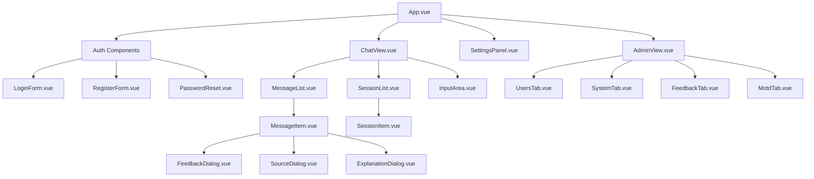

# Komponentenstruktur des nscale DMS Assistenten

Dieses Dokument beschreibt die optimierte Komponentenstruktur für den nscale DMS Assistenten mit Single-File Components (SFC) in Vue 3.

## Überblick

Die neue Komponentenstruktur organisiert den Code in modulare, wiederverwendbare Komponenten, die nach Funktionsbereichen gruppiert sind. Dies verbessert die Wartbarkeit, Testbarkeit und Erweiterbarkeit des Systems.

```
frontend/
├── App.vue                      # Hauptkomponente der Anwendung
├── main.js                      # Einstiegspunkt der Anwendung
├── assets/                      # Statische Assets
├── components/                  # Gemeinsame Komponenten
│   ├── auth/                    # Authentifizierungskomponenten
│   │   ├── LoginForm.vue        # Anmeldeformular
│   │   ├── RegisterForm.vue     # Registrierungsformular
│   │   └── PasswordReset.vue    # Passwort-Zurücksetzung
│   ├── chat/                    # Chat-Komponenten
│   │   ├── ChatView.vue         # Hauptchat-Ansicht
│   │   ├── MessageList.vue      # Nachrichtenliste
│   │   ├── MessageItem.vue      # Einzelne Nachricht
│   │   ├── InputArea.vue        # Chat-Eingabebereich
│   │   ├── SessionList.vue      # Liste der Chat-Sessions
│   │   └── SessionItem.vue      # Einzelne Chat-Session
│   ├── admin/                   # Admin-Komponenten
│   │   ├── AdminView.vue        # Admin-Hauptansicht
│   │   ├── UsersTab.vue         # Benutzerverwaltung
│   │   ├── SystemTab.vue        # Systemüberwachung
│   │   ├── FeedbackTab.vue      # Feedback-Übersicht
│   │   └── MotdTab.vue          # MOTD-Editor
│   ├── settings/                # Einstellungen-Komponenten
│   │   └── SettingsPanel.vue    # Einstellungen-Panel
│   ├── feedback/                # Feedback-Komponenten
│   │   └── FeedbackDialog.vue   # Feedback-Dialog
│   ├── source/                  # Quellenreferenz-Komponenten
│   │   ├── SourceDialog.vue     # Quellen-Dialog
│   │   └── ExplanationDialog.vue# Erklärungs-Dialog
│   └── ui/                      # UI-Komponenten
│       ├── NScaleButton.vue     # Button-Komponente
│       ├── NScaleCard.vue       # Card-Komponente
│       ├── NScaleInput.vue      # Input-Komponente
│       └── NScaleAlert.vue      # Alert-Komponente
├── composables/                 # Kompositionsfunktionen
│   ├── useAuth.js               # Authentifizierungsfunktionen
│   ├── useChat.js               # Chat-Funktionen
│   ├── useSession.js            # Session-Management
│   ├── useFeedback.js           # Feedback-Funktionen
│   ├── useMotd.js               # MOTD-Funktionen
│   ├── useSourceReferences.js   # Quellenreferenz-Funktionen
│   └── useSettings.js           # Einstellungsfunktionen
├── stores/                      # Zustandsverwaltung mit Pinia
│   ├── auth.js                  # Authentifizierungs-Store
│   ├── chat.js                  # Chat-Store
│   ├── session.js               # Session-Store
│   ├── admin.js                 # Admin-Store
│   ├── feedback.js              # Feedback-Store
│   ├── motd.js                  # MOTD-Store
│   └── settings.js              # Einstellungs-Store
└── utils/                       # Hilfsfunktionen
    ├── api.js                   # API-Funktionen
    ├── formatters.js            # Text-Formatierungsfunktionen
    ├── validators.js            # Validierungsfunktionen
    └── constants.js             # Konstanten
```

## Komponentenhierarchie



## Implementierungsansatz

Die Modernisierung erfolgt in drei Hauptphasen:

1. **Vorbereitungsphase**: Extraktion von Zuständen in Stores
2. **Komponentenphase**: Erstellung der SFCs und Ersetzung der DOM-Manipulation
3. **Integrationsphase**: Verbindung von Komponenten und Stores

## Migrationsstrategie

Die Migration wird schrittweise erfolgen:

1. Entwicklung der neuen Komponentenstruktur parallel zur bestehenden Implementierung
2. Migration der Funktionalität in kleinen, testbaren Einheiten
3. Feature-Toggle-System für die schrittweise Aktivierung neuer Komponenten
4. Umfassende Tests vor jedem Migrationsschritt
5. Fallback-Mechanismen zur Sicherstellung der Systemstabilität

## Beispiel: Feature-Toggle für schrittweise Migration

```javascript
// In stores/featureToggles.js
import { defineStore } from 'pinia';

export const useFeatureTogglesStore = defineStore('featureToggles', {
  state: () => ({
    // Komponenten mit modernem SFC-Ansatz
    useSfcAuth: false,
    useSfcChat: false,
    useSfcAdmin: false,
    useSfcSettings: false,
    
    // Funktionen mit Composition API
    useComposableAuth: false,
    useComposableChat: false,
    useComposableSession: false
  }),
  
  actions: {
    enableFeature(feature) {
      if (this[feature] !== undefined) {
        this[feature] = true;
      }
    },
    
    disableFeature(feature) {
      if (this[feature] !== undefined) {
        this[feature] = false;
      }
    },
    
    toggleFeature(feature) {
      if (this[feature] !== undefined) {
        this[feature] = !this[feature];
      }
    }
  }
});
```

## Beispiel: Bridge für alte und neue Implementierung

```javascript
// In main.js
import { createApp } from 'vue';
import { createPinia } from 'pinia';
import App from './App.vue';
import { useFeatureTogglesStore } from './stores/featureToggles';

// Legacy-Import
import './js/app-vanilla.js';

const app = createApp(App);
const pinia = createPinia();
app.use(pinia);
app.mount('#app');

// Bridge zwischen altem globalen Zustand und neuen Stores
const featureToggles = useFeatureTogglesStore(pinia);

// Legacy-Fallback (nur wenn neue Komponente nicht aktiv ist)
if (!featureToggles.useSfcChat) {
  // Initialisiere Legacy-Chat
  window.initLegacyChat();
}
```