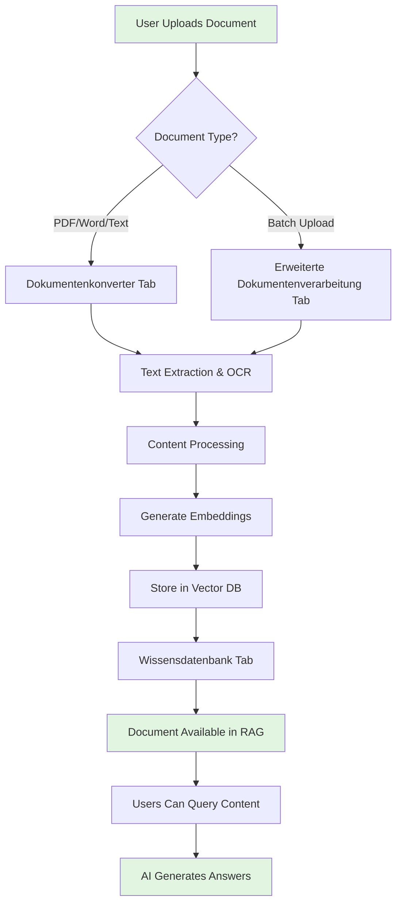

# Document Upload Workflow Guide

## 📄 Overview

This guide explains the complete document upload workflow in the nscale Digital Assistant, from initial upload to full RAG (Retrieval-Augmented Generation) integration. It covers the three main admin tabs for document management and when to use each one.

## 🎯 Quick Reference: Which Tab to Use?

| Task | Use This Tab | Purpose |
|------|--------------|---------|
| **Upload & Convert Documents** | Dokumentenkonverter | Initial document processing, OCR, format conversion |
| **Manage Knowledge Base** | Wissensdatenbank | View, search, and organize processed documents |
| **Advanced Processing** | Erweiterte Dokumentenverarbeitung | Batch processing, quality control, reprocessing |

## 📊 Complete Workflow Diagram



## 📁 Tab 1: Dokumentenkonverter (Document Converter)

### Purpose
The primary entry point for uploading individual documents to the system.

### When to Use
- Uploading single documents
- Quick document conversion
- Testing document processing
- Viewing processing status

### Features
- **File Upload**: Drag & drop or browse for files
- **Format Support**: PDF, DOCX, TXT, RTF, and more
- **OCR Processing**: Automatic text extraction from scanned documents
- **Preview**: View extracted content before processing
- **Status Tracking**: Real-time processing status

### Backend Process
```
1. File Upload → API Endpoint: /api/doc-converter/upload
2. Format Detection → Determine file type and processing method
3. Text Extraction → Extract text using appropriate library
4. OCR (if needed) → Process images/scanned content
5. Content Cleaning → Remove formatting, normalize text
6. Temporary Storage → Save processed content for review
```

### Step-by-Step Usage
1. Navigate to Admin Panel → Dokumentenkonverter
2. Click "Upload Document" or drag file to upload area
3. Select file(s) from your computer
4. Review extraction preview
5. Click "Process Document"
6. Monitor progress bar
7. Document appears in Wissensdatenbank when complete

## 📚 Tab 2: Wissensdatenbank (Knowledge Database)

### Purpose
Central repository for all processed documents available to the RAG system.

### When to Use
- Viewing all processed documents
- Searching existing knowledge
- Managing document metadata
- Removing outdated content
- Checking embedding status

### Features
- **Document List**: Table view of all documents
- **Search**: Full-text search across documents
- **Filters**: By date, type, status, quality score
- **Metadata Editor**: Edit titles, tags, descriptions
- **Quality Metrics**: View embedding quality scores
- **Delete/Archive**: Remove or archive documents

### Backend Process
```
1. Query Documents → API: /api/knowledge/documents
2. Load Metadata → Fetch from PostgreSQL
3. Check Embeddings → Verify vector DB status
4. Calculate Stats → Document count, storage size
5. Return Results → Paginated document list
```

### Document States
- 🟢 **Active**: Fully processed and searchable
- 🟡 **Processing**: Currently being embedded
- 🔴 **Failed**: Processing error occurred
- ⚫ **Archived**: Removed from active search

## 🔧 Tab 3: Erweiterte Dokumentenverarbeitung (Advanced Document Processing)

### Purpose
Advanced features for batch processing, quality control, and document reprocessing.

### When to Use
- Uploading multiple documents at once
- Reprocessing documents with updated settings
- Quality improvement for existing documents
- Batch operations (delete, archive, tag)
- Custom processing pipelines

### Features
- **Batch Upload**: Process multiple files simultaneously
- **Processing Queue**: View and manage processing queue
- **Quality Control**: Set quality thresholds
- **Reprocessing**: Update embeddings with new models
- **Custom Pipelines**: Configure processing steps
- **Bulk Operations**: Apply actions to multiple documents

### Backend Process
```
1. Batch Upload → API: /api/advanced-docs/batch
2. Queue Creation → Add to background job queue
3. Parallel Processing → Process multiple documents
4. Quality Check → Validate extraction quality
5. Batch Embedding → Generate embeddings in batches
6. Status Updates → WebSocket notifications
```

### Advanced Settings
- **Chunk Size**: Control text splitting (default: 512 tokens)
- **Overlap**: Set chunk overlap (default: 50 tokens)
- **Quality Threshold**: Minimum quality score (0-100)
- **Processing Priority**: High/Normal/Low
- **Custom Metadata**: Add batch-level metadata

## 🔄 Complete Backend Workflow

### ASCII Flow Diagram
```
┌─────────────────┐     ┌──────────────────┐     ┌─────────────────┐
│   User Upload   │────▶│ Document Parser  │────▶│ Text Extractor  │
└─────────────────┘     └──────────────────┘     └─────────────────┘
                                                           │
                                                           ▼
┌─────────────────┐     ┌──────────────────┐     ┌─────────────────┐
│  Vector Store   │◀────│ Embedding Model  │◀────│   Text Chunks   │
└─────────────────┘     └──────────────────┘     └─────────────────┘
         │
         ▼
┌─────────────────┐     ┌──────────────────┐     ┌─────────────────┐
│   RAG Engine    │────▶│  Query Processor │────▶│   AI Response   │
└─────────────────┘     └──────────────────┘     └─────────────────┘
```

### Detailed Process Steps

1. **Document Reception** (0-1s)
   - File validation
   - Virus scanning
   - Format detection

2. **Content Extraction** (1-5s)
   - Text extraction for native formats
   - OCR for scanned documents
   - Metadata extraction

3. **Text Processing** (2-10s)
   - Content cleaning
   - Language detection
   - Text normalization

4. **Chunking** (1-3s)
   - Split into semantic chunks
   - Maintain context windows
   - Add chunk metadata

5. **Embedding Generation** (5-30s)
   - Load embedding model
   - Generate vector representations
   - Calculate quality scores

6. **Storage** (1-2s)
   - Store in PostgreSQL (metadata)
   - Store in ChromaDB (vectors)
   - Update search indices

7. **RAG Integration** (instant)
   - Document available for queries
   - Appears in knowledge base
   - Ready for AI responses

## 💡 Best Practices

### For Dokumentenkonverter
- ✅ Use for individual important documents
- ✅ Preview content before processing
- ✅ Add meaningful titles and descriptions
- ❌ Don't use for batch uploads (>10 files)

### For Wissensdatenbank
- ✅ Regularly review document quality scores
- ✅ Archive outdated documents
- ✅ Use tags for better organization
- ✅ Monitor storage usage

### For Erweiterte Dokumentenverarbeitung
- ✅ Use for large document batches
- ✅ Set appropriate quality thresholds
- ✅ Use priority settings wisely
- ✅ Monitor processing queue

## 🚨 Troubleshooting

### Common Issues and Solutions

| Issue | Cause | Solution |
|-------|-------|----------|
| **Upload Fails** | File too large | Use Advanced Processing for files >10MB |
| **OCR Poor Quality** | Low resolution scan | Rescan at 300+ DPI |
| **Slow Processing** | Large batch | Use priority queue in Advanced tab |
| **Missing in RAG** | Processing failed | Check status in Wissensdatenbank |
| **Poor Search Results** | Bad embeddings | Reprocess with higher quality settings |

## 📈 Performance Metrics

### Processing Times (Average)
- **PDF (Text)**: 2-5 seconds
- **PDF (Scanned)**: 10-30 seconds
- **Word Document**: 1-3 seconds
- **Large Batch (100 docs)**: 5-15 minutes

### Quality Scores
- **90-100**: Excellent - Full text extraction
- **70-89**: Good - Minor issues
- **50-69**: Fair - Some content missing
- **Below 50**: Poor - Consider reprocessing

## 🔐 Security & Permissions

### Required Permissions
- **Dokumentenkonverter**: `doc_converter.upload`
- **Wissensdatenbank**: `knowledge.view`, `knowledge.edit`
- **Advanced Processing**: `advanced_docs.manage`

### Data Privacy
- Documents are stored encrypted
- Access logs are maintained
- Automatic cleanup after 90 days (configurable)

## 📝 Example Workflows

### Workflow 1: Single Document Upload
```
1. Admin opens Dokumentenkonverter
2. Uploads "nscale-manual.pdf"
3. Reviews extracted text
4. Clicks "Process"
5. Document appears in Wissensdatenbank
6. Users can now ask questions about nscale
```

### Workflow 2: Batch Processing
```
1. Admin opens Erweiterte Dokumentenverarbeitung
2. Selects 50 policy documents
3. Sets quality threshold to 80%
4. Initiates batch upload
5. Monitors progress queue
6. Reviews results in Wissensdatenbank
7. Reprocesses failed documents
```

### Workflow 3: Knowledge Base Maintenance
```
1. Admin opens Wissensdatenbank
2. Filters by "Last Updated > 1 year"
3. Reviews outdated documents
4. Archives obsolete content
5. Reprocesses important documents
6. Updates metadata and tags
```

## 🎯 Quick Decision Tree

```
Need to upload documents?
│
├─ Single document? → Dokumentenkonverter
│
├─ Multiple documents? → Erweiterte Dokumentenverarbeitung
│
└─ Manage existing? → Wissensdatenbank
```

## 📞 Support

For additional help:
- Check system logs in Admin System tab
- Review processing errors in Advanced Processing
- Contact support with document ID and error message

---

*Last Updated: June 2025 | Version: 1.0.0*