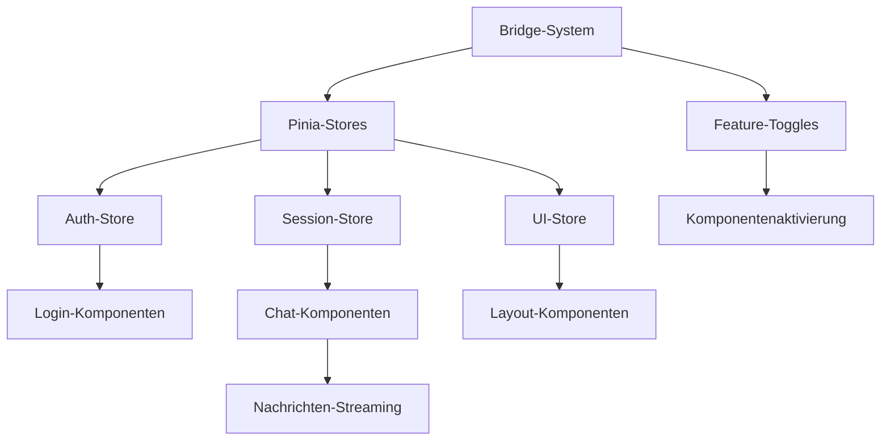

# nscale DMS Assistenten - Migrationsstatus und strategischer Fahrplan

## Executive Summary

Der nscale DMS Assistent befindet sich inmitten einer umfassenden Migration von Vanilla JavaScript zu Vue 3 Single File Components (SFCs). Diese Analyse liefert eine faktenbasierte Bestandsaufnahme des aktuellen Migrationsstatus, identifiziert Risiken und liefert konkrete Handlungsempfehlungen für die erfolgreiche Fortführung der Migration.

### Wichtigste Erkenntnisse

1. **Migrationsfortschritt**: Die Migration ist zu ca. **40%** abgeschlossen, mit starkem Fokus auf Infrastruktur (95%), Admin-Bereich (75%) und Dokumentenkonverter (50%). Das Chat-Interface ist mit 30% weniger weit fortgeschritten.

2. **Technische Qualität**: Die implementierten Vue 3-Komponenten und Pinia-Stores zeigen eine hohe Qualität mit ausgezeichneter TypeScript-Integration, konsistenter Verwendung des Composition API und robusten Fehlerbehandlungsmechanismen.

3. **Bridge-System**: Das Bridge-System für die Kommunikation zwischen Legacy- und Vue-Code ist technisch ausgereift mit Selbstheilungsmechanismen, optimierten Ereignisübertragungen und zuverlässiger Zustandssynchronisation.

4. **Risiken**: Die identifizierten Hauptrisiken liegen in der unvollständigen Testabdeckung (besonders für Stores), potenziellen Performance-Bottlenecks in der Bridge sowie Inkonsistenzen im CSS-Design-System.

### Empfohlene Schwerpunkte

1. **Kurzfristig (1-3 Monate)**: Verbessern der Testabdeckung, Stabilisieren der Chat-Komponenten, Standardisieren des CSS-Design-Systems
2. **Mittelfristig (3-6 Monate)**: Vervollständigen der Chat-Interface-Migration, Implementieren von End-to-End-Tests, Optimieren der Bridge-Performance
3. **Langfristig (6-12 Monate)**: Vollständige Migration aller verbleibenden Komponenten, schrittweise Entfernung des Legacy-Codes, Optimierung der Gesamtanwendung

## 1. Umfassende Bestandsaufnahme und Gap-Analyse

### 1.1 Codebasis-Analyse

| Bereich | Migrationsfortschritt | Qualitätsbewertung | Hauptlücken |
|---------|----------------------|-------------------|------------|
| Infrastruktur | 95% | Sehr gut | CSS-Standardisierung |
| Basis-UI-Komponenten | 85% | Ausgezeichnet | Integration mit Theming-System |
| Admin-Panel | 75% | Sehr gut | Fehlende Tests für komplexe Interaktionen |
| Dokumentenkonverter | 50% | Ausgezeichnet | Unvollständige Mobile-Optimierung |
| Chat-Interface | 30% | Gut | Streaming-Integration, Virtualisierung |
| Session-Management | 60% | Sehr gut | Komplexe Zustandsübergänge |
| Bridge-System | 85% | Ausgezeichnet | Performance-Optimierungspotential |
| Pinia-Stores | 70% | Sehr gut | Fehlende Store-Tests |

#### Implementierte Vue 3 SFCs

Die implementierten Vue 3-Komponenten zeigen eine durchgängig hohe Qualität mit:
- Konsequenter Verwendung des Composition API mit `<script setup>`
- Starker TypeScript-Integration
- Auslagerung komplexer Logik in wiederverwendbare Composables
- Konsistenter Error-Handling-Strategie
- Guter Barrierefreiheit durch ARIA-Attribute und Fokusmanagement

**Lücken**: Inkonsistenzen im CSS-Design (unterschiedliche Variablen-Benennungen), unvollständige Unit-Tests für einige Komponenten.

#### Legacy-Code und Bridge-Integration

Der Legacy-Code ist gut strukturiert und durch das Bridge-System effektiv mit den neuen Vue-Komponenten verbunden. Die Bridge-Implementierung bietet:

- Robuste Fehlerbehandlung und Selbstheilungsmechanismen
- Effiziente Zustandssynchronisation
- Optimiertes Event-Handling mit Batching-Funktionalität
- Detaillierte Diagnose- und Logging-Funktionen

**Lücken**: Potenzielle Performance-Bottlenecks bei komplexen Zustandsänderungen, nicht vollständig getestete Fehlerszenarien.

### 1.2 Dokumentations-Analyse

| Dokumentationsbereich | Vollständigkeit | Übereinstimmung mit Code | Qualität |
|-----------------------|----------------|--------------------------|---------|
| Migrationsstrategie | Sehr gut | Gut | Ausgezeichnet |
| Komponenten-Dokumentation | Gut | Sehr gut | Gut |
| Bridge-System | Ausgezeichnet | Ausgezeichnet | Ausgezeichnet |
| Pinia-Store-Architektur | Ausgezeichnet | Sehr gut | Ausgezeichnet |
| Test-Strategie | Mäßig | Mäßig | Gut |
| Fallback-Mechanismen | Gut | Gut | Gut |

#### Cross-Check zwischen Code und Dokumentation

Die Dokumentation spiegelt größtenteils den aktuellen Implementierungsstand wider, mit einigen Ausnahmen:

- Die angegebene Testabdeckung (30%) scheint höher als die tatsächlich implementierten Tests vermuten lassen
- Der Dokumentenkonverter ist laut Dokumentation zu 50% migriert, was mit dem Code übereinstimmt
- Die Dokumentation zum CSS-Design-System zeigt mehr Konsistenz als die tatsächliche Implementierung

**Lücken**: Fehlende detaillierte Dokumentation zur Test-Strategie für Stores, unvollständige End-to-End-Test-Dokumentation.

## 2. Fortschrittsanalyse der kritischen Systeme

### 2.1 Chat-System

Das Chat-System ist zu etwa 30% migriert, mit folgenden Komponenten:
- `MessageItem.vue` und `MessageList.vue` als Basis
- Erweiterte Komponenten wie `VirtualMessageList.vue` für Performance-Optimierung
- Teilweise implementierte Streaming-Unterstützung

**Stärken**:
- Gute Komponenten-Architektur mit klarer Trennung der Verantwortlichkeiten
- Hervorragende TypeScript-Integration
- Optimierte Rendering-Performance durch Virtualisierung
- Gute Barrierefreiheit

**Lücken**:
- Unvollständige Migration der fortgeschrittenen Streaming-Funktionalität
- Fehlende Integration mit dem Self-Healing-Mechanismus bei Verbindungsabbrüchen
- Lückenhafte Tests für Edge-Cases (z.B. sehr lange Nachrichten, Netzwerkfehler)

### 2.2 Dokumentenkonverter

Der Dokumentenkonverter ist zu etwa 50% migriert, mit implementierten Komponenten für:
- Datei-Upload und Validierung
- Konvertierungsfortschritt
- Dokumentenliste und -vorschau
- Fehleranzeige und -behandlung

**Stärken**:
- Vollständiger Feature-Satz für grundlegende Funktionalität
- Ausgezeichnete Fehlerbehandlung
- Gute Integration mit Pinia-Stores
- Vollständige TypeScript-Typisierung

**Lücken**:
- Unvollständige Integration fortgeschrittener Filterfunktionen
- Fehlende Batch-Operationen für mehrere Dokumente
- Verbesserungspotential bei der mobilen Optimierung

### 2.3 Admin-Panel

Der Admin-Bereich ist zu etwa 75% migriert, mit vollständigen Implementierungen für:
- Benutzer-Management
- System-Einstellungen
- Feature-Toggle-Verwaltung
- Basis-Layout und Navigation

**Stärken**:
- Klar strukturierte Komponenten mit Tab-basierter Navigation
- Gute TypeScript-Integration
- Effektives Store-Management für Admin-Daten

**Lücken**:
- Unvollständige Statistik- und Reporting-Funktionen
- Verbesserungspotential bei der responsiven Darstellung auf kleinen Bildschirmen
- Lückenhafte Testabdeckung für komplexe Interaktionen

### 2.4 Bridge-System und Feature-Toggles

Das Bridge-System und die Feature-Toggles sind ausgereift und produktionsbereit:

**Stärken**:
- Robuste Fehlerbehandlung mit Selbstheilungsmechanismen
- Effiziente Zustandssynchronisation
- Umfassendes Feature-Toggle-System mit Abhängigkeitsverwaltung
- Ausgezeichnete Diagnose- und Logging-Funktionen

**Lücken**:
- Potenzielle Performance-Optimierungen bei komplexen Zustandsänderungen
- Vereinfachungspotential für einfachere Komponenten

### 2.5 Test-Infrastruktur

Die Test-Infrastruktur ist grundlegend vorhanden, aber mit Ausbaubedarf:

**Stärken**:
- Gut konfigurierte Vitest-Umgebung
- Klare Test-Patterns für Komponenten
- Vorhandene Integrationstests für kritische Funktionalität

**Lücken**:
- Fehlende spezifische Store-Tests
- Keine End-to-End-Tests
- Unvollständige Abdeckung aller Vue-Komponenten
- Fehlende automatisierte Performance-Tests

## 3. Risikobewertung

### 3.1 Technische Risiken

| Risiko | Wahrscheinlichkeit | Auswirkung | Mitigationsstrategie |
|--------|-------------------|------------|---------------------|
| CSS-Inkonsistenzen führen zu visuellen Fehlern | Hoch | Mittel | Design-System standardisieren |
| Bridge-Performance-Engpässe bei komplexen Interaktionen | Mittel | Hoch | Performance-Optimierungen und Monitoring |
| Unentdeckte Bugs durch mangelnde Testabdeckung | Hoch | Hoch | Testabdeckung erhöhen, insbesondere für Stores |
| Fehler in der Zustandssynchronisation bei Netzwerkproblemen | Mittel | Hoch | Verbesserte Fehlerbehandlung und Wiederherstellung |
| Regressionsfehler bei weiterer Migration | Mittel | Mittel | End-to-End-Tests implementieren |

### 3.2 Projektrisiken

| Risiko | Wahrscheinlichkeit | Auswirkung | Mitigationsstrategie |
|--------|-------------------|------------|---------------------|
| Verzögerungen durch komplexere als erwartete Migration des Chat-Systems | Hoch | Mittel | Fokus auf Chat-Migration priorisieren |
| Unvollständige Dokumentation führt zu Missverständnissen | Mittel | Mittel | Dokumentation konsolidieren und aktualisieren |
| Übermäßige Fokussierung auf Feature-Entwicklung vs. Migration | Mittel | Hoch | Klare Priorisierung der Migration |
| Wachsende technische Schulden durch teilmigrierte Komponenten | Mittel | Mittel | Regelmäßiges Refactoring nach Migration |

### 3.3 Root-Cause-Analyse für verzögerte Komponenten

Die Chat-Komponenten zeigen den geringsten Migrationsfortschritt (30%). Hauptursachen:

1. **Komplexität**: Streaming-Funktionalität und Zustandsmanagement sind technisch anspruchsvoll
2. **Zentralität**: Das Chat-System ist ein Kernbestandteil der Anwendung, daher ist das Risiko höher
3. **Abhängigkeiten**: Abhängigkeiten vom Session-Management und der Authentifizierung
4. **Priorisierung**: Fokus lag bisher auf Admin-Bereich und Dokumentenkonverter

## 4. Datengestützte Empfehlungen

### 4.1 Strategische Empfehlungen

#### Migrationsreihenfolge

Basierend auf der Analyse empfehlen wir folgende Migrationspriorisierung:

1. **Chat-System vervollständigen** (höchste Priorität)
   - Streaming-Funktionalität abschließen
   - Virtualisierung für große Nachrichtenlisten optimieren
   - Integration mit dem Bridge-System verbessern

2. **CSS-Design-System standardisieren** (hohe Priorität)
   - Einheitliche Variablen-Benennung durchsetzen
   - Theming-System konsolidieren
   - Responsive Breakpoints standardisieren

3. **Testabdeckung erhöhen** (hohe Priorität)
   - Store-Tests implementieren
   - End-to-End-Tests für kritische Benutzerflüsse hinzufügen
   - Komponententestabdeckung erweitern

4. **Bridge-Performance optimieren** (mittlere Priorität)
   - Event-Batching-Mechanismen verbessern
   - Selektive Synchronisation implementieren
   - Performance-Monitoring erweitern

5. **Verbleibende UI-Komponenten migrieren** (mittlere Priorität)
   - Verbleibende Layout-Komponenten
   - Fortgeschrittene Einstellungen-UI
   - Hilfe und Dokumentation

#### Vollständiges Redesign vs. schrittweise Migration

Für das Chat-System empfehlen wir ein **teilweises Redesign**, keine von Grund auf neue Implementierung:
- Kernlogik und Datenfluß beibehalten
- UI-Komponenten neu strukturieren für bessere Wartbarkeit
- Performance-Optimierungen von Grund auf implementieren

Für andere Komponenten ist die **schrittweise Migration** weiterhin der beste Ansatz.

### 4.2 Taktische Empfehlungen

#### Bridge-System

1. Implementieren eines selektiven Subscription-Mechanismus für die Zustandssynchronisation
2. Erweitern der Selbstheilungsstrategien für Chat-spezifische Fehlerszenarien
3. Optimieren des Event-Batching für häufige Ereignisse (Nachrichten-Updates)

#### Testabdeckung

1. Implementieren dedizierter Store-Tests mit Fokus auf:
   - Authentifizierungslogik und Token-Refresh
   - Session-Management und Nachrichten-Synchronisation
   - UI-Zustandsübergänge

2. Erstellen von End-to-End-Tests für kritische Benutzerflüsse:
   - Login und Authentifizierung
   - Chat-Session-Verwaltung
   - Dokumentkonvertierung

#### Feature-Toggle-System

1. Ergänzen des Toggle-Monitorings mit Leistungskennzahlen
2. Implementieren einer Toggle-Gruppenverwaltung für zusammenhängende Features
3. Entwickeln einer Feature-Aktivierungs-Timeline für bessere Planung

## 5. Detaillierter Aktionsplan

### 5.1 Kurzfristige Maßnahmen (1-3 Monate)

| Aktion | Priorität | Verantwortlichkeit | Abhängigkeiten | Erfolgskriterien |
|--------|-----------|-------------------|---------------|------------------|
| Store-Tests implementieren | Hoch | Entwicklung | Keine | 90% Testabdeckung für Auth, Sessions und UI-Stores |
| CSS-Design-System standardisieren | Hoch | Frontend | Keine | Einheitliche Variable-Namen, dokumentierte Design-Tokens |
| Chat-Streaming-Komponenten vervollständigen | Hoch | Frontend, Backend | Feature-Toggles | Vollständige Streaming-Unterstützung mit Fehlerbehandlung |
| Bridge-Performance-Monitoring verbessern | Mittel | Frontend | Keine | Echtzeit-Performance-Metriken mit Alerts |
| Komponententests erweitern | Mittel | Entwicklung | Keine | 70% Testabdeckung für alle Vue-Komponenten |

### 5.2 Mittelfristige Ziele (3-6 Monate)

| Aktion | Priorität | Verantwortlichkeit | Abhängigkeiten | Erfolgskriterien |
|--------|-----------|-------------------|---------------|------------------|
| Chat-Interface-Migration abschließen | Hoch | Frontend | Chat-Streaming | Vollständiges Vue 3 Chat-Interface mit Feature-Parity |
| End-to-End-Tests implementieren | Hoch | QA, Entwicklung | Komponententests | 10 kritische E2E-Testfälle automatisiert |
| Bridge-Performance optimieren | Mittel | Frontend | Performance-Monitoring | 25% Verbesserung bei Event-Durchsatz |
| Mobile Optimierung verbessern | Mittel | Frontend | CSS-Design-System | Funktionale UI auf allen Bildschirmgrößen |
| Dokumentenkonverter-Migration abschließen | Mittel | Frontend, Backend | Keine | 100% Feature-Parity mit Legacy-System |

### 5.3 Langfristige Strategie (6-12 Monate)

| Aktion | Priorität | Verantwortlichkeit | Abhängigkeiten | Erfolgskriterien |
|--------|-----------|-------------------|---------------|------------------|
| Vollständige Migration aller verbleibenden Komponenten | Hoch | Alle | Kurzfristige Ziele | 100% Vue 3 Komponenten |
| Legacy-Code schrittweise entfernen | Mittel | Entwicklung | Komponenten-Migration | 0% Legacy-Code im Produktions-Bundle |
| Performance-Optimierung der Gesamtanwendung | Mittel | Performance | Migration | Core Web Vitals im grünen Bereich |
| Erweiterte Barrierefreiheit implementieren | Mittel | Frontend | Migration | WCAG 2.1 AA Konformität |
| Design-System dokumentieren und veröffentlichen | Niedrig | Dokumentation | CSS-Standardisierung | Vollständiges Storybook mit allen Komponenten |

## 6. Visualisierung und Zusammenfassung

### 6.1 Aktueller Migrationsstand

```
┌─────────────────────────────┐
│ Infrastruktur        [95%]  │
├─────────────────────────────┤
│ Basis-UI-Komponenten [85%]  │
├─────────────────────────────┤
│ Admin-Panel          [75%]  │
├─────────────────────────────┤
│ Dokumentenkonverter  [50%]  │
├─────────────────────────────┤
│ Session-Management   [60%]  │
├─────────────────────────────┤
│ Bridge-System        [85%]  │
├─────────────────────────────┤
│ Pinia-Stores         [70%]  │
├─────────────────────────────┤
│ Chat-Interface       [30%]  │
└─────────────────────────────┘
   Gesamtfortschritt:  ~40%
```

### 6.2 Kritische Komponenten und Abhängigkeiten



### 6.3 Empfohlener Migrationspfad

**Phase 1 (1-3 Monate):**
1. Testabdeckung erhöhen
2. CSS-Design-System standardisieren
3. Chat-Streaming vervollständigen

**Phase 2 (3-6 Monate):**
1. Chat-Interface komplett migrieren
2. End-to-End-Tests einführen
3. Dokumentenkonverter abschließen

**Phase 3 (6-12 Monate):**
1. Verbleibende Komponenten migrieren
2. Legacy-Code entfernen
3. Gesamtoptimierung

### 6.4 Komponenten-Status-Übersicht

| Komponente | Status | Qualität | Testabdeckung | Priorität |
|------------|--------|----------|--------------|-----------|
| Login/Auth | 60% | Sehr gut | Mittel | Mittel |
| Chat-Nachrichten | 40% | Gut | Niedrig | Hoch |
| Chat-Streaming | 20% | Mäßig | Niedrig | Sehr hoch |
| Dokumentenkonverter | 50% | Sehr gut | Hoch | Mittel |
| Admin-Panel | 75% | Sehr gut | Mittel | Niedrig |
| Fehlerbehandlung | 70% | Ausgezeichnet | Mittel | Mittel |
| Basis-UI | 85% | Ausgezeichnet | Hoch | Niedrig |
| Bridge-System | 85% | Ausgezeichnet | Mittel | Niedrig |
| Feature-Toggles | 100% | Ausgezeichnet | Hoch | Niedrig |

## Fazit

Der nscale DMS Assistent zeigt einen soliden Migrationsfortschritt mit hervorragender technischer Qualität der implementierten Vue 3-Komponenten. Die größten Herausforderungen liegen in der Vervollständigung des Chat-Systems, der Standardisierung des CSS-Design-Systems und der Erweiterung der Testabdeckung.

Mit einem fokussierten Ansatz auf die identifizierten Prioritäten kann die Migration innerhalb des geplanten Zeitrahmens erfolgreich abgeschlossen werden. Die vorhandene Bridge-Architektur bietet eine solide Grundlage für die schrittweise Migration bei gleichzeitiger Aufrechterhaltung der Produktionsstabilität.

Die empfohlenen Maßnahmen adressieren sowohl kurzfristige technische Schulden als auch langfristige strategische Ziele, um eine moderne, wartbare und leistungsfähige Anwendung zu gewährleisten.