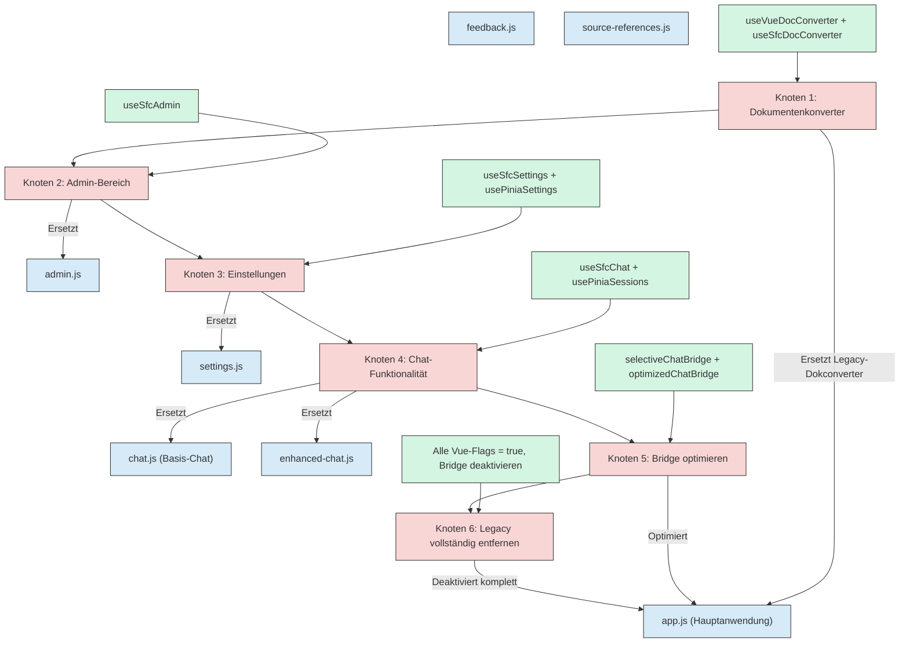

# Abhängigkeitsdiagramm Legacy-Komponenten

```mermaid
graph TD
    %% Hauptkomponenten
    app["app.js (Hauptanwendung)"]
    chat["chat.js (Basis-Chat)"]
    enhanced["enhanced-chat.js (Erweiterte Chat-Funktionalität)"]
    feedback["feedback.js (Feedback-System)"]
    admin["admin.js (Admin-Funktionen)"]
    settings["settings.js (Einstellungen)"]
    sources["source-references.js (Quellenverweise)"]
    abtests["ab-testing.js (A/B-Tests)"]
    
    %% Hilfsmodule für enhanced-chat
    apiClient["api-client.js"]
    errorHandler["error-handler.js"]
    selfHealing["self-healing.js"]
    
    %% Bridge-System
    bridge["Bridge (index.ts)"]
    bridgeCore["bridgeCore.ts"]
    chatBridge["chatBridge.ts"]
    optimizedBridge["optimizedChatBridge.ts"]
    selectiveBridge["selectiveChatBridge.ts"]
    storeBridge["storeBridge.ts"]
    
    %% Vue-Komponenten
    vueChat["Vue Chat-Komponenten"]
    vueAdmin["Vue Admin-Komponenten"]
    vueSettings["Vue Einstellungen"]
    vueDocConverter["Vue Dokumentenkonverter"]
    
    %% Feature-Flags
    featureFlags["Feature-Flags-System"]
    
    %% Pinia-Stores
    piniaAuth["Auth Store"]
    piniaSessions["Sessions Store"]
    piniaUI["UI Store"]
    piniaSettings["Settings Store"]
    piniaDocConverter["DocConverter Store"]
    
    %% Abhängigkeiten von app.js
    app -->|importiert| chat
    app -->|importiert| feedback
    app -->|importiert| admin
    app -->|importiert| settings
    app -->|importiert| sources
    app -->|importiert| abtests
    
    %% Abhängigkeiten von enhanced-chat.js
    enhanced -->|importiert| apiClient
    enhanced -->|importiert| errorHandler
    enhanced -->|importiert| selfHealing
    enhanced -.->|ersetzt zur Laufzeit| chat
    
    %% Bridge Abhängigkeiten
    bridge -->|enthält| bridgeCore
    bridge -->|enthält| chatBridge
    bridge -->|enthält| optimizedBridge
    bridge -->|enthält| selectiveBridge
    bridge -->|enthält| storeBridge
    
    %% Verbindungen Legacy zu Bridge
    app <-->|"Kommunikation über window.nscale*"| bridge
    
    %% Verbindungen Vue zu Bridge
    bridge <-->|"EventBus"| vueChat
    bridge <-->|"EventBus"| vueAdmin
    bridge <-->|"EventBus"| vueSettings
    bridge <-->|"EventBus"| vueDocConverter
    
    %% Bridge zu Pinia
    bridge <-->|"verwendet"| piniaAuth
    bridge <-->|"verwendet"| piniaSessions
    bridge <-->|"verwendet"| piniaUI
    bridge <-->|"verwendet"| piniaSettings
    bridge <-->|"verwendet"| piniaDocConverter
    
    %% Feature-Flag Einfluss
    featureFlags -->|konfiguriert| bridge
    featureFlags -->|aktiviert/deaktiviert| vueChat
    featureFlags -->|aktiviert/deaktiviert| vueAdmin
    featureFlags -->|aktiviert/deaktiviert| vueSettings
    featureFlags -->|aktiviert/deaktiviert| vueDocConverter
    
    %% Vue-Komponenten zu Stores
    vueChat -->|verwendet| piniaSessions
    vueAdmin -->|verwendet| piniaAuth
    vueSettings -->|verwendet| piniaSettings
    vueDocConverter -->|verwendet| piniaDocConverter
    
    %% Legacy-Übernahme
    vueChat -.->|"kann ersetzen"| chat
    vueAdmin -.->|"kann ersetzen"| admin
    vueSettings -.->|"kann ersetzen"| settings
    
    %% Bessere Visualisierung durch Gruppierung
    subgraph "Legacy-Komponenten"
        app
        chat
        enhanced
        feedback
        admin
        settings
        sources
        abtests
        apiClient
        errorHandler
        selfHealing
    end
    
    subgraph "Bridge-System"
        bridge
        bridgeCore
        chatBridge
        optimizedBridge
        selectiveBridge
        storeBridge
    end
    
    subgraph "Vue 3 SFC-Komponenten"
        vueChat
        vueAdmin
        vueSettings
        vueDocConverter
    end
    
    subgraph "Pinia Stores"
        piniaAuth
        piniaSessions
        piniaUI
        piniaSettings
        piniaDocConverter
    end
    
    %% Styling
    classDef legacy fill:#f9d6d6,stroke:#333,stroke-width:1px
    classDef bridge fill:#d6eaf8,stroke:#333,stroke-width:1px
    classDef vue fill:#d5f5e3,stroke:#333,stroke-width:1px
    classDef store fill:#fdebd0,stroke:#333,stroke-width:1px
    classDef config fill:#e8daef,stroke:#333,stroke-width:1px
    
    class app,chat,enhanced,feedback,admin,settings,sources,abtests,apiClient,errorHandler,selfHealing legacy
    class bridge,bridgeCore,chatBridge,optimizedBridge,selectiveBridge,storeBridge bridge
    class vueChat,vueAdmin,vueSettings,vueDocConverter vue
    class piniaAuth,piniaSessions,piniaUI,piniaSettings,piniaDocConverter store
    class featureFlags config
```

# Deaktivierungsknoten-Diagramm

```mermaid
graph TD
    %% Hauptkomponenten
    app["app.js (Hauptanwendung)"]
    chat["chat.js (Basis-Chat)"]
    enhanced["enhanced-chat.js"]
    feedback["feedback.js"]
    admin["admin.js"]
    settings["settings.js"]
    sources["source-references.js"]
    
    %% Deaktivierungsknoten
    node1["Knoten 1: Dokumentenkonverter"]
    node2["Knoten 2: Admin-Bereich"]
    node3["Knoten 3: Einstellungen"]
    node4["Knoten 4: Chat-Funktionalität"]
    node5["Knoten 5: Bridge optimieren"]
    node6["Knoten 6: Legacy vollständig entfernen"]
    
    %% Feature-Flags
    flag1["useVueDocConverter + useSfcDocConverter"]
    flag2["useSfcAdmin"]
    flag3["useSfcSettings + usePiniaSettings"]
    flag4["useSfcChat + usePiniaSessions"]
    flag5["selectiveChatBridge + optimizedChatBridge"]
    flag6["Alle Vue-Flags = true, Bridge deaktivieren"]
    
    %% Verbindungen zu Knoten
    node1 -->|"Ersetzt Legacy-Dokconverter"| app
    node2 -->|"Ersetzt"| admin
    node3 -->|"Ersetzt"| settings
    node4 -->|"Ersetzt"| chat
    node4 -->|"Ersetzt"| enhanced
    node5 -->|"Optimiert"| app
    node6 -->|"Deaktiviert komplett"| app
    
    %% Feature-Flags zu Knoten
    flag1 --> node1
    flag2 --> node2
    flag3 --> node3
    flag4 --> node4
    flag5 --> node5
    flag6 --> node6
    
    %% Reihenfolge
    node1 --> node2
    node2 --> node3
    node3 --> node4
    node4 --> node5
    node5 --> node6
    
    %% Styling
    classDef node fill:#f9d6d6,stroke:#333,stroke-width:1px
    classDef legacy fill:#d6eaf8,stroke:#333,stroke-width:1px
    classDef flag fill:#d5f5e3,stroke:#333,stroke-width:1px
    
    class app,chat,enhanced,feedback,admin,settings,sources legacy
    class node1,node2,node3,node4,node5,node6 node
    class flag1,flag2,flag3,flag4,flag5,flag6 flag
```