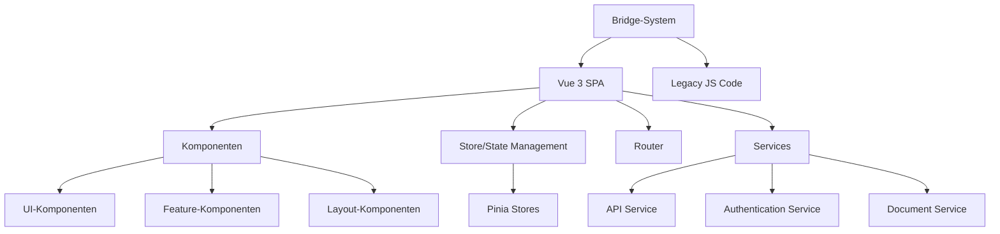
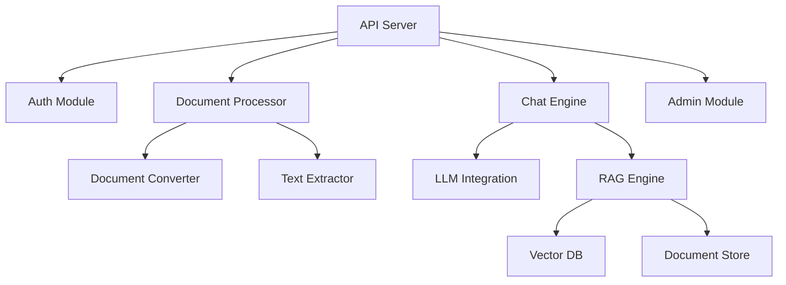

# Projektüberblick nscale DMS Assistent

> **Letzte Aktualisierung:** 13.05.2025 | **Version:** 1.0.0 | **Status:** Aktiv

## Inhaltsübersicht

- [1. Einführung](#1-einführung)
- [2. Kernfunktionen](#2-kernfunktionen)
- [3. Architektur](#3-architektur)
- [4. Technologie-Stack](#4-technologie-stack)
- [5. Entwicklungsstatus](#5-entwicklungsstatus)
- [6. Komponenten](#6-komponenten)
- [7. Zukunftsausblick](#7-zukunftsausblick)
- [8. Referenzen](#8-referenzen)

## 1. Einführung

Der nscale DMS Assistent ist eine moderne, interaktive Webanwendung, die als Erweiterung für das nscale Document Management System entwickelt wurde. Die Anwendung ermöglicht Benutzern eine intuitive, KI-gestützte Interaktion mit dem Dokumentenmanagementsystem durch natürliche Sprache und bietet umfassende Funktionen zur Dokumentenkonvertierung, Inhaltsanalyse und intelligenten Dokumentenverwaltung.

### 1.1 Zielsetzung

Der nscale DMS Assistent verfolgt folgende Hauptziele:

- **Vereinfachung der Dokumentenverwaltung** durch intuitive Benutzeroberfläche und Chat-basierte Interaktion
- **Beschleunigung dokumentenintensiver Prozesse** durch intelligente Automatisierung und KI-Assistenz
- **Verbesserung der Zugänglichkeit** des nscale DMS durch moderne, responsive Benutzeroberfläche
- **Erweiterung der Dokumentenverarbeitungsfähigkeiten** durch fortschrittliche Konvertierungs- und Analysetools

### 1.2 Hauptzielgruppen

- **Sachbearbeiter** in dokumentenintensiven Prozessen
- **Entscheider und Manager** mit Bedarf an schnellem Dokumentenzugriff
- **Systemadministratoren** für das nscale-System
- **Gelegentliche Benutzer** mit begrenzter Erfahrung im Dokumentenmanagement

## 2. Kernfunktionen

Der nscale DMS Assistent bietet folgende Hauptfunktionen:

### 2.1 Chat-Interface

- **Natürlichsprachliche Interaktion** mit dem DMS-System
- **Kontextbewusstes Gespräch** mit Nachverfolgung des Gesprächsverlaufs
- **Intelligente Vorschläge** basierend auf Benutzeranfragen und Systemkontext
- **Mehrsprachige Unterstützung** für internationale Einsatzszenarien

### 2.2 Dokumentenkonverter

- **Multi-Format-Unterstützung** für gängige Dokumentenformate (PDF, DOCX, XLSX, PPTX, HTML)
- **Intelligente Textextraktion** mit Struktur- und Layouterhaltung
- **Metadaten-Extraktion** aus Quelldokumenten
- **Batch-Verarbeitung** für effiziente Massenkonvertierung

### 2.3 Dokumentensuche und -analyse

- **Semantische Suchfunktionen** über natürliche Sprachanfragen
- **Automatische Kategorisierung** von Dokumenten basierend auf Inhalt
- **Relevanzbasierte Ergebnisrankierung** für effiziente Informationsfindung
- **Echtzeit-Vorschau** von Suchergebnissen

### 2.4 Admin-Bereich

- **Umfassende Systemkonfiguration** und -überwachung
- **Benutzer- und Rechteverwaltung** für differenzierte Zugriffssteuerung
- **Systemstatistiken und Nutzungsanalysen** für Optimierungsentscheidungen
- **Protokollierungs- und Auditfunktionen** für Compliance-Anforderungen

### 2.5 Integration mit nscale DMS

- **Nahtlose Verbindung** zum nscale-Basissystem
- **Bidirektionale Synchronisierung** von Dokumenten und Metadaten
- **Erhaltung bestehender Workflows** und Erweiterung um neue Funktionen
- **API-basierte Kommunikation** für zuverlässigen Datenaustausch

## 3. Architektur

Die Architektur des nscale DMS Assistenten folgt modernen Designprinzipien mit klarer Trennung von Verantwortlichkeiten:

### 3.1 Frontend-Architektur

### 3.2 Backend-Architektur

### 3.3 Datenfluss

Der nscale DMS Assistent verarbeitet Daten in einem klaren, unidirektionalen Fluss:

1. **Benutzereingabe** über Chat-Interface oder Dokumenten-Upload
2. **Anfrage-Verarbeitung** im Frontend mit relevanten Komponenten
3. **API-Kommunikation** mit dem Backend für komplexe Verarbeitungsaufgaben
4. **Datenverarbeitung** durch spezialisierte Module im Backend
5. **Rückgabe der Ergebnisse** ans Frontend
6. **Anzeige und Interaktion** für den Benutzer

## 4. Technologie-Stack

Der nscale DMS Assistent basiert auf einem modernen Technologie-Stack:

### 4.1 Frontend-Technologien

- **Vue.js 3** mit Composition API und Single File Components
- **TypeScript** für typsichere Entwicklung
- **Pinia** für State Management
- **Vue Router** für Navigation
- **Vite** als Build-Tool und Development Server
- **Vitest** für Unit- und Komponententests
- **Playwright** für E2E-Tests

### 4.2 Backend-Technologien

- **Python** für Kernfunktionalitäten und Datenverarbeitung
- **FastAPI** für REST API und Websocket-Kommunikation
- **SQLAlchemy** für Datenbankzugriff
- **Celery** für asynchrone Aufgabenverarbeitung
- **Redis** für Caching und Nachrichtenvermittlung
- **LangChain** für LLM-Integration und RAG-Funktionalitäten
- **PyTorch** für KI-Komponenten und Textanalyse

### 4.3 Infrastruktur

- **Docker** für Containerisierung und Deployment
- **Kubernetes** für Orchestrierung und Skalierung
- **PostgreSQL** für relationale Daten
- **Minio/S3** für Dokumentenspeicherung
- **Elasticsearch** für Volltextsuche
- **Prometheus & Grafana** für Monitoring
- **Jaeger** für Distributed Tracing

## 5. Entwicklungsstatus

Der nscale DMS Assistent hat wichtige Meilensteine in seiner Entwicklung erreicht:

### 5.1 Migrationsstatus

Die Migration von der Legacy-JavaScript-Implementierung zu modernem Vue 3/TypeScript-Code ist vollständig abgeschlossen:

| Bereich | Fertigstellungsgrad | Status |
|---------|-------------------|--------|
| Infrastruktur & Build     | 100% | Abgeschlossen |
| Feature-Toggle-System     | 100% | Abgeschlossen |
| Pinia Stores              | 100% | Abgeschlossen |
| Composables               | 100% | Abgeschlossen |
| UI-Basiskomponenten       | 100% | Abgeschlossen |
| Chat-Interface            | 100% | Abgeschlossen |
| Admin-Bereich             | 100% | Abgeschlossen |
| Dokumenten-Konverter      | 100% | Abgeschlossen |
| Routing-System            | 100% | Abgeschlossen |
| Plugin-System             | 100% | Abgeschlossen |
| **Gesamtfortschritt**     | **100%** | **Abgeschlossen** |

### 5.2 TypeScript-Implementation

Die TypeScript-Integration ist nahezu vollständig, mit strikten Typdefinitionen für alle kritischen Komponenten:

| Bereich | Konvertierungsgrad | Status |
|---------|-------------------|--------|
| Komponenten | 98% | Fast abgeschlossen |
| Services | 100% | Abgeschlossen |
| Stores | 100% | Abgeschlossen |
| Utils | 99% | Fast abgeschlossen |
| **Gesamt** | **98%** | **Fast abgeschlossen** |

### 5.3 Feature-Vollständigkeit

Der aktuelle Feature-Status des Systems:

| Feature | Implementierungsgrad | Status |
|---------|----------------------|--------|
| Chat-Interface | 100% | Abgeschlossen |
| Dokumentenkonverter | 100% | Abgeschlossen |
| Admin-Bereich | 100% | Abgeschlossen |
| Einstellungen | 90% | In Finalisierung |
| Dokumentensuche | 85% | In Entwicklung |
| Benutzerprofile | 75% | In Entwicklung |
| Sprachmodellintegration | 90% | In Optimierung |
| Mobil-Optimierung | 95% | In Finalisierung |
| **Gesamt** | **92%** | **In Finalisierung** |

## 6. Komponenten

### 6.1 Frontend-Komponenten

Der nscale DMS Assistent besteht aus folgenden Hauptkomponenten:

- **Chat-Interface**: Hauptinteraktionspunkt für Benutzer mit natürlichsprachlicher Kommunikation
- **Dokument-Konverter**: Tool zur Umwandlung und Analyse verschiedener Dokumentformate
- **Admin-Bereich**: Verwaltungsschnittstelle für Systemkonfiguration und -überwachung
- **Settings-Bereich**: Benutzerspezifische Konfigurationsoptionen
- **Bridge-System**: Verbindungsschicht zwischen modernem Code und Legacy-Implementierung

### 6.2 Backend-Module

Das Backend umfasst folgende spezialisierte Module:

- **Authentifizierung**: Benutzerauthentifizierung und -autorisierung
- **Dokumentenverarbeitung**: Konvertierung, Analyse und Metadatenextraktion
- **Chat-Engine**: Verarbeitung natürlicher Sprache und kontextbezogene Antworten
- **Retrieval-Augmented Generation (RAG)**: Intelligente Informationssuche und -synthese
- **Monitoring**: Systemüberwachung und Leistungsanalyse

### 6.3 Integrationspunkte

Der nscale DMS Assistent bietet Integrationspunkte mit:

- **nscale DMS Kernsystem**: Bidirektionale Kommunikation mit dem Haupt-DMS
- **Externe Dokumentquellen**: Import aus verschiedenen Quellsystemen
- **Identity Provider**: Integration mit vorhandenen Authentifizierungssystemen
- **Sprachmodelle**: Anbindung an LLM-Dienste für erweiterte KI-Funktionen

## 7. Zukunftsausblick

Die geplante Weiterentwicklung des nscale DMS Assistenten umfasst:

### 7.1 Kurzfristige Pläne (Q2-Q3 2025)

- **Erweiterte Dokumentenanalysefunktionen** mit verbesserter NLP-Verarbeitung
- **Verfeinerung des RAG-Systems** für präzisere kontextbezogene Antworten
- **Verbesserte Multi-Dokument-Verarbeitung** für komplexe Szenarien
- **Dashboard für Dokumenten-Insights** mit automatisierten Analysen

### 7.2 Mittelfristige Pläne (Q4 2025 - Q1 2026)

- **Prozessautomatisierung** mit dokumentenbasierten Workflows
- **Collaboration-Funktionen** für Team-basierte Dokumentenarbeit
- **Erweiterte Mobil-Unterstützung** mit nativer App-Erfahrung
- **Vertikale Branchenlösungen** für spezialisierte Anwendungsfälle

### 7.3 Langfristige Vision

- **Vollständig autonome Dokumentenverarbeitung** mit minimaler manueller Intervention
- **Proaktive Informationsbereitstellung** basierend auf Benutzerkontext und -verhalten
- **Cross-System-Dokumentenintegration** für umfassende Informationslandschaften
- **Kognitive Dokumentenanalyse** mit tiefem Verständnis von Dokumenteninhalten

## 8. Referenzen

### 8.1 Interne Referenzen

- [Systemarchitektur](../02_ARCHITEKTUR/01_SYSTEMARCHITEKTUR.md): Detaillierte Architekturübersicht
- [Frontend-Struktur](../02_ARCHITEKTUR/02_FRONTEND_STRUKTUR.md): Details zur Frontend-Implementation
- [Bridge-System](../02_ARCHITEKTUR/05_BRIDGE_SYSTEM.md): Dokumentation des Bridge-Systems
- [TypeScript-Typsystem](../05_ENTWICKLUNG/07_TYPESCRIPT_TYPSYSTEM.md): Informationen zur TypeScript-Implementation

### 8.2 Externe Referenzen

- [Vue 3 Dokumentation](https://vuejs.org/): Offizielles Vue.js 3 Framework
- [TypeScript Dokumentation](https://www.typescriptlang.org/): Offizielle TypeScript-Sprache
- [nscale DMS Dokumentation](https://www.nscale.de/): Informationen zum nscale-Basissystem

### 8.3 Ursprüngliche Dokumente

Dieses Dokument wurde aus folgenden Quellen konsolidiert:

1. `/opt/nscale-assist/app/README.md`: Grundlegende Projektinformationen
2. `/opt/nscale-assist/app/docs/00_KONSOLIDIERTE_DOKUMENTATION/00_PROJEKT/02_PROJEKTUEBERBLICK.md`: Konsolidierte Projektübersicht
3. `/opt/nscale-assist/app/SYSTEM_STATUS.md`: Aktuelle Statusinformationen

---

*Zuletzt aktualisiert: 13.05.2025*