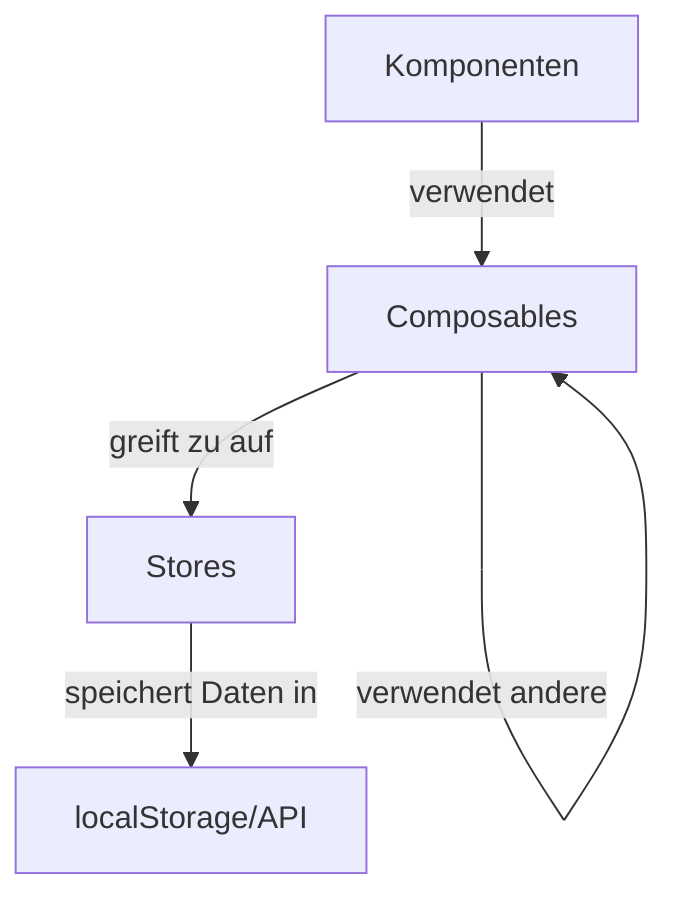

# Vue 3 Composition API

> **Letzte Aktualisierung:** 10.05.2025 | **Version:** 1.0.0 | **Status:** Aktiv

## Inhaltsverzeichnis

1. [Einführung](#einführung)
2. [Grundkonzepte](#grundkonzepte)
   - [Vergleich: Options API vs. Composition API](#vergleich-options-api-vs-composition-api)
   - [Setup-Funktion](#setup-funktion)
   - [Reaktivität](#reaktivität)
   - [Composables](#composables)
3. [Pinia Integration](#pinia-integration)
   - [Store-Struktur](#store-struktur)
   - [Verwendung in Composables](#verwendung-in-composables)
   - [Effiziente Store-Nutzung](#effiziente-store-nutzung)
4. [Implementierte Composables](#implementierte-composables)
   - [Authentifizierung und Autorisierung](#authentifizierung-und-autorisierung)
   - [UI und Theming](#ui-und-theming)
   - [Chat und Sessions](#chat-und-sessions)
   - [Dokumentenkonverter](#dokumentenkonverter)
   - [Utility Composables](#utility-composables)
5. [Best Practices](#best-practices)
   - [Separation of Concerns](#separation-of-concerns)
   - [Optimierte Reaktivität](#optimierte-reaktivität)
   - [Wiederverwendbare Logik](#wiederverwendbare-logik)
   - [TypeScript-Integration](#typescript-integration)
   - [Lifecycle-Management](#lifecycle-management)
6. [Bridge Mechanismen](#bridge-mechanismen)
   - [Legacy-Integration](#legacy-integration)
   - [Bidirektionale Kommunikation](#bidirektionale-kommunikation)
7. [Fehlerbehandlung](#fehlerbehandlung)
   - [Error Boundaries](#error-boundaries)
   - [Konsistente Fehlermeldungen](#konsistente-fehlermeldungen)
8. [Performance-Optimierungen](#performance-optimierungen)
   - [Lazy Loading](#lazy-loading)
   - [Selective Reactivity](#selective-reactivity)
9. [Migration bestehender Komponenten](#migration-bestehender-komponenten)
   - [Schrittweise Migration](#schrittweise-migration)
   - [Parallelimplementierung](#parallelimplementierung)
10. [Häufige Fallstricke und Lösungen](#häufige-fallstricke-und-lösungen)

## Einführung

Die Migration des nscale DMS Assistenten zu Vue 3 Single File Components (SFCs) setzt stark auf die Composition API, die in Vue 3 eingeführt wurde. Diese API ermöglicht eine bessere Organisation von Code, erhöhte Wiederverwendbarkeit und verbesserte Typsicherheit, insbesondere in Kombination mit TypeScript.

Die Composition API bietet folgende Hauptvorteile gegenüber der Options API:

- **Bessere Code-Organisation**: Gruppierung von zusammengehörigem Code statt Trennung nach API-Kategorien
- **Einfachere Wiederverwendbarkeit**: Extraktion und Wiederverwendung von Logik in Composables
- **Optimierte TypeScript-Integration**: Bessere Typsicherheit und Autovervollständigung
- **Verbesserte Performance**: Effizienteres Treeshaking und optimierte Reaktivität
- **Klare Trennung von Verantwortlichkeiten**: Zustandsverwaltung in Stores, Logik in Composables, UI in Komponenten

## Grundkonzepte

### Vergleich: Options API vs. Composition API

Betrachten wir ein einfaches Beispiel, das den Unterschied zwischen der Options API und der Composition API verdeutlicht:

**Options API (Vue 2 Stil)**:

```javascript
// Klassischer Vue 2 Stil mit Options API
export default {
  data() {
    return {
      message: 'Hallo Welt',
      counter: 0
    };
  },
  computed: {
    doubledCounter() {
      return this.counter * 2;
    }
  },
  methods: {
    increment() {
      this.counter++;
    }
  },
  mounted() {
    console.log('Komponente wurde gemounted');
  }
};
```

**Composition API (Vue 3 Stil)**:

```javascript
// Moderner Vue 3 Stil mit Composition API
import { ref, computed, onMounted } from 'vue';

export default {
  setup() {
    // Reaktiver Zustand
    const message = ref('Hallo Welt');
    const counter = ref(0);
    
    // Berechnete Eigenschaft
    const doubledCounter = computed(() => counter.value * 2);
    
    // Methoden
    function increment() {
      counter.value++;
    }
    
    // Lifecycle Hook
    onMounted(() => {
      console.log('Komponente wurde gemounted');
    });
    
    // Rückgabe der Eigenschaften, die im Template verwendet werden
    return {
      message,
      counter,
      doubledCounter,
      increment
    };
  }
};
```

**Mit `<script setup>` Syntax (vereinfacht)**:

```vue
<script setup>
import { ref, computed, onMounted } from 'vue';

// Reaktiver Zustand
const message = ref('Hallo Welt');
const counter = ref(0);

// Berechnete Eigenschaft
const doubledCounter = computed(() => counter.value * 2);

// Methoden
function increment() {
  counter.value++;
}

// Lifecycle Hook
onMounted(() => {
  console.log('Komponente wurde gemounted');
});
</script>

<template>
  <div>
    <p>{{ message }}</p>
    <p>Zähler: {{ counter }} (Doppelt: {{ doubledCounter }})</p>
    <button @click="increment">Erhöhen</button>
  </div>
</template>
```

### Setup-Funktion

Die `setup`-Funktion ist das Herzstück der Composition API. Sie wird ausgeführt, bevor die Komponente erstellt wird, was einige Unterschiede im Vergleich zu den Options API-Hooks bedeutet:

- Sie hat keinen Zugriff auf `this`
- Sie muss explizit zurückgeben, was im Template verfügbar sein soll
- Sie wird vor allen anderen Lifecycle-Hooks ausgeführt

In modernen SFCs wird häufig die `<script setup>`-Syntax verwendet, die die `setup`-Funktion implizit enthält und die Rückgabe von Werten vereinfacht.

### Reaktivität

Die Reaktivität in Vue 3 basiert auf zwei Hauptfunktionen:

1. **ref**: Für primitive Werte wie Strings, Zahlen, Booleans
2. **reactive**: Für Objekte und Arrays

```typescript
import { ref, reactive, computed, watch } from 'vue';

// Primitive Werte mit ref
const count = ref(0);
console.log(count.value); // Zugriff auf den Wert über .value

// Objekte mit reactive
const user = reactive({
  name: 'Max',
  email: 'max@example.com'
});
console.log(user.name); // Direkter Zugriff ohne .value

// Computed-Eigenschaften
const doubleCount = computed(() => count.value * 2);

// Watcher für Änderungen
watch(count, (newValue, oldValue) => {
  console.log(`Count hat sich von ${oldValue} zu ${newValue} geändert`);
});
```

### Composables

Composables sind Funktionen, die reaktive Logik kapseln und wiederverwendbar machen. Sie beginnen typischerweise mit "use" als Präfix und können in Komponenten oder anderen Composables verwendet werden.

```typescript
// Beispiel für ein einfaches Composable (useCounter.ts)
import { ref, computed } from 'vue';

export function useCounter(initialValue = 0) {
  const count = ref(initialValue);
  const doubleCount = computed(() => count.value * 2);
  
  function increment() {
    count.value++;
  }
  
  function decrement() {
    count.value--;
  }
  
  function reset() {
    count.value = initialValue;
  }
  
  return {
    count,
    doubleCount,
    increment,
    decrement,
    reset
  };
}
```

Verwendung in einer Komponente:

```vue
<script setup>
import { useCounter } from '@/composables/useCounter';

const { count, doubleCount, increment, decrement, reset } = useCounter(10);
</script>

<template>
  <div>
    <p>Zähler: {{ count }}</p>
    <p>Doppelter Wert: {{ doubleCount }}</p>
    <button @click="increment">+</button>
    <button @click="decrement">-</button>
    <button @click="reset">Zurücksetzen</button>
  </div>
</template>
```

## Pinia Integration

Für komplexere Zustandsverwaltung wird Pinia verwendet, das offiziell empfohlene State Management für Vue 3.

### Store-Struktur

```typescript
// stores/auth.ts
import { defineStore } from 'pinia';
import type { User } from '@/types/auth';

export const useAuthStore = defineStore('auth', () => {
  // State
  const user = ref<User | null>(null);
  const isAuthenticated = ref(false);
  const token = ref<string | null>(null);
  const loading = ref(false);
  const error = ref<Error | null>(null);
  
  // Getters
  const isAdmin = computed(() => user.value?.role === 'admin');
  const permissions = computed(() => {
    if (!user.value) return [];
    return user.value.permissions || [];
  });
  
  // Actions
  async function login(credentials: { email: string; password: string }) {
    loading.value = true;
    error.value = null;
    
    try {
      const response = await api.auth.login(credentials);
      user.value = response.user;
      token.value = response.token;
      isAuthenticated.value = true;
      return true;
    } catch (err) {
      error.value = err instanceof Error ? err : new Error('Unbekannter Fehler');
      return false;
    } finally {
      loading.value = false;
    }
  }
  
  function logout() {
    user.value = null;
    token.value = null;
    isAuthenticated.value = false;
  }
  
  return {
    // State
    user,
    isAuthenticated,
    token,
    loading,
    error,
    
    // Getters
    isAdmin,
    permissions,
    
    // Actions
    login,
    logout
  };
}, {
  // Persistenz-Optionen
  persist: {
    storage: localStorage,
    paths: ['token']
  }
});
```

### Verwendung in Composables

Composables kapseln häufig die Logik, die mit einem Store interagiert:

```typescript
// composables/useAuth.ts
import { useAuthStore } from '@/stores/auth';
import { useRouter } from 'vue-router';
import type { LoginCredentials } from '@/types/auth';

export function useAuth() {
  const authStore = useAuthStore();
  const router = useRouter();
  
  // Zugriff auf reaktive Store-Eigenschaften
  const user = computed(() => authStore.user);
  const isAuthenticated = computed(() => authStore.isAuthenticated);
  const isAdmin = computed(() => authStore.isAdmin);
  const permissions = computed(() => authStore.permissions);
  const loading = computed(() => authStore.loading);
  const error = computed(() => authStore.error);
  
  // Erweiterte Login-Funktion mit Weiterleitung
  async function login(credentials: LoginCredentials, { redirect = true } = {}) {
    const success = await authStore.login(credentials);
    
    if (success && redirect) {
      router.push('/dashboard');
    }
    
    return success;
  }
  
  // Erweiterte Logout-Funktion mit Weiterleitung
  function logout({ redirect = true } = {}) {
    authStore.logout();
    
    if (redirect) {
      router.push('/login');
    }
  }
  
  // Berechtigungsprüfung
  function hasPermission(permission: string): boolean {
    return permissions.value.includes(permission);
  }
  
  // Mehrfache Berechtigungsprüfung (ANY)
  function hasAnyPermission(requiredPermissions: string[]): boolean {
    return requiredPermissions.some(p => hasPermission(p));
  }
  
  // Mehrfache Berechtigungsprüfung (ALL)
  function hasAllPermissions(requiredPermissions: string[]): boolean {
    return requiredPermissions.every(p => hasPermission(p));
  }
  
  return {
    user,
    isAuthenticated,
    isAdmin,
    permissions,
    loading,
    error,
    login,
    logout,
    hasPermission,
    hasAnyPermission,
    hasAllPermissions
  };
}
```

### Effiziente Store-Nutzung

Für optimale Performance sollten nur die benötigten Store-Eigenschaften abonniert werden:

```typescript
// Ineffizient - ganzen Store abonnieren
const authStore = useAuthStore();
// Jede Änderung im Store löst Neurendering aus

// Effizient - nur benötigte Eigenschaften
import { storeToRefs } from 'pinia';
const authStore = useAuthStore();
const { user, isAuthenticated } = storeToRefs(authStore);
// Nur Änderungen an user und isAuthenticated lösen Neurendering aus
```

## Implementierte Composables

nscale DMS Assistent implementiert eine Reihe von Composables für verschiedene Funktionsbereiche:

### Authentifizierung und Autorisierung

Der `useAuth`-Composable bietet umfassende Authentifizierungs- und Autorisierungsfunktionen:

```typescript
// Beispiel: Verwendung von useAuth
const { 
  user, 
  isAuthenticated, 
  isAdmin,
  login, 
  logout, 
  hasPermission 
} = useAuth();

// Benutzer anmelden
await login({ email, password });

// Prüfen, ob Benutzer bestimmte Berechtigungen hat
if (hasPermission('manage-users')) {
  // Benutzer hat die Berechtigung "manage-users"
}
```

### UI und Theming

Der `useTheme`-Composable verwaltet das Theming der Anwendung:

```typescript
// Beispiel: Theme-Management
const { 
  currentTheme, 
  isDarkMode,
  setTheme, 
  toggleDarkMode,
  useSystemTheme,
  setUseSystemTheme
} = useTheme();

// Theme setzen
setTheme('dark');

// Umschalten zwischen Light/Dark Mode
toggleDarkMode();

// Systemeinstellungen verwenden
setUseSystemTheme(true);
```

Der `useUI`-Composable bietet allgemeine UI-Funktionen:

```typescript
// Beispiel: UI-Funktionen
const { 
  showToast, 
  showDialog,
  sidebar: { isOpen, toggle, setWidth },
  setLoading
} = useUI();

// Toast-Benachrichtigung anzeigen
showToast({
  message: 'Operation erfolgreich!',
  type: 'success',
  duration: 3000
});

// Dialog anzeigen
const result = await showDialog({
  title: 'Bestätigung',
  message: 'Möchten Sie wirklich fortfahren?',
  confirmText: 'Ja',
  cancelText: 'Nein'
});

// Sidebar-Status ändern
toggle();
setWidth(280);

// Ladezustand setzen
setLoading(true);
// Operation ausführen...
setLoading(false);
```

### Chat und Sessions

Der `useChat`-Composable verwaltet Chat-Sitzungen und Nachrichten:

```typescript
// Beispiel: Chat-Funktionalität
const { 
  sessions, 
  currentSession,
  messages,
  isLoadingMessages,
  createSession,
  selectSession,
  sendMessage,
  deleteSession
} = useChat();

// Neue Session erstellen
const sessionId = await createSession('Neue Anfrage');

// Nachricht senden
await sendMessage({
  sessionId,
  content: 'Wie kann ich helfen?'
});

// Session auswählen
selectSession(sessionId);
```

### Dokumentenkonverter

Der `useDocumentConverter`-Composable bietet Funktionen für den Dokumentenkonverter:

```typescript
// Beispiel: Dokumentenkonverter
const { 
  documents,
  isUploading,
  isConverting,
  conversionProgress,
  uploadDocument,
  convertDocument,
  listDocuments,
  deleteDocument
} = useDocumentConverter();

// Dokument hochladen und konvertieren
const file = event.target.files[0];
const documentId = await uploadDocument(file);
await convertDocument(documentId);

// Fortschritt überwachen
watch(conversionProgress, (progress) => {
  console.log(`Konvertierung: ${progress}%`);
});
```

### Utility Composables

Zusätzlich gibt es verschiedene Utility-Composables für spezifische Funktionen:

- **useElementSize**: Größe eines Elements reaktiv verfolgen
- **useWindowSize**: Fenstergröße reaktiv verfolgen
- **useThrottleFn**: Funktionsaufrufe drosseln
- **useFeatureToggles**: Feature-Flags verwalten
- **useErrorReporting**: Fehlerberichte erstellen

```typescript
// Beispiel: Element-Größe verfolgen
const elementRef = ref<HTMLElement | null>(null);
const { width, height } = useElementSize(elementRef);

// Beispiel: Fenstergröße verfolgen
const { width, height, isMobile } = useWindowSize();

// Beispiel: Funktion drosseln
const throttledScroll = useThrottleFn((event) => {
  console.log('Scroll-Position:', window.scrollY);
}, 100);

window.addEventListener('scroll', throttledScroll);

// Beispiel: Feature-Flags
const { isEnabled, enableFeature, disableFeature } = useFeatureToggles();

if (isEnabled('experimentalFeature')) {
  // Feature ist aktiviert
}

// Beispiel: Fehlerberichte
const { reportError, errorStats } = useErrorReporting();

try {
  // Riskante Operation
} catch (err) {
  reportError(err, {
    component: 'ChatView',
    context: { sessionId }
  });
}
```

## Best Practices

### Separation of Concerns

Die Anwendung folgt dem Prinzip der Trennung von Zuständigkeiten:

1. **Stores (Pinia)**: Zustandsverwaltung und Persistenz
2. **Composables**: Wiederverwendbare Logik und Zugriff auf Stores
3. **Komponenten**: UI-Darstellung und Benutzerinteraktion



### Optimierte Reaktivität

Für optimale Performance sollten reaktive Werte gezielt eingesetzt werden:

- **ref**: Für primitive Werte (Zahlen, Strings, Booleans)
- **reactive**: Für komplexe Objekte
- **computed**: Für abgeleitete Werte
- **watch/watchEffect**: Für Seiteneffekte bei Änderungen

```typescript
// Beispiel: Optimierte Reaktivität
// Primitive Werte mit ref
const name = ref('');
const age = ref(30);

// Komplexe Objekte mit reactive
const user = reactive({
  profile: {
    firstName: 'Max',
    lastName: 'Mustermann'
  },
  preferences: {
    theme: 'dark',
    notifications: true
  }
});

// Computed-Eigenschaften für abgeleitete Werte
const fullName = computed(() => {
  return `${user.profile.firstName} ${user.profile.lastName}`;
});

// Watch für Seiteneffekte
watch(fullName, (newName) => {
  console.log(`Name geändert zu: ${newName}`);
});

// WatchEffect für mehrere reaktive Abhängigkeiten
watchEffect(() => {
  console.log(`${fullName.value} ist ${age.value} Jahre alt`);
});
```

### Wiederverwendbare Logik

Composables sollten fokussiert und wiederverwendbar sein:

- **Single Responsibility**: Jedes Composable hat eine klare Aufgabe
- **Komposition**: Komplexe Composables verwenden einfachere Composables
- **Parametrisierung**: Flexibler Einsatz durch Konfigurationsoptionen

```typescript
// Beispiel: Komposition von Composables
export function useEnhancedChat() {
  // Grundlegende Chat-Funktionalität
  const chat = useChat();
  
  // Feature-Flags für erweiterte Funktionen
  const { isEnabled } = useFeatureToggles();
  
  // Fehlerberichterstattung
  const { reportError } = useErrorReporting();
  
  // Erweiterte Funktionalität
  async function sendFormattedMessage(content, format = 'text') {
    try {
      if (format === 'markdown' && isEnabled('markdownSupport')) {
        content = await formatMarkdown(content);
      }
      
      return chat.sendMessage(content);
    } catch (err) {
      reportError(err, { component: 'EnhancedChat' });
      throw err;
    }
  }
  
  // Zusammensetzung der API
  return {
    ...chat, // Grundfunktionen durchreichen
    sendFormattedMessage, // Erweiterte Funktionen hinzufügen
    supportedFormats: computed(() => {
      const formats = ['text'];
      if (isEnabled('markdownSupport')) formats.push('markdown');
      if (isEnabled('htmlSupport')) formats.push('html');
      return formats;
    })
  };
}
```

### TypeScript-Integration

Die Composition API ist ideal für TypeScript-Integration:

- **Typdefinitionen für Props**: Klare Schnittstellendefinition
- **Typisierte Rückgabewerte**: Bessere Autovervollständigung
- **Generics für Flexibilität**: Wiederverwendbare Komponenten

```typescript
// Beispiel: TypeScript-Integration
interface User {
  id: string;
  name: string;
  email: string;
  role: 'admin' | 'user';
  permissions: string[];
}

interface AuthState {
  user: User | null;
  isAuthenticated: boolean;
  token: string | null;
}

// Typisierter Composable
export function useAuth(): {
  user: ComputedRef<User | null>;
  isAuthenticated: ComputedRef<boolean>;
  login: (credentials: { email: string; password: string }) => Promise<boolean>;
  logout: () => void;
  hasPermission: (permission: string) => boolean;
} {
  // Implementierung...
}
```

### Lifecycle-Management

Die Composition API bietet Lifecycle-Hooks für unterschiedliche Phasen:

```typescript
// Beispiel: Lifecycle-Management
import { 
  onMounted, 
  onUpdated, 
  onUnmounted, 
  onBeforeMount,
  onBeforeUpdate,
  onBeforeUnmount,
  onActivated,
  onDeactivated,
  onErrorCaptured
} from 'vue';

export function useWindowResizeListener() {
  const width = ref(window.innerWidth);
  const height = ref(window.innerHeight);
  
  function handleResize() {
    width.value = window.innerWidth;
    height.value = window.innerHeight;
  }
  
  onMounted(() => {
    // Nach dem DOM-Mounting
    window.addEventListener('resize', handleResize);
  });
  
  onUnmounted(() => {
    // Vor der Komponenten-Entfernung
    window.removeEventListener('resize', handleResize);
  });
  
  onErrorCaptured((err, instance, info) => {
    // Fehler in Unterkomponenten abfangen
    console.error('Fehler in Komponente:', err, instance, info);
    return false; // Verhindert Weiterleitung des Fehlers
  });
  
  return { width, height };
}
```

## Bridge Mechanismen

### Legacy-Integration

Die Migration erfolgt schrittweise, daher müssen neue Vue 3 Komponenten mit dem bestehenden Vanilla JavaScript-Code integriert werden:

```typescript
// Beispiel: Bridge-Mechanismus
export function setupBridge() {
  const authStore = useAuthStore();
  const sessionsStore = useSessionsStore();
  
  // Globale API für Legacy-Code
  window.nscaleApi = {
    // Auth-Methoden
    login: authStore.login,
    logout: authStore.logout,
    getUser: () => authStore.user,
    
    // Sessions-Methoden
    createSession: sessionsStore.createSession,
    getMessages: sessionsStore.getMessages,
    sendMessage: sessionsStore.sendMessage,
    
    // Event-System
    on: (event, callback) => {
      bus.on(event, callback);
    },
    off: (event, callback) => {
      bus.off(event, callback);
    },
    emit: (event, data) => {
      bus.emit(event, data);
    }
  };
  
  // Zurück-Bridge: Änderungen im Legacy-Code überwachen
  window.addEventListener('legacy:auth:login', (event) => {
    if (event.detail && event.detail.user) {
      authStore.setUser(event.detail.user);
    }
  });
}
```

### Bidirektionale Kommunikation

Die Bridge ermöglicht Kommunikation in beide Richtungen:

```typescript
// Beispiel: Bidirektionale Kommunikation
// 1. Von Vue 3 zu Vanilla JS
watch(() => authStore.user, (newUser) => {
  // Event für Legacy-Code auslösen
  const event = new CustomEvent('vue:auth:changed', {
    detail: { user: newUser }
  });
  window.dispatchEvent(event);
});

// 2. Von Vanilla JS zu Vue 3
window.addEventListener('legacy:message:sent', (event) => {
  if (event.detail) {
    sessionsStore.addMessage(event.detail.sessionId, event.detail.message);
  }
});
```

## Fehlerbehandlung

### Error Boundaries

Vue 3 unterstützt Error Boundaries für robustere Anwendungen:

```vue
<!-- Beispiel: Error Boundary Komponente -->
<template>
  <div>
    <slot v-if="!hasError"></slot>
    <div v-else class="error-container">
      <h3>Ein Fehler ist aufgetreten</h3>
      <p>{{ error?.message }}</p>
      <button @click="resetError">Erneut versuchen</button>
    </div>
  </div>
</template>

<script setup lang="ts">
import { ref, onErrorCaptured } from 'vue';

const props = defineProps<{
  fallback?: boolean;
}>();

const hasError = ref(false);
const error = ref<Error | null>(null);

// Fehler von Kinderkomponenten abfangen
onErrorCaptured((err, instance, info) => {
  console.error(`Fehler gefangen in ${info}:`, err);
  error.value = err;
  hasError.value = true;
  return false; // Verhindert Weiterleitung des Fehlers
});

// Fehler zurücksetzen
function resetError() {
  hasError.value = false;
  error.value = null;
}
</script>
```

Verwendung:

```vue
<ErrorBoundary>
  <SomeComponentThatMightError />
</ErrorBoundary>
```

### Konsistente Fehlermeldungen

Für eine gute Benutzererfahrung sollten Fehler konsistent behandelt werden:

```typescript
// Beispiel: Fehlerbehandlung im Store
async function fetchData() {
  try {
    loading.value = true;
    error.value = null;
    
    const response = await api.getData();
    data.value = response.data;
  } catch (err) {
    // Fehler verarbeiten
    error.value = normalizeError(err);
    
    // Optional: Fehler protokollieren
    logger.error('Fehler beim Datenabruf:', error.value);
    
    // Optional: Benachrichtigung anzeigen
    ui.showToast({
      type: 'error',
      message: error.value.userMessage || 'Ein Fehler ist aufgetreten'
    });
  } finally {
    loading.value = false;
  }
}

// Hilfsfunktion für konsistente Fehlerformate
function normalizeError(err: unknown): AppError {
  if (err instanceof AppError) return err;
  
  const message = err instanceof Error ? err.message : String(err);
  return new AppError({
    message,
    userMessage: 'Ein unerwarteter Fehler ist aufgetreten.',
    code: 'UNKNOWN_ERROR',
    originalError: err
  });
}
```

## Performance-Optimierungen

### Lazy Loading

Komponenten können bei Bedarf geladen werden, um die initiale Ladezeit zu verbessern:

```typescript
// Beispiel: Lazy Loading von Komponenten
import { defineAsyncComponent } from 'vue';

// Lazy-geladene Komponente
const AdminPanel = defineAsyncComponent(() => 
  import('@/components/admin/AdminPanel.vue')
);

// Mit Lade- und Fehlerkomponenten
const DocumentViewer = defineAsyncComponent({
  loader: () => import('@/components/DocumentViewer.vue'),
  loadingComponent: LoadingSpinner,
  errorComponent: ErrorDisplay,
  delay: 200,
  timeout: 10000
});
```

### Selective Reactivity

Die Performance kann durch selektive Reaktivität optimiert werden:

```typescript
// Beispiel: Selektive Reaktivität
const largeDataset = reactive({
  items: Array.from({ length: 10000 }, (_, i) => ({
    id: i,
    name: `Item ${i}`,
    data: generateComplexData()
  }))
});

// Nicht reaktive Version für bessere Leistung
const nonReactiveData = shallowRef(largeDataset);

// v-once für statische Teile
// <div v-once>Statischer Inhalt</div>

// v-memo für Optimierung von Listen
// <div v-for="item in items" :key="item.id" v-memo="[item.id]">
//   {{ expensiveComputation(item) }}
// </div>
```

## Migration bestehender Komponenten

### Schrittweise Migration

Die Migration erfolgt schrittweise, um Risiken zu minimieren:

1. **Analyse**: Bestehende Komponenten und deren Abhängigkeiten verstehen
2. **Planung**: Migration mit minimalen Auswirkungen planen
3. **Implementierung**: Neue Komponente mit Composition API erstellen
4. **Test**: Gründliche Tests der neuen Komponente
5. **Rollout**: Schrittweise Aktivierung mit Feature-Toggle

### Parallelimplementierung

Mit Feature-Toggles können beide Implementierungen parallel existieren:

```vue
<!-- Beispiel: Parallele Implementierung -->
<template>
  <div>
    <!-- Feature-Toggle steuert, welche Implementierung verwendet wird -->
    <component :is="useSfcChat ? 'ChatViewSFC' : 'ChatViewLegacy'" />
  </div>
</template>

<script setup>
import { useFeatureToggles } from '@/composables/useFeatureToggles';
import ChatViewLegacy from '@/components/legacy/ChatView.vue';
import ChatViewSFC from '@/components/chat/ChatView.vue';

const { isEnabled } = useFeatureToggles();
const useSfcChat = computed(() => isEnabled('useSfcChat'));
</script>
```

## Häufige Fallstricke und Lösungen

1. **Reaktivitätsverlust**: Bei direkter Zuweisung zu `.value` bei verschachtelten Objekten

   ```typescript
   // Problem
   const user = ref({ name: 'Max', profile: { age: 30 } });
   user.value.profile.age = 31; // Reaktiv
   user.value.profile = { age: 31 }; // Reaktiv
   
   // Aber:
   const profile = user.value.profile;
   profile.age = 32; // NICHT reaktiv!
   
   // Lösung
   const profile = toRef(user.value, 'profile'); // Reaktive Referenz
   profile.value.age = 32; // Jetzt reaktiv
   
   // Oder für verschachtelte Eigenschaften:
   const age = computed({
     get: () => user.value.profile.age,
     set: (value) => { user.value.profile.age = value }
   });
   age.value = 32; // Reaktiv
   ```

2. **Lifecycle-Timing**: Lifecycle-Hooks müssen direkt im `setup` oder `<script setup>` aufgerufen werden

   ```typescript
   // Falsch
   function initializeComponent() {
     onMounted(() => {
       // Wird nicht funktionieren
     });
   }
   
   // Richtig
   onMounted(() => {
     initializeComponent();
   });
   ```

3. **Unangemessene Reaktivität**: Übermäßige Reaktivität kann Performance-Probleme verursachen

   ```typescript
   // Problem: Zu viel Reaktivität
   const hugeObject = reactive({
     // Tausende von Eigenschaften
   });
   
   // Lösung: Selektive Reaktivität
   const hugeObject = shallowReactive({
     // Nur oberste Ebene reaktiv
   });
   ```

4. **Template-Refs**: Zugriff auf DOM-Elemente über template-refs

   ```vue
   <template>
     <div ref="container"></div>
   </template>
   
   <script setup>
   // Mit Options API:
   // this.$refs.container
   
   // Mit Composition API:
   const container = ref(null);
   
   onMounted(() => {
     console.log(container.value); // <div> Element
   });
   </script>
   ```

---

Die Composition API ist ein mächtiges Werkzeug für die Entwicklung moderner Vue-Anwendungen. Durch die richtige Anwendung der hier beschriebenen Prinzipien kann die nscale DMS Assistent-Anwendung erfolgreicher zu Vue 3 migriert werden, mit besserem Code, erhöhter Wartbarkeit und verbesserter Performance.

Für weiterführende Informationen empfehlen wir die offizielle Vue 3 Dokumentation zur Composition API: [https://vuejs.org/guide/extras/composition-api-faq.html](https://vuejs.org/guide/extras/composition-api-faq.html)