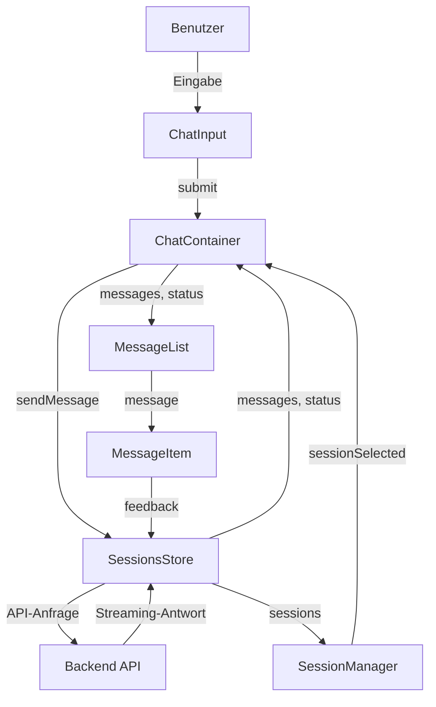

# Chat-Interface-Komponenten

> **Letzte Aktualisierung:** 10.05.2025 | **Version:** 1.0.0 | **Status:** Aktiv

Diese Dokumentation beschreibt die Chat-Interface-Komponenten des nscale DMS Assistenten, die im Rahmen der Migration zu Vue 3 Single File Components (SFC) entwickelt wurden. Die Komponenten bilden das Herzstück der Benutzerinteraktion mit dem Assistenten und wurden für optimale Performance, Benutzererfahrung und Wartbarkeit entwickelt.

## Inhaltsverzeichnis

1. [Systemübersicht](#systemübersicht)
2. [Architektur und Datenfluss](#architektur-und-datenfluss)
3. [Hauptkomponenten](#hauptkomponenten)
   - [MessageList](#messagelist)
   - [MessageItem](#messageitem)
   - [ChatInput](#chatinput)
   - [ChatContainer](#chatcontainer)
4. [Pinia Store-Integration](#pinia-store-integration)
5. [Bridge-Integration](#bridge-integration)
6. [Optimierungen](#optimierungen)
   - [Virtualisierte Listen](#virtualisierte-listen)
   - [Streaming-Unterstützung](#streaming-unterstützung)
7. [Barrierefreiheit](#barrierefreiheit)
8. [Theming und Design-System](#theming-und-design-system)
9. [Migrationsstatus](#migrationsstatus)
10. [Feature-Toggle-Konfiguration](#feature-toggle-konfiguration)
11. [Bekannte Limitierungen](#bekannte-limitierungen)

## Systemübersicht

Das Chat-Interface-System ermöglicht Benutzern:

- Führen mehrerer Unterhaltungen mit dem nscale DMS Assistenten
- Management und Organisation von Chat-Sessions
- Anzeige von Nachrichten mit Markdown-Formatierung und Syntax-Highlighting
- Streaming von Antworten in Echtzeit
- Feedback zu Antworten des Assistenten
- Anzeige von Quellenreferenzen für bessere Nachvollziehbarkeit
- Mobile Nutzung mit responsivem Design

Das System integriert sich nahtlos mit dem Rest der Anwendung durch das Bridge-System, um eine schrittweise Migration zu ermöglichen, und nutzt Feature-Toggles für die kontrollierte Einführung neuer Komponenten.

## Architektur und Datenfluss

Das Chat-Interface folgt einer dreischichtigen Architektur:

1. **Datenschicht**: Pinia Stores für zentrales State Management (`sessions.ts`)
2. **Logikschicht**: Vue 3 Composables für wiederverwendbare Logik (`useChat.ts`, `useBridgeChat.ts`)
3. **Präsentationsschicht**: Vue 3 SFC-Komponenten (`MessageList.vue`, `MessageItem.vue`, etc.)

### Komponentenhierarchie

```
ChatContainer
├── MessageList
│   └── MessageItem
└── MessageInput

SessionManager  (Separat, verwaltet Sessions im Sidebar)
├── SessionList
│   └── SessionItem
└── SessionActions
```

### Datenfluss



## Hauptkomponenten

### MessageList

Die `MessageList`-Komponente ist für die Anzeige der Konversationshistorie verantwortlich. Sie bietet:

- **Virtualisiertes Rendering** für optimale Performance bei langen Chat-Verläufen
- **Automatisches Scrollen** mit intelligenter Erkennung der Benutzerinteraktion
- **Lade-, Leer- und Streaming-Zustände** für bessere UX
- **ResizeObserver-basierte** dynamische Höhenberechnung
- **ARIA-konforme** Implementierung für Barrierefreiheit

```vue
<!-- Verwendungsbeispiel -->
<MessageList
  :messages="messages"
  :is-loading="isLoading"
  :is-streaming="isStreaming"
  :virtualized="true"
  :show-message-actions="true"
  @feedback="handleFeedback"
  @view-sources="handleViewSources"
  @retry="handleRetry"
  @delete="handleDeleteMessage"
  @scroll="handleScroll"
  @load-more="handleLoadMore"
/>
```

#### Props

| Name | Typ | Standardwert | Beschreibung |
|------|-----|--------------|--------------|
| `messages` | `ChatMessage[]` | `[]` | Die anzuzeigenden Nachrichten |
| `isLoading` | `boolean` | `false` | Gibt an, ob Nachrichten geladen werden |
| `isStreaming` | `boolean` | `false` | Gibt an, ob eine Antwort gestreamt wird |
| `virtualized` | `boolean` | `true` | Ob virtualisiertes Rendering verwendet werden soll |
| `pageSize` | `number` | `20` | Anzahl der Nachrichten pro Seite (für Pagination) |
| `welcomeTitle` | `string` | "Willkommen..." | Titel für den Willkommensbildschirm |
| `welcomeMessage` | `string` | "Wie kann ich..." | Nachricht für den Willkommensbildschirm |
| `showMessageActions` | `boolean` | `true` | Ob Aktionen (Feedback, etc.) angezeigt werden sollen |
| `autoScrollThreshold` | `number` | `0.8` | Schwellenwert für Auto-Scroll (0-1) |

#### Events

| Name | Payload | Beschreibung |
|------|---------|--------------|
| `feedback` | `{ messageId, type, feedback? }` | Feedback zu einer Nachricht |
| `view-sources` | `{ messageId }` | Quellen anzeigen |
| `view-explanation` | `{ messageId }` | Erklärung anzeigen |
| `retry` | `{ messageId }` | Nachricht wiederholen |
| `delete` | `{ messageId }` | Nachricht löschen |
| `scroll` | `{ scrollTop, isAtBottom, ... }` | Scroll-Ereignis |
| `load-more` | `{ direction, firstVisibleIndex? }` | Mehr Nachrichten laden |

#### Technische Details

- **Virtualisierung**: Rendert nur die sichtbaren und einige umliegende Nachrichten, um DOM-Größe zu reduzieren
- **ResizeObserver**: Dynamische Berechnung der Nachrichten-Höhen für präzises virtuelles Rendering
- **Throttling**: Leistungsoptimierung für Scroll-Ereignisse und häufige Aktualisierungen
- **Inkrementelles DOM-Update**: Nur geänderte Nachrichten werden aktualisiert
- **Separate Scroll-Logik**: Intelligente Entscheidung, wann automatisch gescrollt werden soll

**Virtualisierungs-Implementierung:**

```typescript
// Berechne die aktuell sichtbaren Items
const visibleItems = computed(() => {
  if (!isVirtualized.value) {
    // Ohne Virtualisierung alle Nachrichten anzeigen
    return props.messages.map((message, index) => ({
      id: message.id,
      index,
      message,
    }));
  }
  
  // Mit Virtualisierung nur den sichtbaren Bereich plus Überhang anzeigen
  const { start, end } = visibleRange.value;
  const startWithOverscan = Math.max(0, start - props.overscan);
  const endWithOverscan = Math.min(allItems.value.length - 1, end + props.overscan);
  
  return allItems.value.slice(startWithOverscan, endWithOverscan + 1);
});
```

### MessageItem

Die `MessageItem`-Komponente ist für die Darstellung einer einzelnen Nachricht verantwortlich und bietet:

- **Markdown-Formatierung** mit Unterstützung für Code-Blöcke, Tabellen, Listen etc.
- **Syntax-Highlighting** für verschiedene Programmiersprachen
- **Quellenreferenzen** mit klickbaren Links zu Quellendokumenten
- **Feedback-Mechanismen** für Benutzerrückmeldungen
- **XSS-Schutz** durch DOMPurify-Integration

```vue
<!-- Verwendungsbeispiel -->
<MessageItem
  :message="message"
  :show-actions="true"
  :show-references="false"
  :highlight-code-blocks="true"
  @feedback="handleFeedback"
  @view-sources="handleViewSources"
/>
```

#### Props

| Name | Typ | Standardwert | Beschreibung |
|------|-----|--------------|--------------|
| `message` | `ChatMessage` | - | Die anzuzeigende Nachricht |
| `showActions` | `boolean` | `true` | Zeigt Aktionen wie Feedback und Quellen an |
| `showReferences` | `boolean` | `false` | Zeigt Quellenreferenzen direkt an |
| `highlightCodeBlocks` | `boolean` | `true` | Aktiviert Syntax-Highlighting für Code |
| `formatLinks` | `boolean` | `true` | Formatiert externe Links und Quellenreferenzen |
| `timeFormat` | `'short'/'medium'/'long'` | `'short'` | Format für den Zeitstempel |

#### Technische Details

- **Markdown-Rendering**: Verwendet `marked` für Markdown-zu-HTML-Konvertierung
- **Syntax-Highlighting**: Integriert `highlight.js` für Code-Blöcke
- **Sicherheit**: Verwendet `DOMPurify` für HTML-Sanitisierung zum Schutz vor XSS
- **Reaktive Updates**: Optimierte Neuberechnung nur bei relevantem State-Change

```typescript
// Formatiert den Nachrichteninhalt mit Markdown und Syntax-Highlighting
const formattedContent = computed(() => {
  let content = props.message.content || '';
  
  // Markdown zu HTML konvertieren
  content = marked(content, { breaks: true });
  
  // Quellenreferenzen in klickbare Spans umwandeln
  if (props.formatLinks) {
    content = linkifySourceReferences(content);
  }
  
  // HTML bereinigen, um XSS zu verhindern
  content = DOMPurify.sanitize(content, {
    ALLOWED_TAGS: [
      'a', 'b', 'blockquote', 'br', 'code', 'div', 'em', 'h1', 'h2', 'h3', 'h4', 'h5', 'h6',
      'hr', 'i', 'img', 'li', 'ol', 'p', 'pre', 's', 'span', 'strong', 'table', 'tbody',
      'td', 'th', 'thead', 'tr', 'ul'
    ],
    ALLOWED_ATTR: [
      'href', 'src', 'alt', 'class', 'id', 'style', 'target', 'rel', 
      'data-source-id', 'data-language'
    ],
    // Weitere Sicherheitseinstellungen...
  });
  
  return content;
});
```

### ChatInput

Die `ChatInput`-Komponente bietet eine benutzerfreundliche Schnittstelle für die Texteingabe:

- **Auto-Größenanpassung** des Textbereichs basierend auf dem Inhalt
- **Unterstützung für Tastenkürzel** (Enter zum Senden, Shift+Enter für neue Zeile)
- **Zeichenbegrenzung** mit visueller Anzeige des Limits
- **Speicherung von Entwürfen** zwischen Sitzungen
- **Loading-Status** während des Streamings

```vue
<!-- Verwendungsbeispiel -->
<ChatInput
  v-model="inputText"
  :disabled="inputDisabled"
  :is-loading="isSending"
  :placeholder="inputPlaceholder"
  @submit="handleSendMessage"
  @draft-change="handleDraftChange"
/>
```

#### Props

| Name | Typ | Standardwert | Beschreibung |
|------|-----|--------------|--------------|
| `modelValue` | `string` | `''` | Eingegebener Text (v-model) |
| `placeholder` | `string` | "Geben Sie..." | Platzhaltertext |
| `disabled` | `boolean` | `false` | Deaktiviert die Eingabe |
| `isLoading` | `boolean` | `false` | Loading-Status während des Sendens |
| `maxLength` | `number` | `4000` | Maximale Zeichenanzahl |
| `minHeight` | `number` | `56` | Minimale Höhe in Pixeln |
| `maxHeight` | `number` | `200` | Maximale Höhe in Pixeln |
| `showCharacterCount` | `boolean` | `true` | Zeigt Zeichenanzahl an |
| `error` | `string` | - | Fehlermeldung |
| `sendButtonTitle` | `string` | "Nachricht..." | Tooltip für den Senden-Button |

#### Technische Details

- **Auto-Resize**: Passt die Höhe des Textfeldes dynamisch an den Inhalt an
- **Eingabe-Validierung**: Verhindert das Senden leerer Nachrichten
- **Tastatursteuerung**: Verarbeitet Tastenkombinationen für verschiedene Aktionen
- **Zugänglichkeit**: Vollständige Tastatursteuerung und ARIA-Attribute

```typescript
// Textarea-Größe an den Inhalt anpassen
function resizeTextarea(): void {
  if (!inputElement.value) return;
  
  const textarea = inputElement.value;
  
  // Höhe zurücksetzen
  textarea.style.height = `${props.initialHeight}px`;
  
  // Neue Höhe berechnen (scrollHeight = Höhe des Inhalts)
  const newHeight = Math.min(
    Math.max(textarea.scrollHeight, props.minHeight),
    props.maxHeight
  );
  
  textarea.style.height = `${newHeight}px`;
  
  // Modellwert aktualisieren
  emit('update:modelValue', inputValue.value);
}
```

### ChatContainer

Die `ChatContainer`-Komponente dient als Hauptcontainer für die Chat-Funktionalität und orchestriert:

- **Session-Management** (Titel, Exportieren, Archivieren)
- **Nachrichtenverarbeitung** (Senden, Löschen, Streaming)
- **Quellen-Anzeige** über ein Modal
- **Integration mit dem Sessions-Store**

```vue
<!-- Verwendungsbeispiel -->
<ChatContainer
  :session-id="currentSessionId"
  :virtualized-list="true"
  :welcome-title="welcomeTitle"
  :welcome-message="welcomeMessage"
  @message-sent="handleMessageSent"
  @message-received="handleMessageReceived"
  @error="handleError"
/>
```

#### Props

| Name | Typ | Standardwert | Beschreibung |
|------|-----|--------------|--------------|
| `sessionId` | `string` | `''` | ID der aktuellen Chat-Session |
| `virtualizedList` | `boolean` | `true` | Ob virtualisiertes Rendering verwendet werden soll |
| `welcomeTitle` | `string` | "Willkommen..." | Titel für den Willkommensbildschirm |
| `welcomeMessage` | `string` | "Wie kann ich..." | Nachricht für den Willkommensbildschirm |
| `showMessageActions` | `boolean` | `true` | Ob Aktionen angezeigt werden sollen |
| `canRenameSession` | `boolean` | `true` | Ob die Session umbenannt werden kann |
| `canExportSession` | `boolean` | `true` | Ob die Session exportiert werden kann |
| `canClearSession` | `boolean` | `true` | Ob die Session geleert werden kann |

#### Technische Details

- **Session-Verwaltung**: Integriert mit dem Pinia SessionsStore
- **Modale Dialoge**: Implementiert für Quellen und Erklärungen
- **Event-Handling**: Fungiert als Vermittler zwischen Komponenten und Store
- **Responsives Design**: Anpassung an verschiedene Bildschirmgrößen

## Pinia Store-Integration

Die Chat-Komponenten sind eng mit dem Pinia `SessionsStore` verknüpft:

### Sessions Store

Der `SessionsStore` verwaltet:

- Chat-Sessions (Erstellen, Laden, Aktualisieren, Archivieren)
- Nachrichten pro Session
- Streaming-Status und -Fortschritt
- Offline-Unterstützung mit Synchronisation
- Optimierte Persistenz für große Datensätze

```typescript
// Zustand für Sessions und Nachrichten
const sessions = ref<ChatSession[]>([]);
const currentSessionId = ref<string | null>(null);
const messages = ref<Record<string, ChatMessage[]>>({});
const streaming = ref<StreamingStatus>({
  isActive: false,
  progress: 0,
  currentSessionId: null
});

// Computed Properties für einfachen Zugriff
const currentSession = computed(() => 
  sessions.value.find(s => s.id === currentSessionId.value) || null
);

const currentMessages = computed(() => 
  currentSessionId.value ? messages.value[currentSessionId.value] || [] : []
);

// Action zum Senden einer Nachricht
async function sendMessage({ sessionId, content, role = 'user' }: SendMessageParams): Promise<void> {
  // Implementierung mit optimistischem Update und Streaming-Unterstützung...
}
```

### useChat Composable

Das `useChat`-Composable dient als Brücke zwischen den Vue-Komponenten und dem Store:

```typescript
// Im useChat.ts Composable
export function useChat() {
  const sessionsStore = useSessionsStore();
  const uiStore = useUIStore();
  
  // Reaktive Referenzen
  const messages = computed(() => sessionsStore.currentMessages);
  const isLoading = computed(() => sessionsStore.isLoading);
  const isStreaming = computed(() => sessionsStore.isStreaming);
  
  // Aktionen
  const sendMessage = async (content: string) => {
    return await sessionsStore.sendMessage({
      sessionId: sessionsStore.currentSessionId!,
      content
    });
  };
  
  // Weitere exported Funktionen und Werte...
  
  return {
    messages,
    isLoading,
    isStreaming,
    sendMessage,
    // ...
  };
}
```

## Bridge-Integration

Die Chat-Komponenten sind vollständig mit dem Bridge-System integriert, das die Kommunikation zwischen altem Vanilla JS-Code und neuem Vue 3-Code ermöglicht.

### Bridge-Komponenten

- **useBridgeChat**: Composable für die Chat-Integration mit der Bridge
- **ChatBridge**: Spezialisierte Bridge-Implementierung für Chat-Funktionalitäten
- **EnhancedChatContainer**: Container mit Bridge-Integration

### Datenfluss

```
Vue 3 SFC-Komponenten <--> Composables <--> Pinia Stores <--> ChatBridge <--> Legacy JS-Code
```

### Implementations-Beispiel

```typescript
// Im ChatView
import { useBridge } from '@/bridge/enhanced/bridgeCore';

// Setup
const bridge = useBridge();

// Event-Kommunikation mit Legacy-Code
bridge.on('legacy:messageSubmitted', (data) => {
  // Behandlung von Legacy-Events
});

// Zustandssynchronisation
watch(() => sessionsStore.currentSessionId, (sessionId) => {
  bridge.setState('sessions.currentId', sessionId);
});
```

## Optimierungen

### Virtualisierte Listen

Die Chat-Komponenten verwenden virtualisiertes Rendering für optimale Performance:

- **Nur sichtbare Elemente werden gerendert**
- **Dynamische Höhenberechnung** mittels ResizeObserver
- **Windowing-Technik** für effizientes DOM-Management
- **Paginierung und Lazy-Loading** für lange Nachrichtenlisten

### Streaming-Unterstützung

Die Komponenten unterstützen Streaming von Antworten für bessere UX:

- **Inkrementelles Rendering** von ankommenden Tokens
- **Typ-Indikator** während der Assistent "tippt"
- **Interaktive Kontrolle** (Abbrechen des Streams)

#### Streaming-Implementierung

```typescript
// Im store während des Streamings
eventSource.onmessage = (event) => {
  try {
    const data = JSON.parse(event.data);
    
    if (data.type === 'content') {
      // Inhalt zur Antwort hinzufügen
      assistantContent += data.content;
      updateMessageContent(assistantContent);
    } else if (data.type === 'metadata') {
      // Metadaten zur Antwort hinzufügen (z.B. Quellenangaben)
      // ...
    }
  } catch (err) {
    console.error('Error parsing streaming event:', err);
  }
};
```

## Barrierefreiheit

Die Chat-Komponenten wurden mit Barrierefreiheit als Kernfunktion entwickelt:

### ARIA-Konformität

- **Semantisches HTML** mit korrekten ARIA-Rollen und -Eigenschaften
- **Keyboard-Navigation** für alle interaktiven Elemente
- **Focus-Management** für modale Dialoge und dynamische Inhalte
- **Screen-Reader-Beschreibungen** für Statusänderungen

### Weitere Barrierefreiheits-Features

- **Farbkontrast** gemäß WCAG 2.1 AA-Standard
- **Skalierbare Texte** und responsive Layouts
- **Reduzierte Bewegung** über `prefers-reduced-motion`-Media-Query

```css
/* Einstellungen für Benutzer, die reduzierte Bewegung bevorzugen */
@media (prefers-reduced-motion: reduce) {
  .n-message-list {
    scroll-behavior: auto;
  }
  
  .n-message-list__typing-dots span {
    animation: none;
  }
  
  .n-message-list__spinner {
    animation: none;
  }
}
```

## Theming und Design-System

Die Chat-Komponenten integrieren sich in das CSS-Design-System der Anwendung:

- **CSS-Variablen** für konsistente Farben, Abstände und Typografie
- **Dark Mode** über CSS-Variablen und Media-Queries
- **Responsive Breakpoints** für verschiedene Bildschirmgrößen

```css
/* Container-Styling mit Design-System-Variablen */
.n-message-list {
  position: relative;
  display: flex;
  flex-direction: column;
  flex: 1 1 auto;
  overflow-y: auto;
  overflow-x: hidden;
  padding: var(--nscale-space-6, 1.5rem);
  background-color: var(--nscale-body-bg, #ffffff);
  scroll-behavior: smooth;
}

/* Dark Mode Unterstützung */
@media (prefers-color-scheme: dark) {
  .n-message-item--user .n-message-item__content {
    background-color: var(--nscale-dark-message-user-bg, #153226);
    color: var(--nscale-dark-message-user-text, #e2e8f0);
  }
  
  .n-message-item--assistant .n-message-item__content {
    background-color: var(--nscale-dark-message-assistant-bg, #1a1a1a);
    color: var(--nscale-dark-message-assistant-text, #e2e8f0);
    border-color: var(--nscale-dark-border-color, #333);
  }
}
```

## Migrationsstatus

Der aktuelle Chat-Interface-Migrationsstatus zu Vue 3 SFCs beträgt etwa **30%**:

| Komponente | Fertigstellungsgrad | Status | Priorität |
|------------|---------------------|--------|-----------|
| MessageList | ~90% | Nahezu abgeschlossen | Hoch |
| MessageItem | ~85% | Nahezu abgeschlossen | Hoch |
| ChatInput | ~80% | Aktiv in Entwicklung | Hoch |
| ChatContainer | ~60% | Aktiv in Entwicklung | Hoch |
| SessionManager | ~40% | In Entwicklung | Mittel |
| Chat-Bridge | ~85% | Größtenteils abgeschlossen | Mittel |
| Styling & Theming | ~75% | Aktiv in Entwicklung | Mittel |
| Tests | ~25% | Frühe Phase | Mittel |

Die weitere Migration des Chat-Interfaces erfolgt schrittweise unter Verwendung von Feature-Toggles, um eine stabile Benutzererfahrung zu gewährleisten.

## Feature-Toggle-Konfiguration

Die Migration der Chat-Komponenten wird durch Feature-Toggles gesteuert:

```typescript
// In featureToggles.ts
export const DEFAULT_FEATURE_TOGGLES = {
  // Chat-Komponenten
  useSfcMessageList: false,      // Neue MessageList-Komponente
  useSfcMessageInput: false,     // Neue MessageInput-Komponente
  useSfcSessionManager: false,   // Neue SessionManager-Komponente
  
  // Abhängigkeiten
  useVirtualizedList: false,     // Virtualisiertes Rendering für Nachrichten
  useMarkdownPreview: false,     // Markdown-Vorschau in der Eingabe
  useEnhancedScrolling: false,   // Verbessertes Scrollverhalten
  
  // Feature-Sets
  useCompleteSfcChat: false      // Aktiviert alle SFC-Chat-Komponenten
};
```

### Integration im Code

```vue
<template>
  <FeatureWrapper
    feature="enhancedChatComponents"
    :fallback="LegacyChatView"
  >
    <ChatContainer />
  </FeatureWrapper>
</template>
```

## Bekannte Limitierungen

1. **Sehr lange Konversationen**: Bei extrem langen Konversationen (>1000 Nachrichten) kann es zu Performance-Einbußen kommen, auch mit virtualisiertem Rendering.
2. **Komplexe Markdown-Inhalte**: Sehr komplexe Markdown-Formatierungen mit vielen eingebetteten Elementen können zu Rendering-Verzögerungen führen.
3. **Mobile Touchevents**: Einige Touch-Gesten auf mobilen Geräten können von der scroll-detection-Logik falsch interpretiert werden.
4. **Offline-Unterstützung**: Die Offline-Unterstützung ist beschränkt und erfordert eine manuelle Synchronisation nach Wiederverbindung.
5. **Browser-Kompatibilität**: Volle Funktionalität ist nur in modernen Browsern verfügbar (IE11 wird nicht unterstützt).

## Referenzierte Dokumente

- [Bridge-System](../03_ARCHITEKTUR/01_BRIDGE_SYSTEM.md)
- [Feature-Toggle-System](../03_ARCHITEKTUR/02_FEATURE_TOGGLE_SYSTEM.md)
- [UI-Basiskomponenten](./02_UI_BASISKOMPONENTEN.md)
- [Fehlerbehandlung und Fallbacks](../04_ENTWICKLUNG/01_FEHLERBEHANDLUNG_UND_FALLBACKS.md)
- [Migrationsstatus und Planung](../01_MIGRATION/01_MIGRATIONSSTATUS_UND_PLANUNG.md)