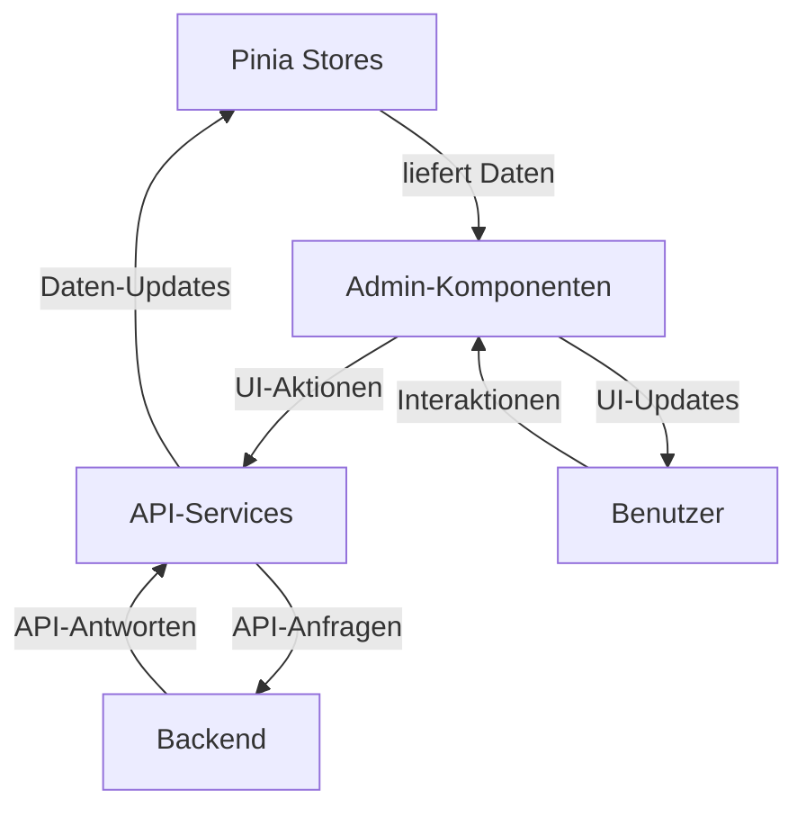

# Admin-Komponenten

> **Letzte Aktualisierung:** 10.05.2025 | **Version:** 1.0.0 | **Status:** Aktiv

## Inhaltsverzeichnis

1. [Übersicht](#übersicht)
2. [Architektur und Struktur](#architektur-und-struktur)
   - [Komponentenhierarchie](#komponentenhierarchie)
   - [Datenflussdiagramm](#datenflussdiagramm)
3. [Hauptkomponenten](#hauptkomponenten)
   - [AdminPanel](#adminpanel)
   - [AdminDashboard](#admindashboard)
   - [AdminUsers](#adminusers)
   - [AdminSystem](#adminsystem)
   - [AdminStatistics](#adminstatistics)
   - [AdminFeatureToggles](#adminfeaturetoggles)
   - [AdminLogViewer](#adminlogviewer)
   - [AdminFeedback](#adminfeedback)
   - [AdminMotd](#adminmotd)
4. [Pinia Stores](#pinia-stores)
   - [Admin Store Struktur](#admin-store-struktur)
   - [Beispiel: useAdminUsersStore](#beispiel-useadminusersstore)
5. [API-Integration](#api-integration)
   - [Service-Wrapper](#service-wrapper)
   - [Fehlerbehandlung](#fehlerbehandlung)
6. [Datenmodelle und Typen](#datenmodelle-und-typen)
7. [Implementierte Features](#implementierte-features)
   - [Benutzerverwaltung](#benutzerverwaltung)
   - [Systemüberwachung](#systemüberwachung)
   - [Feature-Toggle-Management](#feature-toggle-management)
   - [Log-Verwaltung](#log-verwaltung)
   - [Feedback-Verwaltung](#feedback-verwaltung)
   - [MOTD-Verwaltung](#motd-verwaltung)
8. [Integration und Migration](#integration-und-migration)
   - [Feature-Toggles](#feature-toggles)
   - [Kompatibilität mit Legacy-Code](#kompatibilität-mit-legacy-code)
9. [Technische Details](#technische-details)
   - [Performance-Optimierungen](#performance-optimierungen)
   - [Accessibility](#accessibility)
   - [Sicherheit](#sicherheit)
10. [Best Practices](#best-practices)
11. [Nächste Schritte](#nächste-schritte)

## Übersicht

Die Admin-Komponenten bieten eine moderne, benutzerfreundliche Schnittstelle zur Verwaltung und Überwachung des nscale DMS Assistenten. Sie wurden als Vue 3 Single File Components (SFCs) implementiert, um die Wartbarkeit zu verbessern und die Migration von Vanilla JS zu einem modernen Frontend-Framework zu unterstützen.

Die Kernfunktionalitäten umfassen:

- Umfassende Benutzerverwaltung mit Rollenkonzept
- Systemüberwachung und -konfiguration
- Feature-Toggle-Management und -Monitoring
- Feedback-Analyse und -Verwaltung
- Message of the Day (MOTD) Editor
- Systemlog-Anzeige und -Filterung
- Dokumentenkonverter-Verwaltung (teilweise implementiert)

Die Admin-Komponenten sind vollständig in Vue 3 mit Composition API implementiert und nutzen Pinia für das State Management. Sie bieten ein responsives Design, Dark Mode / Light Mode Unterstützung und umfassende Accessibility-Features.

## Architektur und Struktur

### Komponentenhierarchie

```
AdminView.vue (Router-Komponente)
└── AdminPanel.vue (Hauptkomponente)
    ├── AdminSidebar (integriert in AdminPanel)
    │   └── AdminNavItem.vue (implizit)
    ├── AdminHeader (integriert in AdminPanel)
    ├── Tab-Komponenten
    │   ├── AdminDashboard.vue
    │   ├── AdminUsers.vue
    │   ├── AdminSystem.vue
    │   ├── AdminStatistics.vue
    │   ├── AdminFeatureToggles.vue
    │   ├── AdminLogViewer.vue
    │   ├── AdminFeedback.vue
    │   ├── AdminMotd.vue
    │   └── AdminSystemSettings.vue
    └── UI-Komponenten
        ├── Toast.vue
        ├── Dialog.vue
        └── LoadingSpinner.vue
```

Diese Struktur ermöglicht eine klare Trennung von Verantwortlichkeiten, wobei jede Tab-Komponente für einen spezifischen Verwaltungsbereich zuständig ist. Die gemeinsamen UI-Komponenten werden für Benachrichtigungen, Dialoge und Ladeanzeigen verwendet.

### Datenflussdiagramm



Der Datenfluss folgt einem klaren Muster:

1. **Dateneingabe**: Benutzer interagiert mit UI-Komponenten
2. **Aktionsauslösung**: Komponente ruft Service-Methode auf 
3. **API-Kommunikation**: Service sendet API-Anfrage
4. **Datenverarbeitung**: Backend verarbeitet Anfrage
5. **Antwortverarbeitung**: Service empfängt API-Antwort
6. **Zustandsaktualisierung**: Pinia Store wird aktualisiert
7. **UI-Aktualisierung**: Komponenten werden mit neuen Daten neu gerendert

## Hauptkomponenten

### AdminPanel

Die Hauptkomponente, die als Container für alle Admin-Funktionalitäten dient. Sie ist verantwortlich für:

- Layout und Navigation zwischen den verschiedenen Admin-Bereichen
- Benutzerauthentifizierung und Autorisierung
- Dynamisches Laden der Tab-Komponenten
- Anzeige von Toast-Benachrichtigungen und Dialogen
- Dark Mode / Light Mode Umschaltung

```vue
<!-- Vereinfachte Version von AdminPanel.vue -->
<template>
  <div class="admin-panel" :class="{ 'theme-dark': isDarkMode }">
    <!-- Header-Bereich -->
    <div class="admin-header">
      <h1 class="admin-title">nscale DMS Assistent Administration</h1>
      <div class="admin-user-info">
        <span>{{ currentUser?.email }}</span>
        <Badge :type="currentUser?.role === 'admin' ? 'primary' : 'secondary'">
          {{ currentUser?.role }}
        </Badge>
      </div>
    </div>
    
    <div class="admin-main">
      <!-- Sidebar mit Navigation -->
      <div class="admin-sidebar">
        <nav class="admin-nav">
          <button 
            v-for="tab in visibleTabs" 
            :key="tab.id"
            @click="navigateTo(tab.id)"
            :class="['admin-nav-item', { active: activeTab === tab.id }]"
          >
            <i :class="['admin-nav-icon', tab.icon]" aria-hidden="true"></i>
            <span>{{ tab.label }}</span>
          </button>
        </nav>
      </div>
      
      <!-- Content-Bereich mit aktiver Tab-Komponente -->
      <div class="admin-content">
        <Transition name="fade" mode="out-in">
          <component 
            :is="currentTabComponent" 
            v-if="!isLoading"
            @action="handleAction"
          ></component>
          <div v-else class="admin-loading">
            <LoadingSpinner size="large" />
            <p>Lade Daten...</p>
          </div>
        </Transition>
      </div>
    </div>
    
    <!-- Globale UI-Komponenten -->
    <Toast position="bottom-right" />
    <Dialog />
  </div>
</template>
```

### AdminDashboard

Eine Übersichtskomponente, die wichtige Metriken und Systemstatus auf einen Blick zeigt:

- Statusanzeige für den Systemzustand (Normal, Warnung, Kritisch)
- Statistik-Karten für wichtige Metriken (Benutzer, Sitzungen, Nachrichten)
- Schnellaktionen für häufig verwendete Admin-Funktionen
- Anzeige der letzten Aktivitäten im System

### AdminUsers

Eine Komponente zur Verwaltung von Benutzerkonten und Zugriffsrechten:

- Tabellarische Darstellung aller Benutzerkonten mit Such- und Filterfunktion
- Formular zur Erstellung neuer Benutzer
- Rollenmanagement (Änderung von Benutzerrollen)
- Benutzerentfernung mit Sicherheitsabfragen
- Detailansicht von Benutzeraktivitäten

### AdminSystem

Eine Komponente zur Überwachung und Konfiguration des Systemzustands:

- Ressourcennutzung mit visuellen Indikatoren (CPU, Speicher, Festplatte)
- Systemaktionen (Cache leeren, Embeddings neu laden)
- Systemstatistiken und Leistungskennzahlen
- Wartungsfunktionen und Systemkonfiguration

### AdminStatistics

Eine umfangreiche Analyse- und Visualisierungskomponente für Systemdaten und Nutzungsstatistiken:

- Umschaltbare Ansichten (Übersicht, Benutzeraktivität, Sitzungen, Feedback, Leistung)
- Flexibel konfigurierbare Zeiträume (Tag, Woche, Monat, Jahr)
- Interaktive Diagramme zur Visualisierung von:
  - Nutzungstrends im Zeitverlauf (Sitzungen, Nachrichten)
  - Systemperformance (Antwortzeiten, Ressourcennutzung)
  - Benutzeraktivität mit Segmentierung
  - Feedback-Auswertungen und Trends
  - Sitzungsverteilungen nach Zeit, Dauer und Gerät
- Detaillierte Statistik-Karten für wichtige Kennzahlen
- Export-Funktionen für Rohdaten und Diagramme
- Responsive Gestaltung für verschiedene Bildschirmgrößen
- Echtzeit-Datenaktualisierung durch AdminSystemStore

### AdminFeatureToggles

Eine Komponente zur Verwaltung und Überwachung von Feature-Flags:

- Umschaltbare Ansichten: Management und Monitoring
- Kategorisierte Anzeige aller Feature-Toggles
- Einfaches Ein- und Ausschalten von Features
- Nutzungsstatistiken und Fehleranalyse für Features

### AdminLogViewer

Eine Komponente zur Anzeige und Filterung von Systemlogs:

- Tabellarische Darstellung von Logs mit Zeitstempel und Log-Level
- Filterung nach Log-Level, Zeitraum und Suchbegriff
- Detailansicht für einzelne Log-Einträge
- Export-Funktion für Log-Daten

### AdminFeedback

Eine umfassende Komponente zur Verwaltung und Analyse von Benutzerfeedback:

- Tabellarische Darstellung aller Feedback-Einträge mit Pagination
- Umfangreiche Filter- und Suchfunktionen:
  - Filterung nach Zeitraum (Datum von/bis)
  - Filterung nach Kommentaren (mit/ohne Kommentare)
  - Volltextsuche über alle Feedback-Daten
- Detailansicht für einzelne Feedback-Einträge mit vollständigem Kontext
- Statistische Auswertungen und Visualisierungen:
  - Verteilung des Feedbacks nach Quelle (Diagramm)
  - Trend-Analyse über Zeiträume (Liniendiagramm)
  - Zusammenfassung wichtiger Metriken (Karten)
- Export-Funktion für gefilterte Feedback-Daten im CSV-Format
- Responsive Design für optimale Nutzung auf Desktop und Mobilgeräten

### AdminMotd

Eine leistungsfähige Komponente zur Verwaltung und Bearbeitung von Message of the Day (MOTD) Nachrichten:

- WYSIWYG-Editor für Message of the Day mit Markdown-Unterstützung
- Live-Vorschau der MOTD-Nachrichten
- Ausführliche Stilanpassungen:
  - Hintergrund-, Rahmen- und Textfarbe
  - Ikonauswahl für die Nachricht
  - Position und Darstellungsoptionen
- Zeitplanungsfunktion für automatische Anzeige:
  - Start- und Enddatum für die Nachricht
  - Zielgruppenauswahl (alle Benutzer, nur Admins, nur Standard-Benutzer)
- Versionsverwaltung mit Verlauf früherer MOTD-Nachrichten
- Formatierungshilfen für Markdown mit intuitiver Toolbar
- Responsive Design für verschiedene Bildschirmgrößen

```vue
<!-- Vereinfachte Version von AdminFeedback.vue -->
<template>
  <div class="admin-feedback" data-test="admin-feedback">
    <!-- Statistik-Karten für schnellen Überblick -->
    <div class="stats-section" data-test="stats-section">
      <div class="stat-card">
        <h3>Gesamt</h3>
        <div class="stat-value">{{ stats.total }}</div>
      </div>
      <div class="stat-card">
        <h3>Durchschnitt</h3>
        <div class="stat-value">{{ stats.averageRating.toFixed(1) }}</div>
      </div>
      <div class="stat-card">
        <h3>Positiv</h3>
        <div class="stat-value">{{ stats.positiveCount }}</div>
      </div>
      <div class="stat-card">
        <h3>Negativ</h3>
        <div class="stat-value">{{ stats.negativeCount }}</div>
      </div>
      <div class="stat-card">
        <h3>Mit Kommentaren</h3>
        <div class="stat-value">{{ stats.withCommentsCount }}</div>
      </div>
    </div>
    
    <!-- Visualisierungen -->
    <div class="chart-container" :class="isMobile ? 'mobile-layout' : 'desktop-layout'">
      <div class="chart" data-test="source-chart-container">
        <h3>Feedback nach Quelle</h3>
        <canvas ref="sourceChartRef"></canvas>
      </div>
      <div class="chart" data-test="trend-chart-container">
        <h3>Feedback-Trend</h3>
        <canvas ref="trendChartRef"></canvas>
      </div>
    </div>
    
    <!-- Filter-Bereich -->
    <div class="filters-section" data-test="feedback-filters">
      <div class="date-filters">
        <BaseInput
          type="date"
          label="Von"
          v-model="startDate"
          @update:modelValue="updateDateFilter"
        />
        <BaseInput
          type="date"
          label="Bis"
          v-model="endDate"
          @update:modelValue="updateDateFilter"
        />
        <BaseCheckbox
          label="Nur mit Kommentaren"
          v-model="showOnlyWithComments"
          @update:modelValue="toggleCommentFilter"
        />
      </div>
      <div class="search-filter">
        <BaseInput
          type="search"
          label="Suche"
          placeholder="Suche nach Inhalten, Quellen oder Benutzern..."
          v-model="searchTerm"
          @update:modelValue="debouncedSearch"
        />
        <BaseButton @click="resetFilters">Filter zurücksetzen</BaseButton>
        <BaseButton @click="exportToCsv">Als CSV exportieren</BaseButton>
      </div>
    </div>
    
    <!-- Feedback-Tabelle -->
    <div class="feedback-table-container" data-test="feedback-table">
      <table class="feedback-table">
        <thead>
          <tr>
            <th @click="sortBy('timestamp')">Datum</th>
            <th @click="sortBy('rating')">Bewertung</th>
            <th>Quelle</th>
            <th>Kommentar</th>
            <th>Benutzer</th>
            <th>Aktionen</th>
          </tr>
        </thead>
        <tbody>
          <tr v-for="item in paginatedFeedback" :key="item.id" @click="showDetail(item)">
            <td>{{ formatDateForDisplay(item.timestamp) }}</td>
            <td>
              <div class="rating" :class="getRatingClass(item.rating)">
                {{ item.rating }}
              </div>
            </td>
            <td>{{ item.source }}</td>
            <td class="comment-cell">
              {{ truncateComment(item.comment) }}
            </td>
            <td>{{ item.userId }}</td>
            <td>
              <BaseButton size="small" @click.stop="showDetail(item)">Details</BaseButton>
            </td>
          </tr>
        </tbody>
      </table>
      
      <!-- Pagination -->
      <div class="pagination">
        <BaseButton 
          :disabled="currentPage === 1" 
          @click="currentPage--"
        >
          Zurück
        </BaseButton>
        <span>Seite {{ currentPage }} von {{ totalPages }}</span>
        <BaseButton 
          :disabled="currentPage === totalPages" 
          @click="currentPage++"
        >
          Weiter
        </BaseButton>
      </div>
    </div>
    
    <!-- Detail-Modal -->
    <Dialog v-model="showDetailModal" title="Feedback-Details">
      <template v-if="selectedFeedback">
        <div class="feedback-detail">
          <div class="detail-header">
            <h3>Feedback vom {{ formatDateForDisplay(selectedFeedback.timestamp) }}</h3>
            <div class="rating" :class="getRatingClass(selectedFeedback.rating)">
              {{ selectedFeedback.rating }}
            </div>
          </div>
          
          <div class="detail-info">
            <div class="info-item">
              <strong>Benutzer:</strong> {{ selectedFeedback.userId }}
            </div>
            <div class="info-item">
              <strong>Sitzung:</strong> {{ selectedFeedback.sessionId }}
            </div>
            <div class="info-item">
              <strong>Quelle:</strong> {{ selectedFeedback.source }}
            </div>
          </div>
          
          <div class="detail-comment">
            <h4>Kommentar:</h4>
            <p>{{ selectedFeedback.comment || 'Kein Kommentar vorhanden' }}</p>
          </div>
        </div>
      </template>
    </Dialog>
  </div>
</template>
```

## Pinia Stores

### Admin Store Struktur

Die Admin-Komponenten verwenden einen modularen Ansatz mit mehreren spezialisierten Pinia Stores:

- **useAdminStore**: Zentraler Store für gemeinsame Admin-Funktionalitäten
- **useAdminUsersStore**: Verwaltung von Benutzerdaten und -aktionen
- **useAdminSystemStore**: Systemverwaltung und -überwachung
- **useAdminFeedbackStore**: Feedback-Analyse und -Verwaltung
- **useAdminMotdStore**: MOTD-Editor und -Konfiguration

### Beispiel: useAdminUsersStore

```typescript
// Vereinfachtes Beispiel für den Admin Users Store
export const useAdminUsersStore = defineStore('adminUsers', {
  state: () => ({
    users: [] as User[],
    loading: false,
    error: null as string | null,
  }),
  
  getters: {
    adminUsers: (state) => state.users.filter(u => u.role === 'admin'),
    standardUsers: (state) => state.users.filter(u => u.role === 'user'),
  },
  
  actions: {
    async fetchUsers() {
      this.loading = true;
      try {
        const response = await adminApi.getUsers();
        this.users = response.data.users;
      } catch (err) {
        this.error = getErrorMessage(err);
      } finally {
        this.loading = false;
      }
    },
    
    async createUser(userData: NewUser) {
      this.loading = true;
      try {
        const response = await adminApi.createUser(userData);
        this.users.push(response.data.user);
        return response.data.user;
      } catch (err) {
        this.error = getErrorMessage(err);
        throw err;
      } finally {
        this.loading = false;
      }
    },
    
    async updateUserRole(userId: string, role: string) {
      this.loading = true;
      try {
        const response = await adminApi.updateUserRole(userId, role);
        const userIndex = this.users.findIndex(u => u.id === userId);
        if (userIndex !== -1) {
          this.users[userIndex].role = role;
        }
        return response.data;
      } catch (err) {
        this.error = getErrorMessage(err);
        throw err;
      } finally {
        this.loading = false;
      }
    },
    
    async deleteUser(userId: string) {
      this.loading = true;
      try {
        await adminApi.deleteUser(userId);
        this.users = this.users.filter(u => u.id !== userId);
      } catch (err) {
        this.error = getErrorMessage(err);
        throw err;
      } finally {
        this.loading = false;
      }
    },
  }
});
```

## API-Integration

### Service-Wrapper

Die Admin-Komponenten nutzen spezialisierte Service-Wrapper für die API-Kommunikation:

- **AdminServiceWrapper**: Für allgemeine Admin-Funktionen
- **LogServiceWrapper**: Für die Protokollverwaltung
- **DocumentConverterServiceWrapper**: Für den Dokumentenkonverter

Diese Wrapper bieten eine einheitliche Schnittstelle für API-Aufrufe und fügen wichtige Funktionen hinzu:

```typescript
// Vereinfachtes Beispiel für den AdminServiceWrapper
export class AdminServiceWrapper {
  constructor(private api: ApiService) {}
  
  async getUsers(): Promise<User[]> {
    try {
      const response = await this.api.get('/api/admin/users');
      return response.data.users;
    } catch (error) {
      this.handleError(error, 'Fehler beim Abrufen der Benutzer');
      throw error;
    }
  }
  
  async createUser(userData: NewUser): Promise<User> {
    try {
      const response = await this.api.post('/api/admin/users', userData);
      return response.data.user;
    } catch (error) {
      this.handleError(error, 'Fehler beim Erstellen des Benutzers');
      throw error;
    }
  }
  
  private handleError(error: any, defaultMessage: string): void {
    const errorMessage = error.response?.data?.message || defaultMessage;
    logService.error(`Admin API Error: ${errorMessage}`, error);
    
    // Fehler-Mapping und Lösungsvorschläge
    const solutions = this.getSolutionsForError(error);
    
    // Benachrichtigung anzeigen
    toastService.error(errorMessage, {
      title: 'API-Fehler',
      solutions,
      duration: 5000,
    });
  }
  
  private getSolutionsForError(error: any): string[] {
    // Intelligente Lösungsvorschläge basierend auf Fehlertyp
    // ...
  }
}
```

### Fehlerbehandlung

Die Admin-Komponenten implementieren eine fortschrittliche Fehlerbehandlung:

- Standardisierte Fehlerformate für konsistente Darstellung
- Intelligentes Fehler-Mapping mit Lösungsvorschlägen
- Umfassendes Logging für Diagnose- und Debugging-Zwecke
- Fallback-Mechanismen für Offline-Betrieb oder API-Ausfälle
- Toast-Benachrichtigungen mit verschiedenen Fehlertypen

## Datenmodelle und Typen

Die Admin-Komponenten verwenden TypeScript für starke Typisierung. Die wichtigsten Datenmodelle sind:

```typescript
// User-Modell und verwandte Typen
export interface User {
  id: string;
  email: string;
  role: UserRole;
  created_at: number;
  last_login: number | null;
}

export enum UserRole {
  ADMIN = 'admin',
  USER = 'user'
}

export interface NewUser {
  email: string;
  password: string;
  role: UserRole;
}

// System-Statistiken
export interface SystemStats {
  total_users: number;
  active_users_today: number;
  total_sessions: number;
  total_messages: number;
  database_size_mb: number;
  cache_size_mb: number;
  cache_hit_rate: number;
  document_count: number;
  avg_response_time_ms: number;
  active_model: string;
  uptime_days: number;
  memory_usage_percent: number;
  cpu_usage_percent: number;
}

// Feedback-Einträge
export interface FeedbackEntry {
  id: string;
  sessionId: string;
  timestamp: string;
  rating: number;
  comment: string;
  source: string;
  userId: string;
}

// Feedback-Statistiken
export interface FeedbackStats {
  total: number;
  averageRating: number;
  positiveCount: number;
  negativeCount: number;
  withCommentsCount: number;
  bySource: Record<string, number>;
  byWeek: Record<string, number>;
}

// Feedback-Filter
export interface FeedbackFilter {
  startDate: string | null;
  endDate: string | null;
  onlyWithComments: boolean;
  searchTerm: string;
}
```

## Implementierte Features

### Benutzerverwaltung

Die Benutzerverwaltung umfasst:

- Anzeige aller Benutzer mit Details (E-Mail, Rolle, Erstellungsdatum, letzter Login)
- Erstellung neuer Benutzer mit Rollenauswahl (admin/user)
- Änderung von Benutzerrollen mit Berechtigungsprüfung
- Löschen von Benutzern mit Einschränkungen (keine Admins löschen, kein Selbstlöschen)
- Benutzersuche und -filterung nach verschiedenen Kriterien

### Systemüberwachung

Die Systemüberwachung umfasst:

- Anzeige allgemeiner Systemstatistiken (API-Aufruf an `/api/admin/stats`)
- Systemwartung-Funktionen (Cache leeren, Embeddings neu laden)
- Systemzustand und Performance-Indikatoren
- Ressourcennutzung mit Schwellenwerten für Warnungen

### Feature-Toggle-Management

Das Feature-Toggle-Management umfasst:

- Kategorisierte Anzeige aller Feature-Toggles
- Ein-/Ausschalten von Features mit sofortiger Wirkung
- Nutzungsstatistiken für Features
- Fehleranalyse in Zusammenhang mit Features
- Bulk-Aktionen für mehrere Toggles gleichzeitig

### Log-Verwaltung

Die Log-Verwaltung umfasst:

- Anzeige von System-Logs mit verschiedenen Detailebenen
- Filterung nach Log-Level, Zeitraum und Suchbegriff
- Detailansicht für ausgewählte Log-Einträge
- Export-Funktion für Log-Daten
- Automatische Aktualisierung in konfigurierbaren Intervallen

### Feedback-Verwaltung

Die Feedback-Verwaltung umfasst:

- Tabellarische Darstellung aller Feedback-Einträge mit Pagination und Sortierung
- Umfangreiche Filteroptionen:
  - Zeitraumfilter mit Datumswählern
  - Anzeige von Einträgen mit Kommentaren
  - Suchfunktion für Volltextsuche
- Detailansicht für einzelne Feedback-Einträge
- Statistische Visualisierungen:
  - Verteilung des Feedbacks nach Quellen (Kreisdiagramm)
  - Feedback-Trends über Zeit (Liniendiagramm)
  - Übersichtskarten mit wichtigen Kennzahlen
- Export-Funktion für Feedback-Daten im CSV-Format
- Responsive Design für Desktop und Mobile mit optimierter Darstellung

### MOTD-Verwaltung

Die MOTD-Verwaltung (Message of the Day) umfasst:

- Vollständigen WYSIWYG-Editor für Nachrichten mit Markdown-Unterstützung
- Echtzeitvorschau der Nachricht mit originalgetreuer Darstellung
- Erweiterte Anpassungsoptionen:
  - Formatauswahl (Markdown, HTML, Text)
  - Farbeinstellungen für Design und Erscheinungsbild
  - Positionierung der Nachricht in der Anwendung
- Zeitsteuerung für die Nachrichtenanzeige:
  - Konfigurierbare Start- und Endzeiten
  - Zielgruppenspezifische Anzeige (Administratoren/Benutzer)
- Versionskontrolle und Verlaufsverwaltung:
  - Historische Versionen einsehen und wiederherstellen
  - Änderungsprotokoll mit Benutzer- und Zeitstempeln
- Benutzerfreundlicher Markdown-Editor mit Funktionsleiste:
  - Formatierungswerkzeuge für einfache Textgestaltung
  - Hilfebereich mit Markdown-Syntax
- Vollständig responsives Design für verschiedene Geräte

## Integration und Migration

### Feature-Toggles

Die Admin-Komponenten verwenden Feature-Toggles für eine schrittweise Migration:

```javascript
// Beispiel für die Integration in eine bestehende Seite
<template>
  <div>
    <!-- Zeige entweder die neue SFC oder die Legacy-Komponente an -->
    <AdminPanel v-if="featureTogglesStore.isEnabled('useSfcAdmin')" />
    <LegacyAdmin v-else />
  </div>
</template>
```

Die folgenden Feature-Toggles werden verwendet:

- `useSfcAdmin`: Schaltet zwischen altem und neuem Admin-Panel um
- `useEnhancedUserManagement`: Aktiviert erweiterte Benutzerverwaltungsfunktionen
- `useSystemMonitoring`: Aktiviert die Systemüberwachungskomponente
- `useFeedbackAnalysis`: Aktiviert die Feedback-Analyse-Komponente
- `useDocConverter`: Aktiviert die Dokumentenkonverter-Komponente

### Kompatibilität mit Legacy-Code

Die Admin-Komponenten wurden für die Kompatibilität mit bestehendem Legacy-Code entwickelt:

- API-Aufrufe bleiben abwärtskompatibel
- Datenformate sind konsistent mit älteren Implementierungen
- Neue Funktionen werden über Feature-Toggles aktiviert
- Progressive Enhancement für ältere Browser

## Technische Details

### Performance-Optimierungen

Die Admin-Komponenten implementieren verschiedene Performance-Optimierungen:

- Lazy-Loading für Tab-Komponenten mit `defineAsyncComponent`
- Caching von API-Anfragen für häufig verwendete Daten
- Virtualisierte Listen für große Datensätze (z.B. Benutzer, Logs)
- Effizientes Rendering durch Verwendung von Vue 3 Reactivity System
- Debounced Input-Handling für Suchfunktionen
- Optimiertes Rendering durch `v-memo` und `v-once` für statische Inhalte
- Web Workers für rechenintensive Operationen (z.B. Datenfilterung)

### Accessibility

Die Admin-Komponenten implementieren umfassende Accessibility-Features:

- ARIA-Attribute für bessere Screenreader-Unterstützung
- Keyboard-Navigation für alle Funktionen
- Ausreichende Kontrastverhältnisse gemäß WCAG-Richtlinien
- Fokus-Management in Modals und Dialogen
- Semantische HTML-Struktur
- Unterstützung für Benutzer mit eingeschränkter Bewegung (`prefers-reduced-motion`)

### Sicherheit

Die Admin-Komponenten implementieren verschiedene Sicherheitsmaßnahmen:

- CSRF-Schutz bei allen kritischen Operationen
- Rollenbasierte Berechtigungsprüfungen auf Komponentenebene
- Validierung aller Benutzereingaben (Client-Side und Server-Side)
- Timeout für inaktive Admin-Sitzungen
- Audit-Logs für kritische Admin-Aktionen
- Rate-Limiting für sensible Operationen
- Sanitization aller angezeigten Daten zur Verhinderung von XSS

## Best Practices

Bei der Arbeit mit den Admin-Komponenten sollten folgende Best Practices beachtet werden:

1. **API-Aufrufe**: Verwende immer Service-Wrapper-Klassen für API-Aufrufe statt direkter API-Nutzung
2. **Fehlerbehandlung**: Implementiere konsistente Fehlerbehandlung mit Toast-Benachrichtigungen
3. **Zustandsverwaltung**: Nutze Pinia-Stores für alle Zustandsänderungen und State-Management
4. **UI-Konsistenz**: Halte dich an die bestehenden UI-Komponenten und Design-System
5. **Zugriffskontrollen**: Prüfe stets Benutzerberechtigungen vor Anzeige von Admin-Funktionen
6. **Tests**: Schreibe Tests für alle neuen Komponenten und Stores
7. **Internationalisierung**: Verwende immer den i18n-Service für Übersetzungen

## Nächste Schritte

Die folgenden Erweiterungen und Verbesserungen sind für die Admin-Komponenten geplant:

- Umfassende Unit-Tests für alle Komponenten
- End-to-End-Tests für kritische Workflows
- Erweiterte Benutzerstatistiken und Dashboards
- Benutzergruppenverwaltung und erweiterte Rollenkonzepte
- Export-Funktionen für Daten und Metriken
- Audit-Log für Admin-Aktionen
- Erweiterung der Systemstatistiken und -visualisierungen
- Integration weiterer Dokumentenkonverter-Funktionen
- Benutzerdefinierte Dashboard-Widgets mit Drag-and-Drop-Funktion

Diese geplanten Erweiterungen werden die Funktionalität und Benutzerfreundlichkeit der Admin-Komponenten weiter verbessern und zusätzliche Verwaltungsfunktionen für den nscale DMS Assistenten bereitstellen.