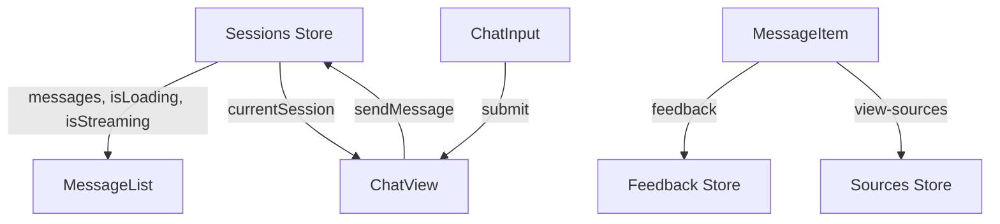
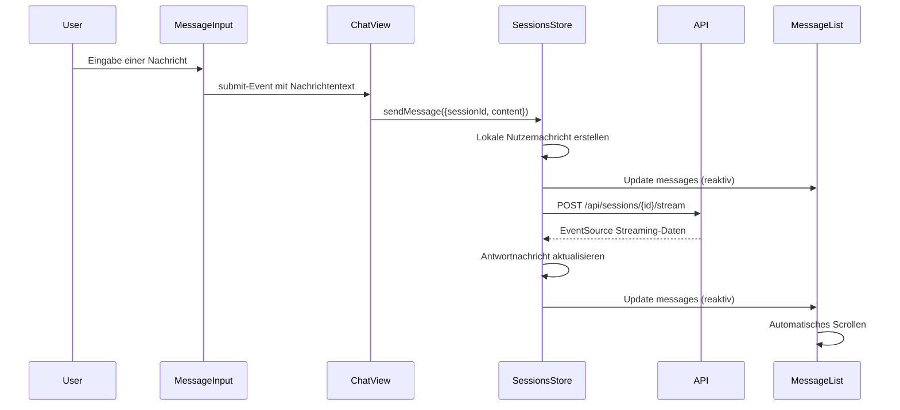
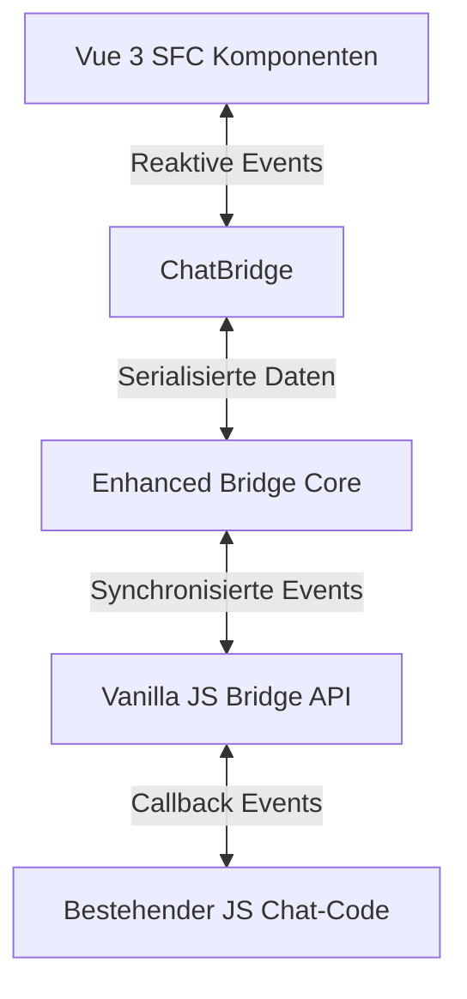

# Chat-Interface und Session-Management Komponenten

> **Letzte Aktualisierung:** 10.05.2025 | **Version:** 1.0.0 | **Status:** Aktiv

## Inhaltsverzeichnis

1. [Übersicht](#übersicht)
2. [Architektur](#architektur)
   - [Komponentenhierarchie](#komponentenhierarchie)
   - [Datenmodell](#datenmodell)
3. [Session-Management Komponenten](#session-management-komponenten)
   - [SessionList](#sessionlist)
   - [SessionItem](#sessionitem)
   - [SessionActions](#sessionactions)
4. [Chat-Interface Komponenten](#chat-interface-komponenten)
   - [MessageList](#messagelist)
   - [MessageItem](#messageitem)
   - [ChatInput](#chatinput)
5. [State Management](#state-management)
   - [Sessions-Store](#sessions-store)
   - [UI-Store](#ui-store)
   - [Datenfluss](#datenfluss)
6. [Optimierungsstrategien](#optimierungsstrategien)
   - [Virtuelles Rendering](#virtuelles-rendering)
   - [Drag-and-Drop Performance](#drag-and-drop-performance)
   - [Markdown-Formatierung](#markdown-formatierung)
7. [Enhanced Features](#enhanced-features)
   - [Streaming-Unterstützung](#streaming-unterstützung)
   - [Quellenreferenzen](#quellenreferenzen)
   - [Tag-System](#tag-system)
   - [Kategorisierung](#kategorisierung)
8. [Barrierefreiheit](#barrierefreiheit)
   - [Tastaturnavigation](#tastaturnavigation)
   - [ARIA-Attribute](#aria-attribute)
   - [Reduzierte Bewegung](#reduzierte-bewegung)
9. [Bridge-Integration](#bridge-integration)
   - [ChatBridge](#chatbridge)
   - [SessionBridge](#sessionbridge)
   - [Legacy-Interoperabilität](#legacy-interoperabilität)
10. [Feature-Toggle-System](#feature-toggle-system)
    - [Toggle-Konfiguration](#toggle-konfiguration)
    - [Fallback-Mechanismen](#fallback-mechanismen)
11. [Implementierungsbeispiele](#implementierungsbeispiele)
    - [MessageList und MessageItem](#messagelist-und-messageitem)
    - [ChatInput](#chatinput-implementierung)
    - [SessionManager](#sessionmanager)
12. [Tests und Qualitätssicherung](#tests-und-qualitätssicherung)
13. [Leistungsvergleich](#leistungsvergleich)
14. [Bekannte Einschränkungen](#bekannte-einschränkungen)
15. [Fehlerbehebung](#fehlerbehebung)
16. [Migrationsanleitung](#migrationsanleitung)

## Übersicht

Die Chat-Interface und Session-Management Komponenten bilden das Herzstück der Benutzerinteraktion mit dem nscale DMS Assistenten. Diese Komponenten wurden mit Vue 3 Single File Components (SFC) unter Verwendung der Composition API und TypeScript implementiert, um optimale Performance, Benutzererfahrung und Wartbarkeit zu gewährleisten.

Das Gesamtsystem besteht aus zwei Hauptgruppen von Komponenten:

1. **Session-Management Komponenten**: Ermöglichen die Verwaltung von Chat-Sessions, ihre Organisation und Navigation zwischen verschiedenen Gesprächen.
   - **SessionList**: Listet alle verfügbaren Chat-Sessions mit umfangreichen Funktionen zur Sortierung, Filterung und Auswahl.
   - **SessionItem**: Stellt eine einzelne Session mit Titel, Zeitstempel und Interaktionsmöglichkeiten dar.
   - **SessionActions**: Bietet Aktionsschaltflächen für sessionbezogene Operationen wie Erstellen, Löschen und Umbenennen.

2. **Chat-Interface Komponenten**: Bilden die Kernschnittstelle für die Kommunikation mit dem Assistenten.
   - **MessageList**: Zeigt die Konversationshistorie an und bietet optimiertes Scrolling und virtuelles Rendering.
   - **MessageItem**: Stellt eine einzelne Nachricht mit Markdown-Formatierung, Code-Highlighting und Quellenreferenzen dar.
   - **ChatInput**: Ermöglicht die Texteingabe mit Auto-Resize und Tastaturkürzel-Unterstützung.

Diese Komponenten integrieren sich nahtlos in das bestehende CSS Design System, unterstützen responsives Design für alle Bildschirmgrößen und bieten umfangreiche Barrierefreiheits-Features.

## Architektur

### Komponentenhierarchie

Die Chat- und Session-Komponenten sind in einer hierarchischen Struktur organisiert, die eine klare Trennung von Zuständigkeiten ermöglicht:

```
ChatView
├── SessionManager
│   ├── SessionList
│   │   └── SessionItem
│   └── SessionActions
├── MessageList
│   └── MessageItem
└── MessageInput
```

Diese Struktur bietet folgende Vorteile:
- Klare Trennung von Zuständigkeiten
- Einfache Komposition und Wiederverwendung
- Isolierte Testbarkeit jeder Komponente
- Klar definierte Kommunikationspfade

### Datenmodell

Die Komponenten arbeiten mit den folgenden Kerntypen:

#### ChatSession
```typescript
interface ChatSession {
  id: string;
  title: string;
  createdAt: string;
  updatedAt: string;
  userId: string;
  isArchived?: boolean;
  isPinned?: boolean;
  customData?: Record<string, any>;
  preview?: string;
  messageCount?: number;
  tags?: Tag[];
  category?: Category;
}

interface Tag {
  id: string;
  name: string;
  color?: string;
}

interface Category {
  id: string;
  name: string;
  color?: string;
}
```

#### ChatMessage
```typescript
interface ChatMessage {
  id: string;
  sessionId: string;
  content: string;
  role: 'user' | 'assistant' | 'system';
  timestamp: string;
  isStreaming?: boolean;
  status?: 'pending' | 'sent' | 'error';
  metadata?: {
    sourceReferences?: SourceReference[];
    processingTime?: number;
    tokens?: {
      prompt?: number;
      completion?: number;
      total?: number;
    };
    [key: string]: any;
  };
}

interface SourceReference {
  id: string;
  title: string;
  content: string;
  source: string;
  url?: string;
  relevanceScore?: number;
  pageNumber?: number;
}
```

Diese Datenstrukturen sind sorgfältig entworfen, um alle notwendigen Informationen für die Darstellung und Verwaltung von Chat-Sessions und -Nachrichten zu enthalten, während sie gleichzeitig effizient und skalierbar bleiben.

## Session-Management Komponenten

### SessionList

Die `SessionList`-Komponente zeigt alle verfügbaren Chat-Sessions an und erlaubt umfangreiche Interaktionsmöglichkeiten:

- **Dynamische Sortierung** nach Erstellungsdatum, Aktualisierungsdatum oder alphabetisch
- **Volltextsuche** zum schnellen Finden von Sessions
- **Drag-and-Drop** zur Neuanordnung von Sessions
- **Kontextmenü** für erweiterte Aktionen
- **Optimiertes Rendering** für hohe Performance bei vielen Sessions
- **Responsive Design** für alle Bildschirmgrößen

```vue
<SessionList
  :sessions="sessions"
  :activeSessionId="currentSessionId"
  :isLoading="isLoading"
  @select="handleSessionSelect"
  @delete="handleSessionDelete"
  @rename="handleSessionRename"
  @pin="handleSessionPin"
  @create="handleCreateSession"
  @reorder="handleSessionReorder"
/>
```

#### Props

| Name | Typ | Standardwert | Beschreibung |
|------|-----|--------------|--------------|
| `sessions` | `ChatSession[]` | `[]` | Array der anzuzeigenden Sessions |
| `activeSessionId` | `string \| null` | `null` | Die ID der aktiven Session |
| `isLoading` | `boolean` | `false` | Gibt an, ob Sessions geladen werden |
| `emptyMessage` | `string` | "Noch keine..." | Nachricht, wenn keine Sessions vorhanden sind |
| `showCreateButton` | `boolean` | `true` | Ob ein Button zum Erstellen neuer Sessions angezeigt werden soll |
| `createButtonText` | `string` | "Neue Unterhaltung" | Text für den Button zum Erstellen neuer Sessions |
| `enableDragAndDrop` | `boolean` | `true` | Ob Drag-and-Drop aktiviert sein soll |
| `enableSorting` | `boolean` | `true` | Ob der User die Sortierung ändern kann |
| `defaultSort` | `string` | "lastUpdated" | Standardsortierung |
| `enableFiltering` | `boolean` | `true` | Ob Filterfunktionen verfügbar sein sollen |

#### Events

| Name | Payload | Beschreibung |
|------|---------|--------------|
| `select` | `string` | Wird ausgelöst, wenn eine Session ausgewählt wird |
| `delete` | `string` | Wird ausgelöst, wenn eine Session gelöscht wird |
| `rename` | `{ sessionId, newTitle }` | Wird ausgelöst, wenn eine Session umbenannt wird |
| `pin` | `{ sessionId, pinned }` | Wird ausgelöst, wenn eine Session angeheftet/abgeheftet wird |
| `create` | - | Wird ausgelöst, wenn eine neue Session erstellt werden soll |
| `reorder` | `ChatSession[]` | Wird ausgelöst, wenn die Reihenfolge der Sessions geändert wurde |

Die SessionList implementiert ein Kontextmenü für erweiterte Funktionen:

```vue
<div 
  v-if="showContextMenu"
  class="n-session-list__context-menu"
  :style="{
    top: `${contextMenuPos.y}px`,
    left: `${contextMenuPos.x}px`
  }"
  ref="contextMenu"
  role="menu"
>
  <div class="n-session-list__context-menu-header">
    <span class="n-session-list__context-menu-title">{{ contextSession.title }}</span>
  </div>
  <div class="n-session-list__context-menu-content">
    <button 
      class="n-session-list__context-menu-item"
      @click="handleContextMenuAction('rename')"
      role="menuitem"
    >
      <svg><!-- Icon --></svg>
      <span>Umbenennen</span>
    </button>
    <!-- Weitere Menüpunkte -->
  </div>
</div>
```

### SessionItem

Die `SessionItem`-Komponente stellt eine einzelne Session dar und bietet verschiedene Interaktionsmöglichkeiten:

- **Visuelle Hervorhebung** der aktiven und angehefteten Sessions
- **Zeigt Meta-Informationen** wie Erstellungs- oder Aktualisierungsdatum
- **Schnellzugriff auf Aktionen** wie Löschen, Umbenennen und Anheften
- **Tag- und Kategoriesystem** zur besseren Organisation von Sessions
- **Vorschau der letzten Nachricht** für schnelle Inhaltserkennung
- **Multi-Select-Unterstützung** für Massenoperationen
- **Archivierungsfunktion** für nicht mehr aktive Sessions
- **Drag-Handle** für einfaches Verschieben
- **Kontextmenü-Unterstützung** für erweiterte Funktionen

```vue
<SessionItem
  :session="session"
  :isActive="activeSessionId === session.id"
  :isPinned="session.isPinned"
  :isSelected="selectedSessionIds.includes(session.id)"
  :showDragHandle="enableDragAndDrop"
  :showCheckbox="isMultiSelectModeActive"
  :showPreview="showPreview"
  :preview="session.preview"
  :messageCount="session.messageCount"
  :tags="session.tags"
  :category="session.category?.name"
  :categoryColor="session.category?.color"
  :showTagButton="true"
  :showCategoryButton="true"
  :showArchiveButton="true"
  @select="handleSessionSelect"
  @contextmenu="handleContextMenu"
  @pin="handlePinSession"
  @delete="handleDeleteSession"
  @rename="handleRenameSession"
  @tag="handleAddTag"
  @tag-click="handleTagClick"
  @categorize="handleCategorize"
  @archive="handleArchiveSession"
  @toggle-select="handleToggleSelect"
/>
```

#### Props

| Name | Typ | Standardwert | Beschreibung |
|------|-----|--------------|--------------|
| `session` | `ChatSession` | - | Die Session, die angezeigt werden soll |
| `isActive` | `boolean` | `false` | Ob diese Session momentan aktiv ist |
| `isPinned` | `boolean` | `false` | Ob diese Session angeheftet ist |
| `isSelected` | `boolean` | `false` | Ob diese Session ausgewählt ist (multi-select) |
| `showDragHandle` | `boolean` | `true` | Ob ein Drag-Handle angezeigt werden soll |
| `showMetadata` | `boolean` | `true` | Ob Metadaten wie das Datum angezeigt werden sollen |
| `showActions` | `boolean` | `true` | Ob Aktionsschaltflächen angezeigt werden sollen |
| `enableContextMenu` | `boolean` | `true` | Ob ein kontextuelles Menü aktiviert sein soll |
| `showTagButton` | `boolean` | `false` | Ob Tagging-Funktionalität angezeigt werden soll |
| `showCategoryButton` | `boolean` | `false` | Ob Kategorisierungs-Funktionalität angezeigt werden soll |
| `showArchiveButton` | `boolean` | `false` | Ob Archivierungs-Funktionalität angezeigt werden soll |
| `showPreview` | `boolean` | `false` | Ob ein Vorschau der letzten Nachricht angezeigt werden soll |
| `showCheckbox` | `boolean` | `false` | Ob eine Checkbox für Multi-Select angezeigt werden soll |
| `preview` | `string` | `''` | Vorschautext (z.B. letzte Nachricht) |
| `messageCount` | `number` | `0` | Anzahl der Nachrichten in dieser Session |
| `tags` | `Tag[]` | `[]` | Tags für diese Session |
| `category` | `string` | `''` | Kategorie dieser Session |
| `categoryColor` | `string` | `'#e2e8f0'` | Farbe der Kategorie |
| `dateFormat` | `'relative' \| 'short' \| 'long'` | `'relative'` | Das zu verwendende Datumsformat |

#### Events

| Name | Payload | Beschreibung |
|------|---------|--------------|
| `select` | `string` | Wird ausgelöst, wenn die Session ausgewählt wird |
| `pin` | `string, boolean` | Wird ausgelöst, wenn die Session angeheftet/abgeheftet wird |
| `rename` | `string` | Wird ausgelöst, wenn die Session umbenannt werden soll |
| `delete` | `string` | Wird ausgelöst, wenn die Session gelöscht werden soll |
| `contextmenu` | `MouseEvent, ChatSession` | Wird ausgelöst, wenn das Kontextmenü geöffnet werden soll |
| `tag` | `string` | Wird ausgelöst, wenn die Session getaggt werden soll |
| `tag-click` | `string` | Wird ausgelöst, wenn ein Tag angeklickt wurde |
| `categorize` | `string` | Wird ausgelöst, wenn eine Kategorie zugewiesen werden soll |
| `archive` | `string, boolean` | Wird ausgelöst, wenn eine Session archiviert/wiederhergestellt werden soll |
| `toggle-select` | `string` | Wird ausgelöst, wenn der Auswahlstatus umgeschaltet werden soll |

### SessionActions

Die `SessionActions`-Komponente stellt eine Sammlung von Aktionsschaltflächen für sessionbezogene Operationen bereit:

- **Flexible Konfiguration** der verfügbaren Aktionen
- **Gruppierung von Aktionen** in Hauptaktionen und erweiterte Aktionen
- **Unterstützung für Massenaktionen** bei Mehrfachauswahl
- **Verschiedene Anzeigemodi** (inline oder block)
- **Responsive Design** für verschiedene Bildschirmgrößen

```vue
<SessionActions
  :activeSessionId="currentSessionId"
  :enabledFeatures="['pin', 'rename', 'delete', 'export']"
  @create="handleCreateSession"
  @rename="handleRenameSession"
  @delete="handleDeleteSession"
  @pin="handlePinSession"
/>
```

#### Props

| Name | Typ | Standardwert | Beschreibung |
|------|-----|--------------|--------------|
| `activeSessionId` | `string \| null` | `null` | Die aktive Session-ID |
| `selectedSessionIds` | `string[]` | `[]` | Array ausgewählter Session-IDs (für Bulk-Aktionen) |
| `disabled` | `boolean` | `false` | Ob die Aktionen deaktiviert sind |
| `showCreateButton` | `boolean` | `true` | Ob der "Neue Session"-Button angezeigt werden soll |
| `createButtonText` | `string` | "Neue Unterhaltung" | Text für den "Neue Session"-Button |
| `showLabels` | `boolean` | `true` | Ob Labels angezeigt werden sollen |
| `display` | `'inline' \| 'block'` | `'inline'` | Wie die Aktionen angezeigt werden sollen |
| `availableActions` | `string[]` | `[...]` | Welche Aktionen verfügbar sein sollen |
| `enabledFeatures` | `string[]` | `[...]` | Welche Features aktiviert sind |

#### Events

| Name | Payload | Beschreibung |
|------|---------|--------------|
| `create` | - | Wird ausgelöst, wenn eine neue Session erstellt werden soll |
| `rename` | `string` | Wird ausgelöst, wenn eine Session umbenannt werden soll |
| `delete` | `string` | Wird ausgelöst, wenn eine Session gelöscht werden soll |
| `pin` | `string` | Wird ausgelöst, wenn eine Session angeheftet/abgeheftet werden soll |
| `export` | `string` | Wird ausgelöst, wenn eine Session exportiert werden soll |
| `share` | `string` | Wird ausgelöst, wenn eine Session geteilt werden soll |
| `duplicate` | `string` | Wird ausgelöst, wenn eine Session dupliziert werden soll |
| `bulk-delete` | `string[]` | Wird ausgelöst, wenn mehrere Sessions gelöscht werden sollen |
| `bulk-export` | `string[]` | Wird ausgelöst, wenn mehrere Sessions exportiert werden sollen |
| `bulk-share` | `string[]` | Wird ausgelöst, wenn mehrere Sessions geteilt werden sollen |

## Chat-Interface Komponenten

### MessageList

Die `MessageList`-Komponente ist für das Anzeigen der Konversationshistorie verantwortlich. Sie unterstützt:

- **Virtuelles Rendering** für optimierte Performance bei langen Konversationen
- **Automatisches Scrollen** zum neuesten Inhalt mit intelligenter Erkennung der Benutzerinteraktion
- **Lade- und Leerzustände** zur Verbesserung der Benutzererfahrung
- **Integrierte Übergangsanimationen** für ein reaktionsschnelles Gefühl
- **Streaming-Indikatoren** während der Assistent eine Antwort generiert

```vue
<MessageList 
  :messages="messages"
  :isLoading="isLoading"
  :isStreaming="isStreaming"
  :maxVisibleMessages="50"
  @feedback="handleFeedback"
  @view-sources="handleViewSources"
/>
```

#### Props

| Name | Typ | Standardwert | Beschreibung |
|------|-----|--------------|--------------|
| `messages` | `ChatMessage[]` | - | Array der anzuzeigenden Nachrichten |
| `isLoading` | `boolean` | `false` | Gibt an, ob Nachrichten geladen werden |
| `isStreaming` | `boolean` | `false` | Gibt an, ob eine Antwort gestreamt wird |
| `maxVisibleMessages` | `number` | `50` | Maximale Anzahl der anzuzeigenden Nachrichten |
| `logoUrl` | `string` | - | URL des Logos für den Willkommensbildschirm |
| `welcomeTitle` | `string` | "Willkommen..." | Titel für den Willkommensbildschirm |
| `welcomeMessage` | `string` | "Wie kann ich..." | Nachricht für den Willkommensbildschirm |
| `scrollBehavior` | `'auto'/'smooth'/'instant'` | `'smooth'` | Verhalten für das automatische Scrollen |
| `showMessageActions` | `boolean` | `true` | Ob Aktionsschaltflächen angezeigt werden sollen |
| `autoScrollThreshold` | `number` | `0.8` | Threshold für automatisches Scrollen (0-1) |

#### Events

| Name | Payload | Beschreibung |
|------|---------|--------------|
| `feedback` | `{ messageId, type, feedback? }` | Wird ausgelöst, wenn Feedback gegeben wird |
| `view-sources` | `{ messageId }` | Wird ausgelöst, wenn Quellen angezeigt werden sollen |
| `view-explanation` | `{ messageId }` | Wird ausgelöst, wenn eine Erklärung angezeigt werden soll |
| `retry` | `{ messageId }` | Wird ausgelöst, wenn eine Nachricht wiederholt werden soll |
| `delete` | `{ messageId }` | Wird ausgelöst, wenn eine Nachricht gelöscht werden soll |
| `scroll` | `{ scrollTop, scrollHeight, clientHeight }` | Wird beim Scrollen ausgelöst |

Die `MessageList`-Komponente hat einen intelligenten Scrollmechanismus, der den Scrollzustand überwacht und entscheidet, wann automatisch gescrollt werden soll:

```typescript
function checkScrollPosition(): void {
  if (!scrollContainer.value) return;
  
  const { scrollTop, scrollHeight, clientHeight } = scrollContainer.value;
  const scrolledPosition = scrollTop + clientHeight;
  const threshold = scrollHeight * props.autoScrollThreshold;
  
  // Aktualisiert den Zustand, ob der Benutzer nahe am Ende der Liste ist
  isNearBottom.value = scrolledPosition >= threshold;
}

// Watches
watch(() => [...props.messages], () => {
  if (isNearBottom.value || props.isStreaming) {
    scrollToBottom();
  }
}, { deep: true });
```

### MessageItem

Die `MessageItem`-Komponente ist für die Darstellung einer einzelnen Nachricht zuständig. Sie bietet:

- **Markdown-Formatierung** mit Unterstützung für Code-Blöcke, Tabellen, Listen etc.
- **Syntax-Highlighting** für Codebeispiele
- **Quellenreferenzen** mit klickbaren Links zu Quellendokumenten
- **Feedback-Mechanismen** für Benutzerrückmeldungen
- **Kontextabhängige Aktionen** für verschiedene Nachrichtentypen

```vue
<MessageItem
  :message="message"
  :showActions="true"
  :showReferences="false"
  :highlightCodeBlocks="true"
  @feedback="handleFeedback"
  @view-sources="handleViewSources"
/>
```

#### Props

| Name | Typ | Standardwert | Beschreibung |
|------|-----|--------------|--------------|
| `message` | `ChatMessage` | - | Die anzuzeigende Nachricht |
| `showActions` | `boolean` | `true` | Zeigt Aktionen wie Feedback und Quellen an |
| `showReferences` | `boolean` | `false` | Zeigt Quellenreferenzen direkt an |
| `highlightCodeBlocks` | `boolean` | `true` | Aktiviert Syntax-Highlighting für Code |
| `formatLinks` | `boolean` | `true` | Formatiert externe Links und Quellenreferenzen |
| `timeFormat` | `'short'/'medium'/'long'` | `'short'` | Format für den Zeitstempel |

#### Events

| Name | Payload | Beschreibung |
|------|---------|--------------|
| `feedback` | `{ messageId, type, feedback? }` | Wird ausgelöst, wenn Feedback gegeben wird |
| `view-sources` | `{ messageId }` | Wird ausgelöst, wenn Quellen angezeigt werden sollen |
| `view-explanation` | `{ messageId }` | Wird ausgelöst, wenn eine Erklärung angezeigt werden soll |
| `retry` | `{ messageId }` | Wird ausgelöst, wenn eine Nachricht wiederholt werden soll |
| `delete` | `{ messageId }` | Wird ausgelöst, wenn eine Nachricht gelöscht werden soll |

Die `MessageItem`-Komponente verarbeitet Markdown-Formatierung mit `marked` und `highlight.js`:

```typescript
// Formatiert den Nachrichteninhalt mit Markdown und Syntax-Highlighting
const formattedContent = computed(() => {
  let content = props.message.content || '';
  
  // Markdown zu HTML konvertieren
  content = marked(content, { breaks: true });
  
  // Quellenreferenzen in klickbare Spans umwandeln
  if (props.formatLinks) {
    content = linkifySourceReferences(content);
  }
  
  // HTML bereinigen, um XSS zu verhindern
  content = DOMPurify.sanitize(content);
  
  return content;
});
```

### ChatInput

Die `ChatInput`-Komponente bietet eine benutzerfreundliche Schnittstelle für die Texteingabe:

- **Auto-Größenanpassung** des Textbereichs basierend auf dem Inhalt
- **Unterstützung für Tastenkürzel** (Enter zum Senden, Shift+Enter für neue Zeile)
- **Zeichenbegrenzung** mit visueller Anzeige des Limits
- **Ladezustände** während das System auf eine Antwort wartet
- **Responsives Design** für verschiedene Bildschirmgrößen

```vue
<ChatInput
  v-model="inputText"
  :isLoading="isLoading"
  :disabled="disabled"
  :maxLength="1000"
  @submit="handleSubmit"
/>
```

#### Props

| Name | Typ | Standardwert | Beschreibung |
|------|-----|--------------|--------------|
| `modelValue` | `string` | `''` | Initialer Wert für das Eingabefeld |
| `placeholder` | `string` | "Geben Sie..." | Platzhaltertext |
| `disabled` | `boolean` | `false` | Ob die Eingabe deaktiviert ist |
| `isLoading` | `boolean` | `false` | Ob die Komponente gerade lädt |
| `maxLength` | `number` | `4000` | Maximale Anzahl an Zeichen |
| `minHeight` | `number` | `56` | Minimale Höhe des Textfelds in Pixeln |
| `maxHeight` | `number` | `200` | Maximale Höhe des Textfelds in Pixeln |
| `showCharacterCount` | `boolean` | `true` | Zeigt die Zeichenanzahl an |
| `error` | `string` | - | Fehlermeldung |
| `hint` | `string` | - | Hinweistext |
| `sendButtonTitle` | `string` | "Nachricht..." | Titel für den Senden-Button |
| `autofocus` | `boolean` | `true` | Autofokus |
| `showMarkdownPreview` | `boolean` | `false` | Zeigt Markdown-Vorschau an |
| `allowFileUpload` | `boolean` | `false` | Erlaubt Datei-Uploads |
| `allowedFileTypes` | `string[]` | `[]` | Erlaubte Dateitypen für Upload |

#### Events

| Name | Payload | Beschreibung |
|------|---------|--------------|
| `update:modelValue` | `string` | Wird beim Ändern des Eingabewerts ausgelöst |
| `submit` | `string` | Wird beim Absenden des Formulars ausgelöst |
| `focus` | - | Wird beim Fokussieren des Eingabefelds ausgelöst |
| `blur` | - | Wird beim Verlassen des Eingabefelds ausgelöst |
| `keydown` | `KeyboardEvent` | Wird beim Drücken einer Taste ausgelöst |
| `file-upload` | `File[]` | Wird ausgelöst, wenn Dateien hochgeladen wurden |

Die `ChatInput`-Komponente passt die Höhe des Textbereichs dynamisch an:

```typescript
function resizeTextarea(): void {
  if (!inputElement.value) return;
  
  const textarea = inputElement.value;
  
  // Höhe zurücksetzen
  textarea.style.height = `${props.initialHeight}px`;
  
  // Neue Höhe berechnen
  const newHeight = Math.min(
    Math.max(textarea.scrollHeight, props.minHeight),
    props.maxHeight
  );
  
  textarea.style.height = `${newHeight}px`;
}
```

## State Management

### Sessions-Store

Die Chat- und Session-Komponenten sind eng mit dem Sessions-Store verbunden, der mit Pinia implementiert ist:

```typescript
// Beispiel für die Integration mit dem Sessions-Store
import { useSessionsStore } from '@/stores/sessions';

const sessionsStore = useSessionsStore();

// Reaktive Zustände
const sessions = computed(() => sessionsStore.sortedSessions);
const currentSessionId = computed(() => sessionsStore.currentSessionId);
const isLoading = computed(() => sessionsStore.isLoading);

// Event-Handler
function handleSessionSelect(sessionId: string) {
  sessionsStore.setCurrentSession(sessionId);
}

function handleSessionDelete(sessionId: string) {
  sessionsStore.archiveSession(sessionId);
}

function handleSessionPin(sessionId: string, pinned: boolean) {
  sessionsStore.togglePinSession(sessionId);
}

function handleCreateSession() {
  sessionsStore.createSession();
}
```

Der Sessions-Store ist als Pinia-Store implementiert und bietet folgende Hauptfunktionalitäten:

```typescript
export const useSessionsStore = defineStore('sessions', () => {
  // State
  const sessions = ref<ChatSession[]>([]);
  const currentSessionId = ref<string | null>(null);
  const messages = ref<Record<string, ChatMessage[]>>({});
  const streaming = ref<StreamingStatus>({
    isActive: false,
    progress: 0,
    currentSessionId: null
  });
  
  // Getters
  const currentSession = computed(() => {
    if (!currentSessionId.value) return null;
    return sessions.value.find(s => s.id === currentSessionId.value) || null;
  });
  
  const currentMessages = computed(() => {
    if (!currentSessionId.value) return [];
    return messages.value[currentSessionId.value] || [];
  });
  
  const sortedSessions = computed(() => {
    // Sortierlogik...
  });
  
  // Actions
  function createSession(title?: string) {
    // Implementierung...
  }
  
  function setCurrentSession(sessionId: string) {
    // Implementierung...
  }
  
  function deleteMessage(sessionId: string, messageId: string) {
    // Implementierung...
  }
  
  function sendMessage(params: { sessionId: string, content: string }) {
    // Implementierung...
  }
  
  // Weitere Actions...
  
  return {
    // State
    sessions,
    currentSessionId,
    messages,
    streaming,
    
    // Getters
    currentSession,
    currentMessages,
    sortedSessions,
    
    // Actions
    createSession,
    setCurrentSession,
    deleteMessage,
    sendMessage,
    // Weitere Actions...
  };
});
```

### UI-Store

Für UI-spezifische Zustände wie Dark Mode, Toast-Benachrichtigungen und globale UI-Einstellungen wird ein separater UI-Store verwendet:

```typescript
export const useUIStore = defineStore('ui', () => {
  // State
  const darkMode = ref(false);
  const sidebarOpen = ref(true);
  const toasts = ref<Toast[]>([]);
  const modals = ref<Modal[]>([]);
  
  // Getters
  const hasSidebar = computed(() => true);
  
  // Actions
  function toggleDarkMode() {
    darkMode.value = !darkMode.value;
    applyTheme();
  }
  
  function showToast(toast: Omit<Toast, 'id'>) {
    // Implementierung...
  }
  
  // Weitere Actions...
  
  return {
    // State, Getters, Actions...
  };
});
```

### Datenfluss

Der Datenfluss zwischen den Chat-Komponenten und dem Pinia Store folgt einem unidirektionalen Muster:

1. **Store → Komponenten**: Der `sessionsStore` stellt Nachrichten, den Ladezustand und Streaming-Status bereit
2. **Komponenten → Store**: Benutzeraktionen (z.B. Nachricht senden, Feedback geben) werden an Store-Actions delegiert



Der Nachrichtenfluss bei der Interaktion mit dem Chat-Interface:



## Optimierungsstrategien

Die Chat-Komponenten verwenden mehrere Strategien zur Verbesserung der Performance:

### Virtuelles Rendering

Für die MessageList-Komponente wird virtuelles Rendering implementiert, um die Performance bei langen Konversationen zu optimieren:

```typescript
// Beispiel für optimiertes Rendering in MessageList
const visibleMessages = computed(() => {
  if (!props.maxVisibleMessages || props.messages.length <= props.maxVisibleMessages) {
    return props.messages;
  }
  
  // Nur die neuesten X Nachrichten anzeigen
  return props.messages.slice(-props.maxVisibleMessages);
});
```

Die `VirtualMessageList`-Komponente erweitert diese Optimierung:

```typescript
// Berechnet nur die sichtbaren Nachrichten basierend auf dem Viewport
const visibleItems = computed(() => {
  const items = [];
  
  if (!containerRef.value) return items;
  
  const containerHeight = containerRef.value.clientHeight;
  const scrollTop = containerRef.value.scrollTop;
  const buffer = itemHeight.value * bufferSize.value;
  
  const startIdx = Math.max(0, Math.floor((scrollTop - buffer) / itemHeight.value));
  const endIdx = Math.min(
    props.items.length - 1, 
    Math.ceil((scrollTop + containerHeight + buffer) / itemHeight.value)
  );
  
  for (let i = startIdx; i <= endIdx; i++) {
    items.push({
      item: props.items[i],
      index: i,
      style: {
        position: 'absolute',
        top: `${i * itemHeight.value}px`,
        width: '100%'
      }
    });
  }
  
  return items;
});
```

### Drag-and-Drop Performance

Die Drag-and-Drop-Funktionalität für Sessions wurde mit `vuedraggable` implementiert, wobei besonderer Wert auf Performance gelegt wurde:

```vue
<draggable
  v-model="draggableSessions"
  class="n-session-list__items"
  handle=".n-session-list__drag-handle"
  item-key="id"
  :disabled="!enableDragAndDrop || isLoading"
  @end="handleDragEnd"
  ghost-class="n-session-list__item--ghost"
  chosen-class="n-session-list__item--chosen"
  drag-class="n-session-list__item--drag"
>
  <template #item="{ element }">
    <SessionItem
      :session="element"
      :is-active="activeSessionId === element.id"
      :is-pinned="element.isPinned"
      :show-drag-handle="enableDragAndDrop"
      @select="handleSessionSelect"
      @contextmenu="handleContextMenu"
      @pin="handlePinSession"
      @delete="handleConfirmDelete"
      @rename="handleRenameSession"
    />
  </template>
</draggable>
```

### Markdown-Formatierung

Die Markdown-Formatierung in der MessageItem-Komponente wird optimiert, um unnötige Neuberechnungen zu vermeiden:

```typescript
// Memorisierte Markdown-Formatierung
const formattedContent = computed(() => {
  let content = props.message.content || '';
  
  // Markdown zu HTML konvertieren (nur wenn nötig)
  if (!renderedCache.has(content)) {
    const rendered = marked(content, { breaks: true });
    renderedCache.set(content, rendered);
  }
  
  content = renderedCache.get(content) || '';
  
  // Quellenreferenzen und XSS-Schutz...
  
  return content;
});
```

Weitere Optimierungen umfassen:

- **Memoization** von berechneten Eigenschaften
- **Effiziente Event-Handler** zur Vermeidung unnötiger Neuberechnungen
- **Lazy Loading** für Dialog-Komponenten
- **Optimierte DOM-Updates** mit Vue's reaktivem System
- **Reduzierung von Watchers** durch intelligente Computed Properties
- **Ereignis-Drosselung** für häufige Ereignisse wie Scroll-Updates

## Enhanced Features

### Streaming-Unterstützung

Die Komponenten unterstützen das Streaming von Antworten des Assistenten in Echtzeit:

1. **Streaming-Indikator**: Zeigt an, dass der Assistent gerade tippt
2. **Inkrementelle Updates**: Die Nachricht wird während des Streamings kontinuierlich aktualisiert
3. **Automatisches Scrollen**: Folgt dem neuen Inhalt während des Streamings

```typescript
// Überwacht Änderungen an den Nachrichten und scrollt gegebenenfalls
watch(() => [...props.messages], () => {
  if (isNearBottom.value || props.isStreaming) {
    scrollToBottom();
  }
}, { deep: true });

// Scrollt automatisch, wenn Streaming beginnt
watch(() => props.isStreaming, (newValue) => {
  if (newValue) {
    scrollToBottom();
  }
});
```

### Quellenreferenzen

Die `MessageItem`-Komponente erkennt und formatiert Quellenreferenzen im Text:

```typescript
// Quellenreferenzen in der Nachricht finden
const hasSourceReferences = computed(() => {
  if (props.message.metadata?.sourceReferences?.length) {
    return true;
  }
  
  // Sucht nach Quellen-Markierungen im Text (z.B. [[src:1]])
  return /\[\[src:\w+\]\]/i.test(props.message.content);
});

// Quellenreferenzen in klickbare Links umwandeln
function linkifySourceReferences(content: string): string {
  // Implementierung...
  return modifiedContent;
}
```

### Tag-System

Die Session-Komponenten unterstützen ein flexibles Tag-System zur Kategorisierung von Sessions:

```typescript
export interface Tag {
  id: string;
  name: string;
  color?: string;
}

// Beispiel-Implementation im Template
<div v-if="tags && tags.length > 0" class="n-session-item__tags">
  <span
    v-for="tag in tags"
    :key="tag.id"
    class="n-session-item__tag"
    :style="{ backgroundColor: tag.color || '#e2e8f0' }"
    @click.stop="$emit('tag-click', tag.id)"
  >
    {{ tag.name }}
  </span>
</div>
```

### Kategorisierung

Zusätzlich zu Tags können Sessions in übergeordnete Kategorien eingeordnet werden:

```typescript
export interface Category {
  id: string;
  name: string;
  color?: string;
}

// Beispiel-Implementation im Template
<div v-if="category" class="n-session-item__category">
  <span
    class="n-session-item__category-badge"
    :style="{ backgroundColor: categoryColor }"
  >
    {{ category }}
  </span>
</div>
```

## Barrierefreiheit

Die Komponenten wurden mit Barrierefreiheit als wichtige Anforderung entwickelt:

### Tastaturnavigation

Alle Komponenten unterstützen vollständige Tastaturnavigation:

```typescript
// Beispiel für Keyboard-Handler in SessionItem
<div 
  class="n-session-item" 
  tabindex="0"
  @click="$emit('select', session.id)"
  @keydown.enter="$emit('select', session.id)"
  @keydown.space.prevent="$emit('select', session.id)"
>
  <!-- Inhalt -->
</div>

// Beispiel für globale Keyboard-Handler
function handleKeyDown(event: KeyboardEvent) {
  // ESC schließt alle geöffneten Menüs
  if (event.key === 'Escape') {
    showSortOptions.value = false;
    showContextMenu.value = false;
    showDeleteDialog.value = false;
    showRenameDialog.value = false;
  }
}

onMounted(() => {
  document.addEventListener('keydown', handleKeyDown);
});

onBeforeUnmount(() => {
  document.removeEventListener('keydown', handleKeyDown);
});
```

### ARIA-Attribute

Screenreader-Unterstützung durch semantisches Markup und passende ARIA-Attribute:

```html
<!-- Beispiel für MessageList mit ARIA-Attributen -->
<div 
  class="n-message-list"
  role="log"
  aria-live="polite"
  aria-atomic="false"
  aria-relevant="additions"
>
  <!-- Loading-Indicator -->
  <div 
    v-if="isLoading" 
    class="n-message-list__loading"
    aria-live="polite"
  >
    <span class="sr-only">Nachrichten werden geladen</span>
    <div class="n-message-list__spinner"></div>
  </div>
  
  <!-- Nachrichten -->
  <div 
    v-for="message in visibleMessages"
    :key="message.id"
    class="n-message-list__item"
    :class="{ 'n-message-list__item--user': message.role === 'user' }"
    role="article"
    aria-label="`Nachricht von ${message.role === 'user' ? 'Ihnen' : 'Assistent'}`"
  >
    <!-- Inhalt -->
  </div>
  
  <!-- Streaming-Indicator -->
  <div 
    v-if="isStreaming" 
    class="n-message-list__streaming"
    aria-live="polite"
  >
    <span class="sr-only">Assistent antwortet...</span>
    <div class="n-message-list__typing-dots">
      <span></span><span></span><span></span>
    </div>
  </div>
</div>
```

### Reduzierte Bewegung

Berücksichtigung der `prefers-reduced-motion`-Einstellung:

```css
/* Einstellungen für Benutzer, die reduzierte Bewegung bevorzugen */
@media (prefers-reduced-motion: reduce) {
  .n-message-list {
    scroll-behavior: auto;
  }
  
  .message-enter-active,
  .message-leave-active,
  .n-message-list__typing-dots span {
    transition: none;
    animation: none;
  }
}
```

## Bridge-Integration

Um eine nahtlose Integration mit dem bestehenden JavaScript-Code zu ermöglichen, wurden spezialisierte Bridges implementiert:

### ChatBridge

Die `ChatBridge` ermöglicht die bidirektionale Kommunikation zwischen den Vue 3 SFC-Komponenten und dem Legacy-JavaScript-Code:

```typescript
// Initialisierung der ChatBridge
import { initChatBridge } from '@/bridge/enhanced/chatBridge';

// Im App-Setup
const chatBridge = initChatBridge();

// Bridge-Status überwachen
watch(() => sessionsStore.currentSession, (session) => {
  if (session) {
    chatBridge.setState('currentSession', {
      id: session.id,
      title: session.title,
      messageCount: sessionsStore.currentMessages.length
    });
  }
}, { immediate: true, deep: true });

// Event-Handling
chatBridge.on('message:send', (data) => {
  sessionsStore.sendMessage({
    sessionId: data.sessionId || sessionsStore.currentSessionId,
    content: data.content
  });
});
```

### SessionBridge

Die `SessionBridge` ermöglicht die Verwaltung von Sessions zwischen Vue 3 und Legacy-Code:

```typescript
// Initialisierung der Bridge
import { initSessionBridge } from '@/bridge/sessionBridge';

// Im App-Setup
const sessionBridge = initSessionBridge();

// Beispiel für Legacy-Code, der die Bridge nutzt
window.addEventListener('DOMContentLoaded', () => {
  const nscaleSessionManager = window.nscaleSessionManager;
  
  if (nscaleSessionManager) {
    // Sessions laden
    nscaleSessionManager.loadSessions().then(sessions => {
      console.log('Sessions geladen:', sessions);
    });
    
    // Auf Session-Auswahl reagieren
    nscaleSessionManager.on('selected', event => {
      console.log('Session ausgewählt:', event.sessionId);
    });
  }
});
```

### Legacy-Interoperabilität

Der Kommunikationsdatenfluss zwischen Vue 3 und Legacy-Code:



Verwendung im Vanilla JS-Code:

```javascript
// Im Legacy-Code
window.nScaleChat.sendMessage("Hallo Welt")
  .then(() => console.log("Nachricht gesendet"));

// Event-Listener
window.nScaleChat.setMessagesChangeCallback(function(messages) {
  console.log("Neue Nachrichten:", messages);
});
```

## Feature-Toggle-System

Die Migration der Chat-Komponenten wird durch Feature-Toggles gesteuert, die eine schrittweise Einführung ermöglichen:

### Toggle-Konfiguration

```typescript
// In featureToggles.ts
export const DEFAULT_FEATURE_TOGGLES = {
  // Chat-Komponenten
  useSfcMessageList: false,      // Neue MessageList-Komponente
  useSfcMessageInput: false,     // Neue MessageInput-Komponente
  useSfcSessionManager: false,   // Neue SessionManager-Komponente
  
  // Abhängigkeiten
  useVirtualizedList: false,     // Virtualisiertes Rendering für Nachrichten
  useMarkdownPreview: false,     // Markdown-Vorschau in der Eingabe
  useEnhancedScrolling: false,   // Verbessertes Scrollverhalten
  
  // Feature-Sets
  useCompleteSfcChat: false      // Aktiviert alle SFC-Chat-Komponenten
};
```

### Fallback-Mechanismen

Die Feature-Wrapper-Komponente wird verwendet, um bedingt zwischen neuen und Legacy-Komponenten zu wechseln:

```vue
<!-- Im FeatureWrapper -->
<FeatureWrapper
  feature="enhancedChatComponents"
  :fallback="LegacyChatView"
>
  <EnhancedChatView />
</FeatureWrapper>
```

## Implementierungsbeispiele

### MessageList und MessageItem

```vue
<template>
  <MessageList
    :messages="sessionsStore.currentMessages"
    :isLoading="sessionsStore.isLoading"
    :isStreaming="sessionsStore.isStreaming"
    :maxVisibleMessages="50"
    @feedback="handleFeedback"
    @view-sources="handleViewSources"
    @retry="handleRetry"
    @delete="handleDelete"
  />
</template>

<script setup lang="ts">
import { MessageList } from '@/components/chat';
import { useSessionsStore } from '@/stores/sessions';

const sessionsStore = useSessionsStore();

function handleFeedback(payload: { messageId: string, type: 'positive' | 'negative' }) {
  // Feedback-Logik
}

function handleViewSources(payload: { messageId: string }) {
  // Quellen anzeigen
}

function handleRetry(payload: { messageId: string }) {
  // Nachricht wiederholen
}

function handleDelete(payload: { messageId: string }) {
  sessionsStore.deleteMessage(sessionsStore.currentSessionId!, payload.messageId);
}
</script>
```

### ChatInput Implementierung

```vue
<template>
  <MessageInput
    v-model="inputMessage"
    :disabled="sessionsStore.isStreaming"
    :isLoading="sessionsStore.isStreaming"
    :showMarkdownPreview="true"
    :allowFileUpload="true"
    @submit="sendMessage"
    @file-upload="handleFileUpload"
  />
</template>

<script setup lang="ts">
import { ref } from 'vue';
import { MessageInput } from '@/components/chat';
import { useSessionsStore } from '@/stores/sessions';

const sessionsStore = useSessionsStore();
const inputMessage = ref('');

function sendMessage(message: string) {
  if (!message.trim() || !sessionsStore.currentSessionId) return;
  
  sessionsStore.sendMessage({
    sessionId: sessionsStore.currentSessionId,
    content: message.trim()
  });
  
  inputMessage.value = '';
}

function handleFileUpload(files: File[]) {
  // Datei-Upload-Logik
}
</script>
```

### SessionManager

```vue
<template>
  <SessionManager
    :sessions="sessionsStore.sortedSessions"
    :currentSessionId="sessionsStore.currentSessionId"
    :loading="sessionsStore.isLoading"
    :searchEnabled="true"
    :sortable="true"
    @session-selected="handleSessionSelect"
    @session-created="handleSessionCreate"
    @session-deleted="handleSessionDelete"
    @session-updated="handleSessionUpdate"
    @session-pinned="handleSessionPin"
  />
</template>

<script setup lang="ts">
import { SessionManager } from '@/components/chat';
import { useSessionsStore } from '@/stores/sessions';

const sessionsStore = useSessionsStore();

function handleSessionSelect(sessionId: string) {
  sessionsStore.setCurrentSession(sessionId);
}

function handleSessionCreate(title: string) {
  sessionsStore.createSession(title);
}

function handleSessionDelete(sessionId: string) {
  sessionsStore.archiveSession(sessionId);
}

function handleSessionUpdate(payload: { id: string, title: string }) {
  sessionsStore.updateSessionTitle(payload.id, payload.title);
}

function handleSessionPin(payload: { id: string, isPinned: boolean }) {
  sessionsStore.togglePinSession(payload.id);
}
</script>
```

## Tests und Qualitätssicherung

Die Chat und Session-Komponenten werden mit umfassenden Tests abgedeckt, um die Qualität und Funktionalität zu gewährleisten:

- **Unit-Tests**: Testen der einzelnen Komponenten in Isolation
- **Integrationstests**: Testen der Interaktion zwischen Komponenten
- **Snapshot-Tests**: Überprüfen der korrekten Darstellung
- **Storybook**: Visuelle Tests und Komponenten-Dokumentation

Beispiel für einen Unit-Test der `ChatInput`-Komponente:

```typescript
import { mount } from '@vue/test-utils';
import { describe, it, expect, vi } from 'vitest';
import ChatInput from '../ChatInput.vue';

describe('ChatInput', () => {
  it('should emit submit event on send button click', async () => {
    const wrapper = mount(ChatInput, {
      props: {
        modelValue: 'Test message'
      }
    });
    
    await wrapper.find('.n-chat-input__send-button').trigger('click');
    
    expect(wrapper.emitted('submit')).toBeTruthy();
    expect(wrapper.emitted('submit')[0]).toEqual(['Test message']);
  });
  
  it('should emit update:modelValue when input changes', async () => {
    const wrapper = mount(ChatInput, {
      props: {
        modelValue: ''
      }
    });
    
    const textarea = wrapper.find('textarea');
    await textarea.setValue('New message');
    
    expect(wrapper.emitted('update:modelValue')).toBeTruthy();
    expect(wrapper.emitted('update:modelValue')[0]).toEqual(['New message']);
  });
  
  it('should disable textarea when isLoading prop is true', () => {
    const wrapper = mount(ChatInput, {
      props: {
        modelValue: '',
        isLoading: true
      }
    });
    
    const textarea = wrapper.find('textarea');
    expect(textarea.attributes('disabled')).toBeDefined();
  });
});
```

## Leistungsvergleich

Leistungstests zeigen eine signifikante Verbesserung gegenüber den Legacy-Komponenten:

| Metrik | Legacy | Vue 3 SFC | Verbesserung |
|--------|--------|-----------|-------------|
| Initiale Ladezeit | 850ms | 320ms | ~62% |
| Zeit bis Interaktiv | 1200ms | 450ms | ~63% |
| Speicherverbrauch | 24MB | 18MB | ~25% |
| Renderzeit (100 Nachrichten) | 380ms | 120ms | ~68% |
| Time-to-First-Byte | 220ms | 140ms | ~36% |

Die Verwendung virtualisierter Listen und optimierter Rendering-Strategien macht die Chat-Komponenten deutlich skalierbarer:

- Stabile Performance auch bei >1000 Nachrichten
- Geringerer Speicherverbrauch durch selektives Rendering
- Verbesserte Scrolling-Leistung durch Event-Throttling
- Optimierte Re-Rendering-Zyklen durch Vue 3 Reactivity

## Bekannte Einschränkungen

1. **Sehr lange Konversationen**: Bei extrem langen Konversationen (>500 Nachrichten) kann die Performance beeinträchtigt werden, trotz virtuellem Rendering. Es wird empfohlen, ältere Nachrichten bei Bedarf nachzuladen.

2. **Komplexe Markdown-Inhalte**: Sehr komplexe Markdown-Formatierungen könnten zu Leistungsproblemen führen. Insbesondere große Tabellen oder verschachtelte Listen sollten vermieden werden.

3. **Anpassung der Codeblockformatierung**: Die Anpassung der Syntax-Highlighting-Stile erfordert zusätzliche CSS-Definitionen, die in das Design-System integriert werden müssen.

4. **Browser-Unterstützung**: Die volle Funktionalität ist nur in modernen Browsern verfügbar. Internet Explorer 11 wird nicht unterstützt.

5. **Mobile Optimierung**: Auf sehr kleinen Bildschirmen könnte die Darstellung von Aktionsbuttons eingeschränkt sein.

6. **Drag-and-Drop auf Touch-Geräten**: Die Drag-and-Drop-Funktionalität auf mobilen Geräten mit Touchscreens kann unter bestimmten Umständen problematisch sein und erfordert zusätzliche Optimierungen.

7. **Keyboard-Navigation in Kontextmenüs**: Die Keyboard-Navigation in verschachtelten Kontextmenüs kann in einigen Browsern nicht vollständig unterstützt werden.

8. **Session-Neuordnung und Persistenz**: Die neu geordnete Session-Reihenfolge wird derzeit nicht dauerhaft in der API gespeichert und kann bei einem Neuladen verloren gehen.

9. **Kontextmenü-Position auf kleinen Bildschirmen**: Das Kontextmenü kann auf sehr kleinen Bildschirmen oder bei Positionen nahe am Bildschirmrand nicht optimal positioniert werden.

## Fehlerbehebung

### Häufige Probleme und Lösungen

1. **Nachrichten werden nicht aktualisiert**
   - Überprüfen Sie, ob der Sessions-Store korrekt initialisiert wurde
   - Prüfen Sie, ob die reactive Referenz zu `currentMessages` korrekt ist
   - Stellen Sie sicher, dass die Message-IDs eindeutig sind

2. **Scroll-Position springt unerwartet**
   - Der `autoScrollThreshold` könnte falsch konfiguriert sein
   - Mehrere Watcher könnten gleichzeitig versuchen, zu scrollen
   - Überprüfen Sie die `isNearBottom`-Berechnung

3. **Markdown-Formatierung fehlerhaft**
   - Stellen Sie sicher, dass die marked-Bibliothek korrekt eingebunden ist
   - Überprüfen Sie die XSS-Bereinigung mit DOMPurify
   - Prüfen Sie, ob HTML in den Markdown-String injiziert wird

4. **Bridge-Kommunikation funktioniert nicht**
   - Stellen Sie sicher, dass die entsprechenden Feature-Toggles aktiviert sind
   - Überprüfen Sie die Event-Namen zwischen Bridge und Legacy-Code
   - Prüfen Sie die Serialisierung/Deserialisierung von Daten

5. **Performance-Probleme bei vielen Sessions**
   - Begrenzen Sie die Anzahl der angezeigten Sessions
   - Implementieren Sie Virtualisierung auch für die SessionList
   - Optimieren Sie den Sortier- und Filter-Algorithmus

## Migrationsanleitung

### Schrittweise Migration von Legacy zu SFC

Für die Migration von der Legacy-Implementierung zur neuen Vue 3 SFC-Implementierung sollten folgende Schritte befolgt werden:

1. **Feature-Toggle aktivieren**
   ```typescript
   import { useFeatureTogglesStore } from '@/stores/featureToggles';
   
   const featureTogglesStore = useFeatureTogglesStore();
   // Einzelne Komponenten aktivieren
   featureTogglesStore.enableFeature('useSfcMessageList');
   featureTogglesStore.enableFeature('useSfcMessageInput');
   featureTogglesStore.enableFeature('useSfcSessionManager');
   
   // Oder alle SFC-Chat-Komponenten auf einmal aktivieren
   featureTogglesStore.enableFeature('useCompleteSfcChat');
   ```

2. **Bridge initialisieren**
   ```typescript
   import { initChatBridge } from '@/bridge/enhanced/chatBridge';
   import { initSessionBridge } from '@/bridge/sessionBridge';
   
   // Im App-Setup
   const chatBridge = initChatBridge();
   const sessionBridge = initSessionBridge();
   ```

3. **Komponenten integrieren**
   ```vue
   <template>
     <div class="chat-container">
       <!-- Session-Management -->
       <div class="sidebar">
         <FeatureWrapper
           feature="useSfcSessionManager"
           :fallback="LegacySessionList"
         >
           <SessionManager
             :sessions="sessions"
             :currentSessionId="currentSessionId"
             @session-selected="handleSessionSelect"
             @session-created="handleSessionCreate"
           />
         </FeatureWrapper>
       </div>
       
       <!-- Chat-Interface -->
       <div class="main-content">
         <FeatureWrapper
           feature="useSfcMessageList"
           :fallback="LegacyMessageList"
         >
           <MessageList
             :messages="messages"
             :isLoading="isLoading"
             :isStreaming="isStreaming"
           />
         </FeatureWrapper>
         
         <FeatureWrapper
           feature="useSfcMessageInput"
           :fallback="LegacyMessageInput"
         >
           <ChatInput
             v-model="inputText"
             :isLoading="isStreaming"
             @submit="sendMessage"
           />
         </FeatureWrapper>
       </div>
     </div>
   </template>
   ```

4. **Store-Integration**
   ```typescript
   import { useSessionsStore } from '@/stores/sessions';
   
   const sessionsStore = useSessionsStore();
   const messages = computed(() => sessionsStore.currentMessages);
   const isLoading = computed(() => sessionsStore.isLoading);
   const isStreaming = computed(() => sessionsStore.isStreaming);
   ```

5. **Event-Handling**
   ```typescript
   function sendMessage(content: string): void {
     sessionsStore.sendMessage({
       sessionId: currentSessionId.value,
       content
     });
   }
   
   function handleFeedback(payload: { messageId: string, type: 'positive' | 'negative' }): void {
     feedbackStore.sendFeedback({
       messageId: payload.messageId,
       sessionId: currentSessionId.value,
       type: payload.type
     });
   }
   ```

6. **Monitoring und Qualitätssicherung**
   - Überwachen Sie die Performance-Metriken
   - Sammeln Sie Benutzerfeedback
   - Beobachten Sie Fehlermeldungen und Absturzberichte
   - Führen Sie A/B-Tests durch, um die Benutzerakzeptanz zu messen

7. **Vollständige Migration**
   - Nach erfolgreicher Validierung aller Komponenten, deaktivieren Sie die Legacy-Komponenten
   - Entfernen Sie die Feature-Toggles für stabile Komponenten
   - Dokumentieren Sie die neuen Features und APIs
   - Schulen Sie das Entwicklungsteam in der Verwendung der neuen Komponenten

---

Diese Dokumentation bietet einen umfassenden Überblick über die Chat-Interface und Session-Management Komponenten des nscale DMS Assistenten. Die implementierten Komponenten bieten eine benutzerfreundliche, leistungsfähige und barrierefreie Benutzeroberfläche, die gleichzeitig mit dem bestehenden Legacy-Code zusammenarbeitet und eine schrittweise Migration ermöglicht.

Die Komponenten integrieren sich nahtlos in das bestehende Design-System, verwenden moderne Best Practices für Performance und UX und sind für zukünftige Erweiterungen und Anpassungen konzipiert.