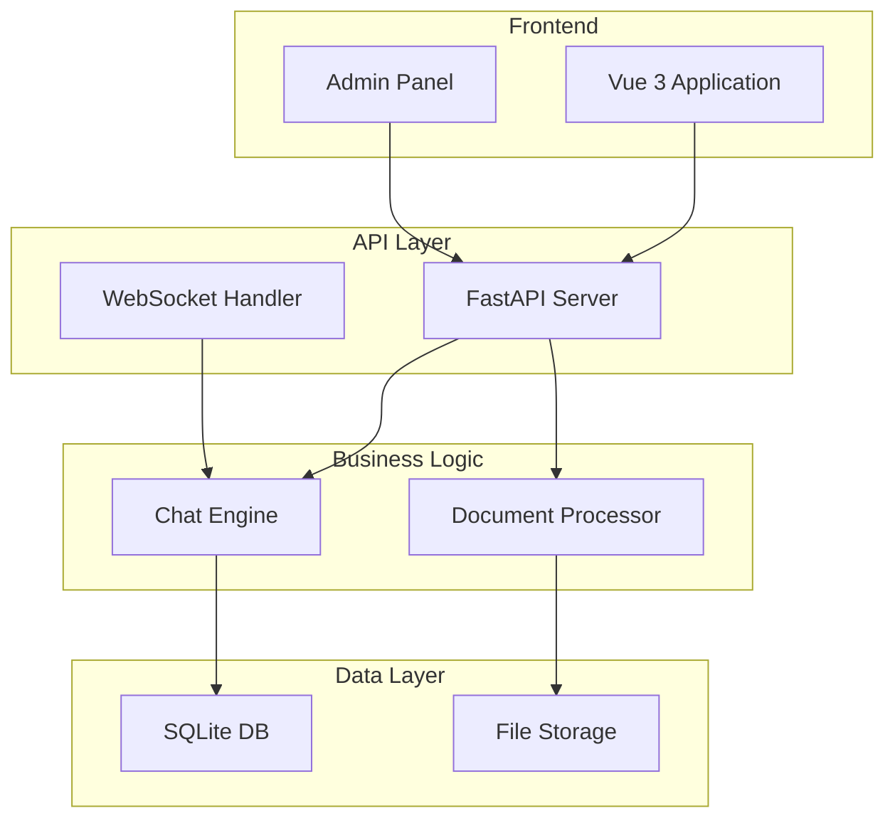
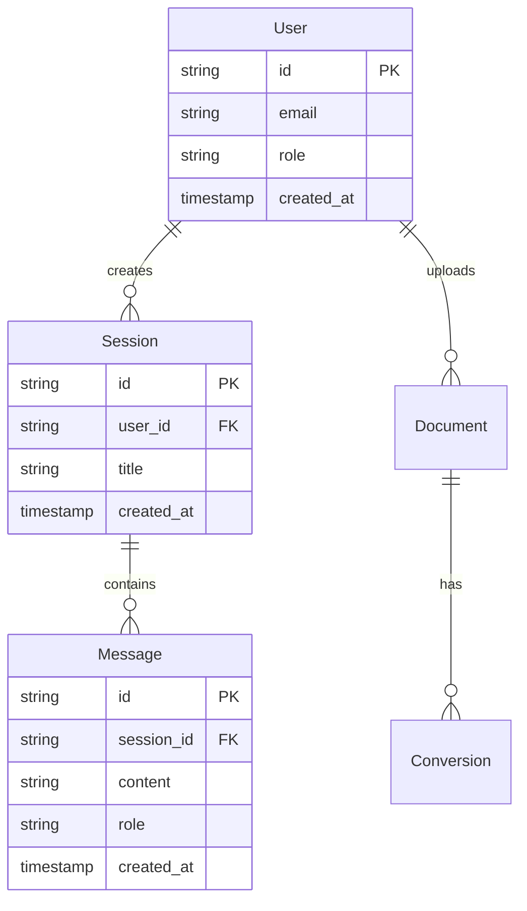
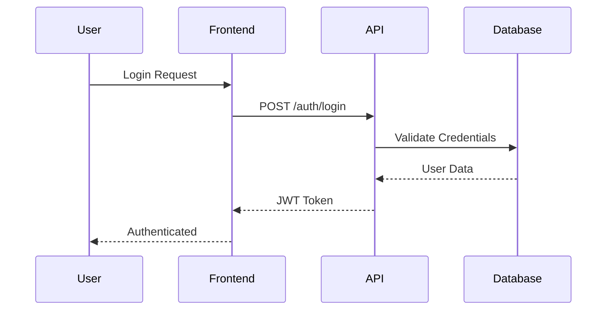
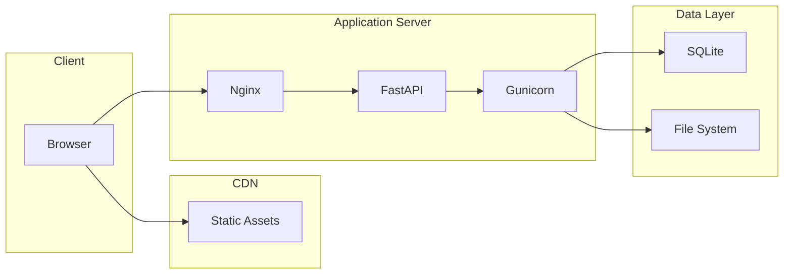

# [Architecture Component/System] Architecture

## Executive Summary
Brief overview of the architectural component/system, its purpose, and key design decisions.

## Table of Contents
- [Executive Summary](#executive-summary)
- [Context and Scope](#context-and-scope)
- [Architectural Overview](#architectural-overview)
- [System Components](#system-components)
- [Data Architecture](#data-architecture)
- [Security Architecture](#security-architecture)
- [Deployment Architecture](#deployment-architecture)
- [Performance Considerations](#performance-considerations)
- [Monitoring and Observability](#monitoring-and-observability)
- [Decision Log](#decision-log)
- [Future Considerations](#future-considerations)

## Context and Scope

### Business Context
- Business requirements driving this architecture
- Key stakeholders and their concerns
- Success criteria

### Technical Context
- Technical constraints
- Integration points with existing systems
- Technology stack rationale

### Scope
- What is included in this architecture
- What is explicitly excluded
- Boundaries and interfaces

## Architectural Overview

### High-Level Architecture Diagram


### Architectural Patterns
- **Pattern 1**: Description and rationale
- **Pattern 2**: Description and rationale
- **Pattern 3**: Description and rationale

### Design Principles
1. **Principle 1**: Explanation and application
2. **Principle 2**: Explanation and application
3. **Principle 3**: Explanation and application

## System Components

### Component 1: [Component Name]
**Purpose:** Brief description of component purpose

**Responsibilities:**
- Responsibility 1
- Responsibility 2
- Responsibility 3

**Technology Stack:**
- Technology 1: Rationale
- Technology 2: Rationale

**Interfaces:**
```typescript
interface ComponentInterface {
  method1(param: Type): Promise<Result>;
  method2(param: Type): Observable<Stream>;
}
```

**Dependencies:**
- Internal: List of internal dependencies
- External: List of external dependencies

### Component 2: [Component Name]
[Repeat structure for each major component]

## Data Architecture

### Data Model


### Data Flow
1. **Flow 1**: Source → Processing → Destination
2. **Flow 2**: Source → Processing → Destination

### Data Storage Strategy
- **Primary Storage**: Technology and rationale
- **Cache Layer**: Technology and rationale
- **Archive Strategy**: Approach and rationale

### Data Governance
- Data retention policies
- Privacy considerations
- Compliance requirements

## Security Architecture

### Authentication & Authorization


### Security Layers
1. **Network Security**: Description
2. **Application Security**: Description
3. **Data Security**: Description

### Security Measures
- **Authentication**: Method and implementation
- **Authorization**: RBAC/ABAC implementation
- **Encryption**: At-rest and in-transit
- **Input Validation**: Approach and tools
- **Rate Limiting**: Implementation details

### Threat Model
| Threat | Impact | Likelihood | Mitigation |
|--------|--------|------------|------------|
| SQL Injection | High | Medium | Parameterized queries |
| XSS | Medium | High | Input sanitization |
| CSRF | Medium | Medium | CSRF tokens |

## Deployment Architecture

### Environment Overview
- **Development**: Configuration and purpose
- **Staging**: Configuration and purpose
- **Production**: Configuration and purpose

### Deployment Diagram


### Infrastructure Requirements
| Component | Development | Staging | Production |
|-----------|-------------|---------|------------|
| CPU | 2 cores | 4 cores | 8 cores |
| Memory | 4 GB | 8 GB | 16 GB |
| Storage | 20 GB | 50 GB | 100 GB |

### Deployment Process
1. Step 1: Description
2. Step 2: Description
3. Step 3: Description

## Performance Considerations

### Performance Requirements
- **Response Time**: < 200ms for API calls
- **Throughput**: 1000 requests/second
- **Concurrent Users**: 500 simultaneous users

### Performance Optimizations
1. **Optimization 1**: Description and impact
2. **Optimization 2**: Description and impact
3. **Optimization 3**: Description and impact

### Caching Strategy
```typescript
interface CacheStrategy {
  layer: 'browser' | 'cdn' | 'application' | 'database';
  ttl: number; // seconds
  invalidation: 'time-based' | 'event-based';
}
```

### Load Testing Results
| Scenario | Users | Response Time | Error Rate |
|----------|-------|---------------|------------|
| Normal Load | 100 | 150ms | 0% |
| Peak Load | 500 | 300ms | 0.1% |
| Stress Test | 1000 | 800ms | 2% |

## Monitoring and Observability

### Monitoring Stack
- **Metrics**: Tool and key metrics
- **Logging**: Tool and log levels
- **Tracing**: Tool and trace points
- **Alerting**: Tool and alert rules

### Key Metrics
| Metric | Type | Threshold | Alert |
|--------|------|-----------|-------|
| API Response Time | Performance | > 500ms | Warning |
| Error Rate | Reliability | > 1% | Critical |
| CPU Usage | Resource | > 80% | Warning |
| Memory Usage | Resource | > 90% | Critical |

### Dashboard Example
```
┌─────────────────────────────────────┐
│         System Dashboard            │
├─────────────┬───────────────────────┤
│ API Health  │ ████████████ 99.9%   │
│ Avg Response│ ████ 142ms            │
│ Active Users│ ████████ 234          │
│ Error Rate  │ █ 0.1%                │
└─────────────┴───────────────────────┘
```

## Decision Log

### ADR-001: Choice of Database
**Date:** YYYY-MM-DD
**Status:** Accepted

**Context:** Need to choose a database for the application

**Decision:** Use SQLite for initial deployment

**Consequences:**
- Positive: Simple deployment, no separate database server
- Negative: Limited concurrent write performance

**Alternatives Considered:**
- PostgreSQL: More scalable but complex deployment
- MongoDB: Document store, but overkill for our needs

### ADR-002: [Next Decision]
[Repeat structure for each major decision]

## Future Considerations

### Scalability Path
1. **Phase 1** (Current): Single server deployment
2. **Phase 2** (6 months): Add caching layer
3. **Phase 3** (1 year): Migrate to PostgreSQL
4. **Phase 4** (2 years): Microservices architecture

### Technical Debt
| Item | Priority | Effort | Impact |
|------|----------|--------|--------|
| Refactor authentication | High | Medium | High |
| Optimize database queries | Medium | Low | Medium |
| Update dependencies | Low | Low | Low |

### Planned Improvements
- [ ] Implement horizontal scaling
- [ ] Add message queue for async processing
- [ ] Enhance monitoring coverage
- [ ] Implement automated failover

### Risk Register
| Risk | Probability | Impact | Mitigation Strategy |
|------|-------------|--------|-------------------|
| Database scaling limits | High | High | Plan migration to PostgreSQL |
| Security vulnerabilities | Medium | High | Regular security audits |
| Technical debt accumulation | High | Medium | Scheduled refactoring sprints |

---
**Review History:**
- YYYY-MM-DD: Initial architecture proposal
- YYYY-MM-DD: Security review completed
- YYYY-MM-DD: Performance optimization added