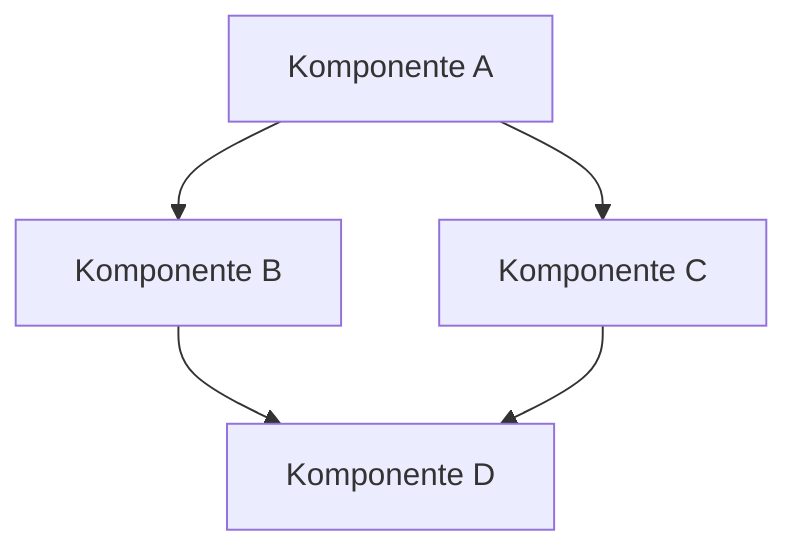

# Dokumenttitel

> **Letzte Aktualisierung:** 13.05.2025 | **Version:** 1.0.0 | **Status:** Aktiv

## Inhaltsübersicht

- [1. Einführung](#1-einführung)
- [2. Architektur](#2-architektur)
- [3. Implementierung](#3-implementierung)
- [4. Nutzung](#4-nutzung)
- [5. Best Practices](#5-best-practices)
- [6. Performance-Überlegungen](#6-performance-überlegungen)
- [7. Tests](#7-tests)
- [8. Bekannte Probleme](#8-bekannte-probleme)
- [9. Nächste Schritte](#9-nächste-schritte)
- [10. Referenzen](#10-referenzen)

## 1. Einführung

### 1.1 Überblick

Kurze Beschreibung des Dokuments und seines Zwecks. Dieser Abschnitt sollte erklären, was das Dokument abdeckt und für wen es gedacht ist.

### 1.2 Ziele

- Ziel 1
- Ziel 2
- Ziel 3

### 1.3 Hintergrund

Kontextinformationen, die zum Verständnis des Dokuments beitragen.

## 2. Architektur

### 2.1 Komponenten

Beschreibung der Hauptkomponenten und ihrer Beziehungen.



### 2.2 Datenfluss

Beschreibung des Datenflusses zwischen den Komponenten.

### 2.3 Schnittstellen

Beschreibung der wichtigsten Schnittstellen.

| Schnittstelle | Beschreibung | Verwendungszweck |
|---------------|--------------|------------------|
| ISchnittstelle1 | Beschreibung der Schnittstelle 1 | Verwendungszweck 1 |
| ISchnittstelle2 | Beschreibung der Schnittstelle 2 | Verwendungszweck 2 |

## 3. Implementierung

### 3.1 Technologien

Beschreibung der verwendeten Technologien.

### 3.2 Code-Beispiele

```typescript
// Beispiel für häufige Implementierungsmuster
import { Feature } from '@/features';

export function useFeature() {
  // Implementation details
  return {
    // Feature API
  };
}
```

### 3.3 Wichtige Algorithmen

Beschreibung wichtiger Algorithmen und Datenstrukturen.

## 4. Nutzung

### 4.1 Installation

Anweisungen zur Installation oder Einrichtung.

### 4.2 Konfiguration

Beschreibung der Konfigurationsoptionen.

### 4.3 Beispiele

```typescript
// Beispiel für die Verwendung
import { useFeature } from '@/features/useFeature';

const feature = useFeature();
feature.doSomething();
```

## 5. Best Practices

### 5.1 Empfohlene Vorgehensweisen

- Best Practice 1
- Best Practice 2
- Best Practice 3

### 5.2 Anti-Patterns

Beschreibung von Anti-Patterns und wie man sie vermeidet.

## 6. Performance-Überlegungen

### 6.1 Optimierungen

Beschreibung von Optimierungsmöglichkeiten.

### 6.2 Benchmarks

Leistungsbenchmarks und -vergleiche, falls verfügbar.

### 6.3 Skalierbarkeit

Überlegungen zur Skalierbarkeit.

## 7. Tests

### 7.1 Teststrategie

Beschreibung der Teststrategie.

### 7.2 Testabdeckung

Informationen zur Testabdeckung.

<details>
<summary>Testabdeckung (klicken zum Erweitern)</summary>

| Modul | Anweisungen | Zweige | Funktionen | Zeilen |
|-------|-------------|--------|------------|--------|
| Modul 1 | 95% | 90% | 100% | 95% |
| Modul 2 | 90% | 85% | 95% | 90% |

</details>

### 7.3 Testbeispiele

```typescript
// Testbeispiel
describe('Feature', () => {
  it('should do something', () => {
    // Test implementation
  });
});
```

## 8. Bekannte Probleme

### 8.1 Aktuell bekannte Probleme

- [ ] Problem 1: Beschreibung und aktueller Status
- [ ] Problem 2: Beschreibung und aktueller Status

### 8.2 Behobene Probleme

- [x] Problem 3: Beschreibung und Lösung
- [x] Problem 4: Beschreibung und Lösung

## 9. Nächste Schritte

### 9.1 Geplante Verbesserungen

- Verbesserung 1
- Verbesserung 2
- Verbesserung 3

### 9.2 Offene Fragen

- Offene Frage 1
- Offene Frage 2

## 10. Referenzen

### 10.1 Interne Referenzen

- [Link zur internen Referenz 1](../pfad/zur/referenz1.md)
- [Link zur internen Referenz 2](../pfad/zur/referenz2.md)

### 10.2 Externe Referenzen

- [Link zur externen Referenz 1](https://example.com/referenz1)
- [Link zur externen Referenz 2](https://example.com/referenz2)

### 10.3 Ursprüngliche Dokumente

Dieses Dokument wurde aus folgenden Quellen konsolidiert:

1. Ursprüngliches_Dokument_1.md
2. Ursprüngliches_Dokument_2.md
3. Ursprüngliches_Dokument_3.md

---

*Zuletzt aktualisiert: 13.05.2025*