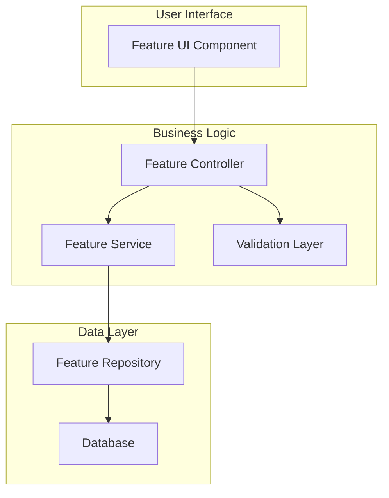
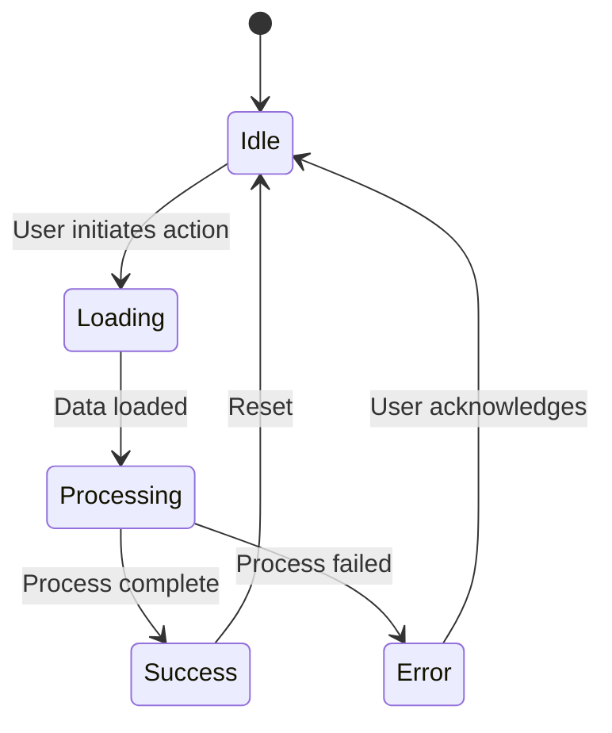

# [Feature Name]

## Overview

### Feature Summary
Brief description of the feature, its purpose, and the value it provides to users.

### Key Benefits
- Benefit 1: Description
- Benefit 2: Description
- Benefit 3: Description

### Target Users
- User Type 1: How they benefit
- User Type 2: How they benefit

## Table of Contents
- [Overview](#overview)
- [Requirements](#requirements)
- [Design](#design)
- [Implementation](#implementation)
- [API Documentation](#api-documentation)
- [User Guide](#user-guide)
- [Configuration](#configuration)
- [Migration Guide](#migration-guide)
- [Testing](#testing)
- [Deployment](#deployment)
- [Monitoring](#monitoring)
- [Future Enhancements](#future-enhancements)

## Requirements

### Functional Requirements
| ID | Requirement | Priority | Status |
|----|-------------|----------|---------|
| FR-001 | User can perform action X | Must Have | Implemented |
| FR-002 | System validates input Y | Must Have | Implemented |
| FR-003 | Feature integrates with Z | Should Have | Implemented |

### Non-Functional Requirements
| ID | Requirement | Target | Actual |
|----|-------------|--------|---------|
| NFR-001 | Response time < 200ms | 200ms | 180ms |
| NFR-002 | Support 1000 concurrent users | 1000 | 1200 |
| NFR-003 | 99.9% availability | 99.9% | 99.95% |

### Dependencies
- **Internal Dependencies:**
  - Module A: version X.Y.Z
  - Service B: version X.Y.Z

- **External Dependencies:**
  - Library C: version X.Y.Z
  - API D: version X.Y

### Constraints
- Constraint 1: Description and impact
- Constraint 2: Description and impact

## Design

### Architecture Overview


### Component Design

#### Component 1: Feature UI
```typescript
interface FeatureUIProps {
  userId: string;
  config: FeatureConfig;
  onComplete: (result: FeatureResult) => void;
  onError: (error: Error) => void;
}
```

#### Component 2: Feature Service
```typescript
class FeatureService {
  async processFeature(request: FeatureRequest): Promise<FeatureResponse> {
    // Validate request
    // Process business logic
    // Return response
  }
}
```

### Data Model
```typescript
interface FeatureData {
  id: string;
  userId: string;
  settings: FeatureSettings;
  metadata: {
    createdAt: Date;
    updatedAt: Date;
    version: string;
  };
}

interface FeatureSettings {
  option1: boolean;
  option2: string;
  option3: number;
}
```

### State Management


## Implementation

### File Structure
```
src/features/[feature-name]/
├── components/
│   ├── FeatureMain.vue
│   ├── FeatureSettings.vue
│   └── FeatureDialog.vue
├── composables/
│   ├── useFeature.ts
│   └── useFeatureSettings.ts
├── services/
│   ├── featureService.ts
│   └── featureValidator.ts
├── stores/
│   └── featureStore.ts
├── types/
│   └── feature.types.ts
└── tests/
    ├── feature.spec.ts
    └── featureService.spec.ts
```

### Core Implementation

#### Feature Store
```typescript
// stores/featureStore.ts
import { defineStore } from 'pinia';

export const useFeatureStore = defineStore('feature', {
  state: () => ({
    isEnabled: false,
    settings: {} as FeatureSettings,
    data: [] as FeatureData[],
    loading: false,
    error: null as Error | null
  }),

  actions: {
    async initializeFeature() {
      this.loading = true;
      try {
        const settings = await featureService.getSettings();
        this.settings = settings;
        this.isEnabled = true;
      } catch (error) {
        this.error = error as Error;
      } finally {
        this.loading = false;
      }
    },

    async processFeatureAction(input: FeatureInput) {
      // Implementation
    }
  }
});
```

#### Feature Component
```vue
<!-- components/FeatureMain.vue -->
<template>
  <div class="feature-container">
    <h2>{{ t('feature.title') }}</h2>
    
    <div v-if="loading" class="loading">
      {{ t('common.loading') }}
    </div>
    
    <div v-else-if="error" class="error">
      {{ error.message }}
    </div>
    
    <div v-else class="feature-content">
      <!-- Feature UI implementation -->
    </div>
  </div>
</template>

<script setup lang="ts">
import { useFeature } from '../composables/useFeature';
import { useI18n } from 'vue-i18n';

const { t } = useI18n();
const { loading, error, processAction } = useFeature();
</script>
```

### Integration Points

#### API Integration
```typescript
// API endpoint registration
router.post('/api/feature/action', async (req, res) => {
  try {
    const result = await featureController.handleAction(req.body);
    res.json({ success: true, data: result });
  } catch (error) {
    res.status(400).json({ success: false, error: error.message });
  }
});
```

#### Event Integration
```typescript
// Event emitter for feature events
featureEmitter.on('feature:completed', (data) => {
  // Handle feature completion
  analytics.track('feature_completed', data);
});
```

## API Documentation

### REST Endpoints

#### GET /api/feature/settings
Retrieve feature settings for the current user.

**Response:**
```json
{
  "enabled": true,
  "settings": {
    "option1": true,
    "option2": "value",
    "option3": 100
  }
}
```

#### POST /api/feature/action
Execute a feature action.

**Request:**
```json
{
  "action": "process",
  "data": {
    "input": "value"
  }
}
```

**Response:**
```json
{
  "success": true,
  "result": {
    "id": "123",
    "status": "completed",
    "output": "processed value"
  }
}
```

### WebSocket Events

#### Event: `feature:update`
Sent when feature data is updated.

```typescript
socket.on('feature:update', (data: FeatureUpdate) => {
  console.log('Feature updated:', data);
});
```

## User Guide

### Getting Started

1. **Enable the Feature**
   - Navigate to Settings → Features
   - Toggle "Enable [Feature Name]"
   - Configure initial settings

2. **Basic Usage**
   - Click the [Feature] button in the main interface
   - Select your options
   - Click "Process" to execute

### Step-by-Step Tutorial

#### Step 1: Access the Feature

Navigate to the feature through the main menu.

#### Step 2: Configure Settings

Adjust the settings according to your needs.

#### Step 3: Execute Action

Click the action button to process.

### Tips and Best Practices
- **Tip 1:** For best results, configure settings before first use
- **Tip 2:** Use keyboard shortcuts for faster access (Ctrl+Shift+F)
- **Tip 3:** Regular data cleanup improves performance

### Troubleshooting

| Issue | Possible Cause | Solution |
|-------|----------------|----------|
| Feature not visible | Not enabled | Enable in settings |
| Slow performance | Large dataset | Use pagination |
| Error on save | Invalid input | Check validation rules |

## Configuration

### Application Configuration
```yaml
# config/features.yml
feature_name:
  enabled: true
  max_items: 1000
  cache_ttl: 3600
  validation:
    strict_mode: false
    max_retries: 3
```

### Environment Variables
```bash
# .env
VITE_FEATURE_ENABLED=true
VITE_FEATURE_API_ENDPOINT=https://api.example.com/feature
VITE_FEATURE_TIMEOUT=30000
VITE_FEATURE_DEBUG=false
```

### User Preferences
```typescript
interface UserFeaturePreferences {
  defaultView: 'grid' | 'list';
  itemsPerPage: number;
  autoSave: boolean;
  notifications: {
    onComplete: boolean;
    onError: boolean;
  };
}
```

## Migration Guide

### From Version X to Y

#### Breaking Changes
1. **API Change:** `processFeature()` now returns Promise instead of callback
   ```typescript
   // Old
   processFeature(data, (err, result) => {});
   
   // New
   const result = await processFeature(data);
   ```

2. **Configuration Change:** Settings structure updated
   ```yaml
   # Old
   feature.enabled: true
   
   # New
   features:
     feature_name:
       enabled: true
   ```

#### Migration Steps
1. Update dependencies to latest versions
2. Run migration script: `npm run migrate:feature`
3. Update configuration files
4. Test thoroughly in staging environment

#### Rollback Procedure
```bash
# If issues occur
npm run rollback:feature --version=X.Y.Z
```

## Testing

### Unit Tests
```typescript
describe('Feature Service', () => {
  it('should process valid input correctly', async () => {
    const input = { data: 'test' };
    const result = await featureService.process(input);
    expect(result.status).toBe('success');
  });

  it('should handle errors gracefully', async () => {
    const invalidInput = { data: null };
    await expect(featureService.process(invalidInput))
      .rejects.toThrow('Invalid input');
  });
});
```

### Integration Tests
```typescript
describe('Feature Integration', () => {
  it('should work end-to-end', async () => {
    // Setup
    const user = await createTestUser();
    
    // Execute
    const response = await api.post('/feature/action', {
      userId: user.id,
      action: 'test'
    });
    
    // Verify
    expect(response.status).toBe(200);
    expect(response.data.success).toBe(true);
  });
});
```

### Test Coverage Requirements
- Unit Tests: > 80%
- Integration Tests: > 60%
- E2E Tests: Critical paths covered

## Deployment

### Pre-deployment Checklist
- [ ] All tests passing
- [ ] Documentation updated
- [ ] Database migrations prepared
- [ ] Feature flags configured
- [ ] Rollback plan documented

### Deployment Steps
1. Deploy database migrations
2. Deploy backend services
3. Deploy frontend application
4. Enable feature flag for testing
5. Gradual rollout to users

### Feature Flags
```typescript
if (featureFlags.isEnabled('new_feature')) {
  // New feature code
} else {
  // Fallback to old behavior
}
```

## Monitoring

### Key Metrics
| Metric | Description | Alert Threshold |
|--------|-------------|-----------------|
| Feature Usage | Daily active users | < 10% drop |
| Error Rate | Errors per 1000 requests | > 1% |
| Response Time | 95th percentile | > 500ms |
| Success Rate | Successful completions | < 95% |

### Dashboards
```
Feature Dashboard
├── Usage Metrics
│   ├── Daily Active Users
│   ├── Feature Adoption Rate
│   └── Most Used Options
├── Performance Metrics
│   ├── Response Times
│   ├── Error Rates
│   └── Resource Usage
└── Business Metrics
    ├── Conversion Rate
    ├── User Satisfaction
    └── Feature Impact
```

### Logging
```typescript
logger.info('Feature action started', {
  userId,
  action,
  timestamp: new Date().toISOString()
});
```

## Future Enhancements

### Roadmap
| Version | Feature | Description | Target Date |
|---------|---------|-------------|-------------|
| 1.1.0 | Batch Processing | Process multiple items | Q2 2025 |
| 1.2.0 | Advanced Analytics | Detailed usage insights | Q3 2025 |
| 2.0.0 | AI Integration | Smart suggestions | Q4 2025 |

### Planned Improvements
1. **Performance:** Implement caching for frequent operations
2. **UX:** Add drag-and-drop functionality
3. **Integration:** Support for third-party services
4. **Analytics:** Enhanced reporting capabilities

### Community Feedback
- Feature Request #123: Add export functionality
- Feature Request #456: Mobile app support
- Feature Request #789: Bulk operations

---
**Version History:**
- v1.0.0 (YYYY-MM-DD): Initial release
- v0.9.0 (YYYY-MM-DD): Beta release
- v0.5.0 (YYYY-MM-DD): Alpha release