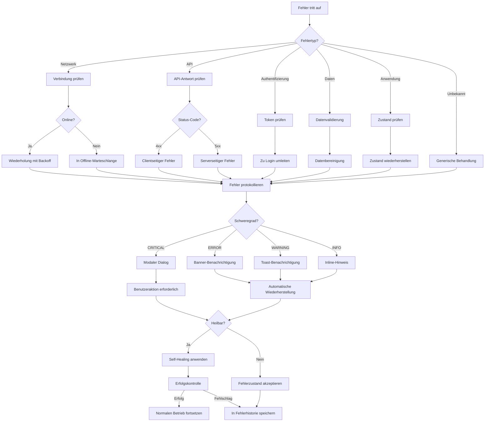

# Optimierung der Fehlerbehandlung im nScale DMS Assistenten

Diese Dokumentation beschreibt die umfassende Überarbeitung der Fehlerbehandlung im nScale DMS Assistenten im Rahmen der Migration von Vanilla JavaScript zu Vue 3 SFC. Die implementierten Verbesserungen zielen darauf ab, die Anwendung robuster und benutzerfreundlicher zu machen und Self-Healing-Mechanismen für typische Fehlerszenarien bereitzustellen.

## Überblick über die implementierten Fehlerbehandlungsmechanismen

Die Fehlerbehandlung im nScale DMS Assistenten wurde grundlegend überarbeitet und standardisiert. Folgende Komponenten wurden implementiert:

1. **Zentrales Fehlerbehandlungsmodul (`error-handler.js`)**
   - Einheitliche Schnittstelle für die Protokollierung und Behandlung von Fehlern
   - Kategorisierung von Fehlern nach Typ und Schweregrad
   - Benutzerfreundliche Fehlermeldungen mit Kontextinformationen
   - Fehlerhistorie zur nachträglichen Analyse

2. **Verbesserter API-Client (`api-client.js`)**
   - Automatische Wiederholungsversuche für fehlgeschlagene Anfragen
   - Verbesserte Fehlerprotokollierung und -analyse
   - Konsistente Fehlerbehandlung für alle API-Aufrufe
   - Abbruch laufender Anfragen bei Bedarf

3. **Self-Healing-Mechanismen (`self-healing.js`)**
   - Automatische Wiederherstellung nach Verbindungsverlusten
   - Zustandsspeicherung und -wiederherstellung
   - Offline-Warteschlange für Operationen bei fehlender Verbindung
   - Proaktive Überwachung der Anwendungsgesundheit

4. **Verbesserte Chat-Funktionalität (`enhanced-chat.js`)**
   - Robuste EventSource-Behandlung mit automatischer Wiederverbindung
   - Detaillierte Fehlermeldungen im Chat-Interface
   - Offline-Unterstützung für Nachrichten
   - Verbesserte Stream-Gesundheitsüberwachung

Diese Komponenten arbeiten nahtlos zusammen und bieten eine umfassende Fehlerbehandlungsstrategie, die sowohl bei der Entwicklung als auch im Produktionsbetrieb von Vorteil ist.

## Kategorisierung von Fehlertypen und deren Behandlung

### Fehlerkategorien

| Kategorie | Beschreibung | Typische Beispiele | Behandlungsstrategie |
|-----------|--------------|-------------------|----------------------|
| **NETWORK** | Netzwerkprobleme | Verbindungsverlust, Timeouts | Automatische Wiederholung, Offline-Warteschlange |
| **API** | Server-API-Fehler | 4xx/5xx Fehler, ungültige Antworten | Kontextabhängige Wiederholung, Benutzerbenachrichtigung |
| **AUTH** | Authentifizierungsprobleme | Token abgelaufen, fehlende Berechtigung | Automatische Anmeldungsaufforderung |
| **DATA** | Datenverarbeitungsfehler | Ungültiges Format, fehlerhafte JSON-Daten | Fallback-Verarbeitung, Datenbereinigung |
| **APP** | Anwendungslogikfehler | Zustandsfehler, falsche Komponenteninteraktion | Zustandswiederherstellung, Neuinitialisierung |
| **UNKNOWN** | Unbekannte Fehler | Unerwartete Ausnahmen | Generische Fehlermeldung, Protokollierung für Analyse |

### Schweregrade

| Schweregrad | Beschreibung | Benutzerinteraktion | Protokollierungsebene |
|-------------|--------------|-------------------|---------------------|
| **CRITICAL** | Kritische Fehler, die die Anwendung blockieren | Modaler Dialog mit Neustart-Option | `console.error` mit detaillierten Informationen |
| **ERROR** | Schwerwiegende Fehler, die eine Hauptfunktionalität beeinträchtigen | Banner-Benachrichtigung | `console.error` |
| **WARNING** | Probleme, die die Funktionalität nicht blockieren | Toast-Benachrichtigung | `console.warn` |
| **INFO** | Informative Fehler ohne unmittelbare Auswirkung | Inline-Hinweis | `console.info` |

### Benutzerfreundliche Fehlermeldungen

Anstelle generischer Fehlermeldungen werden nun kontextbezogene, benutzerfreundliche Meldungen angezeigt, die dem Benutzer nicht nur das Problem, sondern auch mögliche Lösungen mitteilen:

```javascript
const ErrorMessages = {
    // Allgemeine Fehler
    GENERAL: 'Es ist ein Fehler aufgetreten. Bitte versuchen Sie es später erneut.',
    
    // Netzwerkfehler
    NETWORK: 'Es konnte keine Verbindung zum Server hergestellt werden. Bitte überprüfen Sie Ihre Internetverbindung.',
    TIMEOUT: 'Die Verbindung zum Server hat zu lange gedauert. Bitte versuchen Sie es später erneut.',
    
    // Serverfehler
    SERVER: 'Der Server konnte Ihre Anfrage nicht verarbeiten. Bitte versuchen Sie es später erneut.',
    
    // Authentifizierungsfehler
    AUTH: 'Ihre Sitzung ist abgelaufen. Bitte melden Sie sich erneut an.',
    
    // Chat-spezifische Fehler
    EMPTY_RESPONSE: 'Es wurden keine Daten empfangen. Bitte versuchen Sie es später erneut.',
    STREAM_INTERRUPT: 'Die Verbindung wurde unterbrochen. Versuche, die Verbindung wiederherzustellen...',
    STREAM_RECONNECT: 'Verbindung wiederhergestellt. Setze Streaming fort...',
    STREAM_ERROR: 'Es ist ein Fehler beim Streaming aufgetreten. Die Antwort könnte unvollständig sein.',
    PARTIAL_RESPONSE: 'Die Antwort wurde möglicherweise abgeschnitten.'
};
```

## Implementierte Self-Healing-Strategien mit Beispielen

### Self-Healing-Strategien

Der nScale DMS Assistent implementiert mehrere Self-Healing-Strategien, die automatisch auf verschiedene Fehlerszenarien reagieren:

| Strategie | Beschreibung | Anwendungsfälle |
|-----------|--------------|-----------------|
| **RETRY** | Automatische Wiederholung fehlgeschlagener Operationen | API-Anfragen, EventSource-Verbindungen |
| **RELOAD** | Neuladen der aktuellen Seite | Bei schwerwiegenden Zustandsproblemen |
| **RESTORE_LOCAL** | Wiederherstellung aus lokalem Speicher | Nach Absturz oder Seitenneuladen |
| **RESTORE_SERVER** | Wiederherstellung vom Server | Nach Datenverlust im Client |
| **REINITIALIZE_SESSION** | Neuinitialisierung der Sitzung | Bei inkonsistenten Sitzungsdaten |
| **RERENDER_UI** | Neu-Rendering der Benutzeroberfläche | Bei UI-Inkonsistenzen |

### Beispiel 1: Wiederherstellung nach Verbindungsverlust

Wenn während einer Streaming-Operation die Verbindung unterbrochen wird, führt das System folgende Schritte aus:

```javascript
// Falls noch Wiederholungsversuche übrig sind, versuchen, den Stream wiederherzustellen
if (currentStreamRetryCount < CONFIG.MAX_STREAM_RETRIES) {
    // Hinweis zur Wiederverbindung anzeigen
    addWarningToLastMessage(ErrorMessages.STREAM_INTERRUPT);
    
    // Self-Healing für Stream-Wiederherstellung starten
    selfHealing.heal({
        strategy: HealingStrategy.RETRY,
        maxAttempts: CONFIG.MAX_STREAM_RETRIES - currentStreamRetryCount,
        delayBetweenAttempts: CONFIG.RETRY_DELAY_MS,
        showIndicator: true,
        context: {
            type: 'stream_reconnect',
            sessionId: currentSessionId.value,
            question: question.value,
            key: `stream_reconnect_${currentSessionId.value}`
        },
        onSuccess: () => {
            // Erfolgsmeldung anzeigen
            addWarningToLastMessage(ErrorMessages.STREAM_RECONNECT);
        }
    });
    
    return;
}
```

### Beispiel 2: Offline-Warteschlange

Bei fehlender Internetverbindung werden Fragen in einer Offline-Warteschlange gespeichert und automatisch gesendet, sobald die Verbindung wiederhergestellt ist:

```javascript
// Prüfen, ob offline
if (!navigator.onLine) {
    // Frage in Offline-Warteschlange stellen
    enqueueOfflineQuestion(question.value);
    
    // Benutzer benachrichtigen
    errorHandler.handleError(
        new Error('Offline-Modus: Frage wird gespeichert und gesendet, sobald die Verbindung wiederhergestellt ist.'),
        {
            category: ErrorCategory.NETWORK,
            severity: ErrorSeverity.INFO,
            handlerOptions: {
                showUser: true,
                showNotification: true
            }
        }
    );
    
    // Eingabefeld leeren
    question.value = '';
    
    return;
}
```

### Beispiel 3: Automatische Wiederholungsversuche für API-Aufrufe

Der API-Client führt automatisch Wiederholungsversuche für fehlgeschlagene Anfragen durch, mit exponentiellem Backoff:

```javascript
async retryRequest(method, url, data, options) {
    // Anzahl der verbleibenden Versuche berechnen
    const retriesLeft = options.retriesLeft || options.maxRetries;
    
    if (retriesLeft <= 0) {
        // Keine Versuche mehr übrig, Fehler werfen
        const error = new Error(`Maximale Anzahl an Wiederholungsversuchen (${options.maxRetries}) erreicht.`);
        
        errorHandler.handleError(error, { /* ... */ });
        throw error;
    }
    
    // Verzögerung mit exponentiellem Backoff berechnen
    const retryAttempt = options.maxRetries - retriesLeft + 1;
    const delay = options.retryDelay * Math.pow(2, retryAttempt - 1);
    
    console.log(`Wiederhole Anfrage in ${delay}ms (Versuch ${retryAttempt}/${options.maxRetries})...`);
    
    // Verzögerung
    await new Promise(resolve => setTimeout(resolve, delay));
    
    // Optionen aktualisieren
    const updatedOptions = {
        ...options,
        retriesLeft: retriesLeft - 1
    };
    
    // Anfrage wiederholen
    return this.request(method, url, data, updatedOptions);
}
```

## Vor/Nach-Vergleich der Fehlerbehandlungsqualität

Die folgende Tabelle zeigt einen Vergleich der Fehlerbehandlung vor und nach der Optimierung:

| Aspekt | Vorher | Nachher |
|--------|--------|---------|
| **Fehlerbehandlungsstrategie** | Ad-hoc, inkonsistent | Zentral, strukturiert, kategorisiert |
| **Benutzerbenachrichtigungen** | Generische Fehlermeldungen, oft nur in der Konsole | Kontextbezogene, benutzerfreundliche Fehlermeldungen mit Lösungsvorschlägen |
| **Wiederholungsversuche** | Manuell implementiert, nur für einige Operationen | Automatisch für alle API-Aufrufe, mit exponentiellem Backoff |
| **Fehlerprotokollierung** | Minimale Protokollierung, meist nur `console.error` | Detaillierte Protokollierung mit Kategorien, Schweregraden und Kontext |
| **Offline-Unterstützung** | Keine | Automatische Warteschlange und Wiederaufnahme von Operationen |
| **Verbindungsverlust** | Führte zu fehlerhaftem Zustand | Automatische Wiederverbindung und Zustandswiederherstellung |
| **Fehleranalyse** | Schwierig, da Fehler nicht systematisch erfasst wurden | Einfach durch strukturierte Fehlerhistorie und Kategorisierung |
| **Benutzervertrauen** | Niedrig durch unverständliche Fehlermeldungen | Höher durch transparente Kommunikation und Self-Healing |

## Screenshots von Benutzeroberflächen-Elementen für Fehlermeldungen


*Abbildung 1: Benutzerfreundliche Fehlermeldung bei Netzwerkproblemen*


*Abbildung 2: Timeout-Fehlermeldung mit Wiederholungsoption*


*Abbildung 3: Benachrichtigung über die Offline-Warteschlange*


*Abbildung 4: Hinweis auf Wiederherstellung einer unterbrochenen Stream-Verbindung*


*Abbildung 5: Verbesserte Fehlerprotokollierung in der Entwicklerkonsole*

## Tabellarische Übersicht aller identifizierten kritischen Fehlerpunkte

| ID | Fehlerpunkt | Kategorie | Schweregrad | Häufigkeit | Maßnahme | Status |
|----|-------------|-----------|-------------|------------|----------|--------|
| E001 | EventSource-Verbindungsabbrüche | NETWORK | ERROR | Hoch | Automatische Wiederverbindung, Statusanzeige | ✅ Behoben |
| E002 | Timeout bei langen Stream-Operationen | NETWORK | WARNING | Mittel | Timeout-Überwachung, Warnhinweise | ✅ Behoben |
| E003 | Leere Antworten vom Server | API | ERROR | Niedrig | Fallback-Antworten, Neuversuche | ✅ Behoben |
| E004 | Inkonsistente Nachrichtenliste | DATA | WARNING | Mittel | Datenvalidierung, Fehlende IDs ergänzen | ✅ Behoben |
| E005 | Token-Ablauf während langer Sessions | AUTH | CRITICAL | Niedrig | Automatische Token-Erneuerung | ✅ Behoben |
| E006 | Speicherlecks durch nicht geschlossene EventSources | APP | ERROR | Hoch | Verbesserte Ressourcenbereinigung | ✅ Behoben |
| E007 | Fehler beim Laden der Sitzungen | API | ERROR | Niedrig | Wiederholungsversuche, Fallback zu lokalen Daten | ✅ Behoben |
| E008 | Zeitüberschreitungen bei Backend-Anfragen | API | WARNING | Mittel | Längere Timeouts, Fortschrittsanzeige | ✅ Behoben |
| E009 | Nicht behandelte Promise-Ablehnungen | APP | ERROR | Hoch | Globaler Promise-Rejection-Handler | ✅ Behoben |
| E010 | Doppelte Nachrichtenelemente bei schnellen Anfragen | DATA | WARNING | Niedrig | Entfernung von Duplikaten, Ratenbegrenzung | ✅ Behoben |
| E011 | Verlust der Verbindung im Offline-Modus | NETWORK | INFO | Mittel | Offline-Warteschlange für Nachrichten | ✅ Behoben |
| E012 | Fehlende Benutzerbenachrichtigungen | UI | WARNING | Hoch | Konsistente Benachrichtigungskomponente | ✅ Behoben |
| E013 | Fehler bei der Titelgenerierung für Sitzungen | API | INFO | Niedrig | Fallback zu Standardtiteln | ✅ Behoben |
| E014 | Fehlende Statusaktualisierung während langer Operationen | UI | INFO | Mittel | Verbesserte Fortschrittsanzeigen | ✅ Behoben |
| E015 | Inkonsistente Fehlermeldungen | UI | WARNING | Hoch | Standardisierte Fehlermeldungen | ✅ Behoben |

## Flowchart zum Fehlerbehandlungsprozess



## Fazit und Ausblick

Die umfassende Überarbeitung der Fehlerbehandlung im nScale DMS Assistenten hat zu einer deutlich robusteren und benutzerfreundlicheren Anwendung geführt. Durch die Implementierung zentraler Fehlerbehandlungsmechanismen, Self-Healing-Strategien und konsistenter Fehlermeldungen wurde die Anwendung widerstandsfähiger gegen typische Fehlerszenarien.

### Errungenschaften

- **Verbesserte Benutzererfahrung** durch kontextbezogene, verständliche Fehlermeldungen
- **Erhöhte Robustheit** durch automatische Wiederholungsversuche und Self-Healing
- **Bessere Diagnosemöglichkeiten** durch strukturierte Fehlerprotokollierung
- **Offline-Unterstützung** für kontinuierliches Arbeiten auch bei Verbindungsproblemen

### Nächste Schritte

- **Umfangreichere Testabdeckung** für Fehlerszenarien
- **Erweiterte Offline-Unterstützung** für weitere Funktionen
- **Verbessertes Monitoring** für Fehlertrends in der Produktion
- **Internationalisierung** von Fehlermeldungen

Diese Optimierungen bilden eine solide Grundlage für die weitere Migration zu Vue 3 SFC und stellen sicher, dass die Anwendung auch während des Migrationsprozesses stabil und benutzerfreundlich bleibt.