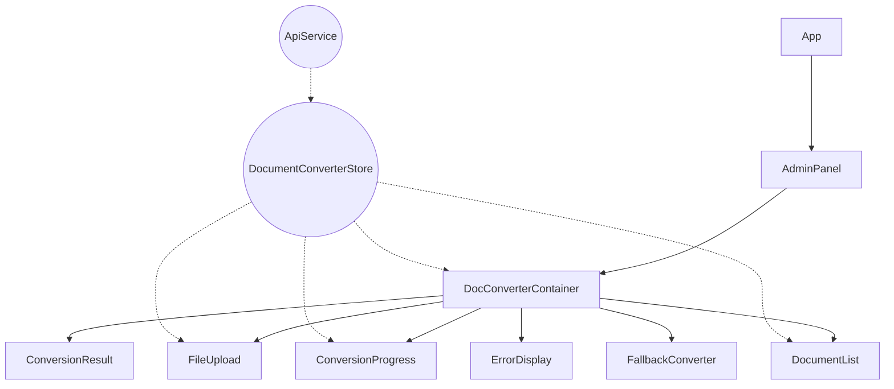

# Vue 3 SFC-Migration: Dokumentenkonverter

**Zuletzt aktualisiert:** 08.05.2025 | **Version:** 1.0.0 | **Status:** In Entwicklung

## 1. Übersicht und Zielsetzung

### Aktuelle Migrationsphase

Die Migration des Dokumentenkonverters zu Vue 3 Single File Components (SFC) ist Teil der schrittweisen Modernisierung der nscale Assist Anwendung. Derzeit befinden wir uns in Phase 2 des Migrationsprozesses:

- ✅ **Phase 1**: Analyse und Vorbereitung (abgeschlossen)
- 🔄 **Phase 2**: Implementierung von Kernkomponenten (in Bearbeitung, ca. 70% abgeschlossen)
- ⏳ **Phase 3**: Integration und vollständige Testabdeckung (geplant)
- ⏳ **Phase 4**: Produktivstellung und Legacy-Code-Entfernung (geplant)

### Ziele der Dokumentenkonverter-Migration

Die Vue 3 SFC-Migration des Dokumentenkonverters verfolgt mehrere strategische Ziele:

1. **Modernisierung der Codebasis**: Überführung von klassischem Vue.js zu Vue 3 mit Composition API
2. **Verbesserte Typsicherheit**: Vollständige Integration von TypeScript für robustere Entwicklung
3. **Optimierte Performance**: Nutzung der verbesserten Rendering-Engine von Vue 3
4. **Bessere Modulariät**: Aufteilung in wiederverwendbare SFC-Komponenten
5. **Einheitliches UX-Design**: Anpassung an das neue nscale Assist Design-System
6. **Verbesserte Fehlerbehandlung**: Robustere Error-Boundaries und Fallback-Mechanismen

### Vorteile gegenüber der klassischen Implementierung

Die neue SFC-Implementierung bietet mehrere signifikante Verbesserungen:

| Aspekt | Klassische Implementierung | Vue 3 SFC-Implementierung |
|--------|---------------------------|--------------------------|
| **Struktur** | Monolithische Implementierung | Modulare Komponenten mit klaren Verantwortlichkeiten |
| **Typsicherheit** | Keine Typsicherheit | Vollständige TypeScript-Integration |
| **Reaktivität** | Vue 2 Reaktivitätssystem | Vue 3 Composition API mit verbesserten reaktiven Primitiven |
| **Wartbarkeit** | Schwer zu verstehende Mischung aus JS/HTML | Klar strukturierte Single File Components |
| **Dateiupload** | Grundlegende Funktionalität | Erweiterte Funktionalität mit Drag & Drop und Mehrfachauswahl |
| **Fehlerbehandlung** | Grundlegende Fehlerbehandlung | Robuste Fehlerbehandlung mit automatischem Fallback |
| **Barrierefreiheit** | Minimale Unterstützung | Vollständige Keyboard-Navigation und Screen-Reader-Unterstützung |
| **Integration** | Fest integriert | Über Feature-Toggles flexibel aktivierbar |

## 2. Architektur

### Komponentenhierarchie

Die neue Implementierung des Dokumentenkonverters folgt einer hierarchischen Struktur, bei der jede Komponente eine klar definierte Verantwortlichkeit hat:



### Datenfluss zwischen Komponenten

Der Datenfluss im Dokumentenkonverter folgt dem unidirektionalen Datenflussprinzip von Vue, ergänzt durch den zentralen Pinia-Store:

1. Die **DocConverterContainer**-Komponente fungiert als Hauptkoordinator und verwaltet den übergeordneten Zustand
2. Kindkomponenten erhalten Daten als **Props** und kommunizieren Änderungen durch **Events** zurück
3. Der **DocumentConverterStore** stellt einen zentralen Zustand bereit, auf den alle Komponenten zugreifen können
4. **API-Aufrufe** werden durch den Store abstrahiert, sodass Komponenten nur mit dem lokalen Zustand interagieren

Beispiel für den Datenfluss beim Dateiupload:

```
1. Benutzer wählt Datei(en) in FileUpload aus
2. FileUpload-Komponente emittiert 'upload'-Event mit Datei-Objekt(en)
3. DocConverterContainer fängt Event ab und ruft store.uploadDocument() auf
4. Store führt API-Aufruf durch und aktualisiert den Zustand
5. Reaktive Zustandsänderungen bewirken UI-Updates in allen abhängigen Komponenten
```

### Integration in die bestehende Anwendung

Die Integration des Vue 3 SFC-Dokumentenkonverters in die bestehende Anwendung erfolgt über einen FeatureWrapper-Ansatz:

```vue
<!-- AdminPanel.vue (vereinfacht) -->
<template>
  <div class="admin-panel">
    <!-- Andere Admin-Bereiche... -->
    
    <FeatureWrapper
      feature="useSfcDocConverter"
      :newComponent="SfcDocConverterContainer"
      :legacyComponent="LegacyDocConverterContainer"
      @feature-error="handleFeatureError"
    />
  </div>
</template>
```

Dieser Ansatz ermöglicht:
- Koexistenz von altem und neuem Code während der Migration
- Einfaches A/B-Testing verschiedener Implementierungen
- Sofortigen Fallback bei Fehlern in der neuen Implementierung
- Schrittweise Migration ohne größere Risiken

### Feature-Toggle-Mechanismen

Das Feature-Toggle-System ermöglicht eine präzise Steuerung der Aktivierung neuer Komponenten:

1. **Konfigurierbare Feature-Flags** im zentralen FeatureTogglesStore:
   ```typescript
   // Auszug aus featureToggles.ts
   const useSfcDocConverter = ref<boolean>(false);
   ```

2. **Persistent im localStorage** gespeichert für konsistente Benutzererfahrung:
   ```typescript
   persist: {
     storage: localStorage,
     paths: [
       // ...
       'useSfcDocConverter'
     ]
   }
   ```

3. **Rollenbasierte Aktivierung** für verschiedene Benutzergruppen:
   ```typescript
   useSfcDocConverter: {
     name: 'SFC Dokumentenkonverter',
     requiredRole: 'developer',
     // ...
   }
   ```

4. **Automatischer Fallback** bei Fehlern:
   ```typescript
   if (error) {
     featureToggles.reportFeatureError(
       'useSfcDocConverter',
       error.message,
       error,
       true // aktiviere Fallback
     );
   }
   ```

## 3. Komponenten-Dokumentation

### DocConverterContainer

**Hauptkomponente** des Dokumentenkonverters, die als Koordinator für alle Unterkomponenten dient.

**Datei:** `/src/components/admin/document-converter/DocConverterContainer.vue`

**Verantwortlichkeiten:**
- Koordination der Unterkomponenten
- Verwaltung des Konvertierungsprozesses
- Fehlerbehandlung auf oberster Ebene
- Lebenszyklus-Management

**Wichtige Props und Events:**
- Keine externen Props (verwendet Feature-Toggles zur Aktivierung)
- Keine externen Events (interne Kommunikation über Store)

**Code-Beispiel:**
```vue
<template>
  <div class="doc-converter-container" v-if="featureToggles.isDocConverterEnabled">
    <!-- Komponenten-Header -->
    <div class="doc-converter-header">
      <h2>{{ t('documentConverter.title', 'Dokumentenkonverter') }}</h2>
      <!-- ... -->
    </div>
    
    <!-- Fehleranzeige -->
    <ErrorDisplay 
      v-if="error" 
      :error="error" 
      @retry="initialize" 
    />
    
    <!-- Hauptinhalt mit bedingtem Rendering der Unterkomponenten -->
    <div v-else class="doc-converter-content">
      <!-- ... Unterkomponenten ... -->
    </div>
  </div>
</template>

<script setup lang="ts">
  // Composables
  const featureToggles = useFeatureToggles();
  const { t } = useI18n();
  const store = useDocumentConverterStore();
  
  // Reaktiver Zustand
  const { error, isConverting, /* ... */ } = toRefs(store);
  
  // Initialisierung
  onMounted(() => {
    store.initialize();
  });
  
  // Bereinigung
  onBeforeUnmount(() => {
    if (store.isConverting && store.activeConversionId) {
      store.cancelConversion(store.activeConversionId);
    }
  });
  
  // ... Weitere Logik ...
</script>
```

### FileUpload

**Spezialisierte Komponente** für den Dateiupload mit Drag & Drop und Mehrfachauswahl.

**Datei:** `/src/components/admin/document-converter/FileUpload.vue`

**Verantwortlichkeiten:**
- Dateiauswahl über Dialog oder Drag & Drop
- Validierung von Dateitypen und -größen
- Anzeige ausgewählter Dateien vor dem Upload
- Fortschrittsanzeige während des Uploads

**Wichtige Props und Events:**
- `isUploading: boolean` - Gibt an, ob ein Upload läuft
- `uploadProgress: number` - Fortschritt des Uploads (0-100)
- `maxFileSize: number` - Maximale Dateigröße in Bytes
- `allowedExtensions: string[]` - Liste erlaubter Dateierweiterungen
- `@upload` - Emittiert, wenn Dateien hochgeladen werden sollen
- `@cancel` - Emittiert, wenn der Upload abgebrochen wird

**Barrierefreiheitsmerkmale:**
- Vollständige Keyboard-Navigation
- ARIA-Attribute für Screenreader
- Fokus-Management
- Statusmeldungen für assistive Technologien

**Code-Beispiel:**
```vue
<template>
  <div 
    class="file-upload"
    :class="{ 'file-upload--dragging': isDragging }"
    @dragover.prevent="onDragOver"
    @dragleave.prevent="onDragLeave"
    @drop.prevent="onDrop"
    tabindex="0"
    role="button"
    aria-label="Dateien hochladen"
  >
    <!-- Upload-Bereich -->
    <!-- Ausgewählte Dateien -->
    <!-- Aktions-Buttons -->
  </div>
</template>

<script setup lang="ts">
  // Props und Events
  const props = withDefaults(defineProps<FileUploadProps>(), {
    isUploading: false,
    uploadProgress: 0,
    maxFileSize: 50 * 1024 * 1024,
    allowedExtensions: () => ['pdf', 'docx', 'xlsx', 'pptx', 'html', 'txt']
  });
  
  const emit = defineEmits<{
    (e: 'upload', files: File[]): void;
    (e: 'cancel'): void;
  }>();
  
  // Interner Status
  const isDragging = ref<boolean>(false);
  const selectedFiles = ref<SelectedFile[]>([]);
  
  // Drag & Drop Handler
  function onDragOver(event: DragEvent): void { /* ... */ }
  function onDragLeave(event: DragEvent): void { /* ... */ }
  function onDrop(event: DragEvent): void { /* ... */ }
  
  // Dateivalidierung
  function validateFile(file: File): boolean { /* ... */ }
  
  // ... Weitere Logik ...
</script>
```

### ConversionProgress

**Spezialisierte Komponente** zur Anzeige des Konvertierungsfortschritts.

**Datei:** `/src/components/admin/document-converter/ConversionProgress.vue`

**Verantwortlichkeiten:**
- Anzeige des Konvertierungsfortschritts
- Darstellung des aktuellen Konvertierungsschritts
- Anzeige der geschätzten verbleibenden Zeit
- Möglichkeit zum Abbrechen der Konvertierung

**Wichtige Props und Events:**
- `progress: number` - Fortschritt in Prozent (0-100)
- `currentStep: string` - Beschreibung des aktuellen Schritts
- `estimatedTime: number` - Geschätzte verbleibende Zeit in Sekunden
- `@cancel` - Emittiert, wenn die Konvertierung abgebrochen werden soll

**Code-Beispiel:**
```vue
<template>
  <div class="conversion-progress" role="progressbar" :aria-valuenow="progress">
    <div class="progress-bar">
      <div class="progress-bar-fill" :style="{ width: `${progress}%` }"></div>
    </div>
    <div class="progress-info">
      <div class="progress-step">{{ currentStep }}</div>
      <div class="progress-time" v-if="estimatedTime > 0">
        {{ formatTime(estimatedTime) }} verbleibend
      </div>
    </div>
    <button 
      class="cancel-button" 
      @click="emit('cancel')"
      aria-label="Konvertierung abbrechen"
    >
      Abbrechen
    </button>
  </div>
</template>

<script setup lang="ts">
  // Props und Events
  const props = defineProps<{
    progress: number;
    currentStep: string;
    estimatedTime: number;
  }>();
  
  const emit = defineEmits<{
    (e: 'cancel'): void;
  }>();
  
  // Formatierungsfunktion
  function formatTime(seconds: number): string {
    const minutes = Math.floor(seconds / 60);
    const remainingSeconds = Math.floor(seconds % 60);
    return `${minutes}:${remainingSeconds.toString().padStart(2, '0')}`;
  }
</script>
```

### DocumentList

**Komponente zur Anzeige** konvertierter Dokumente mit Interaktionsmöglichkeiten.

**Datei:** `/src/components/admin/document-converter/DocumentList.vue`

**Verantwortlichkeiten:**
- Anzeige der Liste konvertierter Dokumente
- Sortier- und Filterfunktionen
- Aktionen für jedes Dokument (Anzeigen, Herunterladen, Löschen)
- Statusanzeige für jedes Dokument

**Wichtige Props und Events:**
- `documents: ConversionResult[]` - Liste der konvertierten Dokumente
- `selectedDocument: ConversionResult | null` - Aktuell ausgewähltes Dokument
- `loading: boolean` - Gibt an, ob Dokumente geladen werden
- `@select` - Emittiert, wenn ein Dokument ausgewählt wird
- `@view` - Emittiert, wenn ein Dokument angezeigt werden soll
- `@download` - Emittiert, wenn ein Dokument heruntergeladen werden soll
- `@delete` - Emittiert, wenn ein Dokument gelöscht werden soll

**Code-Beispiel:**
```vue
<template>
  <div class="document-list">
    <h3>{{ t('documentConverter.documentList', 'Konvertierte Dokumente') }}</h3>
    
    <!-- Ladeindikator -->
    <div v-if="loading" class="document-list-loading">
      <!-- Spinner oder Ladeanzeige -->
    </div>
    
    <!-- Leere Liste -->
    <div v-else-if="documents.length === 0" class="document-list-empty">
      {{ t('documentConverter.noDocuments', 'Keine Dokumente vorhanden') }}
    </div>
    
    <!-- Dokumente -->
    <div v-else class="document-list-table">
      <table>
        <!-- Tabellenkopf -->
        <thead><!-- ... --></thead>
        
        <!-- Tabelleninhalt -->
        <tbody>
          <tr 
            v-for="doc in documents" 
            :key="doc.id"
            :class="{ 'selected': selectedDocument?.id === doc.id }"
            @click="emit('select', doc.id)"
          >
            <!-- Dokumentdetails und Aktionen -->
          </tr>
        </tbody>
      </table>
    </div>
  </div>
</template>

<script setup lang="ts">
  // Props und Events
  const props = defineProps<{
    documents: ConversionResult[];
    selectedDocument: ConversionResult | null;
    loading: boolean;
  }>();
  
  const emit = defineEmits<{
    (e: 'select', id: string): void;
    (e: 'view', id: string): void;
    (e: 'download', id: string): void;
    (e: 'delete', id: string): void;
  }>();
  
  // ... Weitere Logik ...
</script>
```

### ErrorDisplay

**Spezialisierte Komponente** zur Anzeige und Behandlung von Fehlern.

**Datei:** `/src/components/admin/document-converter/ErrorDisplay.vue`

**Verantwortlichkeiten:**
- Anzeige von Fehlermeldungen
- Formatierung und Präsentation von Fehlerdetails
- Aktionen zur Fehlerbehebung
- Verbindung zur Fehlerprotokollierung

**Wichtige Props und Events:**
- `error: Error | string` - Der anzuzeigende Fehler
- `@retry` - Emittiert, wenn ein Wiederholungsversuch gestartet werden soll

**Code-Beispiel:**
```vue
<template>
  <div class="error-display" role="alert">
    <div class="error-icon">
      <i class="fas fa-exclamation-triangle"></i>
    </div>
    <div class="error-content">
      <h3>{{ t('documentConverter.errorTitle', 'Ein Fehler ist aufgetreten') }}</h3>
      <p class="error-message">{{ errorMessage }}</p>
      <div v-if="errorDetails" class="error-details">
        <pre>{{ errorDetails }}</pre>
      </div>
      <div class="error-actions">
        <button 
          @click="emit('retry')"
          class="retry-button"
        >
          {{ t('common.retry', 'Erneut versuchen') }}
        </button>
      </div>
    </div>
  </div>
</template>

<script setup lang="ts">
  // Props und Events
  const props = defineProps<{
    error: Error | string;
  }>();
  
  const emit = defineEmits<{
    (e: 'retry'): void;
  }>();
  
  // Berechnete Eigenschaften
  const errorMessage = computed<string>(() => {
    if (typeof props.error === 'string') {
      return props.error;
    }
    return props.error.message || 'Unbekannter Fehler';
  });
  
  const errorDetails = computed<string | null>(() => {
    if (typeof props.error === 'object' && props.error.stack) {
      return props.error.stack;
    }
    return null;
  });
</script>
```

## 4. State-Management

### DocumentConverterStore

**Zentraler Pinia-Store** für die Verwaltung des Dokumentenkonverter-Zustands.

**Datei:** `/src/stores/documentConverter.ts`

**Hauptfunktionen:**
- Verwaltung des gesamten Dokumentenkonverter-Zustands
- Kommunikation mit dem Backend über die API
- Koordination der Konvertierungsprozesse
- Fehlerbehandlung und Wiederherstellung

**API-Übersicht:**

**State:**
```typescript
interface DocumentConverterState {
  // Status
  isInitialized: boolean;
  isLoading: boolean;
  isUploading: boolean;
  isConverting: boolean;
  error: Error | null;
  
  // Daten
  documents: ConversionResult[];
  selectedDocumentId: string | null;
  
  // Fortschritt
  uploadProgress: number;
  conversionProgress: number;
  conversionStep: string;
  estimatedTimeRemaining: number;
  
  // Aktiver Konvertierungsvorgang
  activeConversionId: string | null;
  
  // Zeitstempel
  lastUpdated: Date | null;
}
```

**Getters:**
```typescript
// Berechnete Eigenschaften
const selectedDocument = computed(() => 
  selectedDocumentId.value 
    ? documents.value.find(doc => doc.id === selectedDocumentId.value) 
    : null
);

const hasDocuments = computed(() => documents.value.length > 0);

const documentsByType = computed(() => {
  const result: Record<string, ConversionResult[]> = {};
  documents.value.forEach(doc => {
    const type = doc.originalFormat || 'unknown';
    if (!result[type]) result[type] = [];
    result[type].push(doc);
  });
  return result;
});
```

**Actions:**
```typescript
// Initialisierung
async function initialize(): Promise<void>;

// Dokument hochladen
async function uploadDocument(file: File): Promise<string | null>;

// Dokument konvertieren
async function convertDocument(
  documentId: string, 
  settings?: Partial<ConversionSettings>
): Promise<boolean>;

// Konvertierung abbrechen
async function cancelConversion(documentId: string): Promise<void>;

// Dokument löschen
async function deleteDocument(documentId: string): Promise<boolean>;

// Dokument auswählen
function selectDocument(documentId: string): void;

// Auswahl zurücksetzen
function clearSelection(): void;
```

**Beispielverwendung:**
```typescript
// In einer Komponente
import { useDocumentConverterStore } from '@/stores/documentConverter';

export default defineComponent({
  setup() {
    const store = useDocumentConverterStore();
    
    // Initialisierung
    onMounted(() => {
      store.initialize();
    });
    
    // Datei hochladen und konvertieren
    async function handleFileUpload(file: File) {
      const documentId = await store.uploadDocument(file);
      if (documentId) {
        await store.convertDocument(documentId);
      }
    }
    
    return {
      // Zustand für Template
      documents: computed(() => store.documents),
      isConverting: computed(() => store.isConverting),
      
      // Aktionen
      handleFileUpload,
      selectDocument: store.selectDocument,
      deleteDocument: store.deleteDocument
    };
  }
});
```

### Interaktion mit dem Backend

Der DocumentConverterStore kommuniziert mit dem Backend über den `DocumentConverterService`, der eine Abstraktion der API-Aufrufe bietet:

```typescript
// Auszug aus DocumentConverterService.ts
class DocumentConverterService {
  // Dokument hochladen
  async uploadDocument(
    file: File, 
    onProgress?: (progress: number) => void
  ): Promise<string>;
  
  // Dokument konvertieren
  async convertDocument(
    documentId: string, 
    settings?: Partial<ConversionSettings>,
    onProgress?: (progress: number, step: string, timeRemaining: number) => void
  ): Promise<ConversionResult>;
  
  // Konvertierungsstatus abrufen
  async getConversionStatus(documentId: string): Promise<{
    status: 'pending' | 'processing' | 'success' | 'error';
    progress: number;
    step?: string;
    estimatedTimeRemaining?: number;
    error?: string;
  }>;
  
  // Dokumente abrufen
  async getDocuments(): Promise<ConversionResult[]>;
  
  // Dokument herunterladen
  async downloadDocument(documentId: string, filename?: string): Promise<void>;
  
  // Dokument löschen
  async deleteDocument(documentId: string): Promise<void>;
}
```

**API-Endpunkte:**

| Endpunkt                        | Methode | Beschreibung                    |
|---------------------------------|---------|--------------------------------|
| `/api/documents/upload`         | POST    | Lädt ein Dokument hoch         |
| `/api/documents/{id}/convert`   | POST    | Startet Konvertierungsprozess  |
| `/api/documents/{id}/status`    | GET     | Ruft Konvertierungsstatus ab   |
| `/api/documents`                | GET     | Ruft alle Dokumente ab         |
| `/api/documents/{id}`           | GET     | Ruft Dokumentdetails ab        |
| `/api/documents/{id}/content`   | GET     | Ruft konvertierten Inhalt ab   |
| `/api/documents/{id}/download`  | GET     | Lädt Dokument herunter         |
| `/api/documents/{id}`           | DELETE  | Löscht ein Dokument            |

### Persistenz und Caching

Die Persistenz im DocumentConverterStore ist mehrschichtig implementiert:

1. **Zustandspersistenz** mit Pinia-Plugin:
   ```typescript
   // Konfiguration im Store
   persist: {
     key: 'nscale-doc-converter',
     storage: localStorage,
     paths: [
       'documents',
       'selectedDocumentId',
       'conversionSettings',
       'lastUpdated'
     ]
   }
   ```

2. **API-Caching** mit lokalem Browser-Cache:
   - Ergebnisse von GET-Anfragen werden im Cache gespeichert
   - Cache-Kontrolle über HTTP-Header
   - Manuelle Invalidierung bei Zustandsänderungen

3. **Offline-Unterstützung**:
   - Basisdaten bleiben im persistierten Zustand verfügbar
   - Metadaten konvertierter Dokumente sind offline verfügbar
   - Volltextinhalte werden bei Bedarf nachgeladen

## 5. Migration und Koexistenz

### FeatureWrapper für bedingte Anzeige

Der `FeatureWrapper` ist ein zentrales Element für die Koexistenz von altem und neuem Code:

```vue
<!-- Beispiel für die Integration -->
<FeatureWrapper
  feature="useSfcDocConverter"
  :newComponent="SfcDocConverterContainer"
  :legacyComponent="LegacyDocConverterContainer"
  :captureErrors="true"
  :autoFallback="true"
  @feature-error="handleFeatureError"
  @feature-fallback="handleFeatureFallback"
  @component-mounted="handleComponentMounted"
/>
```

**Verhaltensmuster:**
1. Prüft den Status des Feature-Flags `useSfcDocConverter`
2. Rendert die neue Komponente, wenn das Flag aktiviert ist
3. Rendert die Legacy-Komponente, wenn das Flag deaktiviert ist
4. Fängt Fehler der neuen Komponente ab und aktiviert den Fallback
5. Emittiert Events für Fehlererfassung und Monitoring

### Fallback-Mechanismen bei Fehlern

Das Feature-Toggle-System bietet robuste Fallback-Mechanismen bei Fehlern:

1. **Automatische Fehlererfassung**:
   ```typescript
   // In useFeatureToggles.ts
   onErrorCaptured((error, instance, info) => {
     // Prüfen, ob der Fehler in einer SFC-Komponente aufgetreten ist
     if (instance && componentName.startsWith('Sfc')) {
       reportError(
         'useSfcDocConverter',
         `Fehler in SFC-Komponente: ${error.message}`,
         { error, info }
       );
       return true; // Fehler abfangen
     }
     return false;
   });
   ```

2. **Automatischer Fallback**:
   ```typescript
   // In featureToggles.ts
   function reportFeatureError(
     featureName: string, 
     message: string, 
     details?: any, 
     activateFallback: boolean = true
   ): void {
     // Fehler erfassen...
     
     // Fallback aktivieren
     if (activateFallback) {
       setFallbackMode(featureName, true);
       ref[featureName] = false; // Feature deaktivieren
     }
   }
   ```

3. **Manueller Fallback-Reset**:
   ```typescript
   // In FeatureTogglesPanel.vue
   function deactivateFallback(featureName: string): void {
     featureToggles.deactivateFallback(featureName);
     
     // Feature wieder aktivieren
     if (!featureToggles.isEnabled(featureName)) {
       featureToggles.enableFeature(featureName);
     }
   }
   ```

### Testabdeckung und Qualitätssicherung

Für die Qualitätssicherung der SFC-Migration wurden umfangreiche Tests implementiert:

1. **Unit-Tests** für jede Komponente:
   - Zustandsüberprüfung
   - Event-Emittierung
   - Fehlerbehandlung
   - Edge Cases

2. **Integrationstests** für die Komponenten-Zusammenarbeit:
   - Datenfluss zwischen Komponenten
   - Store-Integration
   - API-Mocking

3. **End-to-End-Tests** für die Benutzerinteraktion:
   - Upload-Prozesse
   - Konvertierungsabläufe
   - Fehlerszenarien

**Testrichtlinien:**
- Mindestens 80% Code-Abdeckung für neue Komponenten
- Vollständige Abdeckung kritischer Pfade
- Explizite Tests für Fehlerbehandlung und Fallback
- Parallele Tests für alte und neue Implementierung

## 6. Bekannte Probleme und Lösungsansätze

### Aktuelle Herausforderungen

1. **Browser-Kompatibilität**
   - **Problem**: Drag & Drop funktioniert in älteren Browsern nicht zuverlässig
   - **Lösung**: Progressive Enhancement mit Fallback auf klassischen Datei-Dialog
   - **Status**: Implementiert, wird kontinuierlich verbessert

2. **Große Dateien**
   - **Problem**: Browser-Limitierungen bei sehr großen Dateien (>100MB)
   - **Lösung**: Implementierung eines Chunk-Upload-Verfahrens
   - **Status**: Geplant für Phase 3

3. **Offline-Funktionalität**
   - **Problem**: Begrenzte Unterstützung in Offline-Szenarien
   - **Lösung**: Service Worker für Offline-Caching
   - **Status**: Konzeptphase

4. **Internet Explorer-Unterstützung**
   - **Problem**: Keine volle Unterstützung für IE11
   - **Lösung**: Legacy-Fallback für IE11-Benutzer
   - **Status**: Implementiert über Feature-Detection

5. **Leistungsoptimierung**
   - **Problem**: Verzögerungen bei der Verarbeitung komplexer PDF-Dokumente
   - **Lösung**: Worker-Thread-Implementierung für Vorschauverarbeitung
   - **Status**: In Entwicklung

### Geplante Verbesserungen

1. **Mehrfachupload-Verbesserungen**
   - Parallele Verarbeitung mehrerer Dateien
   - Fortschrittsanzeige für jede Datei
   - Pausieren und Fortsetzen von Uploads
   - Geplant für Phase 3

2. **Erweiterte Metadatenextraktion**
   - Automatische Kategorisierung basierend auf Inhalt
   - Verbessertes Tagging-System
   - OCR-Integration für Bilddokumente
   - Geplant für Phase 3

3. **Verarbeitungsoptionen**
   - Erweiterte Konfigurationsmöglichkeiten für Konvertierungen
   - Vorlagenbasierte Konvertierung
   - Anpassbare Ausgabeformate
   - Geplant für Phase 3

4. **UI-Verbesserungen**
   - Fortschrittsanzeige im Browser-Tab
   - Benachrichtigungen nach abgeschlossener Konvertierung
   - Verbesserte mobile Unterstützung
   - Kontinuierliche Verbesserung

5. **Kennzahlen und Analysen**
   - Erweitertes Berichtswesen für Administratoren
   - Konvertierungsstatistiken und -trends
   - Fehleranalyse und Reporting
   - Geplant für Phase 4

## 7. Zusammenfassung

Die Vue 3 SFC-Migration des Dokumentenkonverters stellt einen wichtigen Meilenstein in der Modernisierung der nscale Assist Anwendung dar. Mit einem modularen Ansatz, robuster Fehlerbehandlung und einem ausgereiften Feature-Toggle-System können die neuen Komponenten schrittweise eingeführt werden.

Die Hauptvorteile der neuen Implementierung sind:
- Verbesserte Codebasis mit TypeScript und Composition API
- Modulare Struktur für bessere Wartbarkeit
- Erweiterte Funktionalität mit Drag & Drop und Mehrfachauswahl
- Robuste Fehlerbehandlung und automatische Fallbacks
- Verbesserte Benutzerfreundlichkeit und Barrierefreiheit

Die Migration wird in Phasen fortgesetzt, mit einem Fokus auf Stabilität und nahtlose Benutzererfahrung. Durch den FeatureWrapper-Ansatz können alte und neue Implementierungen parallel existieren, wodurch das Risiko bei der Migration minimiert wird.

Zukünftige Entwicklungen werden sich auf erweiterte Funktionalität, Leistungsoptimierung und verbesserte Offline-Unterstützung konzentrieren.