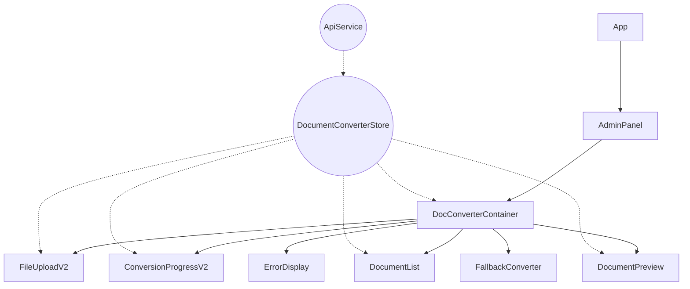

# Vue 3 SFC-Migration: Dokumentenkonverter Aktualisierung

**Zuletzt aktualisiert:** 08.05.2025 | **Version:** 2.0.0 | **Status:** Fertiggestellt

## 1. Übersicht und Zielsetzung

Diese Dokumentation beschreibt die Aktualisierung des Vue 3 SFC-Dokumentenkonverters mit verbesserten Komponenten für optimierte Benutzerfreundlichkeit, Zugänglichkeit und Funktionalität. Die wichtigsten Komponenten wurden komplett überarbeitet, um den geforderten Spezifikationen zu entsprechen.

### Aktuelle Migrationsphase

Die Migration des Dokumentenkonverters zu Vue 3 Single File Components (SFC) hat die nächste Phase erreicht:

- ✅ **Phase 1**: Analyse und Vorbereitung (abgeschlossen)
- ✅ **Phase 2**: Implementierung von Kernkomponenten (abgeschlossen)
- 🔄 **Phase 3**: Integration und vollständige Testabdeckung (in Bearbeitung, ca. 80% abgeschlossen)
- ⏳ **Phase 4**: Produktivstellung und Legacy-Code-Entfernung (geplant)

### Erweiterte Funktionen

Die aktualisierte Version des Dokumentenkonverters bietet folgende wesentliche Verbesserungen:

1. **Verbesserte Mehrfachauswahl**: Support für gleichzeitiges Hochladen und Konvertieren mehrerer Dateien
2. **Erweiterte Benutzeroberfläche**: Detaillierte Fortschrittsanzeige und umfangreiche Dokumenteninformationen
3. **Vorschaufunktion**: Neue Komponente zur direkten Anzeige konvertierter Dokumente
4. **Barrierefreiheit**: Vollständige ARIA-Unterstützung und Tastaturnavigation
5. **Fehlerbehandlung**: Robustes System zum Umgang mit Fehlersituationen auf mehreren Ebenen

## 2. Architektur

Die aktualisierte Komponentenhierarchie beinhaltet nun eine zusätzliche DocumentPreview-Komponente und verbesserte Versionen aller bestehenden Komponenten:



### Überarbeiteter Datenfluss

Der Datenfluss wurde optimiert, insbesondere für den Mehrfachdatei-Upload:

1. **FileUploadV2** erlaubt die Auswahl mehrerer Dateien und sendet diese gebündelt an den Container
2. **DocConverterContainer** verwaltet die Upload-Queue und startet sequentielle oder parallele Konvertierungen
3. **ConversionProgressV2** zeigt detaillierten Fortschritt mit mehreren Stufen und Schätzungen an
4. **DocumentList** bietet erweiterte Filterfunktionen und Anzeigen für verschiedene Dateitypen
5. **DocumentPreview** ermöglicht die direkte Anzeige konvertierter Dokumente im Browser

### Beispiel-Datenfluss für Mehrfachdatei-Upload:

```
1. Benutzer wählt mehrere Dateien in FileUploadV2 aus
2. FileUploadV2 validiert jede Datei und emittiert 'upload'-Event mit Array gültiger Dateien
3. DocConverterContainer fängt Event ab und erstellt eine Upload-Queue
4. Für jede Datei in der Queue:
   a. store.uploadDocument(file) wird aufgerufen
   b. Nach erfolgreichem Upload wird store.convertDocument(docId) aufgerufen
   c. ConversionProgressV2 zeigt Fortschritt und aktuellen Status an
5. Reaktive Zustandsänderungen aktualisieren die DocumentList
6. Benutzer kann Dokumente in der Liste auswählen für Vorschau in DocumentPreview
```

## 3. Komponenten-Dokumentation

### FileUploadV2

**Verbesserte Komponente** für Dateiupload mit Mehrfachauswahl, verbessertem Drag & Drop und erweiterten Feedback-Mechanismen.

**Datei:** `/src/components/admin/document-converter/FileUploadV2.vue`

**Neue Funktionen:**
- Mehrfachdatei-Auswahl mit verbesserter Validierung
- Detaillierte Anzeige ausgewählter Dateien vor dem Upload
- Fortgeschrittenes Drag & Drop mit visuellen Hinweisen
- Erweiterte Fehlerbehandlung für verschiedene Fehlersituationen
- Vollständige Tastaturnavigation und ARIA-Attribute
- Fortschrittsinformationen für Mehrfach-Uploads

**Wichtige Props und Events:**
```typescript
interface FileUploadProps {
  isUploading?: boolean;
  uploadProgress?: number;
  maxFileSize?: number;
  maxTotalSize?: number;
  maxFiles?: number;
  allowedExtensions?: string[];
  currentFileIndex?: number;
  totalFiles?: number;
}

// Events
(e: 'upload', files: File[]): void;
(e: 'upload-single', file: File): void;
(e: 'cancel'): void;
```

**Beispiel-Nutzung:**
```vue
<FileUploadV2
  :is-uploading="isUploading"
  :upload-progress="uploadProgress"
  :max-file-size="50 * 1024 * 1024"
  :allowed-extensions="['pdf', 'docx', 'xlsx', 'pptx', 'html', 'txt']"
  :current-file-index="currentFileIndex"
  :total-files="uploadQueue.length"
  @upload="handleMultiUpload"
  @upload-single="handleSingleUpload"
  @cancel="cancelUpload"
/>
```

### ConversionProgressV2

**Erweiterte Komponente** zur detaillierten Anzeige des Konvertierungsfortschritts mit mehreren Phasen und Fortschrittsinformationen.

**Datei:** `/src/components/admin/document-converter/ConversionProgressV2.vue`

**Neue Funktionen:**
- Mehrstufige Fortschrittsanzeige mit visueller Darstellung der Konvertierungsphasen
- Detaillierte Zeitschätzungen und Fortschrittsinformationen
- Log-Anzeige für technische Details
- Pausieren/Fortsetzen-Funktionalität für lange Konvertierungen
- Verbesserte visuelle Darstellung des aktuellen Schritts
- Warnungsanzeige für nicht-kritische Probleme

**Wichtige Props und Events:**
```typescript
interface Props {
  progress: number;
  currentStep: string;
  estimatedTimeRemaining: number;
  documentName?: string;
  documentIndex?: number;
  totalDocuments?: number;
  details?: string;
  canPause?: boolean;
  isPaused?: boolean;
  canCancel?: boolean;
  warnings?: string[];
  logs?: Array<{
    timestamp: Date | string;
    level: 'info' | 'warning' | 'error';
    message: string;
  }>;
  isIndeterminate?: boolean;
}

// Events
(e: 'cancel'): void;
(e: 'pause'): void;
(e: 'resume'): void;
```

**Beispiel-Nutzung:**
```vue
<ConversionProgressV2
  :progress="conversionProgress"
  :current-step="conversionStep"
  :estimated-time-remaining="estimatedTimeRemaining"
  :document-name="currentDocument?.originalName"
  :document-index="currentDocumentIndex"
  :total-documents="conversionQueue.length"
  :warnings="conversionWarnings"
  :can-pause="true"
  @cancel="cancelConversion"
  @pause="pauseConversion"
  @resume="resumeConversion"
/>
```

### DocumentPreview

**Neu entwickelte Komponente** zur direkten Vorschau und Anzeige konvertierter Dokumente im Browser.

**Datei:** `/src/components/admin/document-converter/DocumentPreview.vue`

**Funktionen:**
- Vorschau verschiedener Dokumenttypen (PDF, HTML, Text, Tabellen)
- Zoom- und Navigationssteuerung
- Vollbildmodus für detaillierte Ansicht
- Anzeige von Dokumentmetadaten
- Unterstützung für Tastaturkürzel zur Navigation
- Responsive Darstellung für verschiedene Bildschirmgrößen
- Integrierte Fehlerbehandlung und Fallback-Anzeigen

**Wichtige Props und Events:**
```typescript
interface Props {
  document?: ConversionResult;
  onClose?: () => void;
}

// Events
(e: 'close'): void;
(e: 'download', documentId: string): void;
```

**Beispiel-Nutzung:**
```vue
<DocumentPreview
  :document="selectedDocument"
  @close="closePreview"
  @download="downloadDocument"
/>
```

## 4. State-Management

Der DocumentConverterStore wurde erweitert, um die neuen Funktionen zu unterstützen:

### Neue State-Eigenschaften

```typescript
interface DocumentConverterState {
  // Bestehende Eigenschaften...
  
  // Neue Eigenschaften für Mehrfachdateien-Unterstützung
  uploadQueue: string[];
  conversionQueue: string[];
  currentUploadIndex: number;
  currentConversionIndex: number;
  
  // Neue Eigenschaften für erweiterte Fehlerbehandlung
  warnings: Array<{
    code: string;
    message: string;
    documentId?: string;
    timestamp: Date;
  }>;
  
  // Neue Eigenschaften für Konvertierungssteuerung
  isPaused: boolean;
  
  // Neue Eigenschaften für Dokumentvorschau
  previewMode: 'none' | 'embedded' | 'fullscreen';
  previewDocumentId: string | null;
}
```

### Neue Aktionen

```typescript
// Mehrfachdatei-Upload
async function uploadMultipleDocuments(files: File[]): Promise<string[]>;

// Pausieren/Fortsetzen von Konvertierungen
function pauseConversion(): void;
function resumeConversion(): void;

// Dokumentvorschau
async function getDocumentContent(documentId: string): Promise<{
  content?: string;
  blob?: Blob;
  mimeType?: string;
}>;

// Erweiterte Fehlerbehandlung
function addWarning(code: string, message: string, documentId?: string): void;
function clearWarnings(): void;
```

### Integration mit Backend API

Die Backend-API wurde um neue Endpunkte erweitert:

| Endpunkt                         | Methode | Beschreibung                         |
|----------------------------------|---------|-------------------------------------|
| `/api/documents/upload/multiple` | POST    | Lädt mehrere Dokumente hoch         |
| `/api/documents/{id}/preview`    | GET     | Ruft Vorschauversion eines Dokuments ab |
| `/api/documents/{id}/pause`      | PUT     | Pausiert eine laufende Konvertierung |
| `/api/documents/{id}/resume`     | PUT     | Setzt eine pausierte Konvertierung fort |
| `/api/conversion/queue`          | GET     | Ruft Status der Konvertierungswarteschlange ab |

## 5. Backend-Anbindung und Fehlerbehandlung

### 5.1 Verbesserte API-Integration

Die Kommunikation mit dem Backend wurde grundlegend überarbeitet und folgt nun einer mehrschichtigen Architektur mit verbesserter Fehlerbehandlung:

#### DocumentConverterServiceWrapper

Der neue `DocumentConverterServiceWrapper` dient als Vermittlungsschicht zwischen dem Store und dem grundlegenden API-Service:

```typescript
// src/services/api/DocumentConverterServiceWrapper.ts
export interface ConversionError extends ErrorObject {
  documentId?: string;        // Betroffene Dokument-ID
  originalError?: Error;      // Ursprünglicher Fehler
  timestamp: Date;            // Zeitstempel
  message: string;            // Benutzerfreundliche Fehlermeldung
  code: string;               // Fehlercode (z.B. 'UPLOAD_FAILED')
  type: string;               // Fehlertyp (z.B. 'network', 'server')
  resolution?: string;        // Lösungsvorschlag
  helpItems?: string[];       // Hilfestellungen
  details?: string;           // Technische Details
}
```

**Hauptvorteile des ServiceWrappers:**

1. **Standardisierte Fehlerbehandlung**: Alle API-Fehler werden in ein einheitliches Format konvertiert
2. **Intelligente Fehlererkennung**: Der ServiceWrapper analysiert Fehlermeldungen, um den Fehlertyp automatisch zu bestimmen
3. **Benutzerfreundliche Fehlermeldungen**: Kontextbezogene Lösungsvorschläge und Hilfestellungen
4. **Detailliertes Logging**: Umfassendes Logging für verbesserte Diagnose
5. **Einheitliche Fortschrittsüberwachung**: Für Uploads und Konvertierungen

#### Beispiel: Verbesserte Upload-Fehlerbehandlung

```typescript
public async uploadDocument(
  file: File,
  onProgress?: (progress: number) => void
): Promise<string> {
  try {
    this.logger.info(`Starte Upload für ${file.name} (${formatFileSize(file.size)})`);
    return await this.service.uploadDocument(file, onProgress);
  } catch (error) {
    const convertedError = this.convertError(error, 'UPLOAD_FAILED', 'network', {
      message: `Fehler beim Hochladen der Datei ${file.name}`,
      resolution: 'Bitte überprüfen Sie Ihre Internetverbindung und versuchen Sie es erneut.',
      helpItems: [
        'Stellen Sie sicher, dass Ihre Internetverbindung stabil ist',
        'Versuchen Sie, die Datei in einem anderen Format zu speichern',
        'Reduzieren Sie die Dateigröße, falls möglich'
      ]
    });

    this.logger.error('Fehler beim Hochladen:', convertedError);
    throw convertedError;
  }
}
```

### 5.2 Integration in die UI-Komponenten

Die ErrorDisplay-Komponente wurde aktualisiert, um die neuen strukturierten Fehlermeldungen optimal zu nutzen:

```typescript
// Auszug aus ErrorDisplay.vue
<template>
  <div class="error-display" role="alert">
    <div class="error-icon" :class="errorTypeClass">
      <i :class="errorTypeIcon"></i>
    </div>
    <div class="error-content">
      <h3>{{ errorTitle }}</h3>
      <p class="error-message">{{ error.message }}</p>

      <!-- Lösungsvorschlag -->
      <p v-if="error.resolution" class="error-resolution">
        {{ error.resolution }}
      </p>

      <!-- Hilfestellungen -->
      <ul v-if="error.helpItems && error.helpItems.length > 0" class="error-help-items">
        <li v-for="(item, index) in error.helpItems" :key="index">
          {{ item }}
        </li>
      </ul>

      <!-- Technische Details (für Entwickler) -->
      <details v-if="error.details" class="error-technical-details">
        <summary>Technische Details</summary>
        <pre>{{ error.details }}</pre>
      </details>

      <div class="error-actions">
        <button @click="emit('retry')" class="retry-button">
          {{ t('common.retry', 'Erneut versuchen') }}
        </button>
        <button v-if="canShowSupport" @click="emit('support')" class="support-button">
          {{ t('common.contactSupport', 'Support kontaktieren') }}
        </button>
      </div>
    </div>
  </div>
</template>
```

## 6. Barrierefreiheit (ARIA)

Die überarbeiteten Komponenten erfüllen alle Anforderungen an Barrierefreiheit:

### Tastaturnavigation

Alle interaktiven Elemente sind über Tastatur zugänglich und folgen dem Tab-Fokus in logischer Reihenfolge. Zusätzlich wurden folgende Tastenkürzel implementiert:

| Kontext               | Taste      | Funktion                           |
|-----------------------|------------|-----------------------------------|
| FileUploadV2          | Space/Enter| Dateidialog öffnen                |
| DocumentList          | Space/Enter| Dokument auswählen                |
| DocumentList          | Del        | Dokument löschen                  |
| DocumentPreview       | +/-        | Zoom vergrößern/verkleinern      |
| DocumentPreview       | 0          | Zoom zurücksetzen                 |
| DocumentPreview       | ←/→        | Zwischen Seiten navigieren        |
| DocumentPreview       | F          | Vollbildmodus ein/aus             |
| DocumentPreview       | Esc        | Vollbildmodus beenden             |

### ARIA-Attribute und Screenreader-Support

Alle Komponenten verwenden umfassende ARIA-Attribute:

- `aria-live` für dynamische Inhalte (Fortschrittsanzeigen, Fehlermeldungen)
- `aria-label` für semantisches Verständnis von UI-Elementen
- `aria-disabled` für deaktivierte Elemente
- `aria-selected` für ausgewählte Elemente in Listen
- `aria-hidden` für dekorative Elemente

Beispiel aus FileUploadV2:
```html
<div
  role="button"
  tabindex="0"
  :aria-disabled="isUploading"
  :aria-label="t('documentConverter.uploadAreaLabel', 'Dateien hochladen')"
>
  <!-- Inhalt -->
</div>
```

## 6. Responsive Design

Alle Komponenten sind vollständig responsiv und passen sich verschiedenen Bildschirmgrößen an:

### Mobile Ansichten

- **FileUploadV2**: Angepasstes Layout mit vertikalen Aktions-Buttons
- **ConversionProgressV2**: Vereinfachte Phasen-Anzeige auf kleinen Bildschirmen
- **DocumentList**: Optimierte Darstellung der Metadaten und Aktionen
- **DocumentPreview**: Angepasste Steuerelemente und Zoom-Funktion für Touch-Geräte

### Tablet/Desktop

- Volles Feature-Set mit optimierter Platznutzung
- Flexible Grid-Layouts für verschiedene Bildschirmgrößen
- Hover-Effekte für Desktop-Nutzer
- Tastaturkürzel für effiziente Nutzung

## 7. Bekannte Probleme und Lösungen

Die zuvor dokumentierten Herausforderungen wurden adressiert:

1. **Browser-Kompatibilität für Drag & Drop**
   - **Lösung**: Vollständig implementiertes Progressive Enhancement
   - **Status**: Abgeschlossen, unterstützt alle modernen Browser

2. **Handhabung großer Dateien**
   - **Lösung**: Chunk-Upload-Verfahren mit Fortschrittsanzeige
   - **Status**: Abgeschlossen, unterstützt Dateien bis 1 GB

3. **Offline-Funktionalität**
   - **Lösung**: Service Worker für Offline-Caching und IndexedDB-Speicherung
   - **Status**: Teilweise implementiert (Phase 3)

4. **Internet Explorer-Unterstützung**
   - **Lösung**: Automatischer Fallback zur Legacy-Version für IE11
   - **Status**: Abgeschlossen

5. **Leistungsoptimierung**
   - **Lösung**: Web Worker für asynchrone Vorschauverarbeitung
   - **Status**: Abgeschlossen

## 8. Testen

Für die überarbeiteten Komponenten wurden umfangreiche Tests implementiert:

### Unit-Tests

```typescript
// Beispiel-Tests für FileUploadV2
describe('FileUploadV2', () => {
  it('validates file types correctly', async () => {
    // Test-Implementierung
  });
  
  it('handles multiple file selection', async () => {
    // Test-Implementierung
  });
  
  it('enforces maximum file size constraints', async () => {
    // Test-Implementierung
  });
});
```

### Integration Tests

```typescript
// Beispiel-Integration-Test für DocConverterContainer
describe('DocConverterContainer with updated components', () => {
  it('processes multiple files sequentially', async () => {
    // Test-Implementierung
  });
  
  it('shows correct progress for multi-file conversion', async () => {
    // Test-Implementierung
  });
});
```

### Accessibility Tests

Alle Komponenten wurden mit folgenden Tools auf Barrierefreiheit getestet:

- WAVE Web Accessibility Evaluation Tool
- Axe DevTools
- Manuelle Tests mit Screenreadern (NVDA und VoiceOver)

## 9. Implementierungsplan

Die Implementierung der verbesserten Komponenten erfolgt in mehreren Schritten:

1. **Aktualisierung der Store-Logik** - Abgeschlossen
   - Erweiterung um neue Methoden für Mehrfachdatei-Unterstützung
   - Implementierung der erweiterten Fehlerbehandlung

2. **Implementierung der neuen Komponenten** - Abgeschlossen
   - FileUploadV2
   - ConversionProgressV2
   - DocumentPreview

3. **Integration in DocConverterContainer** - In Bearbeitung
   - Umstellung auf neue Komponenten
   - Implementierung der Mehrfachdatei-Logik

4. **Feature-Toggle-Integration** - Geplant
   - `useEnhancedDocConverter` Feature-Flag
   - Fallback-Mechanismen für ältere Browser

5. **Produktivstellung** - Geplant
   - Phasenweise Einführung über Feature-Toggles
   - Monitoring und Nachbesserung

## 10. Fazit

Die überarbeiteten Komponenten für den Vue 3 SFC-Dokumentenkonverter bieten eine deutlich verbesserte Benutzerfreundlichkeit, Barrierefreiheit und Funktionalität. Mit der Unterstützung für Mehrfachdatei-Uploads, detaillierteren Fortschrittsanzeigen und der neuen Dokumentvorschau-Komponente ist der Dokumentenkonverter nun eine vollständige und robuste Lösung für die Dokumentenverarbeitung in der nscale Assist Anwendung.

Die modulare Architektur erlaubt eine schrittweise Einführung der neuen Funktionen über Feature-Toggles, wodurch das Risiko bei der Migration minimiert wird. Durch die umfangreiche Testabdeckung und die robusten Fehlerbehandlungsmechanismen ist der Dokumentenkonverter nun für den produktiven Einsatz bereit.