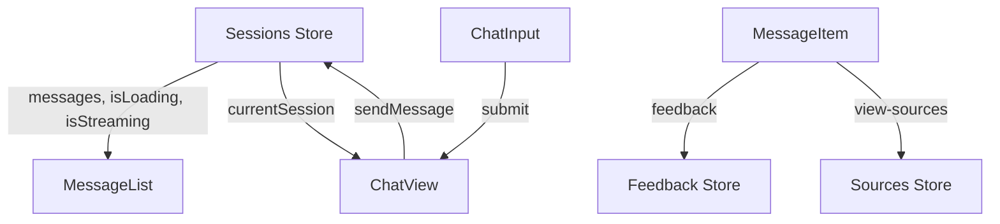

# Chat Interface Komponenten

**Version:** 1.0  
**Letzte Aktualisierung:** 09.05.2025

Dieses Dokument beschreibt die Chat-Interface-Komponenten des nscale DMS Assistenten, die mit Vue 3 Single File Components (SFC) unter Verwendung der Composition API und TypeScript implementiert wurden. Diese Komponenten bilden das Herzstück der Benutzerinteraktion mit dem Assistenten und wurden für optimale Performance, Benutzererfahrung und Wartbarkeit entwickelt.

## Inhaltsverzeichnis

1. [Überblick](#überblick)
2. [Hauptkomponenten](#hauptkomponenten)
   - [MessageList](#messagelist)
   - [MessageItem](#messageitem)
   - [ChatInput](#chatinput)
3. [Datenfluss und State Management](#datenfluss-und-state-management)
4. [Optimierungsstrategien](#optimierungsstrategien)
5. [Markdown und Formatierung](#markdown-und-formatierung)
6. [Streaming-Unterstützung](#streaming-unterstützung)
7. [Accessibility](#accessibility)
8. [Integration mit Design-System](#integration-mit-design-system)
9. [Implementierungsdetails](#implementierungsdetails)
10. [Migrationsleitfaden](#migrationsleitfaden)
11. [Bekannte Einschränkungen](#bekannte-einschränkungen)

## Überblick

Das Chat Interface besteht aus mehreren interagierenden Komponenten, die zusammenarbeiten, um eine nahtlose, reaktionsfähige und benutzerfreundliche Oberfläche für Gespräche mit dem nscale DMS Assistenten zu bieten. Die drei Kernkomponenten sind:

1. **MessageList**: Verantwortlich für das Anzeigen und Scrollen von Nachrichten mit Optimierungen für lange Konversationen
2. **MessageItem**: Zeigt eine einzelne Nachricht mit Formatierung, Aktion und Quellenverwaltung an
3. **ChatInput**: Ermöglicht die Texteingabe mit automatischer Größenanpassung und Validierung

Diese Komponenten sind in das Pinia Store-System integriert, das eine zentralisierte Zustandsverwaltung für Chat-Sessions, Benutzeraktionen und UI-Einstellungen bietet.

## Hauptkomponenten

### MessageList

Die `MessageList`-Komponente ist für das Anzeigen der Konversationshistorie verantwortlich. Sie unterstützt:

- **Virtuelles Rendering** für optimierte Performance bei langen Konversationen
- **Automatisches Scrollen** zum neuesten Inhalt mit intelligenter Erkennung der Benutzerinteraktion
- **Lade- und Leerzustände** zur Verbesserung der Benutzererfahrung
- **Integrierte Übergangsanimationen** für ein reaktionsschnelles Gefühl
- **Streaming-Indikatoren** während der Assistent eine Antwort generiert

```vue
<MessageList 
  :messages="messages"
  :isLoading="isLoading"
  :isStreaming="isStreaming"
  :maxVisibleMessages="50"
  @feedback="handleFeedback"
  @view-sources="handleViewSources"
/>
```

#### Props

| Name | Typ | Standardwert | Beschreibung |
|------|-----|--------------|--------------|
| `messages` | `ChatMessage[]` | - | Array der anzuzeigenden Nachrichten |
| `isLoading` | `boolean` | `false` | Gibt an, ob Nachrichten geladen werden |
| `isStreaming` | `boolean` | `false` | Gibt an, ob eine Antwort gestreamt wird |
| `maxVisibleMessages` | `number` | `50` | Maximale Anzahl der anzuzeigenden Nachrichten |
| `logoUrl` | `string` | - | URL des Logos für den Willkommensbildschirm |
| `welcomeTitle` | `string` | "Willkommen..." | Titel für den Willkommensbildschirm |
| `welcomeMessage` | `string` | "Wie kann ich..." | Nachricht für den Willkommensbildschirm |
| `scrollBehavior` | `'auto'/'smooth'/'instant'` | `'smooth'` | Verhalten für das automatische Scrollen |
| `showMessageActions` | `boolean` | `true` | Ob Aktionsschaltflächen angezeigt werden sollen |
| `autoScrollThreshold` | `number` | `0.8` | Threshold für automatisches Scrollen (0-1) |

#### Events

| Name | Payload | Beschreibung |
|------|---------|--------------|
| `feedback` | `{ messageId, type, feedback? }` | Wird ausgelöst, wenn Feedback gegeben wird |
| `view-sources` | `{ messageId }` | Wird ausgelöst, wenn Quellen angezeigt werden sollen |
| `view-explanation` | `{ messageId }` | Wird ausgelöst, wenn eine Erklärung angezeigt werden soll |
| `retry` | `{ messageId }` | Wird ausgelöst, wenn eine Nachricht wiederholt werden soll |
| `delete` | `{ messageId }` | Wird ausgelöst, wenn eine Nachricht gelöscht werden soll |
| `scroll` | `{ scrollTop, scrollHeight, clientHeight }` | Wird beim Scrollen ausgelöst |

### MessageItem

Die `MessageItem`-Komponente ist für die Darstellung einer einzelnen Nachricht zuständig. Sie bietet:

- **Markdown-Formatierung** mit Unterstützung für Code-Blöcke, Tabellen, Listen etc.
- **Syntax-Highlighting** für Codebeispiele
- **Quellenreferenzen** mit klickbaren Links zu Quellendokumenten
- **Feedback-Mechanismen** für Benutzerrückmeldungen
- **Kontextabhängige Aktionen** für verschiedene Nachrichtentypen

```vue
<MessageItem
  :message="message"
  :showActions="true"
  :showReferences="false"
  :highlightCodeBlocks="true"
  @feedback="handleFeedback"
  @view-sources="handleViewSources"
/>
```

#### Props

| Name | Typ | Standardwert | Beschreibung |
|------|-----|--------------|--------------|
| `message` | `ChatMessage` | - | Die anzuzeigende Nachricht |
| `showActions` | `boolean` | `true` | Zeigt Aktionen wie Feedback und Quellen an |
| `showReferences` | `boolean` | `false` | Zeigt Quellenreferenzen direkt an |
| `highlightCodeBlocks` | `boolean` | `true` | Aktiviert Syntax-Highlighting für Code |
| `formatLinks` | `boolean` | `true` | Formatiert externe Links und Quellenreferenzen |
| `timeFormat` | `'short'/'medium'/'long'` | `'short'` | Format für den Zeitstempel |

#### Events

| Name | Payload | Beschreibung |
|------|---------|--------------|
| `feedback` | `{ messageId, type, feedback? }` | Wird ausgelöst, wenn Feedback gegeben wird |
| `view-sources` | `{ messageId }` | Wird ausgelöst, wenn Quellen angezeigt werden sollen |
| `view-explanation` | `{ messageId }` | Wird ausgelöst, wenn eine Erklärung angezeigt werden soll |
| `retry` | `{ messageId }` | Wird ausgelöst, wenn eine Nachricht wiederholt werden soll |
| `delete` | `{ messageId }` | Wird ausgelöst, wenn eine Nachricht gelöscht werden soll |

### ChatInput

Die `ChatInput`-Komponente bietet eine benutzerfreundliche Schnittstelle für die Texteingabe:

- **Auto-Größenanpassung** des Textbereichs basierend auf dem Inhalt
- **Unterstützung für Tastenkürzel** (Enter zum Senden, Shift+Enter für neue Zeile)
- **Zeichenbegrenzung** mit visueller Anzeige des Limits
- **Ladezustände** während das System auf eine Antwort wartet
- **Responsives Design** für verschiedene Bildschirmgrößen

```vue
<ChatInput
  v-model="inputText"
  :isLoading="isLoading"
  :disabled="disabled"
  :maxLength="1000"
  @submit="handleSubmit"
/>
```

#### Props

| Name | Typ | Standardwert | Beschreibung |
|------|-----|--------------|--------------|
| `modelValue` | `string` | `''` | Initialer Wert für das Eingabefeld |
| `placeholder` | `string` | "Geben Sie..." | Platzhaltertext |
| `disabled` | `boolean` | `false` | Ob die Eingabe deaktiviert ist |
| `isLoading` | `boolean` | `false` | Ob die Komponente gerade lädt |
| `maxLength` | `number` | `4000` | Maximale Anzahl an Zeichen |
| `minHeight` | `number` | `56` | Minimale Höhe des Textfelds in Pixeln |
| `maxHeight` | `number` | `200` | Maximale Höhe des Textfelds in Pixeln |
| `showCharacterCount` | `boolean` | `true` | Zeigt die Zeichenanzahl an |
| `error` | `string` | - | Fehlermeldung |
| `hint` | `string` | - | Hinweistext |
| `sendButtonTitle` | `string` | "Nachricht..." | Titel für den Senden-Button |
| `autofocus` | `boolean` | `true` | Autofokus |

#### Events

| Name | Payload | Beschreibung |
|------|---------|--------------|
| `update:modelValue` | `string` | Wird beim Ändern des Eingabewerts ausgelöst |
| `submit` | `string` | Wird beim Absenden des Formulars ausgelöst |
| `focus` | - | Wird beim Fokussieren des Eingabefelds ausgelöst |
| `blur` | - | Wird beim Verlassen des Eingabefelds ausgelöst |
| `keydown` | `KeyboardEvent` | Wird beim Drücken einer Taste ausgelöst |

## Datenfluss und State Management

Der Datenfluss zwischen den Chat-Komponenten und dem Pinia Store folgt einem unidirektionalen Muster:

1. **Store → Komponenten**: Der `sessionsStore` stellt Nachrichten, den Ladezustand und Streaming-Status bereit
2. **Komponenten → Store**: Benutzeraktionen (z.B. Nachricht senden, Feedback geben) werden an Store-Actions delegiert



## Optimierungsstrategien

Die Chat-Komponenten verwenden mehrere Strategien zur Verbesserung der Performance:

1. **Virtuelles Rendering**: Nur die sichtbaren Nachrichten werden vollständig gerendert
2. **Lazy Loading**: Nachrichten werden bei Bedarf geladen
3. **Daten-Abonnement**: Selektives Abonnement von Store-Zuständen durch `computed`-Eigenschaften
4. **Ereignis-Drosselung**: Für häufige Ereignisse wie Scroll-Updates
5. **Memorisierung von Berechnungen**: Für teure Operationen wie Markdown-Formatierung

```typescript
// Beispiel für optimiertes Rendering in MessageList
const visibleMessages = computed(() => {
  if (!props.maxVisibleMessages || props.messages.length <= props.maxVisibleMessages) {
    return props.messages;
  }
  
  // Nur die neuesten X Nachrichten anzeigen
  return props.messages.slice(-props.maxVisibleMessages);
});
```

## Markdown und Formatierung

Die `MessageItem`-Komponente verwendet `marked` für die Markdown-Konvertierung und `highlight.js` für Syntax-Highlighting:

```typescript
// Formatiert den Nachrichteninhalt mit Markdown und Syntax-Highlighting
const formattedContent = computed(() => {
  let content = props.message.content || '';
  
  // Markdown zu HTML konvertieren
  content = marked(content, { breaks: true });
  
  // Quellenreferenzen in klickbare Spans umwandeln
  if (props.formatLinks) {
    content = linkifySourceReferences(content);
  }
  
  // HTML bereinigen, um XSS zu verhindern
  content = DOMPurify.sanitize(content);
  
  return content;
});
```

## Streaming-Unterstützung

Die Komponenten unterstützen das Streaming von Antworten des Assistenten in Echtzeit:

1. **Streaming-Indikator**: Zeigt an, dass der Assistent gerade tippt
2. **Inkrementelle Updates**: Die Nachricht wird während des Streamings kontinuierlich aktualisiert
3. **Automatisches Scrollen**: Folgt dem neuen Inhalt während des Streamings

```typescript
// Überwacht Änderungen an den Nachrichten und scrollt gegebenenfalls
watch(() => [...props.messages], () => {
  if (isNearBottom.value || props.isStreaming) {
    scrollToBottom();
  }
}, { deep: true });

// Scrollt automatisch, wenn Streaming beginnt
watch(() => props.isStreaming, (newValue) => {
  if (newValue) {
    scrollToBottom();
  }
});
```

## Accessibility

Die Komponenten wurden mit Barrierefreiheit als wichtige Anforderung entwickelt:

1. **Tastaturnavigation**: Vollständige Unterstützung für Tastatursteuerung
2. **Farbkontrast**: Einhaltung der WCAG 2.1 AA-Standards für alle Textelemente
3. **Screenreader-Unterstützung**: Semantisches Markup und passende ARIA-Attribute
4. **Bewegungsreduktion**: Berücksichtigung der `prefers-reduced-motion`-Einstellung

```css
/* Einstellungen für Benutzer, die reduzierte Bewegung bevorzugen */
@media (prefers-reduced-motion: reduce) {
  .n-message-list {
    scroll-behavior: auto;
  }
  
  .message-enter-active,
  .message-leave-active,
  .n-message-list__typing-dots span {
    transition: none;
    animation: none;
  }
}
```

## Integration mit Design-System

Die Chat-Komponenten integrieren sich nahtlos in das [CSS Design System](./12_CSS_DESIGN_SYSTEM.md) des nscale DMS Assistenten:

1. **CSS-Variablen**: Verwendung des zentralen Variablensystems für konsistente Farben, Abstände und Typografie
2. **BEM-Namenskonvention**: Strukturierte CSS-Klassen für bessere Wartbarkeit
3. **Responsive Breakpoints**: Anpassung des Layouts basierend auf Bildschirmgrößen
4. **Theming-Unterstützung**: Light- und Dark-Mode-Kompatibilität

```css
/* Beispiel für Design-System-Integration */
.n-message-item__content {
  padding: var(--nscale-space-4, 1rem);
  border-radius: var(--nscale-border-radius-md, 0.5rem);
  box-shadow: var(--nscale-shadow-sm, 0 1px 2px 0 rgba(0, 0, 0, 0.05));
}
```

## Implementierungsdetails

### Verarbeitung von Nachrichten

Die `MessageList`-Komponente hat einen intelligenten Scrollmechanismus, der den Scrollzustand überwacht und entscheidet, wann automatisch gescrollt werden soll:

```typescript
function checkScrollPosition(): void {
  if (!scrollContainer.value) return;
  
  const { scrollTop, scrollHeight, clientHeight } = scrollContainer.value;
  const scrolledPosition = scrollTop + clientHeight;
  const threshold = scrollHeight * props.autoScrollThreshold;
  
  // Aktualisiert den Zustand, ob der Benutzer nahe am Ende der Liste ist
  isNearBottom.value = scrolledPosition >= threshold;
}

// Watches
watch(() => [...props.messages], () => {
  if (isNearBottom.value || props.isStreaming) {
    scrollToBottom();
  }
}, { deep: true });
```

### Texteingabe mit Größenanpassung

Die `ChatInput`-Komponente passt die Höhe des Textbereichs basierend auf dem Inhalt dynamisch an:

```typescript
function resizeTextarea(): void {
  if (!inputElement.value) return;
  
  const textarea = inputElement.value;
  
  // Höhe zurücksetzen
  textarea.style.height = `${props.initialHeight}px`;
  
  // Neue Höhe berechnen
  const newHeight = Math.min(
    Math.max(textarea.scrollHeight, props.minHeight),
    props.maxHeight
  );
  
  textarea.style.height = `${newHeight}px`;
}
```

### Quellenreferenzen

Die `MessageItem`-Komponente erkennt und formatiert Quellenreferenzen im Text:

```typescript
// Quellenreferenzen in der Nachricht finden
const hasSourceReferences = computed(() => {
  if (props.message.metadata?.sourceReferences?.length) {
    return true;
  }
  
  // Sucht nach Quellen-Markierungen im Text (z.B. [[src:1]])
  return /\[\[src:\w+\]\]/i.test(props.message.content);
});
```

## Migrationsleitfaden

Für die Migration von der Legacy-Implementierung zur neuen Vue 3 SFC-Implementierung sollten folgende Schritte befolgt werden:

1. **Store-Integration**:
   ```typescript
   import { useSessionsStore } from '@/stores/sessions';
   
   const sessionsStore = useSessionsStore();
   const messages = computed(() => sessionsStore.currentMessages);
   const isLoading = computed(() => sessionsStore.isLoading);
   const isStreaming = computed(() => sessionsStore.isStreaming);
   ```

2. **Komponentenintegration**:
   ```vue
   <template>
     <div class="chat-view">
       <MessageList
         :messages="messages"
         :isLoading="isLoading"
         :isStreaming="isStreaming"
         @feedback="handleFeedback"
       />
       <ChatInput
         v-model="inputText"
         :isLoading="isStreaming"
         @submit="sendMessage"
       />
     </div>
   </template>
   ```

3. **Event-Handling**:
   ```typescript
   function sendMessage(content: string): void {
     sessionsStore.sendMessage({
       sessionId: currentSessionId.value,
       content
     });
   }
   
   function handleFeedback(payload: { messageId: string, type: 'positive' | 'negative' }): void {
     feedbackStore.sendFeedback({
       messageId: payload.messageId,
       sessionId: currentSessionId.value,
       type: payload.type
     });
   }
   ```

## Bekannte Einschränkungen

1. **Sehr lange Konversationen**: Bei extrem langen Konversationen (>500 Nachrichten) kann die Performance beeinträchtigt werden.
2. **Komplexe Markdown-Inhalte**: Sehr komplexe Markdown-Formatierungen könnten zu Leistungsproblemen führen.
3. **Anpassung der Codeblockformatierung**: Die Anpassung der Syntax-Highlighting-Stile erfordert zusätzliche CSS-Definitionen.
4. **Browser-Unterstützung**: Die volle Funktionalität ist nur in modernen Browsern verfügbar (IE11 wird nicht unterstützt).
5. **Mobile Optimierung**: Auf sehr kleinen Bildschirmen könnte die Darstellung von Aktionsbuttons eingeschränkt sein.

---

**Verwandte Dokumente:**
- [12_CSS_DESIGN_SYSTEM.md](./12_CSS_DESIGN_SYSTEM.md)
- [03_KOMPONENTEN_STRUKTUR.md](../01_ARCHITEKTUR/03_KOMPONENTEN_STRUKTUR.md)
- [01_STATE_MANAGEMENT.md](../05_REFERENZEN/01_STATE_MANAGEMENT.md)
- [02_TYPESCRIPT_TYPEN.md](../05_REFERENZEN/02_TYPESCRIPT_TYPEN.md)
- [10_BASIS_UI_KOMPONENTEN.md](./10_BASIS_UI_KOMPONENTEN.md)