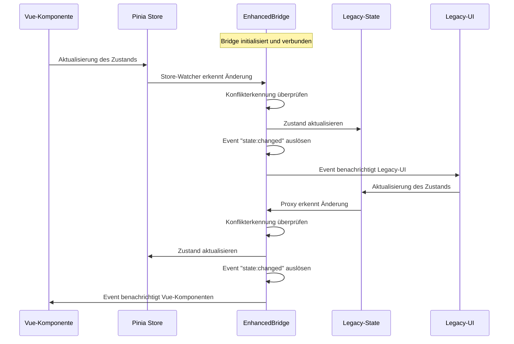
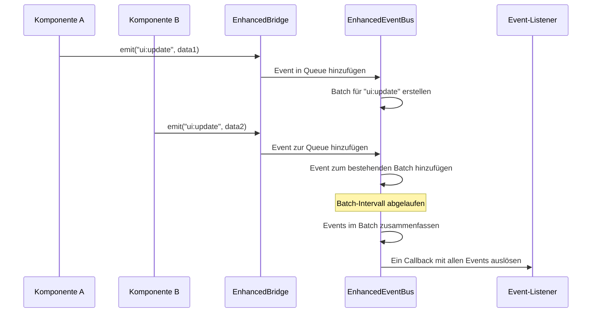
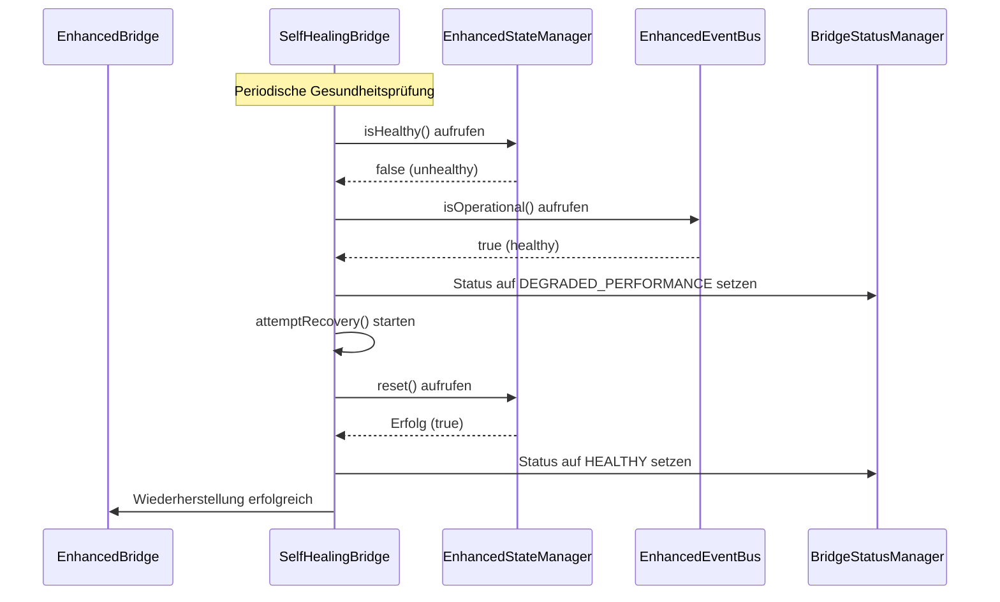
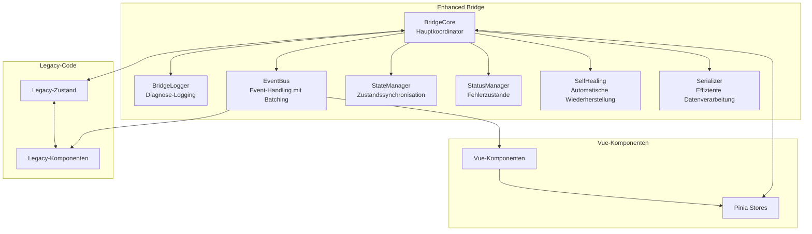
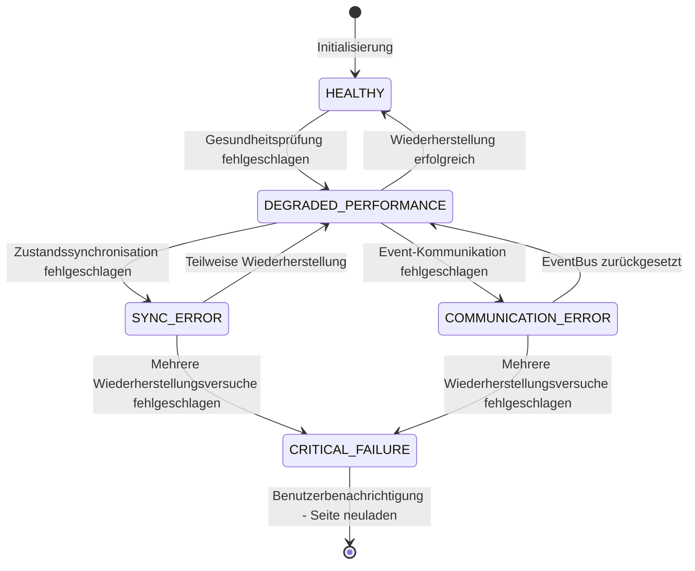
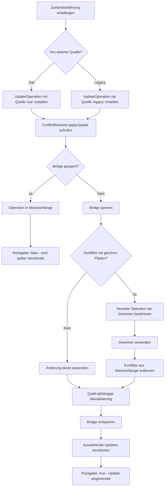
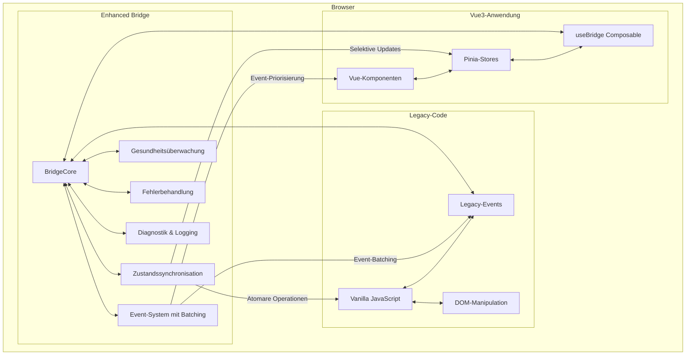

# UML-Diagramme für die verbesserte Bridge-Implementierung

## Klassendiagramm

```mermaid
classDiagram
    class EnhancedBridge {
        -BridgeConfiguration config
        -EnhancedBridgeLogger logger
        -EnhancedEventBus eventBus
        -EnhancedStateManager stateManager
        -BridgeStatusManager statusManager
        -SelfHealingBridge selfHealing
        -EfficientSerializer serializer
        +constructor(config?: Partial~BridgeConfiguration~)
        +connect(): void
        +disconnect(): void
        +exposeGlobalAPI(): BridgeAPI
        +getDiagnostics(): any
    }

    class EnhancedBridgeLogger {
        -LogLevel level
        -logs: Array
        -maxLogs: number
        +setLevel(level: LogLevel): void
        +debug(message: string, data?: any): void
        +info(message: string, data?: any): void
        +warn(message: string, data?: any): void
        +error(message: string, data?: any): void
        +getLogs(level?: LogLevel): any[]
        +clearLogs(): void
        -log(level: LogLevel, message: string, data?: any): void
        -emitErrorEvent(message: string, data?: any): void
    }

    class EnhancedEventBus {
        -listeners: Map
        -batchingEnabled: boolean
        -batchSize: number
        -batchDelay: number
        -batchQueue: Map
        +emit(eventName: string, data: any): void
        +on(eventName: string, callback: Function, options?: EventOptions): EventSubscription
        +off(eventName: string, subscriptionOrId: EventSubscription | string): void
        +once(eventName: string, callback: Function, options?: any): EventSubscription
        +priority(eventName: string, priority: number, callback: Function, options?: any): EventSubscription
        +clear(): void
        +isOperational(): boolean
        +reset(): void
        +getDiagnostics(): any
        -triggerEvent(eventName: string, data: any): void
        -flushEventBatch(eventName: string): void
        -executeWithTimeout(callback: Function, data: any, timeout: number): void
        -generateId(): string
        +enableBatching(enabled: boolean): void
        +configureBatching(batchSize: number, batchDelay: number): void
    }

    class EnhancedStateManager {
        -vueStores: Record~string, any~
        -legacyState: Record~string, any~
        -watchers: Array
        -atomicState: AtomicStateManager
        -conflictResolver: ConflictResolver
        -selectiveUpdates: SelectiveUpdateManager
        -subscribers: Map
        -healthStatus: boolean
        +connect(vueStores: Record~string, any~, legacyState: Record~string, any~): void
        +disconnect(): void
        +getState(path: string): any
        +setState(path: string, value: any, source?: 'legacy' | 'vue'): boolean
        +subscribe(path: string, callback: Function): () => void
        +isHealthy(): boolean
        +reset(): void
        +getDiagnostics(): any
        -setupDeepWatcher(source: any, basePath: string, sourceType: 'vue' | 'legacy'): () => void
        -createReactiveProxy(obj: any, path: string): any
        -handleStateChange(path: string, value: any, source: 'vue' | 'legacy'): void
        -updateLegacyState(path: string, value: any): void
        -updateVueStore(path: string, value: any): void
        -notifySubscribers(path: string): void
    }

    class BridgeStatusManager {
        -currentStatus: BridgeStatusInfo
        -statusListeners: Array
        +updateStatus(newStatus: Partial~BridgeStatusInfo~): void
        +incrementRecoveryAttempts(): void
        +getStatus(): BridgeStatusInfo
        +onStatusChanged(listener: Function): () => void
        -notifyListeners(): void
        -showUserNotification(): void
    }

    class SelfHealingBridge {
        -healthChecks: Array
        -recoveryStrategies: Array
        -isRecovering: boolean
        -checkIntervalId: number
        -healthCheckInterval: number
        +addHealthCheck(check: () => boolean): void
        +addRecoveryStrategy(strategy: () => Promise~boolean~): void
        +performHealthCheck(): Promise~boolean~
        +setHealthCheckInterval(interval: number): void
        +stopHealthChecks(): void
        -setupPeriodicHealthCheck(): void
        -attemptRecovery(): Promise~boolean~
    }

    class EfficientSerializer {
        -serializationCache: Map
        -deserializationCache: Map
        -cacheHits: number
        -cacheMisses: number
        -maxCacheSize: number
        +serialize(value: any): string
        +deserialize<T>(serialized: string): T
        +getStats(): object
        +clearCache(): void
        -objectHash(obj: any): string
    }

    class AtomicStateManager {
        -stateSnapshot: any
        -isTransactionActive: boolean
        +beginTransaction(state: any): void
        +commitTransaction(): void
        +rollbackTransaction(): any
        +isInTransaction(): boolean
    }

    class ConflictResolver {
        -pendingUpdates: UpdateOperation[]
        -lockTimeout: number
        -locked: boolean
        +applyUpdate(operation: UpdateOperation): Promise~boolean~
        -processPendingUpdates(): void
    }

    class SelectiveUpdateManager {
        -lastValues: Map
        -updateThreshold: number
        -pendingUpdates: Set
        -updateTimer: number
        +scheduleUpdate(path: string, value: any): void
        -processPendingUpdates(): void
        -optimizePaths(paths: string[]): string[]
    }

    class BridgePlugin {
        +install(app: App, config?: Partial~BridgeConfiguration~): void
    }

    EnhancedBridge *-- EnhancedBridgeLogger
    EnhancedBridge *-- EnhancedEventBus
    EnhancedBridge *-- EnhancedStateManager
    EnhancedBridge *-- BridgeStatusManager
    EnhancedBridge *-- SelfHealingBridge
    EnhancedBridge *-- EfficientSerializer
    EnhancedStateManager *-- AtomicStateManager
    EnhancedStateManager *-- ConflictResolver
    EnhancedStateManager *-- SelectiveUpdateManager
    BridgePlugin ..> EnhancedBridge
```

## Sequenzdiagramm: Bidirektionale Zustandssynchronisation

## Sequenzdiagramm: Event-Batching

## Sequenzdiagramm: Selbstheilungsmechanismus

## Komponentendiagramm

## Zustandsdiagramm: Bridge-Fehlerbehandlung

## Aktivitätsdiagramm: Konfliktlösung

## UML-Deploymentdiagramm

Die UML-Diagramme geben einen umfassenden Überblick über die Architektur, die Interaktionen und den Datenfluss in der verbesserten Bridge-Implementierung. Sie dienen als visuelle Dokumentation für Entwickler, die mit der Bridge arbeiten oder sie erweitern möchten.