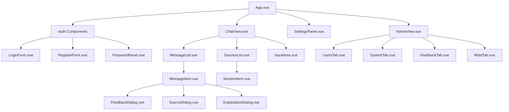

# Komponentenstruktur des nscale DMS Assistenten

Dieses Dokument beschreibt die optimierte Komponentenstruktur für den nscale DMS Assistenten mit Single-File Components (SFC) in Vue 3.

## Überblick

Die neue Komponentenstruktur organisiert den Code in modulare, wiederverwendbare Komponenten, die nach Funktionsbereichen gruppiert sind. Dies verbessert die Wartbarkeit, Testbarkeit und Erweiterbarkeit des Systems.

```
frontend/
├── App.vue                      # Hauptkomponente der Anwendung
├── main.js                      # Einstiegspunkt der Anwendung
├── assets/                      # Statische Assets
├── components/                  # Gemeinsame Komponenten
│   ├── auth/                    # Authentifizierungskomponenten
│   │   ├── LoginForm.vue        # Anmeldeformular
│   │   ├── RegisterForm.vue     # Registrierungsformular
│   │   └── PasswordReset.vue    # Passwort-Zurücksetzung
│   ├── chat/                    # Chat-Komponenten
│   │   ├── ChatView.vue         # Hauptchat-Ansicht
│   │   ├── MessageList.vue      # Nachrichtenliste
│   │   ├── MessageItem.vue      # Einzelne Nachricht
│   │   ├── InputArea.vue        # Chat-Eingabebereich
│   │   ├── SessionList.vue      # Liste der Chat-Sessions
│   │   └── SessionItem.vue      # Einzelne Chat-Session
│   ├── admin/                   # Admin-Komponenten
│   │   ├── AdminView.vue        # Admin-Hauptansicht
│   │   ├── UsersTab.vue         # Benutzerverwaltung
│   │   ├── SystemTab.vue        # Systemüberwachung
│   │   ├── FeedbackTab.vue      # Feedback-Übersicht
│   │   └── MotdTab.vue          # MOTD-Editor
│   ├── settings/                # Einstellungen-Komponenten
│   │   └── SettingsPanel.vue    # Einstellungen-Panel
│   ├── feedback/                # Feedback-Komponenten
│   │   └── FeedbackDialog.vue   # Feedback-Dialog
│   ├── source/                  # Quellenreferenz-Komponenten
│   │   ├── SourceDialog.vue     # Quellen-Dialog
│   │   └── ExplanationDialog.vue# Erklärungs-Dialog
│   ├── layout/                  # Layout-Komponenten
│   │   ├── MainLayout.vue       # Hauptlayout mit Header, Sidebar und Content
│   │   ├── NavigationBar.vue    # Obere Navigationsleiste
│   │   └── Sidebar.vue          # Seitliche Navigationsleiste
│   └── ui/                      # UI-Komponenten
│       ├── NScaleButton.vue     # Button-Komponente
│       ├── NScaleCard.vue       # Card-Komponente
│       ├── NScaleInput.vue      # Input-Komponente
│       └── NScaleAlert.vue      # Alert-Komponente
├── composables/                 # Kompositionsfunktionen
│   ├── useAuth.js               # Authentifizierungsfunktionen
│   ├── useChat.js               # Chat-Funktionen
│   ├── useSession.js            # Session-Management
│   ├── useFeedback.js           # Feedback-Funktionen
│   ├── useMotd.js               # MOTD-Funktionen
│   ├── useSourceReferences.js   # Quellenreferenz-Funktionen
│   └── useSettings.js           # Einstellungsfunktionen
├── stores/                      # Zustandsverwaltung mit Pinia
│   ├── auth.js                  # Authentifizierungs-Store
│   ├── chat.js                  # Chat-Store
│   ├── session.js               # Session-Store
│   ├── admin.js                 # Admin-Store
│   ├── feedback.js              # Feedback-Store
│   ├── motd.js                  # MOTD-Store
│   └── settings.js              # Einstellungs-Store
└── utils/                       # Hilfsfunktionen
    ├── api.js                   # API-Funktionen
    ├── formatters.js            # Text-Formatierungsfunktionen
    ├── validators.js            # Validierungsfunktionen
    └── constants.js             # Konstanten
```

## Komponentenhierarchie



## Implementierungsansatz

Die Modernisierung erfolgt in drei Hauptphasen:

1. **Vorbereitungsphase**: Extraktion von Zuständen in Stores
2. **Komponentenphase**: Erstellung der SFCs und Ersetzung der DOM-Manipulation
3. **Integrationsphase**: Verbindung von Komponenten und Stores

## Migrationsstrategie

Die Migration wird schrittweise erfolgen:

1. Entwicklung der neuen Komponentenstruktur parallel zur bestehenden Implementierung
2. Migration der Funktionalität in kleinen, testbaren Einheiten
3. Feature-Toggle-System für die schrittweise Aktivierung neuer Komponenten
4. Umfassende Tests vor jedem Migrationsschritt
5. Fallback-Mechanismen zur Sicherstellung der Systemstabilität

## Beispiel: Feature-Toggle für schrittweise Migration

```javascript
// In stores/featureToggles.js
import { defineStore } from 'pinia';

export const useFeatureTogglesStore = defineStore('featureToggles', {
  state: () => ({
    // Komponenten mit modernem SFC-Ansatz
    useSfcAuth: false,
    useSfcChat: false,
    useSfcAdmin: false,
    useSfcSettings: false,
    
    // Funktionen mit Composition API
    useComposableAuth: false,
    useComposableChat: false,
    useComposableSession: false
  }),
  
  actions: {
    enableFeature(feature) {
      if (this[feature] !== undefined) {
        this[feature] = true;
      }
    },
    
    disableFeature(feature) {
      if (this[feature] !== undefined) {
        this[feature] = false;
      }
    },
    
    toggleFeature(feature) {
      if (this[feature] !== undefined) {
        this[feature] = !this[feature];
      }
    }
  }
});
```

## Beispiel: Bridge für alte und neue Implementierung

```javascript
// In main.js
import { createApp } from 'vue';
import { createPinia } from 'pinia';
import App from './App.vue';
import { useFeatureTogglesStore } from './stores/featureToggles';

// Legacy-Import
import './js/app-vanilla.js';

const app = createApp(App);
const pinia = createPinia();
app.use(pinia);
app.mount('#app');

// Bridge zwischen altem globalen Zustand und neuen Stores
const featureToggles = useFeatureTogglesStore(pinia);

// Legacy-Fallback (nur wenn neue Komponente nicht aktiv ist)
if (!featureToggles.useSfcChat) {
  // Initialisiere Legacy-Chat
  window.initLegacyChat();
}
```

## Layout-Komponenten

**Version:** 2.0  
**Letzte Aktualisierung:** 09.05.2025

Die Layout-Komponenten des nscale DMS Assistenten wurden grundlegend überarbeitet, um moderne UI-Praktiken zu implementieren und eine vollständige Integration mit dem neuen Design-System zu gewährleisten. Dieses Update betrifft primär die folgenden Komponenten:

1. **MainLayout**: Die Hauptstruktur der Anwendung mit Slots für Header, Sidebar und Content
2. **NavigationBar**: Die obere Navigationsleiste mit Logo, Titel und Aktionsbuttons
3. **Sidebar**: Die seitliche Navigationsleiste mit Session-Liste und Aktionen

### MainLayout

Die `MainLayout`-Komponente dient als Grundstruktur der Anwendung und ist für das Arrangement der Hauptelemente verantwortlich. Sie unterstützt:

- Flexible Konfiguration von Header, Sidebar und Footer
- Responsive Design-Anpassungen für verschiedene Bildschirmgrößen
- Theming-Integration mit Light/Dark/System-Modi
- Bereistellen eines Layout-Kontexts für Kindkomponenten
- Dynamische Sidebar-Steuerung (ein-/ausklappbar, vollständig ausblendbar)

```vue
<MainLayout
  title="nscale DMS Assistent"
  :sidebar-items="sessions"
  :active-sidebar-item-id="currentSessionId"
  sidebar-title="Unterhaltungen"
  theme="system"
  :sticky-header="true"
  @sidebar-item-select="handleSessionSelect"
>
  <template #header>
    <!-- Benutzerdefinierter Header -->
  </template>
  
  <template #sidebar>
    <!-- Benutzerdefinierte Sidebar -->
  </template>
  
  <!-- Hauptinhalt -->
  <div>Content der Anwendung</div>
  
  <template #footer>
    <!-- Benutzerdefinierter Footer -->
  </template>
</MainLayout>
```

### NavigationBar

Die `NavigationBar`-Komponente stellt die obere Navigationsleiste dar und bietet:

- Logo- und Titelanzeige
- Toggle-Button für die Sidebar
- Responsive Design mit angepassten Layouts für mobile Ansichten
- Dynamisch anpassbare Aktionsbuttons und Benutzermenü
- Theme-Switching-Funktionalität
- Slots für Anpassungen und Erweiterungen

```vue
<NavigationBar
  title="nscale DMS Assistent"
  :show-sidebar-toggle="true"
  :user="currentUser"
  :is-authenticated="true"
  :user-role="userRole"
  @sidebar-toggle="toggleSidebar"
  @logout="handleLogout"
  @new-chat="createNewChat"
>
  <template #logo>
    <!-- Benutzerdefiniertes Logo -->
  </template>
  
  <template #center>
    <!-- Zentrale Elemente -->
  </template>
  
  <template #right>
    <!-- Rechte Aktionselemente -->
  </template>
</NavigationBar>
```

### Sidebar

Die `Sidebar`-Komponente ist für die Navigation zwischen verschiedenen Inhalten verantwortlich:

- Dynamische Item-Liste mit flexiblem Datenmodell
- Unterstützung für Icons, Labels und Aktionen pro Element
- Kollapsierbare Ansicht für platzsparende Darstellung
- Konfigurierbares Löschen und Hinzufügen von Elementen
- Responsive Design mit optimierter mobiler Darstellung
- Integration mit dem zentralen UI-Store für konsistenten Zustand

```vue
<Sidebar
  title="Unterhaltungen"
  :items="sessions"
  :active-item-id="currentSessionId"
  :empty-message="Keine Unterhaltungen vorhanden"
  :is-loading="isLoading"
  :show-create-button="true"
  create-button-text="Neue Unterhaltung starten"
  @select="handleSessionSelect"
  @delete="handleSessionDelete"
  @create="createNewSession"
  @toggle-collapse="handleSidebarToggle"
>
  <template #item-icon="{ item }">
    <!-- Benutzerdefiniertes Icon pro Element -->
  </template>
  
  <template #item-actions="{ item }">
    <!-- Benutzerdefinierte Aktionen pro Element -->
  </template>
  
  <template #footer>
    <!-- Benutzerdefinierter Footer -->
  </template>
</Sidebar>
```

## Implementierungsdetails

### BEM-basierte CSS-Struktur

Alle Layout-Komponenten folgen nun dem BEM-Namensschema (Block-Element-Modifier), das die Wartbarkeit und Verständlichkeit des CSS verbessert:

```css
.n-sidebar__item--active {
  background-color: var(--n-active-color, rgba(49, 130, 206, 0.1));
}
```

### CSS-Variablen-Integration

Die Komponenten nutzen das zentrale CSS-Variablen-System für konsistentes Styling und einfaches Theming:

```css
.n-navigation-bar {
  height: var(--n-navigation-bar-height, 64px);
  background-color: var(--n-navigation-bar-bg, var(--n-surface-color, #ffffff));
  color: var(--n-navigation-bar-color, var(--n-text-color-primary, #2d3748));
}
```

### Responsive Design-Strategie

Alle Komponenten wurden mit einer "Mobile First"-Strategie implementiert:

```css
@media (max-width: 768px) {
  .n-sidebar {
    position: fixed;
    left: 0;
    top: var(--n-navigation-bar-height, 64px);
    bottom: 0;
    z-index: var(--n-z-index-sidebar, 90);
    transform: translateX(0);
    transition: transform 0.3s ease, width 0.3s ease;
  }
  
  .n-sidebar--collapsed {
    transform: translateX(calc(-1 * var(--n-sidebar-width, 280px)));
  }
}
```

### TypeScript-Integration

Alle Komponenten verfügen über umfassende TypeScript-Typendefinitionen für bessere Entwicklerunterstützung und Fehlervermeidung:

```typescript
export interface NavigationBarProps {
  /** Titel in der Navigationsleiste */
  title?: string;
  /** URL des Logos */
  logo?: string;
  /** Ob die Navigationsleiste in kondensierter Form angezeigt werden soll */
  condensed?: boolean;
  // ...weitere Eigenschaften
}
```

### Slots für Flexibilität

Alle Komponenten bieten verschiedene Slots, um Anpassungen ohne Änderung der Kernkomponenten zu ermöglichen:

```vue
<slot name="sidebar">
  <Sidebar 
    :items="sidebarItems"
    :active-item-id="activeSidebarItemId"
    :title="sidebarTitle"
    @toggle-collapse="setSidebarCollapsed"
    @select="handleSidebarItemSelect"
  />
</slot>
```

## Migrationsschritte für bestehenden Code

Wenn Sie bestehenden Code auf die neuen Layout-Komponenten migrieren möchten, folgen Sie diesen Schritten:

1. **Von globalen Layouts zu MainLayout migrieren**:
   ```vue
   <!-- Alt -->
   <div class="app-container">
     <header>...</header>
     <aside>...</aside>
     <main>...</main>
   </div>
   
   <!-- Neu -->
   <MainLayout>
     <template #header>...</template>
     <template #sidebar>...</template>
     <div>...</div>
   </MainLayout>
   ```

2. **Bestehende Navigationsleisten durch NavigationBar ersetzen**:
   ```vue
   <!-- Alt -->
   <header class="navbar">...</header>
   
   <!-- Neu -->
   <NavigationBar :show-sidebar-toggle="true" @sidebar-toggle="toggleSidebar" />
   ```

3. **Sidebar-Komponente integrieren**:
   ```vue
   <!-- Alt -->
   <aside class="sidebar">
     <ul class="session-list">
       <li v-for="session in sessions" :key="session.id">...</li>
     </ul>
   </aside>
   
   <!-- Neu -->
   <Sidebar 
     :items="sessions" 
     :active-item-id="currentSessionId"
     @select="handleSessionSelect"
   />
   ```

## Best Practices

- Verwenden Sie stets die vordefinierten CSS-Variablen anstelle von hartcodierten Werten
- Nutzen Sie die Slot-Mechanismen für Anpassungen, anstatt die Komponenten zu modifizieren
- Folgen Sie dem BEM-Namensschema, wenn Sie neue Styles hinzufügen
- Verwenden Sie die TypeScript-Interfaces für bessere Typüberprüfung und Autovervollständigung
- Achten Sie auf die Mobile-First-Implementierung bei Anpassungen oder Erweiterungen

## Aktuelle Limitations und geplante Erweiterungen

- Die Unterstützung für verschachtelte Sidebar-Menüs ist noch nicht vollständig implementiert
- Die Integration mit Routing-Systemen wird in einer zukünftigen Version optimiert
- Weitere Anpassungsmöglichkeiten für die Sidebar-Animation sind geplant
- Die Zugänglichkeit (Accessibility) wird in kommenden Updates verbessert

## Zusammenfassung

Die überarbeiteten Layout-Komponenten bieten eine solide Grundlage für konsistentes UI-Design im nscale DMS Assistenten. Sie verbessern nicht nur die visuelle Konsistenz, sondern erhöhen auch die Entwicklungsgeschwindigkeit durch wiederverwendbare, gut dokumentierte Komponenten.

Die Integration mit dem Design-System und die konsistente Verwendung von CSS-Variablen ermöglichen ein einheitliches Erscheinungsbild und vereinfachen zukünftige Design-Änderungen und Anpassungen.