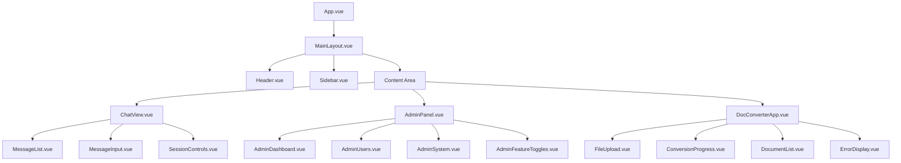
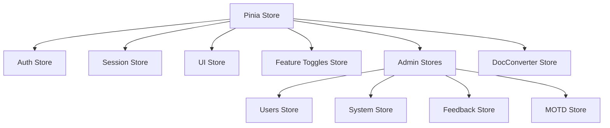
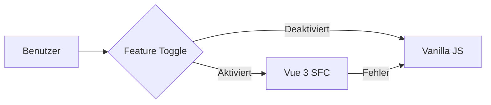

# Vue 3 SFC-Migration für den nscale DMS Assistenten

**Letzte Aktualisierung:** 11.05.2025

## Inhaltsverzeichnis

1. [Einleitung](#einleitung)
2. [Migrationsstatus](#migrationsstatus)
   1. [Überblick](#überblick)
   2. [Fortschritt nach Bereichen](#fortschritt-nach-bereichen)
   3. [Komponenten-Status](#komponenten-status)
3. [Architektur](#architektur)
   1. [Komponenten-Hierarchie](#komponenten-hierarchie)
   2. [Stores und State Management](#stores-und-state-management)
   3. [Services und API-Integration](#services-und-api-integration)
   4. [Bridge-Mechanismen](#bridge-mechanismen)
4. [Feature-Toggle-System](#feature-toggle-system)
   1. [Grundkonzept](#grundkonzept)
   2. [Implementation](#implementation)
   3. [Monitoring und Fehlerbehandlung](#monitoring-und-fehlerbehandlung)
   4. [Verwendung des FeatureWrapper](#verwendung-des-featurewrapper)
5. [Design-System](#design-system)
   1. [Komponenten-Bibliothek](#komponenten-bibliothek)
   2. [CSS-Richtlinien](#css-richtlinien)
   3. [Theming](#theming)
   4. [Responsives Design](#responsives-design)
6. [Best Practices](#best-practices)
   1. [Komponentenentwicklung](#komponentenentwicklung)
   2. [State Management](#state-management)
   3. [TypeScript-Integration](#typescript-integration)
   4. [Performance-Optimierungen](#performance-optimierungen)
7. [Testing](#testing)
   1. [Unit-Tests](#unit-tests)
   2. [Komponententests](#komponententests)
   3. [Integration in CI/CD](#integration-in-cicd)
8. [Herausforderungen und Lösungen](#herausforderungen-und-lösungen)
   1. [Browser-Kompatibilität](#browser-kompatibilität)
   2. [Leistungsoptimierung](#leistungsoptimierung)
   3. [State-Synchronisation](#state-synchronisation)
   4. [Migrationskonflikte](#migrationskonflikte)
9. [Migrations-Roadmap](#migrations-roadmap)
   1. [Aktuelle Phase](#aktuelle-phase)
   2. [Nächste Schritte](#nächste-schritte)
   3. [Zeitplanung](#zeitplanung)
10. [Detaillierte Komponenten-Dokumentation](#detaillierte-komponenten-dokumentation)
    1. [Dokumentenkonverter](#dokumentenkonverter)
    2. [Admin-Komponenten](#admin-komponenten)
    3. [Chat-Interface](#chat-interface)
11. [Anhang](#anhang)
    1. [Glossar](#glossar)
    2. [Nützliche Ressourcen](#nützliche-ressourcen)
    3. [Kontakt](#kontakt)

## Einleitung

Die Migration des nscale DMS Assistenten von einer Vanilla-JavaScript-Implementierung zu einer modernen Vue 3-Architektur mit Single File Components (SFC) stellt einen wichtigen Schritt in der Weiterentwicklung der Anwendung dar. Dieses Dokument bietet einen umfassenden Überblick über den aktuellen Stand, die zugrundeliegende Architektur, verwendete Best Practices sowie einen realistischen Zeitplan für die vollständige Migration.

Die Entscheidung für Vue 3 wurde basierend auf folgenden Faktoren getroffen:

- **Verbesserte Wartbarkeit**: Klare Komponentenstruktur und Trennung von Verantwortlichkeiten
- **Reaktives UI**: Automatische UI-Updates bei Zustandsänderungen
- **TypeScript-Integration**: Verbesserte Codequalität und Entwicklererfahrung
- **Composition API**: Bessere Wiederverwendbarkeit von Logik
- **Modernere Toolchain**: Vite für schnellere Entwicklung und optimierte Builds
- **Leistungsverbesserungen**: Optimierte Rendering-Effizienz

Die Migration erfolgt schrittweise und inkrementell, um Risiken zu minimieren und die Stabilität der Anwendung während des gesamten Prozesses zu gewährleisten.

## Migrationsstatus

### Überblick

Der aktuelle Gesamtfortschritt der Migration liegt bei etwa **40%**. Die höchste Priorität hat weiterhin die Stabilisierung der Vanilla-JavaScript-Implementierung, während die Vue 3 SFC-Migration parallel vorangetrieben wird.

Die wichtigsten Meilensteine sind:

- ✅ Einrichtung und Konfiguration des Build-Systems (Vite)
- ✅ Implementierung des Feature-Toggle-Systems mit erweiterten Monitoring-Funktionen
- ✅ Weitgehende Implementierung der Admin-Komponenten (75%)
- ✅ Implementierung der Pinia Stores für zentrales State Management (80%)
- ✅ Integration von TypeScript
- 🔄 Implementierung des Dokumentenkonverters als Vue 3 SFC (50%)
- 🔄 Migration des Chat-Interfaces (30%)

### Fortschritt nach Bereichen

| Bereich | Fortschritt | Status | Priorität |
|---------|-------------|--------|-----------|
| **Infrastruktur & Build-System** | ~95% | Nahezu abgeschlossen | Abgeschlossen |
| **Feature-Toggle-System** | ~100% | Abgeschlossen | Abgeschlossen |
| **Pinia Stores** | ~80% | In Bearbeitung | Hoch |
| **Composables** | ~65% | In Bearbeitung | Hoch |
| **UI-Basiskomponenten** | ~60% | In Bearbeitung | Hoch |
| **Layout-Komponenten** | ~50% | In Bearbeitung | Mittel |
| **Feedback-Komponenten** | ~40% | In Bearbeitung | Mittel |
| **Dokumentenkonverter** | ~50% | In Bearbeitung | Mittel |
| **Chat-Interface** | ~30% | In Bearbeitung | Hoch |
| **Admin-Bereich** | ~75% | Aktiv in Bearbeitung | Mittel |
| **Bridge-Mechanismen** | ~85% | Größtenteils abgeschlossen | Mittel |
| **Tests** | ~30% | In früher Bearbeitung | Hoch |

### Komponenten-Status

Die folgende Tabelle zeigt den Status der wichtigsten Komponenten:

| Komponente | Status | Implementierungsgrad | Layout-Übereinstimmung |
|------------|--------|----------------------|------------------------|
| **App.vue** | In Arbeit | 60% | Mittel |
| **NavigationBar.vue** | In Arbeit | 70% | Hoch |
| **Sidebar.vue** | In Arbeit | 60% | Mittel |
| **ChatView.vue** | In Arbeit | 40% | Niedrig |
| **MessageInput.vue** | In Arbeit | 45% | Niedrig |
| **Button.vue** | Fertiggestellt | 95% | Hoch |
| **Input.vue** | Fertiggestellt | 90% | Hoch |
| **Card.vue** | Fertiggestellt | 85% | Hoch |
| **Alert.vue** | Fertiggestellt | 80% | Hoch |
| **Modal.vue** | Fertiggestellt | 70% | Mittel |
| **ErrorBoundary.vue** | Fertiggestellt | 95% | N/A |
| **FeatureWrapper.vue** | Fertiggestellt | 90% | N/A |
| **EnhancedFeatureWrapper.vue** | Fertiggestellt | 95% | N/A |
| **Toast.vue** | Fertiggestellt | 80% | Mittel |
| **Dialog.vue** | Fertiggestellt | 70% | Mittel |
| **DocConverterContainer.vue** | In Arbeit | 75% | Mittel |
| **FileUpload.vue** | In Arbeit | 80% | Hoch |
| **ConversionProgress.vue** | In Arbeit | 85% | Hoch |
| **DocumentList.vue** | In Arbeit | 75% | Mittel |
| **ErrorDisplay.vue** | In Arbeit | 90% | Hoch |
| **AdminPanel.vue** | Fertiggestellt | 95% | Hoch |
| **AdminDashboard.vue** | Fertiggestellt | 90% | Hoch |
| **AdminUsers.vue** | Fertiggestellt | 95% | Hoch |
| **AdminSystem.vue** | Fertiggestellt | 95% | Hoch |
| **AdminFeatureToggles.vue** | Fertiggestellt | 90% | Hoch |
| **MainLayout.vue** | In Arbeit | 60% | Mittel |
| **Header.vue** | In Arbeit | 65% | Mittel |
| **TabPanel.vue** | In Arbeit | 50% | Niedrig |

## Architektur

### Komponenten-Hierarchie

Die Anwendung folgt einer strukturierten Komponentenhierarchie, die eine klare Trennung von Verantwortlichkeiten und eine gute Wartbarkeit ermöglicht:



Die Komponenten sind in folgende Kategorien eingeteilt:

1. **Layout-Komponenten**: Verantwortlich für die Struktur der Anwendung (MainLayout, Header, Sidebar)
2. **Kern-Komponenten**: Implementieren die Hauptfunktionalitäten (ChatView, AdminPanel, DocConverterApp)
3. **UI-Komponenten**: Wiederverwendbare UI-Elemente (Button, Input, Card, Modal, etc.)
4. **Funktionale Komponenten**: Implementieren spezifische Funktionalitäten (FeatureWrapper, ErrorBoundary)

Alle Komponenten werden mit dem Präfix "nscale-" in der CSS-Klasse versehen, um Konflikte mit externen Bibliotheken zu vermeiden.

### Stores und State Management

Für das zentrale State Management wird Pinia verwendet, das eine typsichere und modulare Zustandsverwaltung ermöglicht:



Jeder Store ist nach dem Composition-API-Muster strukturiert:

```typescript
// stores/auth.ts
import { defineStore } from 'pinia';

export const useAuthStore = defineStore('auth', () => {
  // State
  const user = ref<User | null>(null);
  const isAuthenticated = ref(false);
  const loading = ref(false);
  const error = ref<Error | null>(null);
  
  // Computed
  const hasAdminRights = computed(() => {
    return user.value?.role === 'admin';
  });
  
  // Actions
  async function login(username: string, password: string) {
    loading.value = true;
    error.value = null;
    
    try {
      const response = await api.auth.login(username, password);
      user.value = response.user;
      isAuthenticated.value = true;
      return true;
    } catch (err) {
      error.value = err as Error;
      return false;
    } finally {
      loading.value = false;
    }
  }
  
  function logout() {
    user.value = null;
    isAuthenticated.value = false;
  }
  
  return {
    user,
    isAuthenticated,
    loading,
    error,
    hasAdminRights,
    login,
    logout
  };
});
```

Die Stores werden über Composables in den Komponenten verwendet:

```vue
<script setup>
import { useAuthStore } from '@/stores/auth';

const authStore = useAuthStore();

const handleLogin = async () => {
  const success = await authStore.login(username.value, password.value);
  if (success) {
    // Weiterleitung zur Hauptseite
  }
};
</script>
```

### Services und API-Integration

Die API-Integration erfolgt über Service-Klassen, die eine Abstraktion der API-Aufrufe bieten:

```typescript
// services/api/ChatService.ts
export class ChatService {
  private readonly apiClient: ApiClient;
  
  constructor(apiClient: ApiClient) {
    this.apiClient = apiClient;
  }
  
  async sendMessage(sessionId: string, message: string): Promise<Message> {
    return this.apiClient.post<Message>(`/sessions/${sessionId}/messages`, { content: message });
  }
  
  async getMessages(sessionId: string): Promise<Message[]> {
    return this.apiClient.get<Message[]>(`/sessions/${sessionId}/messages`);
  }
  
  async createSession(): Promise<Session> {
    return this.apiClient.post<Session>('/sessions');
  }
}
```

Diese Services werden in den Stores verwendet und können leicht für Tests gemockt werden.

### Bridge-Mechanismen

Für die Kommunikation zwischen der neuen Vue 3 SFC-Implementierung und dem bestehenden Vanilla-JavaScript-Code wurden Bridge-Mechanismen implementiert:

```typescript
// bridge/index.ts
import { watch } from 'vue';
import { useAuthStore } from '@/stores/auth';
import { useSessionStore } from '@/stores/sessions';

export function setupBridge() {
  const authStore = useAuthStore();
  const sessionStore = useSessionStore();
  
  // Von Vue zu Vanilla JS
  watch(() => authStore.user, (newUser) => {
    if (window.nscaleApp && newUser) {
      window.nscaleApp.user = newUser;
    }
  });
  
  // Von Vanilla JS zu Vue
  window.addEventListener('vanilla-auth-change', (event) => {
    if (event.detail && event.detail.user) {
      authStore.user = event.detail.user;
    }
  });
  
  // API für Vanilla JS bereitstellen
  window.vueBridge = {
    login: authStore.login,
    logout: authStore.logout,
    // Weitere Methoden...
  };
}
```

Diese Bridge-Mechanismen ermöglichen einen schrittweisen Übergang, bei dem neue und alte Komponenten parallel existieren können.

## Feature-Toggle-System

### Grundkonzept

Das Feature-Toggle-System ermöglicht die schrittweise Aktivierung neuer Vue 3 SFC-Komponenten und bietet einen sicheren Fallback auf die Vanilla-JavaScript-Implementierung bei Problemen:



### Implementation

Die Implementierung des Feature-Toggle-Systems basiert auf einem Pinia Store mit persistentem Zustand:

```typescript
// stores/featureToggles.ts
import { defineStore } from 'pinia';

interface FeatureState {
  useSfcAdmin: boolean;
  useSfcChat: boolean;
  useSfcDocConverter: boolean;
  useSfcSettings: boolean;
  // Weitere Features...
}

export const useFeatureTogglesStore = defineStore('featureToggles', {
  state: (): FeatureState => ({
    useSfcAdmin: false,
    useSfcChat: false,
    useSfcDocConverter: false,
    useSfcSettings: false,
  }),
  
  getters: {
    isEnabled: (state) => (featureName: keyof FeatureState) => {
      return state[featureName] ?? false;
    }
  },
  
  actions: {
    enableFeature(featureName: keyof FeatureState) {
      if (featureName in this) {
        this[featureName] = true;
      }
    },
    
    disableFeature(featureName: keyof FeatureState) {
      if (featureName in this) {
        this[featureName] = false;
      }
    },
    
    setFeatureState(featureName: keyof FeatureState, state: boolean) {
      if (featureName in this) {
        this[featureName] = state;
      }
    },
    
    // Feature-Abhängigkeiten prüfen
    checkDependencies(featureName: keyof FeatureState): boolean {
      const dependencies = featureDependencies[featureName] || [];
      return dependencies.every(dep => this.isEnabled(dep));
    }
  },
  
  persist: {
    enabled: true,
    strategies: [
      { storage: localStorage, key: 'nscale-feature-toggles' }
    ]
  }
});
```

### Monitoring und Fehlerbehandlung

Das Feature-Toggle-System wurde um Monitoring- und Fehlerbehandlungsfunktionen erweitert:

```typescript
// monitoring/featureMonitoring.ts
export const useFeatureMonitoring = defineStore('featureMonitoring', {
  state: () => ({
    featureUsage: {} as Record<string, FeatureUsage>,
    featureErrors: {} as Record<string, FeatureError[]>,
  }),
  
  actions: {
    trackUsage(featureName: string) {
      if (!this.featureUsage[featureName]) {
        this.featureUsage[featureName] = {
          count: 0,
          lastUsed: null,
          errorCount: 0
        };
      }
      
      this.featureUsage[featureName].count++;
      this.featureUsage[featureName].lastUsed = new Date();
    },
    
    trackError(featureName: string, error: Error) {
      if (!this.featureErrors[featureName]) {
        this.featureErrors[featureName] = [];
      }
      
      this.featureErrors[featureName].push({
        timestamp: new Date(),
        message: error.message,
        stack: error.stack,
      });
      
      if (this.featureUsage[featureName]) {
        this.featureUsage[featureName].errorCount++;
      }
      
      // Automatischer Fallback bei zu vielen Fehlern
      if (this.getErrorCount(featureName) > MAX_ERRORS_BEFORE_FALLBACK) {
        const featureToggles = useFeatureTogglesStore();
        featureToggles.disableFeature(featureName as any);
        console.warn(`Feature ${featureName} wurde aufgrund zu vieler Fehler deaktiviert.`);
      }
    },
    
    getErrorCount(featureName: string): number {
      return this.featureErrors[featureName]?.length || 0;
    },
    
    getUsageData(featureName: string): FeatureUsage | null {
      return this.featureUsage[featureName] || null;
    },
    
    clearErrorsForFeature(featureName: string) {
      this.featureErrors[featureName] = [];
      if (this.featureUsage[featureName]) {
        this.featureUsage[featureName].errorCount = 0;
      }
    }
  }
});
```

### Verwendung des FeatureWrapper

Der `FeatureWrapper` ist eine spezialisierte Komponente, die das Feature-Toggle-System in die Komponenten integriert:

```vue
<!-- components/shared/FeatureWrapper.vue -->
<template>
  <component v-if="isEnabled && !hasError" :is="componentToRender" v-bind="$props" />
  <slot v-else-if="hasError" name="error" :error="error" :retry="retryFeature" />
  <slot v-else name="fallback" />
</template>

<script setup lang="ts">
import { ref, computed, onErrorCaptured, watch } from 'vue';
import { useFeatureTogglesStore } from '@/stores/featureToggles';
import { useFeatureMonitoring } from '@/monitoring/featureMonitoring';

const props = defineProps({
  featureName: {
    type: String,
    required: true
  },
  componentName: {
    type: String,
    required: true
  },
  // Weitere Props...
});

const featureToggles = useFeatureTogglesStore();
const monitoring = useFeatureMonitoring();
const error = ref<Error | null>(null);
const hasError = ref(false);
const errorCount = ref(0);

// Feature aktiviert?
const isEnabled = computed(() => {
  return featureToggles.isEnabled(props.featureName as any);
});

// Komponente dynamisch laden
const componentToRender = computed(async () => {
  if (!isEnabled.value) return null;
  
  try {
    monitoring.trackUsage(props.featureName);
    return await import(`@/components/${props.componentName}.vue`);
  } catch (err) {
    error.value = err as Error;
    hasError.value = true;
    monitoring.trackError(props.featureName, err as Error);
    return null;
  }
});

// Fehlerbehandlung
onErrorCaptured((err) => {
  error.value = err;
  hasError.value = true;
  errorCount.value++;
  monitoring.trackError(props.featureName, err);
  
  return false; // Fehler nicht weitergeben
});

// Feature neustarten
function retryFeature() {
  hasError.value = false;
  error.value = null;
}
</script>
```

Die Verwendung des `FeatureWrapper` ist einfach und intuitiv:

```vue
<FeatureWrapper
  feature-name="useSfcAdmin"
  component-name="admin/AdminPanel"
>
  <template #fallback>
    <div id="legacy-admin-mount"></div>
  </template>
  <template #error="{ error, retry }">
    <div class="error-container">
      <p>Fehler beim Laden der Admin-Komponente: {{ error.message }}</p>
      <button @click="retry">Erneut versuchen</button>
    </div>
  </template>
</FeatureWrapper>
```

## Design-System

### Komponenten-Bibliothek

Eine grundlegende UI-Komponenten-Bibliothek wurde für die Vue 3 SFC-Migration implementiert:

| Komponente | Beschreibung | Status |
|------------|-------------|--------|
| **Button** | Schaltfläche mit verschiedenen Varianten (primary, secondary, danger, etc.) | ✅ |
| **Input** | Texteingabefeld mit Validierung | ✅ |
| **Card** | Container für Inhalte | ✅ |
| **Alert** | Benachrichtigungen in verschiedenen Stufen (info, warning, error, success) | ✅ |
| **Modal** | Dialog-Fenster für Eingaben oder Bestätigungen | ✅ |
| **Toast** | Temporäre Benachrichtigungen | ✅ |
| **Dialog** | Komplexe Dialog-Komponente mit verschiedenen Aktionen | ✅ |
| **Tabs** | Tab-Navigation für verschiedene Inhalte | ✅ |
| **Dropdown** | Auswahlmenü | 🔄 |
| **Table** | Tabelle mit Sortierung und Filterung | 🔄 |

Die Komponenten sind mit TypeScript implementiert und unterstützen volle Barrierefreiheit.

### CSS-Richtlinien

Für ein konsistentes Design wurden folgende CSS-Richtlinien etabliert:

1. **CSS-Variablen für Theming**:
   ```css
   :root {
     --nscale-primary: #0072C6;
     --nscale-secondary: #6C757D;
     --nscale-success: #28A745;
     --nscale-info: #17A2B8;
     --nscale-warning: #FFC107;
     --nscale-danger: #DC3545;
     --nscale-light: #F8F9FA;
     --nscale-dark: #343A40;
     --nscale-bg-light: #FFFFFF;
     --nscale-bg-dark: #121212;
     --nscale-text-light: #212529;
     --nscale-text-dark: #F8F9FA;
     /* Weitere Variablen... */
   }
   ```

2. **Namenskonventionen**:
   - Komponenten-Klassen beginnen immer mit `nscale-` (z.B. `nscale-button`)
   - Modifikatoren werden mit `--` angehängt (z.B. `nscale-button--primary`)
   - Zustände werden mit `-` angehängt (z.B. `nscale-button-disabled`)

3. **Scoped CSS in Komponenten**:
   ```vue
   <style scoped>
   .nscale-button {
     /* Grundlegende Stile */
   }
   .nscale-button--primary {
     /* Primary-Variante */
   }
   </style>
   ```

4. **Responsive Design mit Media Queries**:
   ```css
   /* Mobile first */
   .nscale-container {
     /* Basis-Stile für mobile Geräte */
   }
   
   /* Tablet */
   @media (min-width: 768px) {
     .nscale-container {
       /* Tablet-spezifische Stile */
     }
   }
   
   /* Desktop */
   @media (min-width: 1024px) {
     .nscale-container {
       /* Desktop-spezifische Stile */
     }
   }
   ```

### Theming

Die Anwendung unterstützt verschiedene Themes (Light, Dark, High Contrast), die über CSS-Variablen gesteuert werden:

```typescript
// stores/ui.ts
export const useUiStore = defineStore('ui', {
  state: () => ({
    theme: localStorage.getItem('theme') || 'light',
  }),
  
  actions: {
    setTheme(theme: 'light' | 'dark' | 'high-contrast') {
      this.theme = theme;
      localStorage.setItem('theme', theme);
      document.documentElement.setAttribute('data-theme', theme);
      
      // Klassennamen für Theme-spezifische Stile
      document.body.classList.remove('theme-light', 'theme-dark', 'theme-high-contrast');
      document.body.classList.add(`theme-${theme}`);
    }
  }
});
```

Die Themes werden in separaten CSS-Dateien definiert:

```css
/* themes.css */
[data-theme='light'] {
  --nscale-bg: var(--nscale-bg-light);
  --nscale-text: var(--nscale-text-light);
  /* Weitere Theme-spezifische Variablen... */
}

[data-theme='dark'] {
  --nscale-bg: var(--nscale-bg-dark);
  --nscale-text: var(--nscale-text-dark);
  /* Weitere Theme-spezifische Variablen... */
}

[data-theme='high-contrast'] {
  --nscale-bg: #000000;
  --nscale-text: #FFFFFF;
  /* Weitere Theme-spezifische Variablen... */
}
```

### Responsives Design

Alle Komponenten sind vollständig responsiv und verwenden einen Mobile-First-Ansatz:

```vue
<template>
  <div class="nscale-admin-panel">
    <div class="nscale-admin-sidebar" :class="{ 'nscale-admin-sidebar--expanded': isSidebarExpanded }">
      <!-- Sidebar-Inhalt -->
    </div>
    <div class="nscale-admin-content">
      <!-- Haupt-Inhalt -->
    </div>
  </div>
</template>

<style scoped>
.nscale-admin-panel {
  display: flex;
  flex-direction: column;
  width: 100%;
  height: 100%;
}

.nscale-admin-sidebar {
  width: 100%;
  padding: 1rem;
}

.nscale-admin-content {
  flex: 1;
  padding: 1rem;
}

/* Tablet und größer */
@media (min-width: 768px) {
  .nscale-admin-panel {
    flex-direction: row;
  }
  
  .nscale-admin-sidebar {
    width: 250px;
    min-width: 250px;
  }
}
</style>
```

## Best Practices

### Komponentenentwicklung

Für die Entwicklung neuer Vue 3 SFC-Komponenten wurden folgende Best Practices etabliert:

1. **Verwendung der Composition API**:
   ```vue
   <script setup lang="ts">
   import { ref, computed, watch, onMounted } from 'vue';
   
   // Props mit TypeScript-Typen
   const props = defineProps<{
     title: string;
     items: Item[];
   }>();
   
   // Emits definieren
   const emit = defineEmits<{
     (e: 'select', item: Item): void;
     (e: 'cancel'): void;
   }>();
   
   // Reaktiver Zustand
   const selectedItem = ref<Item | null>(null);
   
   // Berechnete Eigenschaften
   const sortedItems = computed(() => {
     return [...props.items].sort((a, b) => a.name.localeCompare(b.name));
   });
   
   // Methoden
   function selectItem(item: Item) {
     selectedItem.value = item;
     emit('select', item);
   }
   
   // Lifecycle Hooks
   onMounted(() => {
     // Initialisierungslogik
   });
   </script>
   ```

2. **Komponentenstruktur**:
   - Kleine, fokussierte Komponenten mit einer klaren Verantwortlichkeit
   - Logik in Composables auslagern für bessere Wiederverwendbarkeit
   - Props für Eingaben, Emits für Ausgaben

3. **Performance-Optimierungen**:
   - `v-once` für statische Inhalte
   - `v-memo` für optimiertes Rendering
   - Lazy-Loading von Komponenten

4. **Barrierefreiheit**:
   - ARIA-Attribute für bessere Screenreader-Unterstützung
   - Tastaturnavigation
   - Ausreichende Kontrastverhältnisse

### State Management

Für das State Management mit Pinia wurden folgende Best Practices etabliert:

1. **Store-Struktur**:
   - Ein Store pro Feature-Bereich
   - Klare Trennung von State, Getters und Actions
   - TypeScript-Typen für den Store-Zustand

2. **Zustandsänderungen**:
   - Immer Actions für Zustandsänderungen verwenden
   - Asynchrone Operationen in Actions kapseln
   - Optimistische Updates für bessere UX

3. **Store-Modularisierung**:
   - Große Stores in kleinere, fokussierte Stores aufteilen
   - Stores über Composables in Komponenten verwenden

### TypeScript-Integration

Die TypeScript-Integration folgt diesen Best Practices:

1. **Typendefinitionen**:
   - Interface für alle API-Modelle definieren
   - Enums für feste Wertebereiche verwenden
   - Typen für Props und Emits definieren

2. **Typsicherheit**:
   - Strikte Typprüfungen aktivieren (`"strict": true`)
   - Generics für wiederverwendbare Funktionen
   - Type Guards für Laufzeitprüfungen

3. **Organisation**:
   - Typen in separaten Dateien (`types/*.ts`)
   - Barrel-Files für einfachere Importe

### Performance-Optimierungen

Folgende Performance-Optimierungen wurden implementiert:

1. **Lazy-Loading**:
   ```typescript
   // Router mit Lazy-Loading
   const routes = [
     {
       path: '/admin',
       component: () => import('@/views/AdminView.vue'),
       children: [
         {
           path: 'users',
           component: () => import('@/components/admin/tabs/AdminUsers.vue')
         },
         // Weitere Routes...
       ]
     }
   ];
   ```

2. **Code-Splitting**:
   - Vite's automatisches Chunk-Splitting
   - Dynamische Imports für große Bibliotheken

3. **Rendering-Optimierungen**:
   - Virtualisierte Listen für große Datensätze
   - Debounced Input-Handling für Suchfelder
   - Memoization für teure Berechnungen

## Testing

### Unit-Tests

Für Unit-Tests wird Vitest in Kombination mit Vue Test Utils verwendet:

```typescript
// tests/components/Button.spec.ts
import { mount } from '@vue/test-utils';
import { describe, it, expect } from 'vitest';
import Button from '@/components/ui/Button.vue';

describe('Button.vue', () => {
  it('renders a button with the correct text', () => {
    const wrapper = mount(Button, {
      props: {
        label: 'Test Button'
      }
    });
    
    expect(wrapper.text()).toContain('Test Button');
  });
  
  it('emits a click event when clicked', async () => {
    const wrapper = mount(Button);
    
    await wrapper.trigger('click');
    
    expect(wrapper.emitted('click')).toBeTruthy();
  });
  
  it('applies the correct CSS class based on variant', () => {
    const wrapper = mount(Button, {
      props: {
        variant: 'primary'
      }
    });
    
    expect(wrapper.classes()).toContain('nscale-button--primary');
  });
});
```

### Komponententests

Für komplexere Komponententests werden Mocks für Stores und Services verwendet:

```typescript
// tests/components/admin/AdminUsers.spec.ts
import { mount } from '@vue/test-utils';
import { createTestingPinia } from '@pinia/testing';
import { describe, it, expect, vi } from 'vitest';
import AdminUsers from '@/components/admin/tabs/AdminUsers.vue';
import { useAdminUsersStore } from '@/stores/admin/users';

describe('AdminUsers.vue', () => {
  it('renders a list of users', async () => {
    const wrapper = mount(AdminUsers, {
      global: {
        plugins: [
          createTestingPinia({
            createSpy: vi.fn,
            initialState: {
              adminUsers: {
                users: [
                  { id: '1', username: 'admin', email: 'admin@example.com', role: 'admin' },
                  { id: '2', username: 'user', email: 'user@example.com', role: 'user' }
                ],
                loading: false,
                error: null
              }
            }
          })
        ]
      }
    });
    
    // Store-Methoden mocken
    const store = useAdminUsersStore();
    store.fetchUsers = vi.fn().mockResolvedValue();
    
    await wrapper.vm.$nextTick();
    
    expect(wrapper.findAll('tbody tr')).toHaveLength(2);
    expect(wrapper.text()).toContain('admin');
    expect(wrapper.text()).toContain('user');
  });
  
  // Weitere Tests...
});
```

### Integration in CI/CD

Die Tests sind in eine CI/CD-Pipeline integriert:

```yaml
# .github/workflows/test.yml
name: Test

on:
  push:
    branches: [ main, develop ]
  pull_request:
    branches: [ main, develop ]

jobs:
  test:
    runs-on: ubuntu-latest
    
    steps:
      - uses: actions/checkout@v2
      
      - name: Setup Node.js
        uses: actions/setup-node@v2
        with:
          node-version: '18'
          
      - name: Install dependencies
        run: npm ci
        
      - name: Run tests
        run: npm run test
        
      - name: Run type check
        run: npm run typecheck
```

## Herausforderungen und Lösungen

### Browser-Kompatibilität

**Herausforderung**: Unterschiedliche Unterstützung von modernen JavaScript-Features in verschiedenen Browsern.

**Lösung**:
- Verwendung von Vite mit automatischem Polyfill-Injection
- Browserlist-Konfiguration für gezielte Browser-Unterstützung
- Fallback-Mechanismen für ältere Browser

### Leistungsoptimierung

**Herausforderung**: Leistungseinbußen bei der Einführung eines komplexen Frameworks.

**Lösung**:
- Code-Splitting und Lazy-Loading
- Virtualisierte Listen für große Datensätze
- Optimierte Bundles durch Vite
- Memoization für teure Berechnungen

### State-Synchronisation

**Herausforderung**: Synchronisation des Zustands zwischen Vanilla-JavaScript und Vue 3.

**Lösung**:
- Event-basierte Kommunikation
- Globale API für den Datenaustausch
- Reaktive Watches für Zustandsänderungen
- Eindeutige Datenquelle definieren

### Migrationskonflikte

**Herausforderung**: Konflikte zwischen gleichzeitig aktiven Vanilla-JavaScript- und Vue 3-Komponenten.

**Lösung**:
- Klare Trennung der DOM-Manipulation
- Feature-Toggle-System mit Fallback
- Klare API-Grenzen definieren
- Ausführliche Tests für Interaktionen

## Migrations-Roadmap

### Aktuelle Phase

Die Migration befindet sich derzeit in einer aktiven Implementierungsphase mit einem Gesamtfortschritt von etwa 40%. Besondere Fortschritte wurden in folgenden Bereichen erzielt:

- **Admin-Komponenten**: 75% abgeschlossen
- **Feature-Toggle-System**: 100% abgeschlossen
- **Pinia Stores**: 80% abgeschlossen

### Nächste Schritte

Die nächsten Schritte in der Migration sind:

1. **Vervollständigung der Test-Automatisierung**
   - Implementierung automatisierter Tests für alle kritischen Komponenten
   - Integration der Tests in den CI/CD-Prozess
   - Einrichtung regelmäßiger Testläufe

2. **Design-System-Entwicklung**
   - Standardisierung der CSS-Variablen
   - Erstellung einer Komponenten-Bibliothek mit konsistentem Styling
   - Implementierung eines Theme-Mechanismus

3. **Chat-Komponenten-Migration**
   - Migration der MessageList-Komponente
   - Migration der InputComponent
   - Migration der ChatView
   - Integration mit Pinia-Stores

4. **Dokumentenkonverter-Fertigstellung**
   - Abschluss der Tests für DocConverterContainer
   - Behebung von UI-Inkonsistenzen
   - Integration in die Gesamtanwendung

### Zeitplanung

| Phase | Meilenstein | Aktueller Status | Geplanter Abschluss |
|-------|-------------|------------------|---------------------|
| 1 | Infrastruktur & Feature-Toggle-System | 95% abgeschlossen | Mai 2025 |
| 2 | UI-Basiskomponenten | 60% abgeschlossen | Juni 2025 |
| 3a | Admin-Komponenten | 75% abgeschlossen | Juni 2025 |
| 3b | Dokumentenkonverter | 50% abgeschlossen | Juli 2025 |
| 4 | Chat-Interface | 30% abgeschlossen | August 2025 |
| 5 | Authentifizierung & Einstellungen | 10% begonnen | September 2025 |
| 6 | Legacy-Code-Entfernung | Geplant | Q4 2025 |

Diese Zeitplanung berücksichtigt die verfügbaren Ressourcen (15 Wochenstunden) und enthält Puffer für unerwartete Probleme.

## Detaillierte Komponenten-Dokumentation

### Dokumentenkonverter

Der Dokumentenkonverter wurde als modulares Vue 3 SFC-System implementiert, das verschiedene Dokumentformate in durchsuchbaren Text konvertieren kann. Die Migration ist zu etwa 50% abgeschlossen.

#### Komponentenhierarchie

```
src/components/admin/document-converter/
├── DocConverterContainer.vue     # Hauptcontainer-Komponente (75%)
├── FileUpload.vue                # Datei-Upload-Komponente (80%)
├── ConversionProgress.vue        # Fortschrittsanzeige (85%)
├── DocumentList.vue              # Liste konvertierter Dokumente (75%)
├── ConversionResult.vue          # Ergebnisanzeige (65%)
├── DocumentPreview.vue           # Dokumentvorschau (60%)
├── ErrorDisplay.vue              # Fehleranzeige (90%)
└── FallbackConverter.vue         # Fallback-Komponente (100%)
```

#### DocConverterContainer.vue

Die Hauptkomponente, die alle anderen Unterkomponenten koordiniert:

```vue
<template>
  <div class="doc-converter-container" v-if="featureToggles.isDocConverterEnabled">
    <div class="doc-converter-header">
      <h2>{{ t('documentConverter.title', 'Dokumentenkonverter') }}</h2>
      <p class="doc-converter-description">
        {{ t('documentConverter.description', 'Konvertieren Sie Ihre Dokumente in ein nscale-kompatibles Format. Unterstützte Formate: PDF, DOCX, XLSX, PPTX, TXT.') }}
      </p>
    </div>

    <!-- Fehleranzeige bei Initialisierungsproblemen -->
    <ErrorDisplay 
      v-if="error" 
      :error="error" 
      @retry="initialize" 
    />

    <div v-else class="doc-converter-content">
      <!-- Upload-Bereich mit Drag & Drop Unterstützung -->
      <FileUpload 
        v-if="!isConverting && !conversionResult" 
        @upload="startConversion" 
        :is-uploading="isUploading"
        :allowed-extensions="allowedExtensions"
        :max-file-size="maxFileSize"
      />

      <!-- Fortschrittsanzeige während der Konvertierung -->
      <ConversionProgress 
        v-if="isConverting" 
        :progress="conversionProgress" 
        :current-step="conversionStep"
        :estimated-time="estimatedTimeRemaining"
        @cancel="handleCancelConversion"
      />

      <!-- Ergebnis der Konvertierung -->
      <ConversionResult 
        v-if="conversionResult" 
        :result="conversionResult"
        @close="clearConversionResult" 
      />

      <!-- Liste der konvertierten Dokumente -->
      <DocumentList 
        :documents="documents" 
        :selected-document="selectedDocument"
        :loading="isLoading"
        @select="selectDocument"
        @view="viewDocument"
        @download="downloadDocument"
        @delete="promptDeleteDocument"
      />

      <!-- Fallback-Konverter, falls etwas schief geht -->
      <FallbackConverter 
        v-if="useFallback" 
        @retry="initialize" 
      />
    </div>
  </div>
</template>
```

#### DocumentConverterStore

Die Zustandsverwaltung erfolgt über einen dedizierten Pinia Store:

```typescript
// stores/documentConverter.ts
export const useDocumentConverterStore = defineStore('documentConverter', () => {
  // State
  const isInitialized = ref(false);
  const isLoading = ref(false);
  const isUploading = ref(false);
  const isConverting = ref(false);
  const documents = ref<Document[]>([]);
  const selectedDocumentId = ref<string | null>(null);
  const error = ref<Error | null>(null);
  
  // Conversion tracking
  const uploadProgress = ref(0);
  const conversionProgress = ref(0);
  const conversionStep = ref('');
  const estimatedTimeRemaining = ref(0);
  
  // Computed
  const selectedDocument = computed(() => {
    return documents.value.find(doc => doc.id === selectedDocumentId.value) || null;
  });
  
  // Actions
  async function initialize() {
    if (isInitialized.value) return;
    
    isLoading.value = true;
    error.value = null;
    
    try {
      const docs = await documentService.getDocuments();
      documents.value = docs;
      isInitialized.value = true;
    } catch (err) {
      error.value = err as Error;
    } finally {
      isLoading.value = false;
    }
  }
  
  // Weitere Actions...
  
  return {
    // Exported state
    isInitialized,
    isLoading,
    isUploading,
    isConverting,
    documents,
    selectedDocumentId,
    error,
    uploadProgress,
    conversionProgress,
    conversionStep,
    estimatedTimeRemaining,
    selectedDocument,
    
    // Exported actions
    initialize,
    uploadDocument,
    convertDocument,
    selectDocument,
    // Weitere Actions...
  };
});
```

#### Robuste Fehlerbehandlung

Der Dokumentenkonverter implementiert mehrschichtige Fallback-Mechanismen:

1. **Feature-Toggle**: Aktivierung/Deaktivierung der Vue 3-Version über den Feature-Toggle `useSfcDocConverter`
2. **ErrorBoundary-Komponente**: Einfangen von Fehlern auf Komponentenebene
3. **FallbackConverter**: Eine vereinfachte Version, die bei kritischen Fehlern verwendet wird
4. **Vanilla-JS-Fallback**: Bei schwerwiegenden Problemen wird auf die alte Implementierung zurückgegriffen

#### Laufende Entwicklung

Die folgenden Aufgaben sind für die Fertigstellung des Dokumentenkonverters geplant:

- Integration von OCR-Funktionalität für gescannte Dokumente
- Batch-Verarbeitung für mehrere Dokumente gleichzeitig
- Verbesserung der Benutzeroberfläche für Mobilgeräte
- Erweiterung der Testabdeckung

### Admin-Komponenten

Die Admin-Komponenten wurden zu etwa 75% auf Vue 3 SFC migriert und bieten umfangreiche Verwaltungsfunktionen:

#### Abgeschlossene Komponenten

1. **AdminPanel.vue** (95%): Hauptkomponente mit Tab-Navigation und Benutzerberechtigungsprüfung
2. **AdminUsers.vue** (95%): Benutzerverwaltung mit CRUD-Operationen
3. **AdminSystem.vue** (95%): Systemüberwachung und -konfiguration
4. **AdminFeatureToggles.vue** (90%): Verwaltung von Feature-Toggles mit erweitertem Monitoring

#### In Entwicklung

1. **AdminFeedback.vue** (25%): Feedback-Verwaltung und -Analyse
2. **AdminMotdTab.vue** (20%): Verwaltung der Nachricht des Tages

### Chat-Interface

Die Migration des Chat-Interfaces ist zu etwa 30% abgeschlossen:

#### Abgeschlossene Komponenten

1. **MessageItem.vue** (90%): Darstellung einzelner Nachrichten
2. **EnhancedMessageInput.vue** (70%): Eingabefeld mit erweiterten Funktionen

#### In Entwicklung

1. **MessageList.vue** (45%): Anzeige aller Nachrichten mit Virtualisierung
2. **ChatView.vue** (40%): Gesamtansicht des Chat-Interfaces
3. **SessionManager.vue** (30%): Verwaltung von Chat-Sitzungen

## Anhang

### Glossar

| Begriff | Beschreibung |
|---------|-------------|
| **SFC** | Single File Component, Vue-Komponente mit Template, Script und Style in einer Datei |
| **Composition API** | Vue 3 API für bessere Code-Organisation und Wiederverwendbarkeit |
| **Pinia** | Offizielles State Management für Vue 3 |
| **Vite** | Build-Tool und Entwicklungsserver für moderne Webanwendungen |
| **Bridge** | Mechanismus zur Kommunikation zwischen altem und neuem Code |
| **Feature Toggle** | System zur kontrollierten Aktivierung neuer Features |

### Nützliche Ressourcen

- [Vue 3 Dokumentation](https://vuejs.org)
- [Pinia Dokumentation](https://pinia.vuejs.org)
- [Vite Dokumentation](https://vitejs.dev)
- [TypeScript Dokumentation](https://www.typescriptlang.org)
- [Vue Test Utils](https://test-utils.vuejs.org)

### Kontakt

Bei Fragen zur Vue 3 SFC-Migration wenden Sie sich an das Entwicklungsteam (entwicklung@nscale.de).

---

*Zuletzt aktualisiert: 11.05.2025*