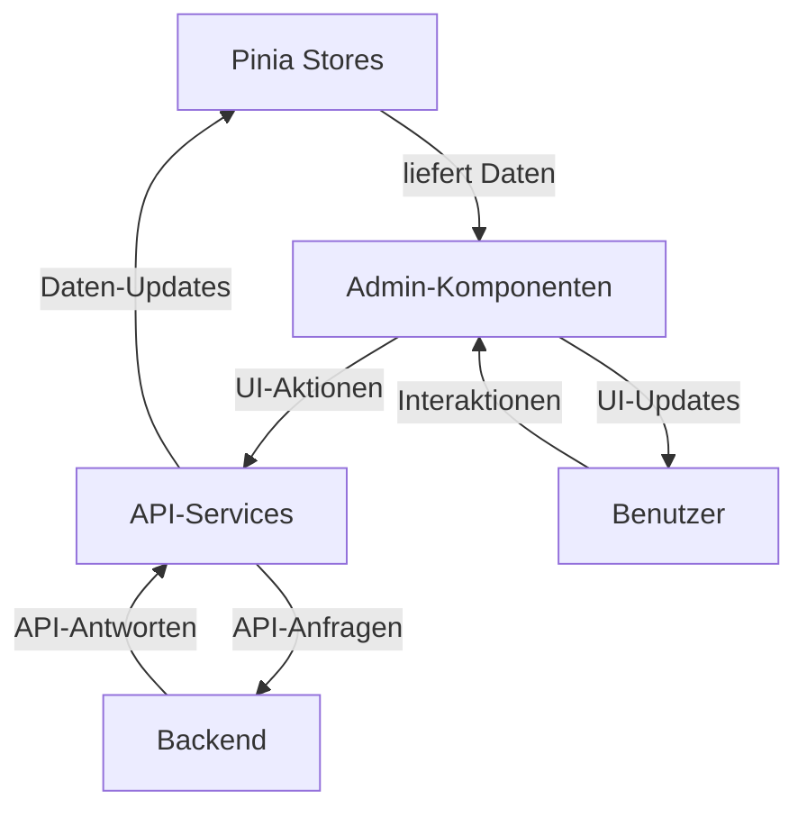

# Design-Konzept: Admin-Komponenten in Vue 3 SFC

*Datum: 08.05.2024*

## 1. Analyse der aktuellen Admin-Komponenten

### 1.1 Überblick der bestehenden Funktionalitäten

Nach einer gründlichen Analyse der vorhandenen Codebasis wurden folgende Admin-Funktionalitäten identifiziert:

#### 1.1.1 Benutzer- und Rollenverwaltung
- Anzeige aller Benutzer mit Details (E-Mail, Rolle, Erstellungsdatum, letzter Login)
- Erstellung neuer Benutzer mit Rollenauswahl (admin/user)
- Änderung von Benutzerrollen
- Löschen von Benutzern mit Einschränkungen (keine Admins löschen, kein Selbstlöschen)

#### 1.1.2 System-Monitoring und -Statistiken
- Anzeige allgemeiner Systemstatistiken (API-Aufruf an `/api/admin/stats`)
- Systemwartung-Funktionen (Cache leeren, Embeddings neu laden)
- Systemzustand und Performance-Indikatoren

#### 1.1.3 Feedback-Verwaltung und -Analyse
- Anzeige von Feedback-Statistiken (positiv/negativ)
- Detail-Ansicht für negatives Feedback mit Benutzerkommentaren
- Analyse von Frage-Antwort-Paaren, die negatives Feedback erhielten

#### 1.1.4 Message of the Day (MOTD) Editor
- Bearbeitung des MOTD-Inhalts mit Markdown-Unterstützung
- Konfiguration von Stil-Optionen (Farben, Positionen)
- Anzeigeoptionen (Startup, im Chat, etc.)
- Vorschaufunktion

#### 1.1.5 Dokumentenkonverter
- Platzhalter für Funktionalität zur Verwaltung der Dokumentenkonvertierung
- Aktuell nicht implementiert

### 1.2 Aktueller Datenfluss und Benutzerinteraktionen

#### 1.2.1 API-Endpunkte und Datenstrukturen
Die wichtigsten identifizierten API-Endpunkte sind:

| Endpunkt | Methode | Beschreibung | Datenstruktur |
|---|---|---|---|
| `/api/admin/users` | GET | Liste aller Benutzer | `[{id, email, role, created_at, last_login}]` |
| `/api/admin/users` | POST | Neuen Benutzer erstellen | `{email, password, role}` |
| `/api/admin/users/{id}/role` | PUT | Benutzerrolle aktualisieren | `{role}` |
| `/api/admin/users/{id}` | DELETE | Benutzer löschen | - |
| `/api/admin/stats` | GET | Systemstatistiken abrufen | `{stats: {...}}` |
| `/api/admin/feedback/stats` | GET | Feedback-Statistiken | `{stats: {total, positive, negative, positive_percent}}` |
| `/api/admin/feedback/negative` | GET | Negatives Feedback | `{feedback: [{id, message_id, comment, question, answer, user_email}]}` |
| `/api/motd` | GET | MOTD-Konfiguration | `{enabled, format, content, style, display}` |
| `/api/admin/update-motd` | POST | MOTD aktualisieren | `{enabled, format, content, style, display}` |
| `/api/admin/reload-motd` | POST | MOTD neu laden | - |
| `/api/admin/clear-cache` | POST | Modell-Cache leeren | - |
| `/api/admin/clear-embedding-cache` | POST | Embedding-Cache leeren | - |

#### 1.2.2 Benutzeraktionen und Ereignisse
- **Tabwechsel**: Auslösen verschiedener API-Aufrufe basierend auf dem aktiven Tab
- **Formular-Submissions**: Erstellen/Aktualisieren von Daten mit API-Aufrufen
- **Bestätigungsdialoge**: Vor kritischen Aktionen (Löschen, Cache leeren)
- **Live-Vorschau**: Bei MOTD-Bearbeitung

#### 1.2.3 Fehlerbehandlung und Validierung
- Client-seitige Formularvalidierung (minimal)
- Server-seitige Validierung (z.B. unzulässige Benutzeraktionen)
- Einfache Alert-basierte Fehleranzeigen

#### 1.2.4 Zustandsverwaltung und -persistenz
- Derzeit reaktive Vue.js-Variablen ohne dediziertes State-Management
- Zustand wird bei Tab-Wechsel zurückgesetzt und neu geladen
- Keine dauerhafte Clientseitige Zustandspersistenz

### 1.3 Identifizierte Verbesserungsmöglichkeiten

#### 1.3.1 UX-Probleme im aktuellen Design
- **Inkonsistente Benutzeroberfläche**: Fehlende einheitliche Designsprache
- **Alert-basierte Fehlerbehandlung**: Unschöne und störende `alert()`-Aufrufe
- **Fehlende Ladezustände**: Keine Anzeige während API-Aufrufen
- **Keine Bestätigungsfeedbacks**: Unzureichende Rückmeldung nach erfolgreichen Aktionen
- **Unzureichende Validierungsfeedbacks**: Fehlermeldungen werden nicht an UI-Elementen angezeigt

#### 1.3.2 Fehlende Funktionalitäten und Features
- **Filterung/Sortierung**: Keine Möglichkeit, Benutzerlisten zu filtern/sortieren
- **Erweiterte Benutzersuche**: Keine Suchfunktion für Benutzer
- **Feedback-Filterung**: Keine zeitliche oder kategoriebezogene Filterung
- **Export-Funktionen**: Keine Möglichkeit, Daten zu exportieren
- **Erweiterte MOTD-Vorschau**: Keine Vorschau in verschiedenen Kontexten

#### 1.3.3 Performance-Probleme und Bottlenecks
- **Wiederholte API-Aufrufe**: Bei jedem Tab-Wechsel neue Anfragen
- **Fehlende Caching-Strategien**: Daten werden nicht zwischengespeichert
- **Unnötige Daten-Neuladezyklen**: Vollständiges Neuladen statt Aktualisierung

#### 1.3.4 Zugänglichkeits- und Benutzerfreundlichkeitsprobleme
- **Fehlende ARIA-Attribute**: Unzureichende Screenreader-Unterstützung
- **Tastaturbedienung**: Mangelnde Unterstützung für Tastaturbedienung
- **Fehlende Responsive Design Anpassungen**: Mobile Darstellung nicht optimiert
- **Inkonsistente Kontrast- und Farbschemata**: Kontrastverhältnisse nicht WCAG-konform

## 2. Design-Konzept: Admin-Komponenten in Vue 3 SFC

### 2.1 Komponentenhierarchie und -struktur

```
AdminPanel.vue (Hauptkomponente)
├── AdminSidebar.vue
│   └── AdminNavItem.vue
├── AdminHeader.vue
└── AdminContent.vue (Router-View)
    ├── UserManagement.vue
    │   ├── UserList.vue
    │   │   └── UserListItem.vue
    │   ├── UserForm.vue
    │   └── UserDetails.vue
    ├── SystemMonitoring.vue
    │   ├── SystemStats.vue
    │   │   └── StatCard.vue
    │   └── SystemActions.vue
    ├── FeedbackAnalysis.vue
    │   ├── FeedbackStats.vue
    │   │   └── FeedbackChart.vue
    │   └── FeedbackList.vue
    │       └── FeedbackItem.vue
    ├── MotdEditor.vue
    │   ├── MotdForm.vue
    │   ├── MotdStyler.vue
    │   └── MotdPreview.vue
    └── DocConverter.vue
        ├── ConverterStatus.vue
        ├── ConverterSettings.vue
        └── ConverterLogs.vue
```

#### 2.1.1 Haupt-Admin-Komponente

- **AdminPanel.vue**: Container-Komponente mit Layout und Tab-Navigation
- **AdminSidebar.vue**: Seitenleiste mit Navigationselementen
- **AdminHeader.vue**: Kopfzeile mit Titel, Nutzerinfo und globalen Aktionen
- **AdminContent.vue**: Inhaltsbereich für die aktiven Tab-Komponenten

#### 2.1.2 Unterkomponenten für jede Funktionalität

- **UserManagement.vue**: Benutzerverwaltung mit Liste und Formular
- **SystemMonitoring.vue**: Systemüberwachung mit Statistiken und Aktionen
- **FeedbackAnalysis.vue**: Feedback-Analyse mit Statistiken und Detailansicht
- **MotdEditor.vue**: MOTD-Editor mit Live-Vorschau
- **DocConverter.vue**: Dokumenten-Konverter-Verwaltung

#### 2.1.3 Gemeinsam genutzte UI-Komponenten

- **AdminCard.vue**: Standard-Kartenelement für Admin-Bereiche
- **AdminButton.vue**: Stilisierte Schaltfläche mit Varianten
- **AdminTable.vue**: Standardtabelle mit Sortierung und Paginierung
- **AdminFormGroup.vue**: Standard-Formularelemente
- **AdminAlert.vue**: Benachrichtigungskomponente
- **AdminBadge.vue**: Statusanzeige-Element
- **AdminConfirmDialog.vue**: Standardisierter Bestätigungsdialog
- **AdminPagination.vue**: Seitenumbruch-Steuerung

### 2.2 Datenflussdiagramm



1. **Dateneingabe**: Benutzer interagiert mit UI-Komponenten
2. **Aktionsauslösung**: Komponente ruft Service-Methode auf 
3. **API-Kommunikation**: Service sendet API-Anfrage
4. **Datenverarbeitung**: Backend verarbeitet Anfrage
5. **Antwortverarbeitung**: Service empfängt API-Antwort
6. **Zustandsaktualisierung**: Pinia Store wird aktualisiert
7. **UI-Aktualisierung**: Komponenten werden mit neuen Daten neu gerendert

### 2.3 Wireframes und Mockups

#### 2.3.1 Admin-Dashboard Übersicht


```
+-------------------------------------------------------+
|                    nscale DMS Assistent Administration |
+-------------------------------------------------------+
| [Sidebar]  | [Header: Titel + Nutzerinfo]              |
|            |                                          |
| [Benutzer] | [Statistik-Karten]                       |
| [System]   | +------------------+ +------------------+ |
| [Feedback] | | Aktive Benutzer  | | Erfolgsrate     | |
| [MOTD]     | | 42               | | 87%             | |
| [Docs]     | +------------------+ +------------------+ |
|            |                                          |
|            | [Letzte Aktivitäten]                     |
|            | +----------------------------------------+ |
|            | | Zeitpunkt | Benutzer | Aktion         | |
|            | | 10:15     | max      | Login          | |
|            | | 09:45     | anna     | Feedback       | |
|            | | 09:30     | admin    | Cache geleert  | |
|            | +----------------------------------------+ |
+-------------------------------------------------------+
```

#### 2.3.2 Benutzerverwaltung


```
+-------------------------------------------------------+
|                    nscale DMS Assistent Administration |
+-------------------------------------------------------+
| [Sidebar]  | [Header: Benutzerverwaltung]              |
|            |                                          |
| [Benutzer] | [Suchleiste]         [+ Neuer Benutzer]  |
| [System]   |                                          |
| [Feedback] | [Benutzer-Tabelle]                       |
| [MOTD]     | +----------------------------------------+ |
| [Docs]     | | E-Mail | Rolle | Erstellt | Letzter L.| |
|            | | admin  | Admin | 01.04.24 | heute     | |
|            | | max    | User  | 10.04.24 | gestern   | |
|            | | anna   | User  | 15.04.24 | 03.05.24  | |
|            | +----------------------------------------+ |
|            |                                          |
|            | [Pagination]                             |
+-------------------------------------------------------+
```

#### 2.3.3 Systemstatistiken


```
+-------------------------------------------------------+
|                    nscale DMS Assistent Administration |
+-------------------------------------------------------+
| [Sidebar]  | [Header: Systemstatistiken]               |
|            |                                          |
| [Benutzer] | [System-Status: OK]                      |
| [System]   |                                          |
| [Feedback] | [Statistik-Karten]                       |
| [MOTD]     | +------------+ +------------+ +----------+ |
| [Docs]     | | DB-Größe   | | API-Calls  | | Cache   | |
|            | | 128 MB     | | 4,562      | | 87%     | |
|            | +------------+ +------------+ +----------+ |
|            |                                          |
|            | [System-Aktionen]                        |
|            | [Cache leeren] [Embeddings neu laden]    |
|            |                                          |
|            | [Server-Logs (letzte 5 Einträge)]        |
|            | ...                                      |
+-------------------------------------------------------+
```

#### 2.3.4 Feedback-Analyse


```
+-------------------------------------------------------+
|                    nscale DMS Assistent Administration |
+-------------------------------------------------------+
| [Sidebar]  | [Header: Feedback-Analyse]                |
|            |                                          |
| [Benutzer] | [Feedback-Übersicht]                     |
| [System]   | +-------------------+ +------------------+ |
| [Feedback] | | Gesamt: 256       | | Positiv: 75%    | |
| [MOTD]     | +-------------------+ +------------------+ |
| [Docs]     |                                          |
|            | [Negatives Feedback]                     |
|            | +----------------------------------------+ |
|            | | Datum   | Benutzer | Frage | Kommentar | |
|            | | 05.05.  | max      | ...   | ...       | |
|            | | 03.05.  | anna     | ...   | ...       | |
|            | +----------------------------------------+ |
|            |                                          |
|            | [Feedback-Trend (Chart)]                 |
+-------------------------------------------------------+
```

#### 2.3.5 MOTD-Editor


```
+-------------------------------------------------------+
|                    nscale DMS Assistent Administration |
+-------------------------------------------------------+
| [Sidebar]  | [Header: Message of the Day Editor]       |
|            |                                          |
| [Benutzer] | [MOTD aktiviert: Ja/Nein]                |
| [System]   |                                          |
| [Feedback] | [MOTD-Inhalt]                            |
| [MOTD]     | +----------------------------------------+ |
| [Docs]     | | [Markdown-Editor]                      | |
|            | |                                        | |
|            | | ```                                    | |
|            | | **Willkommen zum nscale DMS Assistent**| |
|            | | ...                                    | |
|            | | ```                                    | |
|            | +----------------------------------------+ |
|            |                                          |
|            | [Stil-Optionen]    [Vorschau]           |
|            | [Speichern]        [Zurücksetzen]       |
+-------------------------------------------------------+
```

### 2.4 Entwicklungsplan und Priorisierung

#### 2.4.1 Abfolge der Komponentenmigration

1. **Phase 1: Grundlegende Infrastruktur**
   - AdminPanel.vue mit Tab-Navigation
   - AdminCard und gemeinsame UI-Komponenten
   - Pinia Store und API-Services
   
2. **Phase 2: Kritische Admin-Funktionen**
   - Benutzerverwaltung (Users)
   - Systemstatistiken (System)
   
3. **Phase 3: Erweiterte Admin-Funktionen**
   - Feedback-Analyse
   - MOTD-Editor
   
4. **Phase 4: Spezialisierte Funktionen**
   - Dokumentenkonverter
   - Dashboard/Übersicht

#### 2.4.2 Wichtige Meilensteine und Abhängigkeiten

| Meilenstein | Beschreibung | Abhängigkeiten |
|---|---|---|
| M1 | Admin-Grundgerüst | - |
| M2 | API-Services & Pinia Store | M1 |
| M3 | Benutzer- und Systemverwaltung | M2 |
| M4 | Feedback-Analyse-Komponenten | M2 |
| M5 | MOTD-Editor mit Vorschau | M2 |
| M6 | Dokumentenkonverter | M2 |
| M7 | UI-Verbesserungen | M3, M4, M5, M6 |
| M8 | Abschluss und Optimierung | Alle |

#### 2.4.3 Integration mit dem Feature-Toggle-System

- Feature-Flag `enableNewAdminPanel` für schrittweise Migration
- Bedingte Anzeige der neuen/alten Admin-Komponenten
- API-Kompatibilitätsschicht für Übergangszeitraum
- Graduelle Migration einzelner Tabs mit eigenen Feature-Flags
- A/B-Testing-Möglichkeit für Benutzer-Feedback

#### 2.4.4 Testplan für die migrierten Komponenten

- **Unit-Tests**: Für Komponenten-Logik und Services
- **Komponentententests**: Mit Vue Test Utils
- **End-to-End-Tests**: Für kritische Admin-Workflows
- **Usability-Tests**: Mit Administratoren und Power-Usern
- **Performance-Tests**: Ladezeiten und Reaktivität
- **Accessibility-Tests**: WCAG-Konformität sicherstellen

### 2.5 Technische Spezifikationen

#### 2.5.1 Pinia Store Struktur für Admin-Daten

```typescript
// stores/admin/users.ts
export const useAdminUsersStore = defineStore('adminUsers', {
  state: () => ({
    users: [] as User[],
    loading: false,
    error: null as string | null,
  }),
  getters: {
    adminUsers: (state) => state.users.filter(u => u.role === 'admin'),
    standardUsers: (state) => state.users.filter(u => u.role === 'user'),
    getUserById: (state) => (id: string) => state.users.find(u => u.id === id),
  },
  actions: {
    async fetchUsers() {
      this.loading = true;
      try {
        const response = await api.admin.getUsers();
        this.users = response.data.users;
      } catch (err) {
        this.error = getErrorMessage(err);
      } finally {
        this.loading = false;
      }
    },
    async createUser(userData: NewUser) { /* ... */ },
    async updateUserRole(userId: string, role: string) { /* ... */ },
    async deleteUser(userId: string) { /* ... */ },
  }
});

// stores/admin/system.ts
export const useAdminSystemStore = defineStore('adminSystem', {
  state: () => ({
    stats: {} as SystemStats,
    loading: false,
    error: null as string | null,
  }),
  /* ... */
});

// stores/admin/feedback.ts
// stores/admin/motd.ts
// stores/admin/docConverter.ts
```

#### 2.5.2 API-Integrationsschicht

```typescript
// services/api/admin.ts
import axios from 'axios';

export const adminApi = {
  // User Management
  getUsers: () => axios.get('/api/admin/users'),
  createUser: (userData) => axios.post('/api/admin/users', userData),
  updateUserRole: (userId, role) => axios.put(`/api/admin/users/${userId}/role`, { role }),
  deleteUser: (userId) => axios.delete(`/api/admin/users/${userId}`),
  
  // System
  getSystemStats: () => axios.get('/api/admin/stats'),
  clearModelCache: () => axios.post('/api/admin/clear-cache'),
  clearEmbeddingCache: () => axios.post('/api/admin/clear-embedding-cache'),
  
  // Feedback
  getFeedbackStats: () => axios.get('/api/admin/feedback/stats'),
  getNegativeFeedback: () => axios.get('/api/admin/feedback/negative'),
  
  // MOTD
  getMotd: () => axios.get('/api/motd'),
  updateMotd: (motdConfig) => axios.post('/api/admin/update-motd', motdConfig),
  reloadMotd: () => axios.post('/api/admin/reload-motd'),
};
```

#### 2.5.3 Datenmodelle und TypeScript Interfaces

```typescript
// types/admin.ts

export interface User {
  id: string;
  email: string;
  role: 'admin' | 'user';
  created_at: number;
  last_login: number | null;
}

export interface NewUser {
  email: string;
  password: string;
  role: 'admin' | 'user';
}

export interface SystemStats {
  total_users: number;
  total_sessions: number;
  total_messages: number;
  database_size: number;
  cache_size: number;
  cache_hit_rate: number;
  avg_response_time: number;
  active_model: string;
  uptime: number;
  memory_usage: number;
  cpu_usage: number;
}

export interface FeedbackStats {
  total: number;
  positive: number;
  negative: number;
  positive_percent: number;
}

export interface FeedbackEntry {
  id: string;
  message_id: string;
  session_id: string;
  user_id: string;
  user_email: string;
  is_positive: boolean;
  comment: string | null;
  question: string;
  answer: string;
  created_at: number;
}

export interface MotdConfig {
  enabled: boolean;
  format: 'markdown' | 'html' | 'text';
  content: string;
  style: {
    backgroundColor: string;
    borderColor: string;
    textColor: string;
    iconClass: string;
  };
  display: {
    position: 'top' | 'bottom';
    dismissible: boolean;
    showOnStartup: boolean;
    showInChat: boolean;
  };
}

export interface DocConverterStatus {
  enabled: boolean;
  queue_size: number;
  processed_today: number;
  failed_today: number;
  last_conversion: number | null;
}
```

#### 2.5.4 Verwendete UI-Komponenten und Layouts

- **Layout-Komponenten**: 
  - Flexbox/Grid für Anordnung
  - Responsive Design mit MediaQueries
  - Dynamische Höhenberechnung

- **UI-Framework-Integration**:
  - Eigene UI-Bibliothek basierend auf vorhandenen Design-Patterns
  - Integration mit bereits erstellten Feedback-Komponenten
  - Konsistenz zu restlicher Anwendung

- **Theme-Integration**:
  - Unterstützung für helles/dunkles Design
  - Kontrastmodus für bessere Barrierefreiheit
  - CSS-Variablen für konsistente Farbpalette
  
- **Animation und Transition**:
  - Vue Transition-Komponenten
  - Subtile Animationen für bessere UX
  - Beachtung von reduced-motion-Einstellungen

## 3. Implementation der Admin-Hauptkomponente

### `AdminPanel.vue` (Beispiel-Implementation)

```vue
<template>
  <div class="admin-panel" :class="{ 'theme-dark': isDarkMode }">
    <!-- Admin Header -->
    <div class="admin-header">
      <h1 class="admin-title">nscale DMS Assistent Administration</h1>
      <div class="admin-user-info">
        <span class="admin-user-email">{{ currentUser?.email }}</span>
        <span class="admin-user-role">{{ currentUser?.role }}</span>
      </div>
    </div>
    
    <div class="admin-main">
      <!-- Admin Sidebar -->
      <div class="admin-sidebar">
        <nav class="admin-nav">
          <button 
            v-for="tab in visibleTabs" 
            :key="tab.id"
            @click="navigateTo(tab.id)"
            :class="[
              'admin-nav-item', 
              { active: activeTab === tab.id }
            ]"
            :aria-current="activeTab === tab.id ? 'page' : undefined"
          >
            <i :class="['admin-nav-icon', tab.icon]" aria-hidden="true"></i>
            <span class="admin-nav-label">{{ tab.label }}</span>
          </button>
        </nav>
        
        <div class="admin-sidebar-footer">
          <p class="admin-version">Version {{ appVersion }}</p>
          <button class="admin-sidebar-action" @click="toggleDarkMode">
            <i :class="['admin-sidebar-action-icon', isDarkMode ? 'fas fa-sun' : 'fas fa-moon']"></i>
            <span>{{ isDarkMode ? 'Licht-Modus' : 'Dunkel-Modus' }}</span>
          </button>
        </div>
      </div>
      
      <!-- Admin Content -->
      <div class="admin-content">
        <Transition name="fade" mode="out-in">
          <component 
            :is="currentTabComponent" 
            v-if="!isLoading"
            @action="handleAction"
          ></component>
          <div v-else class="admin-loading">
            <LoadingSpinner size="large" />
            <p>Lade Daten...</p>
          </div>
        </Transition>
      </div>
    </div>
    
    <!-- Toast Notifications -->
    <Toast position="bottom-right" />
    
    <!-- Confirmation Dialog -->
    <Dialog />
  </div>
</template>

<script setup lang="ts">
import { ref, computed, watch, onMounted } from 'vue';
import { useRouter } from 'vue-router';
import { storeToRefs } from 'pinia';
import { useFeatureToggles } from '@/composables/useFeatureToggles';
import { useAdminStore } from '@/stores/admin';
import { useAuthStore } from '@/stores/auth';
import { useUiStore } from '@/stores/ui';
import { 
  Toast, 
  Dialog, 
  LoadingSpinner 
} from '@/components/ui';

// Dynamic import of tab components based on feature toggles
import UserManagement from './tabs/UserManagement.vue';
import SystemMonitoring from './tabs/SystemMonitoring.vue';
import FeedbackAnalysis from './tabs/FeedbackAnalysis.vue';
import MotdEditor from './tabs/MotdEditor.vue';
import DocConverter from './tabs/DocConverter.vue';

// Feature Toggles
const { isFeatureEnabled } = useFeatureToggles();
const showDocConverter = isFeatureEnabled('documentConverter');

// Router and Stores
const router = useRouter();
const adminStore = useAdminStore();
const authStore = useAuthStore();
const uiStore = useUiStore();
const { currentUser } = storeToRefs(authStore);
const { isDarkMode } = storeToRefs(uiStore);

// Local state
const isLoading = ref(false);
const activeTab = ref('users');
const appVersion = ref('1.0.0');

// Define tabs with their labels, components, and required roles
const tabs = [
  { 
    id: 'users', 
    label: 'Benutzer', 
    component: UserManagement, 
    icon: 'fas fa-users',
    requiredRole: 'admin' 
  },
  { 
    id: 'system', 
    label: 'System', 
    component: SystemMonitoring, 
    icon: 'fas fa-cogs',
    requiredRole: 'admin' 
  },
  { 
    id: 'feedback', 
    label: 'Feedback', 
    component: FeedbackAnalysis, 
    icon: 'fas fa-comment',
    requiredRole: 'admin' 
  },
  { 
    id: 'motd', 
    label: 'Nachrichten', 
    component: MotdEditor, 
    icon: 'fas fa-bullhorn',
    requiredRole: 'admin' 
  },
  { 
    id: 'docConverter', 
    label: 'Dokumentenkonverter', 
    component: DocConverter, 
    icon: 'fas fa-file-alt',
    requiredRole: 'admin',
    featureFlag: 'documentConverter'
  }
];

// Filter tabs based on user role and feature flags
const visibleTabs = computed(() => {
  if (!currentUser.value) return [];
  
  return tabs.filter(tab => {
    // Check role requirements
    if (tab.requiredRole && tab.requiredRole !== currentUser.value?.role) {
      return false;
    }
    
    // Check feature flags
    if (tab.featureFlag && !isFeatureEnabled(tab.featureFlag)) {
      return false;
    }
    
    return true;
  });
});

// Get the current tab component
const currentTabComponent = computed(() => {
  const tab = tabs.find(t => t.id === activeTab.value);
  return tab?.component || null;
});

// Actions
function navigateTo(tabId) {
  activeTab.value = tabId;
  router.replace({ query: { tab: tabId } });
}

function toggleDarkMode() {
  uiStore.toggleDarkMode();
}

function handleAction(action, payload) {
  // Handle actions from child components
  if (action === 'reload') {
    loadTabData();
  }
}

// Data loading
async function loadTabData() {
  isLoading.value = true;
  
  try {
    switch (activeTab.value) {
      case 'users':
        await adminStore.loadUsers();
        break;
      case 'system':
        await adminStore.loadSystemStats();
        break;
      case 'feedback':
        await adminStore.loadFeedbackStats();
        await adminStore.loadNegativeFeedback();
        break;
      case 'motd':
        await adminStore.loadMotdConfig();
        break;
      case 'docConverter':
        await adminStore.loadConverterStatus();
        break;
    }
  } catch (error) {
    console.error(`Error loading tab data: ${error}`);
  } finally {
    isLoading.value = false;
  }
}

// Lifecycle hooks and watchers
onMounted(async () => {
  // Check URL for active tab
  const tabParam = router.currentRoute.value.query.tab as string;
  if (tabParam && tabs.some(t => t.id === tabParam)) {
    activeTab.value = tabParam;
  }
  
  // Load initial data
  await loadTabData();
});

watch(activeTab, async () => {
  await loadTabData();
});
</script>

<style scoped>
.admin-panel {
  display: flex;
  flex-direction: column;
  height: 100vh;
  background-color: var(--n-color-background);
  color: var(--n-color-text-primary);
}

.admin-header {
  display: flex;
  justify-content: space-between;
  align-items: center;
  padding: 1rem 1.5rem;
  background-color: var(--n-color-primary);
  color: var(--n-color-on-primary);
  border-bottom: 1px solid var(--n-color-border);
}

.admin-title {
  margin: 0;
  font-size: 1.25rem;
  font-weight: 600;
}

.admin-user-info {
  display: flex;
  align-items: center;
  gap: 0.5rem;
}

.admin-user-role {
  font-size: 0.75rem;
  padding: 0.25rem 0.5rem;
  background-color: rgba(255, 255, 255, 0.2);
  border-radius: 1rem;
}

.admin-main {
  display: flex;
  flex: 1;
  overflow: hidden;
}

.admin-sidebar {
  width: 250px;
  background-color: var(--n-color-background-alt);
  border-right: 1px solid var(--n-color-border);
  display: flex;
  flex-direction: column;
  justify-content: space-between;
}

.admin-nav {
  padding: 1rem;
  display: flex;
  flex-direction: column;
  gap: 0.5rem;
}

.admin-nav-item {
  display: flex;
  align-items: center;
  padding: 0.75rem 1rem;
  border-radius: var(--n-border-radius);
  cursor: pointer;
  background: transparent;
  border: none;
  color: var(--n-color-text-primary);
  text-align: left;
  transition: all 0.2s ease;
}

.admin-nav-item:hover {
  background-color: var(--n-color-hover);
}

.admin-nav-item.active {
  background-color: var(--n-color-primary);
  color: var(--n-color-on-primary);
}

.admin-nav-icon {
  margin-right: 0.75rem;
  width: 20px;
  text-align: center;
}

.admin-sidebar-footer {
  padding: 1rem;
  border-top: 1px solid var(--n-color-border);
}

.admin-version {
  font-size: 0.75rem;
  color: var(--n-color-text-secondary);
  margin-bottom: 0.5rem;
}

.admin-sidebar-action {
  display: flex;
  align-items: center;
  gap: 0.5rem;
  width: 100%;
  padding: 0.5rem;
  background: transparent;
  border: 1px solid var(--n-color-border);
  border-radius: var(--n-border-radius);
  color: var(--n-color-text-primary);
  cursor: pointer;
  transition: all 0.2s ease;
}

.admin-sidebar-action:hover {
  background-color: var(--n-color-hover);
}

.admin-content {
  flex: 1;
  padding: 1.5rem;
  overflow-y: auto;
  position: relative;
}

.admin-loading {
  position: absolute;
  top: 0;
  left: 0;
  right: 0;
  bottom: 0;
  display: flex;
  flex-direction: column;
  justify-content: center;
  align-items: center;
  background-color: rgba(var(--n-color-background-rgb), 0.7);
}

/* Transitions */
.fade-enter-active,
.fade-leave-active {
  transition: opacity 0.3s ease;
}

.fade-enter-from,
.fade-leave-to {
  opacity: 0;
}

/* Responsive Design */
@media (max-width: 768px) {
  .admin-main {
    flex-direction: column;
  }
  
  .admin-sidebar {
    width: 100%;
    border-right: none;
    border-bottom: 1px solid var(--n-color-border);
  }
  
  .admin-nav {
    flex-direction: row;
    overflow-x: auto;
    padding: 0.5rem;
  }
  
  .admin-nav-item {
    flex-direction: column;
    padding: 0.5rem;
    font-size: 0.75rem;
    text-align: center;
  }
  
  .admin-nav-icon {
    margin-right: 0;
    margin-bottom: 0.25rem;
  }
  
  .admin-sidebar-footer {
    display: none;
  }
}
</style>
```

## 4. TypeScript-Interfaces für die wichtigsten Datenstrukturen

```typescript
// src/types/admin.ts

/**
 * Benutzer und Rollen
 */
export interface User {
  id: string;
  email: string;
  role: UserRole;
  created_at: number;
  last_login: number | null;
}

export enum UserRole {
  ADMIN = 'admin',
  USER = 'user'
}

export interface NewUser {
  email: string;
  password: string;
  role: UserRole;
}

export interface UserUpdateParams {
  userId: string;
  role: UserRole;
}

/**
 * Systemstatistiken
 */
export interface SystemStats {
  total_users: number;
  active_users_today: number;
  total_sessions: number;
  total_messages: number;
  avg_messages_per_session: number;
  total_feedback: number;
  positive_feedback_percent: number;
  database_size_mb: number;
  cache_size_mb: number;
  cache_hit_rate: number;
  document_count: number;
  avg_response_time_ms: number;
  active_model: string;
  uptime_days: number;
  memory_usage_percent: number;
  cpu_usage_percent: number;
  start_time: number;
}

export interface SystemAction {
  type: 'clear-cache' | 'clear-embedding-cache' | 'reload-motd' | 'reindex';
  name: string;
  description: string;
  requiresConfirmation: boolean;
  confirmationMessage?: string;
}

/**
 * Feedback-Einträge
 */
export interface FeedbackStats {
  total: number;
  positive: number;
  negative: number;
  positive_percent: number;
  with_comments: number;
  feedback_rate: number; // Prozentsatz der Nachrichten mit Feedback
  feedback_by_day: { date: string; positive: number; negative: number }[];
}

export interface FeedbackEntry {
  id: string;
  message_id: string;
  session_id: string;
  user_id: string;
  user_email: string;
  is_positive: boolean;
  comment: string | null;
  question: string;
  answer: string;
  created_at: number;
}

export interface FeedbackFilter {
  dateFrom?: number;
  dateTo?: number;
  isPositive?: boolean;
  hasComment?: boolean;
  searchTerm?: string;
}

/**
 * MOTD-Struktur
 */
export interface MotdConfig {
  enabled: boolean;
  format: 'markdown' | 'html' | 'text';
  content: string;
  style: MotdStyle;
  display: MotdDisplay;
}

export interface MotdStyle {
  backgroundColor: string;
  borderColor: string;
  textColor: string;
  iconClass: string;
}

export interface MotdDisplay {
  position: 'top' | 'bottom';
  dismissible: boolean;
  showOnStartup: boolean;
  showInChat: boolean;
}

/**
 * Systemeinstellungen
 */
export interface SystemSettings {
  maxTokensPerRequest: number;
  defaultModel: string;
  availableModels: string[];
  enableRateLimit: boolean;
  rateLimitPerMinute: number;
  maxSessionsPerUser: number;
  sessionTimeoutMinutes: number;
  enableFeedback: boolean;
  enableLogging: boolean;
  maintenanceMode: boolean;
  maintenanceMessage: string;
}

/**
 * Dokumentenkonverter
 */
export interface DocConverterStatus {
  enabled: boolean;
  queue_length: number;
  processing: boolean;
  last_run: number | null;
  documents_processed: number;
  documents_failed: number;
  documents_pending: number;
  supported_formats: string[];
}

export interface DocConverterJob {
  id: string;
  fileName: string;
  fileSize: number;
  status: 'pending' | 'processing' | 'completed' | 'failed';
  created_at: number;
  updated_at: number;
  error?: string;
}

export interface DocConverterSettings {
  enabled: boolean;
  concurrency: number;
  max_file_size_mb: number;
  allowed_extensions: string[];
  chunk_size: number;
  auto_process: boolean;
  schedule: string;
}
```

## 5. Implementierungsplan

### 5.1 Prioritäten und Zeitplan

| Priorität | Komponenten | Geschätzter Aufwand | Abhängigkeiten |
|---|---|---|---|
| 1 | Basis-Framework, Stores, Services | 3 Tage | - |
| 2 | AdminPanel + UI-Komponenten | 2 Tage | 1 |
| 3 | UserManagement-Komponenten | 3 Tage | 1, 2 |
| 4 | SystemMonitoring-Komponenten | 2 Tage | 1, 2 |
| 5 | FeedbackAnalysis-Komponenten | 3 Tage | 1, 2 |
| 6 | MotdEditor-Komponenten | 3 Tage | 1, 2 |
| 7 | DocConverter-Komponenten | 4 Tage | 1, 2 |
| 8 | Integration & Testing | 5 Tage | 1-7 |

### 5.2 Schritte der Implementierung

1. **Setup und Grundstruktur**
   - Erstellen der Pinia Stores
   - Implementieren der API-Services
   - Einrichten von TypeScript-Interfaces
   
2. **AdminPanel und Navigation**
   - Implementieren der Hauptkomponente
   - Erstellen der Navigationsstruktur
   - Implementieren des Tab-Wechsel-Mechanismus
   
3. **Implementierung der Tab-Komponenten**
   - Eifache Versionen der Tab-Komponenten
   - Integration mit den entsprechenden Stores
   - Implementierung der Basis-Funktionalität
   
4. **Detaillierte Komponenten-Umsetzung**
   - Vollständige Implementierung aller Tab-Funktionen
   - Erstellen von Tabellenansichten, Formularen usw.
   - Integration von Charts und Visualisierungen
   
5. **Usability-Optimierung**
   - Verbesserung von Feedback-Mechanismen
   - Optimierung der Formulare und Validierung
   - Implementierung responsives Design

6. **Testing und Bugfixing**
   - Unit-Tests für Komponenten
   - End-to-End-Tests für Workflows
   - Accessiblity-Tests

7. **Optimierung und Finalisierung**
   - Performance-Optimierung
   - Caching-Strategien
   - Dokumentation und Clean-Up

## 6. Fazit und Ausblick

Die Migration der Admin-Komponenten zu Vue 3 SFC bietet die Möglichkeit, die Benutzeroberfläche erheblich zu verbessern und gleichzeitig die Code-Qualität und Wartbarkeit zu steigern. Das vorgeschlagene Design-Konzept berücksichtigt die aktuellen Anforderungen und identifizierten Verbesserungspotenziale.

Mit einer wohlüberlegten Komponentenstruktur, einem strukturierten Datenfluss und einer klaren Implementierungsstrategie kann die Migration schrittweise und geordnet durchgeführt werden. Die Integration mit dem Feature-Toggle-System ermöglicht eine risikoarme Einführung der neuen Komponenten.

Die Umstellung auf Composition API und TypeScript wird die Codebasis insgesamt verbessern und die langfristige Wartbarkeit erhöhen. Die Verwendung von Pinia für das State Management wird die Zustandsverwaltung vereinfachen und die Reaktivität verbessern.

Für die Zukunft bietet diese Architektur eine solide Grundlage für weitere Erweiterungen wie:
- Erweiterte Analysen und Visualisierungen
- Integration mit einem umfassenderen Logging-System
- Erweiterte Benutzerberechtigungen mit feingranularen Zugriffsrechten
- Automatisierte Reports und Exportfunktionen