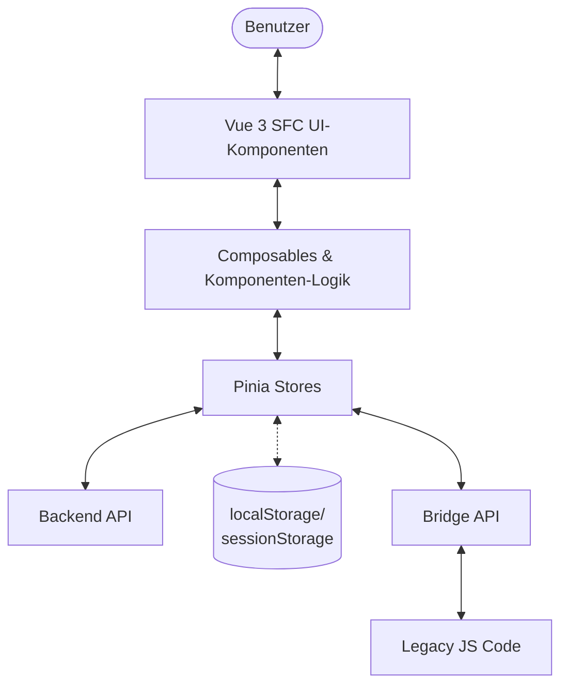
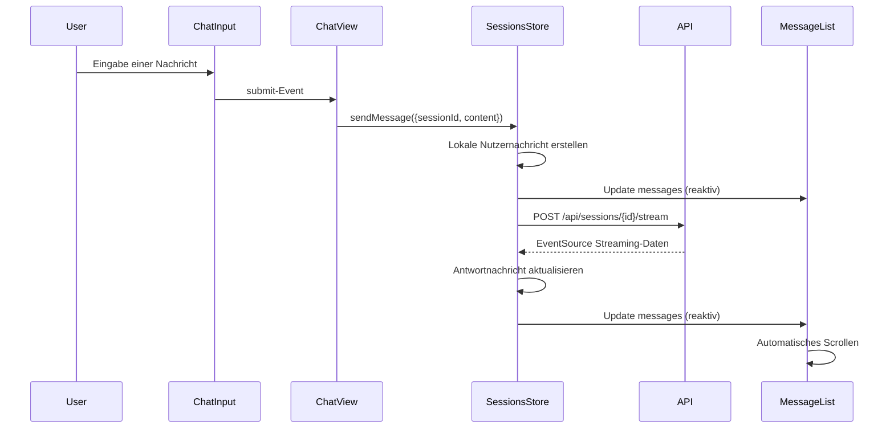
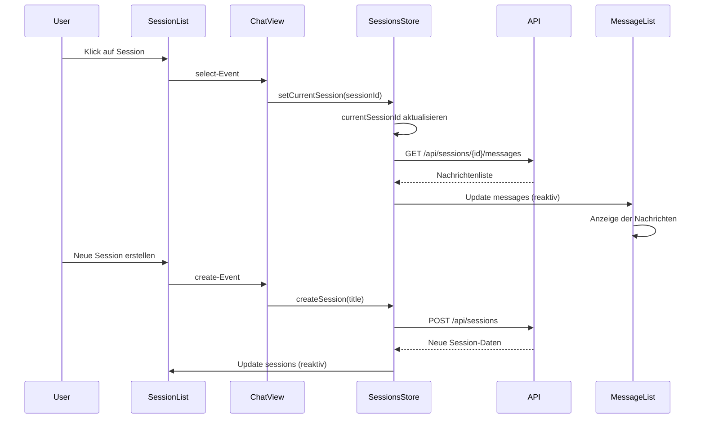

# Chat-System und Session-Management

**Version:** 1.0.0  
**Letzte Aktualisierung:** 15.05.2025  
**Autor:** nscale DMS Assist Team

## Inhaltsverzeichnis

1. [Überblick](#überblick)
2. [Architektur](#architektur)
3. [Komponenten-Hierarchie](#komponenten-hierarchie)
4. [Hauptkomponenten](#hauptkomponenten)
   - [Session-Management](#session-management)
   - [Chat-Interface](#chat-interface)
5. [Datenfluss und State Management](#datenfluss-und-state-management)
6. [Implementierungsdetails](#implementierungsdetails)
   - [Performance-Optimierungen](#performance-optimierungen)
   - [Formatierung und Rendering](#formatierung-und-rendering)
   - [Tastaturnavigation und Barrierefreiheit](#tastaturnavigation-und-barrierefreiheit)
7. [Bridge für Legacy-Integration](#bridge-für-legacy-integration)
8. [Feature-Toggle-Integration](#feature-toggle-integration)
9. [Migrationsleitfaden](#migrationsleitfaden)
10. [Testen](#testen)
11. [Bekannte Einschränkungen](#bekannte-einschränkungen)
12. [Fehlerbehebung](#fehlerbehebung)

## Überblick

Das Chat-System mit Session-Management des nscale DMS Assistenten bietet eine umfassende Lösung für die Verwaltung von Chat-Konversationen. Es wurde mit Vue 3 Single File Components (SFC) unter Verwendung der Composition API und TypeScript implementiert. Das System ermöglicht Benutzern, mehrere Unterhaltungen zu führen, diese zu organisieren, zu durchsuchen und effizient zu verwalten.

Die Kernfunktionen umfassen:

- **Session-Management**: Übersichtliche Verwaltung mehrerer Chat-Sessions mit Kategorisierung, Tagging und Sortierung
- **Chat-Interface**: Hochperformante Darstellung von Nachrichtenverläufen mit Markdown-Unterstützung und Quellenverwaltung
- **Datenpersistenz**: Effiziente Speicherung und Wiederherstellung von Chat-Sessions und -Nachrichten
- **Legacy-Integration**: Nahtlose Kommunikation mit bestehendem JavaScript-Code durch Bridge-Mechanismen
- **Optimierte Performance**: Virtualisiertes Rendering, selektive Datenspeicherung und effiziente DOM-Updates

Das System wurde mit besonderem Fokus auf Benutzerfreundlichkeit, Performance und Barrierefreiheit entwickelt und bietet eine konsistente Benutzererfahrung auf verschiedenen Geräten.

## Architektur

Das Chat-System mit Session-Management basiert auf einer dreischichtigen Architektur:

1. **Datenschicht**: Pinia Stores für die zentrale Zustandsverwaltung, Datenpersistenz und API-Kommunikation
2. **Logikschicht**: Vue 3 Composables und Komponenten-Logik für die Geschäftslogik und Benutzerinteraktionen
3. **Darstellungsschicht**: Vue 3 Single File Components für die Benutzeroberfläche

Diese Architektur ermöglicht:
- Klare Trennung von Zuständigkeiten
- Einfache Testbarkeit der einzelnen Komponenten
- Wiederverwendbarkeit von Logik durch Composables
- Optimierte Performanz durch selektives Re-Rendering



## Komponenten-Hierarchie

Die Komponenten sind in einer hierarchischen Struktur organisiert:

```
ChatView (Hauptansicht)
├── Sidebar
│   ├── SessionManager
│   │   ├── SessionList
│   │   │   └── SessionItem
│   │   └── SessionActions
├── ChatContainer
│   ├── MessageList
│   │   └── MessageItem
│   └── MessageInput/ChatInput
└── Quellen- und Info-Panels
```

Diese Struktur bietet:
- Modulare, wiederverwendbare Komponenten
- Klare Zuständigkeitsbereiche
- Einfache Navigation und Verständlichkeit des Codes
- Optimierte Rendering-Performance durch isolierte Updates

## Hauptkomponenten

### Session-Management

#### SessionList

Die `SessionList`-Komponente zeigt alle verfügbaren Chat-Sessions an und erlaubt umfangreiche Interaktionsmöglichkeiten:

- **Dynamische Sortierung** nach Erstellungsdatum, Aktualisierungsdatum oder alphabetisch
- **Volltextsuche** zum schnellen Finden von Sessions
- **Drag-and-Drop** zur Neuanordnung von Sessions
- **Kontextmenü** für erweiterte Aktionen
- **Optimiertes Rendering** für hohe Performance bei vielen Sessions
- **Responsive Design** für alle Bildschirmgrößen

**Props:**

| Name | Typ | Standardwert | Beschreibung |
|------|-----|--------------|--------------|
| `sessions` | `ChatSession[]` | `[]` | Array der anzuzeigenden Sessions |
| `activeSessionId` | `string \| null` | `null` | Die ID der aktiven Session |
| `isLoading` | `boolean` | `false` | Gibt an, ob Sessions geladen werden |
| `emptyMessage` | `string` | "Noch keine..." | Nachricht bei leerer Liste |
| `showCreateButton` | `boolean` | `true` | Zeigt Button zum Erstellen neuer Sessions |
| `enableDragAndDrop` | `boolean` | `true` | Aktiviert Drag-and-Drop |
| `enableSorting` | `boolean` | `true` | Erlaubt Benutzer, Sortierung zu ändern |
| `enableFiltering` | `boolean` | `true` | Aktiviert Filter-Funktionen |

**Events:**

| Name | Payload | Beschreibung |
|------|---------|--------------|
| `select` | `string` | Session wurde ausgewählt |
| `delete` | `string` | Session soll gelöscht werden |
| `rename` | `{ sessionId, newTitle }` | Session soll umbenannt werden |
| `pin` | `{ sessionId, pinned }` | Session angeheftet/abgeheftet |
| `create` | - | Neue Session erstellen |
| `reorder` | `ChatSession[]` | Reihenfolge der Sessions geändert |

#### SessionItem

Die `SessionItem`-Komponente stellt eine einzelne Session dar und bietet verschiedene Interaktionsmöglichkeiten:

- **Visuelle Hervorhebung** der aktiven und angehefteten Sessions
- **Zeigt Meta-Informationen** wie Erstellungs- oder Aktualisierungsdatum
- **Schnellzugriff auf Aktionen** wie Löschen, Umbenennen und Anheften
- **Tag- und Kategoriesystem** zur besseren Organisation
- **Vorschau der letzten Nachricht** für schnelle Inhaltserkennung
- **Multi-Select-Unterstützung** für Massenoperationen
- **Archivierungsfunktion** für nicht mehr aktive Sessions

**Props:**

| Name | Typ | Standardwert | Beschreibung |
|------|-----|--------------|--------------|
| `session` | `ChatSession` | - | Die anzuzeigende Session |
| `isActive` | `boolean` | `false` | Aktiver Status |
| `isPinned` | `boolean` | `false` | Angeheftet-Status |
| `isSelected` | `boolean` | `false` | Multi-select Status |
| `showDragHandle` | `boolean` | `true` | Zeigt Drag-Handle |
| `showMetadata` | `boolean` | `true` | Zeigt Zeitstempel etc. |
| `showTagButton` | `boolean` | `false` | Zeigt Tag-Funktionalität |
| `showPreview` | `boolean` | `false` | Zeigt Vorschau der letzten Nachricht |
| `preview` | `string` | `''` | Vorschautext (letzte Nachricht) |
| `tags` | `Tag[]` | `[]` | Tags für diese Session |
| `category` | `string` | `''` | Kategorie dieser Session |

**Events:**

| Name | Payload | Beschreibung |
|------|---------|--------------|
| `select` | `string` | Session ausgewählt |
| `pin` | `string, boolean` | Session angeheftet/abgeheftet |
| `rename` | `string` | Session umbenennen |
| `delete` | `string` | Session löschen |
| `tag` | `string` | Session taggen |
| `categorize` | `string` | Kategorie zuweisen |
| `archive` | `string, boolean` | Session archivieren/wiederherstellen |

#### SessionActions

Die `SessionActions`-Komponente stellt eine Sammlung von Aktionsschaltflächen für sessionbezogene Operationen bereit:

- **Flexible Konfiguration** der verfügbaren Aktionen
- **Gruppierung von Aktionen** in Hauptaktionen und erweiterte Aktionen
- **Unterstützung für Massenaktionen** bei Mehrfachauswahl
- **Verschiedene Anzeigemodi** (inline oder block)

**Props:**

| Name | Typ | Standardwert | Beschreibung |
|------|-----|--------------|--------------|
| `activeSessionId` | `string \| null` | `null` | Die aktive Session-ID |
| `selectedSessionIds` | `string[]` | `[]` | Ausgewählte Session-IDs (für Bulk-Aktionen) |
| `disabled` | `boolean` | `false` | Aktiviert/deaktiviert Aktionen |
| `showCreateButton` | `boolean` | `true` | Zeigt "Neue Session"-Button |
| `enabledFeatures` | `string[]` | `[...]` | Aktivierte Features |

**Events:**

| Name | Payload | Beschreibung |
|------|---------|--------------|
| `create` | - | Neue Session erstellen |
| `rename` | `string` | Session umbenennen |
| `delete` | `string` | Session löschen |
| `pin` | `string` | Session anheften/abheften |
| `bulk-delete` | `string[]` | Mehrere Sessions löschen |

### Chat-Interface

#### MessageList

Die `MessageList`-Komponente ist für das Anzeigen der Konversationshistorie verantwortlich. Sie bietet:

- **Virtuelles Rendering** für optimierte Performance bei langen Konversationen
- **Automatisches Scrollen** zum neuesten Inhalt mit Benutzerinteraktionserkennung
- **Lade- und Leerzustände** zur Verbesserung der Benutzererfahrung
- **Integrierte Übergangsanimationen** für ein reaktionsschnelles Gefühl
- **Streaming-Indikatoren** während der Assistent antwortet

**Props:**

| Name | Typ | Standardwert | Beschreibung |
|------|-----|--------------|--------------|
| `messages` | `ChatMessage[]` | - | Anzuzeigende Nachrichten |
| `isLoading` | `boolean` | `false` | Ladezustand |
| `isStreaming` | `boolean` | `false` | Streaming-Status |
| `maxVisibleMessages` | `number` | `50` | Max. angezeigte Nachrichten |
| `autoScrollThreshold` | `number` | `0.8` | Schwellwert für Auto-Scroll |
| `showMessageActions` | `boolean` | `true` | Zeigt Nachrichtenaktionen |

**Events:**

| Name | Payload | Beschreibung |
|------|---------|--------------|
| `feedback` | `{ messageId, type, feedback? }` | Feedback zu Nachricht |
| `view-sources` | `{ messageId }` | Quellen anzeigen |
| `retry` | `{ messageId }` | Nachricht wiederholen |
| `delete` | `{ messageId }` | Nachricht löschen |

#### MessageItem

Die `MessageItem`-Komponente ist für die Darstellung einer einzelnen Nachricht zuständig:

- **Markdown-Formatierung** mit Code-Blöcken, Tabellen, Listen etc.
- **Syntax-Highlighting** für Codebeispiele
- **Quellenreferenzen** mit klickbaren Links 
- **Feedback-Mechanismen** für Benutzerrückmeldungen
- **Kontextabhängige Aktionen** für verschiedene Nachrichtentypen

**Props:**

| Name | Typ | Standardwert | Beschreibung |
|------|-----|--------------|--------------|
| `message` | `ChatMessage` | - | Anzuzeigende Nachricht |
| `showActions` | `boolean` | `true` | Zeigt Aktionen (Feedback, Quellen) |
| `showReferences` | `boolean` | `false` | Zeigt Quellenreferenzen |
| `highlightCodeBlocks` | `boolean` | `true` | Syntax-Highlighting für Code |
| `formatLinks` | `boolean` | `true` | Formatiert Links und Referenzen |

**Events:**

| Name | Payload | Beschreibung |
|------|---------|--------------|
| `feedback` | `{ messageId, type, feedback? }` | Feedback geben |
| `view-sources` | `{ messageId }` | Quellen anzeigen |
| `retry` | `{ messageId }` | Nachricht wiederholen |
| `delete` | `{ messageId }` | Nachricht löschen |

#### MessageInput/ChatInput

Die `ChatInput`-Komponente bietet eine benutzerfreundliche Schnittstelle für die Texteingabe:

- **Auto-Größenanpassung** des Textbereichs basierend auf dem Inhalt
- **Unterstützung für Tastenkürzel** (Enter zum Senden, Shift+Enter für neue Zeile)
- **Zeichenbegrenzung** mit visueller Anzeige
- **Ladezustände** während das System auf eine Antwort wartet
- **Responsives Design** für verschiedene Bildschirmgrößen

**Props:**

| Name | Typ | Standardwert | Beschreibung |
|------|-----|--------------|--------------|
| `modelValue` | `string` | `''` | Eingabewert (v-model) |
| `placeholder` | `string` | "Geben Sie..." | Platzhaltertext |
| `disabled` | `boolean` | `false` | Deaktiviert Eingabe |
| `isLoading` | `boolean` | `false` | Ladezustand |
| `maxLength` | `number` | `4000` | Max. Zeichenanzahl |
| `minHeight` | `number` | `56` | Min. Höhe in Pixeln |
| `maxHeight` | `number` | `200` | Max. Höhe in Pixeln |
| `showCharacterCount` | `boolean` | `true` | Zeigt Zeichenanzahl |
| `allowFileUpload` | `boolean` | `false` | Aktiviert Datei-Upload |

**Events:**

| Name | Payload | Beschreibung |
|------|---------|--------------|
| `update:modelValue` | `string` | v-model Update |
| `submit` | `string` | Nachricht absenden |
| `file-upload` | `File[]` | Dateien hochgeladen |
| `focus` | - | Eingabefeld fokussiert |
| `blur` | - | Fokus verloren |

## Datenfluss und State Management

Der Datenfluss zwischen den Komponenten und dem Pinia Store folgt einem unidirektionalen Muster:

1. **Store → Komponenten**: Stores stellen Daten und Zustand bereit
2. **Komponenten → Store**: Benutzeraktionen werden an Store-Actions delegiert

### Sessions-Store

Der Sessions-Store ist die zentrale Zustandsquelle für Chat-Funktionalitäten:

```typescript
export const useSessionsStore = defineStore('sessions', () => {
  // State
  const sessions = ref<ChatSession[]>([]);
  const currentSessionId = ref<string | null>(null);
  const messages = ref<Record<string, ChatMessage[]>>({});
  const streaming = ref<StreamingStatus>({
    isActive: false,
    progress: 0,
    currentSessionId: null
  });
  
  // Getters
  const currentSession = computed(() => 
    sessions.value.find(s => s.id === currentSessionId.value) || null
  );
  
  const currentMessages = computed(() => 
    currentSessionId.value ? messages.value[currentSessionId.value] || [] : []
  );
  
  const sortedSessions = computed(() => {
    // Gepinnte Sessions immer oben
    const pinnedSessions = sessions.value.filter(s => s.isPinned);
    const unpinnedSessions = sessions.value.filter(s => !s.isPinned);
    
    // Sortiere beide Gruppen nach Aktualisierungsdatum
    const sortFn = (a, b) => new Date(b.updatedAt).getTime() - new Date(a.updatedAt).getTime();
    pinnedSessions.sort(sortFn);
    unpinnedSessions.sort(sortFn);
    
    // Kombiniere beide sortierten Arrays
    return [...pinnedSessions, ...unpinnedSessions];
  });
  
  // Actions
  async function createSession(title?: string) {
    // Implementation...
  }
  
  async function setCurrentSession(sessionId: string) {
    // Implementation...
  }
  
  async function sendMessage(params: { sessionId: string, content: string }) {
    // Implementation...
  }
  
  // Weitere Actions...
  
  return {
    // State
    sessions,
    currentSessionId,
    messages,
    streaming,
    
    // Getters
    currentSession,
    currentMessages,
    sortedSessions,
    
    // Actions
    createSession,
    setCurrentSession,
    sendMessage,
    // Weitere Actions...
  };
});
```

Der Store bietet folgende Hauptfunktionalitäten:

- **Verwaltung aller Sessions** (Laden, Erstellen, Aktualisieren, Löschen)
- **Tracking der aktiven Session**
- **Sortierung und Filterung** von Sessions
- **Persistierung** der Sessions im LocalStorage
- **Migration** von Legacy-Daten

### Sequenzdiagramm: Nachrichtenfluss



### Sequenzdiagramm: Session-Verwaltung



## Implementierungsdetails

### Performance-Optimierungen

Das Chat-System mit Session-Management verwendet mehrere Strategien zur Optimierung der Performance:

#### 1. Virtualisiertes Rendering

Die `MessageList`-Komponente verwendet virtualisiertes Rendering für optimale Performance bei langen Nachrichtenlisten:

```typescript
// Beispiel für virtualisiertes Rendering
const visibleItems = computed(() => {
  if (!containerRef.value) return [];
  
  const { scrollTop, clientHeight } = containerRef.value;
  const startIndex = Math.max(0, Math.floor(scrollTop / averageItemHeight.value) - overscan);
  const endIndex = Math.min(
    items.value.length,
    Math.ceil((scrollTop + clientHeight) / averageItemHeight.value) + overscan
  );
  
  return items.value.slice(startIndex, endIndex);
});
```

#### 2. Effiziente DOM-Updates

Die Komponenten nutzen Vue 3's reaktives System für effiziente DOM-Updates:

```typescript
// Optimierte Computed Properties für selektives Re-Rendering
const filteredSessions = computed(() => {
  if (!searchQuery.value) return props.sessions;
  
  const query = searchQuery.value.toLowerCase().trim();
  return props.sessions.filter(session => 
    session.title.toLowerCase().includes(query)
  );
});

// Memoization für teure Berechnungen
const formattedContent = computed(() => {
  if (!props.message.content) return '';
  
  // Cache-Schlüssel für Memoization
  const cacheKey = `${props.message.id}-${props.message.content.length}`;
  
  if (contentCache.has(cacheKey)) {
    return contentCache.get(cacheKey);
  }
  
  // Teure Formatierungsoperationen
  const formatted = formatMarkdown(props.message.content);
  contentCache.set(cacheKey, formatted);
  
  return formatted;
});
```

#### 3. Daten-Abonnement-Optimierung

Selektives Abonnieren von Store-Zuständen, um unnötige Re-Renderings zu vermeiden:

```typescript
// Ineffizient - ganzen Store binden
const sessionsStore = useSessionsStore();

// Effizient - nur benötigte Props
const { sessions, currentSessionId } = storeToRefs(useSessionsStore());
```

#### 4. Ereignis-Drosselung

Für häufige Ereignisse wie Scrolling wird Drosselung (Throttling) angewendet:

```typescript
// Scroll-Handler mit Drosselung
const handleScroll = throttle(function() {
  if (!scrollContainer.value) return;
  
  const { scrollTop, scrollHeight, clientHeight } = scrollContainer.value;
  const scrolledPosition = scrollTop + clientHeight;
  const threshold = scrollHeight * props.autoScrollThreshold;
  
  // Aktualisiert den Zustand, ob der Benutzer nahe am Ende der Liste ist
  isNearBottom.value = scrolledPosition >= threshold;
  
  // Scroll-Event emittieren
  emit('scroll', { scrollTop, scrollHeight, clientHeight });
}, 100); // Nur alle 100ms ausführen
```

### Formatierung und Rendering

#### Markdown und Syntax-Highlighting

Die `MessageItem`-Komponente nutzt Markdown-Parsing und Syntax-Highlighting für formatierte Inhalte:

```typescript
// Formatiert den Nachrichteninhalt mit Markdown und Syntax-Highlighting
const formattedContent = computed(() => {
  let content = props.message.content || '';
  
  // Markdown zu HTML konvertieren
  content = marked(content, { breaks: true });
  
  // Syntax-Highlighting für Code-Blöcke
  if (props.highlightCodeBlocks) {
    content = applyCodeHighlighting(content);
  }
  
  // Quellenreferenzen in klickbare Spans umwandeln
  if (props.formatLinks) {
    content = linkifySourceReferences(content);
  }
  
  // HTML bereinigen, um XSS zu verhindern
  content = DOMPurify.sanitize(content);
  
  return content;
});

// Highlighting für Code-Blöcke
function applyCodeHighlighting(html: string): string {
  const tempDiv = document.createElement('div');
  tempDiv.innerHTML = html;
  
  const codeBlocks = tempDiv.querySelectorAll('pre code');
  codeBlocks.forEach((block: HTMLElement) => {
    try {
      hljs.highlightElement(block);
    } catch (error) {
      console.error('Error highlighting code block:', error);
    }
  });
  
  return tempDiv.innerHTML;
}
```

#### Streaming-Unterstützung

Die Komponenten unterstützen das Streaming von Antworten in Echtzeit:

```typescript
// Im ChatContainer.vue
const { startStreaming, cancelStreaming, isStreaming } = useStreamingService();

async function handleSendMessage(content: string): Promise<void> {
  if (!content.trim() || !sessionId.value) return;
  
  try {
    const userMessage = await sendUserMessage(sessionId.value, content);
    
    // Start streaming für die Antwort
    await startStreaming({
      sessionId: sessionId.value,
      messageId: userMessage.id,
      onToken: (token) => {
        // Token der Nachricht hinzufügen
        appendToLastMessage(token);
      },
      onComplete: () => {
        // Streaming abgeschlossen
        setMessageStatus('complete');
      },
      onError: (error) => {
        // Fehlerbehandlung
        setMessageStatus('error', error.message);
      }
    });
  } catch (error) {
    handleError(error as Error);
  }
}

// Auto-Scroll während des Streamings
watch(() => props.isStreaming, (newValue) => {
  if (newValue) {
    scrollToBottom();
  }
});
```

### Tastaturnavigation und Barrierefreiheit

Die Komponenten unterstützen umfassende Tastaturnavigation und Barrierefreiheit:

```typescript
// Tastaturnavigation in SessionItem
<div 
  class="n-session-item" 
  tabindex="0"
  @click="$emit('select', session.id)"
  @keydown.enter="$emit('select', session.id)"
  @keydown.space.prevent="$emit('select', session.id)"
  role="option"
  :aria-selected="isActive"
>
  <!-- Inhalt -->
</div>

// Keyboard-Handler für das Kontextmenü
function handleKeyDown(event: KeyboardEvent) {
  if (event.key === 'Escape') {
    closeContextMenu();
  } else if (event.key === 'ArrowDown') {
    focusNextMenuItem();
  } else if (event.key === 'ArrowUp') {
    focusPrevMenuItem();
  } else if (event.key === 'Enter' || event.key === ' ') {
    activateCurrentMenuItem();
  }
}
```

Die Chat-Komponenten setzen umfangreiche ARIA-Attribute ein:

```html
<!-- Barrierefreiheit in MessageList -->
<div 
  ref="messageContainer"
  class="n-message-list"
  aria-live="polite"
  aria-relevant="additions text"
  aria-label="Nachrichtenverlauf"
>
  <!-- Nachrichten-Inhalt -->
  
  <!-- Streaming-Indikator -->
  <div 
    v-if="isStreaming" 
    class="n-message-list__streaming"
    aria-live="assertive"
  >
    <span class="sr-only">Assistent antwortet...</span>
    <div class="n-message-list__typing-dots">
      <span></span><span></span><span></span>
    </div>
  </div>
</div>
```

Anpassung an Benutzereinstellungen für reduzierte Bewegung:

```css
/* Einstellungen für Benutzer, die reduzierte Bewegung bevorzugen */
@media (prefers-reduced-motion: reduce) {
  .n-message-list {
    scroll-behavior: auto;
  }
  
  .message-enter-active,
  .message-leave-active,
  .n-message-list__typing-dots span {
    transition: none;
    animation: none;
  }
}
```

## Bridge für Legacy-Integration

Um eine nahtlose Integration mit dem bestehenden JavaScript-Code zu ermöglichen, wurde eine Bridge implementiert:

```typescript
// Initialisierung der Bridge
import { initSessionBridge } from '@/bridge/sessionBridge';
import { initChatBridge } from '@/bridge/chatBridge';

export function setupBridge() {
  // Session-Bridge initialisieren
  const sessionBridge = initSessionBridge();
  
  // Chat-Bridge initialisieren
  const chatBridge = initChatBridge();
  
  // Event-Listener für Bridge-Ready-Event
  window.dispatchEvent(new CustomEvent('nscale:bridge:ready'));
  
  return {
    session: sessionBridge,
    chat: chatBridge
  };
}
```

Diese Bridge bietet folgende Funktionen:

- **Bidirektionale Kommunikation** zwischen Vue 3 SFCs und Legacy-JavaScript
- **Event-System** für Session- und Chat-Ereignisse
- **Datenkonvertierung** zwischen Store-Format und Legacy-Format
- **Seamless Fallback** bei deaktivierten Features

Beispiel für Legacy-Code, der die Bridge nutzt:

```javascript
// Im Legacy-Code
window.addEventListener('nscale:bridge:ready', () => {
  const nscaleSessionManager = window.nscaleSessionManager;
  
  if (nscaleSessionManager) {
    // Sessions laden
    nscaleSessionManager.loadSessions().then(sessions => {
      console.log('Sessions geladen:', sessions);
    });
    
    // Auf Session-Auswahl reagieren
    nscaleSessionManager.on('selected', event => {
      console.log('Session ausgewählt:', event.sessionId);
    });
  }
});
```

Verwendung der Bridge in Vue-Komponenten:

```typescript
// Im ChatView
import { useBridge } from '@/bridge/enhanced/bridgeCore';

// Setup
const bridge = useBridge();

// Event-Kommunikation mit Legacy-Code
bridge.on('legacy:messageSubmitted', (data) => {
  // Behandlung von Legacy-Events
});

// Zustandssynchronisation
watch(() => sessionsStore.currentSessionId, (sessionId) => {
  bridge.setState('sessions.currentId', sessionId);
});
```

## Feature-Toggle-Integration

Die Chat- und Session-Komponenten nutzen das Feature-Toggle-System, um die schrittweise Migration zu ermöglichen:

```typescript
// In der ChatView-Komponente
import { useFeatureTogglesStore } from '@/stores/featureToggles';

const featureToggles = useFeatureTogglesStore();

// Bedingte Renderlogik
const showNewMessageList = computed(() => 
  featureToggles.isEnabled('useSfcMessageList')
);

// Feature-Wrapper für konditionales Rendering
<FeatureWrapper
  feature="enhancedChatComponents"
  :fallback="LegacyChatView"
>
  <EnhancedChatView />
</FeatureWrapper>
```

Die Feature-Toggles ermöglichen:
- Granulare Kontrolle über die Migration
- A/B-Testing zwischen alten und neuen Komponenten
- Schnelles Zurückschalten bei Problemen
- Schrittweise Einführung neuer Features

```typescript
// In featureToggles.ts
export const DEFAULT_FEATURE_TOGGLES = {
  // Chat-Komponenten
  useSfcMessageList: false,      // Neue MessageList-Komponente
  useSfcMessageInput: false,     // Neue MessageInput-Komponente
  useSfcSessionManager: false,   // Neue SessionManager-Komponente
  
  // Abhängigkeiten
  useVirtualizedList: false,     // Virtualisiertes Rendering für Nachrichten
  useMarkdownPreview: false,     // Markdown-Vorschau in der Eingabe
  useEnhancedScrolling: false,   // Verbessertes Scrollverhalten
  
  // Feature-Sets
  useCompleteSfcChat: false      // Aktiviert alle SFC-Chat-Komponenten
};
```

## Migrationsleitfaden

Für die Migration von der Legacy-Implementierung zur neuen Vue 3 SFC-Implementierung sollten folgende Schritte befolgt werden:

### 1. Feature-Toggle aktivieren

```typescript
import { useFeatureTogglesStore } from '@/stores/featureToggles';

const featureTogglesStore = useFeatureTogglesStore();
featureTogglesStore.enableFeature('useSfcSessionManagement');
featureTogglesStore.enableFeature('useSfcMessageList');
featureTogglesStore.enableFeature('useSfcMessageInput');
```

### 2. Bridge initialisieren

```typescript
import { setupBridge } from '@/bridge/setup';

// Im App-Setup
const bridge = setupBridge();
```

### 3. Store integrieren

```typescript
import { useSessionsStore } from '@/stores/sessions';

const sessionsStore = useSessionsStore();
const messages = computed(() => sessionsStore.currentMessages);
const isLoading = computed(() => sessionsStore.isLoading);
const isStreaming = computed(() => sessionsStore.isStreaming);
```

### 4. Komponenten einbinden

```vue
<template>
  <div class="chat-view">
    <div class="sidebar">
      <SessionList
        :sessions="sessions"
        :activeSessionId="currentSessionId"
        :isLoading="isLoading"
        @select="handleSessionSelect"
        @delete="handleSessionDelete"
        @rename="handleSessionRename"
        @pin="handleSessionPin"
        @create="handleCreateSession"
      />
      
      <SessionActions
        :activeSessionId="currentSessionId"
        @create="handleCreateSession"
        @rename="handleRenameSession"
        @delete="handleDeleteSession"
        @pin="handlePinSession"
      />
    </div>
    
    <div class="main-content">
      <MessageList
        :messages="messages"
        :isLoading="isLoading"
        :isStreaming="isStreaming"
        @feedback="handleFeedback"
        @view-sources="handleViewSources"
      />
      
      <MessageInput
        v-model="inputText"
        :isLoading="isStreaming"
        @submit="sendMessage"
      />
    </div>
  </div>
</template>

<script setup>
// Imports
import { ref, computed } from 'vue';
import { SessionList, SessionActions } from '@/components/session';
import { MessageList, MessageInput } from '@/components/chat';
import { useSessionsStore } from '@/stores/sessions';

// Store
const sessionsStore = useSessionsStore();
const sessions = computed(() => sessionsStore.sortedSessions);
const currentSessionId = computed(() => sessionsStore.currentSessionId);
const messages = computed(() => sessionsStore.currentMessages);
const isLoading = computed(() => sessionsStore.isLoading);
const isStreaming = computed(() => sessionsStore.isStreaming);

// Lokaler Status
const inputText = ref('');

// Event-Handler
function handleSessionSelect(sessionId) {
  sessionsStore.setCurrentSession(sessionId);
}

function handleCreateSession() {
  sessionsStore.createSession();
}

function sendMessage(content) {
  if (!content.trim() || !currentSessionId.value) return;
  
  sessionsStore.sendMessage({
    sessionId: currentSessionId.value,
    content
  });
  
  inputText.value = '';
}

// Weitere Handler...
</script>
```

## Testen

Die Komponenten können mit verschiedenen Testansätzen überprüft werden:

### Unit-Tests

```typescript
// MessageList.spec.ts
import { mount } from '@vue/test-utils';
import { createPinia, setActivePinia } from 'pinia';
import { nextTick } from 'vue';
import MessageList from '@/components/chat/MessageList.vue';
import MessageItem from '@/components/chat/MessageItem.vue';

describe('MessageList', () => {
  beforeEach(() => {
    setActivePinia(createPinia());
  });

  it('renders messages correctly', async () => {
    const messages = [
      { id: '1', content: 'Hello', role: 'user', timestamp: new Date().toISOString() },
      { id: '2', content: 'Hi there', role: 'assistant', timestamp: new Date().toISOString() }
    ];
    
    const wrapper = mount(MessageList, {
      props: {
        messages,
        isLoading: false,
        isStreaming: false
      },
      global: {
        stubs: {
          MessageItem: true
        }
      }
    });
    
    await nextTick();
    
    expect(wrapper.findAllComponents(MessageItem).length).toBe(2);
  });

  it('shows loading state', async () => {
    const wrapper = mount(MessageList, {
      props: {
        messages: [],
        isLoading: true,
        isStreaming: false
      }
    });
    
    expect(wrapper.find('.n-message-list__loading').exists()).toBe(true);
  });
  
  it('emits events correctly', async () => {
    const wrapper = mount(MessageList, {
      props: {
        messages: [
          { id: '1', content: 'Hello', role: 'user', timestamp: new Date().toISOString() }
        ],
        isLoading: false,
        isStreaming: false
      }
    });
    
    wrapper.vm.handleFeedback({ messageId: '1', type: 'positive' });
    expect(wrapper.emitted('feedback')).toBeTruthy();
    expect(wrapper.emitted('feedback')[0]).toEqual([{ messageId: '1', type: 'positive' }]);
  });
});
```

### Integration Tests

```typescript
// Chat.integration.spec.ts
import { mount } from '@vue/test-utils';
import { createPinia, setActivePinia } from 'pinia';
import { nextTick } from 'vue';
import ChatView from '@/views/ChatView.vue';
import { useSessionsStore } from '@/stores/sessions';

// Mock API-Calls
vi.mock('@/services/api/SessionService', () => ({
  default: {
    getSessions: vi.fn().mockResolvedValue([
      { id: '1', title: 'Test Session', createdAt: new Date().toISOString(), updatedAt: new Date().toISOString() }
    ]),
    getMessages: vi.fn().mockResolvedValue([
      { id: '1', sessionId: '1', content: 'Hello', role: 'user', timestamp: new Date().toISOString() },
      { id: '2', sessionId: '1', content: 'Hi there', role: 'assistant', timestamp: new Date().toISOString() }
    ]),
    sendMessage: vi.fn().mockImplementation((sessionId, content) => {
      return Promise.resolve({
        id: '3',
        sessionId,
        content,
        role: 'user',
        timestamp: new Date().toISOString()
      });
    })
  }
}));

describe('ChatView Integration', () => {
  beforeEach(() => {
    setActivePinia(createPinia());
  });

  it('loads sessions and displays them', async () => {
    const wrapper = mount(ChatView);
    const sessionsStore = useSessionsStore();
    
    // Store initialisieren
    await sessionsStore.loadSessions();
    await nextTick();
    
    // Prüfen, ob Sessions angezeigt werden
    expect(wrapper.find('.n-session-list').exists()).toBe(true);
    expect(wrapper.find('.n-session-item').exists()).toBe(true);
    
    // Session auswählen
    await wrapper.find('.n-session-item').trigger('click');
    await nextTick();
    
    // Prüfen, ob Nachrichten geladen wurden
    expect(wrapper.findAll('.n-message-item').length).toBe(2);
  });

  it('sends a message and receives a response', async () => {
    const wrapper = mount(ChatView);
    const sessionsStore = useSessionsStore();
    
    // Store initialisieren und Session auswählen
    await sessionsStore.loadSessions();
    await sessionsStore.setCurrentSession('1');
    await nextTick();
    
    // Nachricht eingeben und senden
    const input = wrapper.find('.n-chat-input__textarea');
    await input.setValue('Test message');
    await input.trigger('keydown.enter');
    
    // Prüfen, ob Nachricht gesendet wurde
    expect(sessionsStore.sendMessage).toHaveBeenCalledWith({
      sessionId: '1',
      content: 'Test message'
    });
  });
});
```

## Bekannte Einschränkungen

1. **Drag-and-Drop auf Touch-Geräten**: Die Drag-and-Drop-Funktionalität auf mobilen Geräten mit Touchscreens kann unter bestimmten Umständen problematisch sein.

2. **Keyboard-Navigation in verschachtelten Menüs**: Die Keyboard-Navigation in verschachtelten Kontextmenüs kann in einigen Browsern nicht vollständig unterstützt werden.

3. **Session-Neuordnung und Persistenz**: Die neu geordnete Session-Reihenfolge wird derzeit nicht dauerhaft in der API gespeichert.

4. **Performance bei sehr vielen Sessions/Nachrichten**: Bei einer sehr großen Anzahl von Sessions (>100) oder Nachrichten (>500) kann es zu Performanceproblemen kommen.

5. **Komplexe Markdown-Inhalte**: Sehr komplexe Markdown-Formatierungen könnten zu Leistungsproblemen führen.

6. **Browser-Unterstützung**: Die volle Funktionalität ist nur in modernen Browsern verfügbar (IE11 wird nicht unterstützt).

## Fehlerbehebung

### UI-Probleme

1. **Nachrichten werden nicht angezeigt**:
   - Prüfen Sie, ob der Store korrekt initialisiert ist
   - Überprüfen Sie, ob eine aktive Session ausgewählt ist
   - Stellen Sie sicher, dass die API-Verbindung funktioniert

2. **Auto-Scroll funktioniert nicht**:
   - Prüfen Sie, ob der `autoScrollThreshold` korrekt gesetzt ist
   - Stellen Sie sicher, dass keine CSS-Überschreibungen die Scroll-Höhe beeinflussen
   - Prüfen Sie auf Fehler in den Browser-DevTools

3. **Drag-and-Drop funktioniert nicht**:
   - Überprüfen Sie, ob `enableDragAndDrop` aktiviert ist
   - Stellen Sie sicher, dass die draggable-Bibliothek korrekt importiert ist
   - Prüfen Sie, ob die Drag-Handles korrekt gerendert werden

### Bridge-Probleme

1. **Legacy-Code kann nicht auf Store-Funktionen zugreifen**:
   - Prüfen Sie, ob die Bridge vor dem Legacy-Code initialisiert wird
   - Stellen Sie sicher, dass die Feature-Toggles korrekt gesetzt sind
   - Fügen Sie Event-Listener für das 'nscale:bridge:ready'-Event hinzu

2. **Store-Updates werden nicht an Legacy-Code weitergegeben**:
   - Überprüfen Sie die Watch-Funktionen in der Bridge
   - Stellen Sie sicher, dass die Event-Namen korrekt sind
   - Prüfen Sie, ob der Event-Bus korrekt initialisiert ist

### Performance-Probleme

1. **Langsames Rendering bei vielen Nachrichten**:
   - Reduzieren Sie den Wert von `maxVisibleMessages`
   - Aktivieren Sie das virtualisierte Rendering mit `useVirtualizedList`
   - Überprüfen Sie auf teure Berechnungen in Computed Properties

2. **Hohe Speichernutzung**:
   - Implementieren Sie die selektive Persistenz für große Datensätze
   - Verwenden Sie die Message-Auslagerungsstrategie für ältere Nachrichten
   - Optimieren Sie die Speicherung von Markdown-Rendering-Ergebnissen

---

**Verwandte Dokumente:**
- [CSS_DESIGN_SYSTEM.md](/opt/nscale-assist/app/docs/06_SYSTEME/12_CSS_DESIGN_SYSTEM.md)
- [KOMPONENTEN_STRUKTUR.md](/opt/nscale-assist/app/docs/01_ARCHITEKTUR/03_KOMPONENTEN_STRUKTUR.md)
- [STATE_MANAGEMENT.md](/opt/nscale-assist/app/docs/05_REFERENZEN/01_STATE_MANAGEMENT.md)
- [TYPESCRIPT_TYPEN.md](/opt/nscale-assist/app/docs/05_REFERENZEN/02_TYPESCRIPT_TYPEN.md)
- [BASIS_UI_KOMPONENTEN.md](/opt/nscale-assist/app/docs/06_SYSTEME/10_BASIS_UI_KOMPONENTEN.md)
- [BRIDGE_IMPLEMENTIERUNG.md](/opt/nscale-assist/app/docs/03_MIGRATION/08_BRIDGE_IMPLEMENTIERUNG.md)