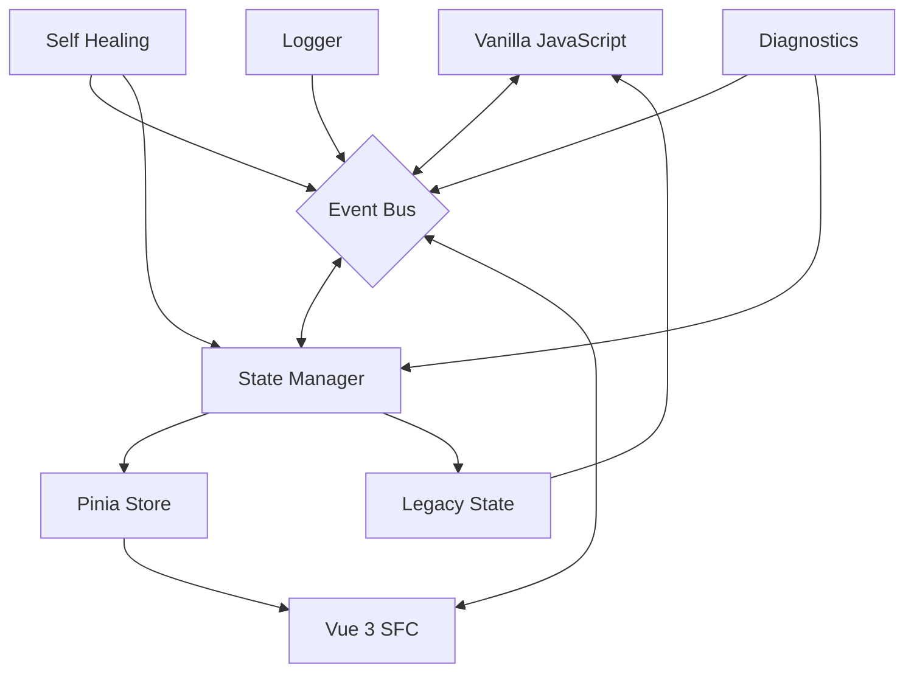

# Bridge-Architektur

> **Letzte Aktualisierung:** 09.05.2025 | **Version:** 2.0.0 | **Status:** Aktiv

## Übersicht

Die Bridge-Architektur ist ein zentraler Bestandteil der Vue 3 SFC-Migration und ermöglicht die nahtlose Integration zwischen dem neuen Vue 3-Code und der bestehenden Vanilla-JavaScript-Implementierung. Dieses Dokument beschreibt die Architektur, Implementierungsdetails und Optimierungsmechanismen des Bridge-Systems.

## 1. Architekturübersicht

Das Bridge-System folgt einem bidirektionalen Kommunikationsmodell, das sowohl Zustandssynchronisation als auch Event-Handling zwischen der Vanilla-JS- und Vue 3-Welt ermöglicht.

### Hauptkomponenten

```
src/bridge/
├── index.ts                 # Hauptexport-Datei
├── setup.ts                 # Konfiguration und Setup-Funktionen
├── sessionBridge.ts         # Session-spezifische Integration
├── storeBridge.ts           # Pinia-Store Integration
├── enhanced/
│   ├── index.ts             # API-Export für erweiterte Funktionen
│   ├── bridgeCore.ts        # Kern-Funktionalität
│   ├── eventBus.ts          # Event-Handling-System
│   ├── stateManager.ts      # Zustandsverwaltung
│   ├── statusManager.ts     # Status-Tracking
│   ├── selfHealing.ts       # Selbstheilungs-Mechanismen
│   ├── logger.ts            # Erweitertes Logging
│   ├── types.ts             # TypeScript-Typdefinitionen
│   ├── chatBridge.ts        # Chat-spezifische Integration
│   └── optimized/           # Leistungsoptimierte Implementierungen
```

### Kommunikationsfluss



## 2. Kern-Mechanismen

### 2.1 Zustandssynchronisation

Die Zustandssynchronisation erfolgt über zwei Hauptmechanismen:

1. **Reaktive Synchronisation**: Änderungen in Pinia-Stores werden automatisch mit dem Legacy-Zustand synchronisiert.
2. **Event-basierte Aktualisierung**: Änderungen im Legacy-Code lösen Events aus, die den Vue 3-Zustand aktualisieren.

```typescript
// Beispiel für Zustandssynchronisation in storeBridge.ts
export function synchronizeStoreWithLegacy(
  store: StoreDefinition,
  legacyPath: string,
  options: SyncOptions = {}
) {
  // Initiale Synchronisation
  const initialState = getNested(window.nscaleApi, legacyPath) || {};
  store.$patch(initialState);
  
  // Reaktive Synchronisation (Vue -> Legacy)
  watch(
    () => store.$state,
    (newState) => {
      setNested(window.nscaleApi, legacyPath, newState);
      
      // Event auslösen für Legacy-Listeners
      window.dispatchEvent(new CustomEvent('nscale-state-change', {
        detail: { path: legacyPath, state: newState }
      }));
    },
    { deep: true }
  );
  
  // Legacy -> Vue Synchronisation über Events
  window.addEventListener('nscale-legacy-change', (event) => {
    const { path, state } = event.detail;
    if (path === legacyPath) {
      store.$patch(state);
    }
  });
}
```

### 2.2 Event-Handling

Das Event-Bus-System ermöglicht eine zentralisierte Kommunikation zwischen allen Teilen der Anwendung:

1. **Kategorisierte Events**: Events werden nach Typ und Priorität kategorisiert.
2. **Event-Batching**: Hochfrequente Events werden für bessere Performance gebündelt.
3. **Priorisierung**: Kritische Events werden vorrangig verarbeitet.

```typescript
// Beispiel für Event-Handling in eventBus.ts
export class EnhancedEventBus {
  private handlers: Record<string, EventHandler[]> = {};
  private batchedEvents: Record<string, Event[]> = {};
  private batchingEnabled = true;
  private batchInterval = 50; // ms
  
  constructor(options: EventBusOptions = {}) {
    this.batchingEnabled = options.batchingEnabled ?? true;
    this.batchInterval = options.batchInterval ?? 50;
    
    if (this.batchingEnabled) {
      this.startBatchProcessing();
    }
  }
  
  on(eventType: string, handler: EventHandler): Unsubscribe {
    if (!this.handlers[eventType]) {
      this.handlers[eventType] = [];
    }
    
    this.handlers[eventType].push(handler);
    
    return () => this.off(eventType, handler);
  }
  
  emit(eventType: string, payload?: any) {
    const event = { type: eventType, payload, timestamp: Date.now() };
    
    if (this.batchingEnabled && !this.isHighPriorityEvent(eventType)) {
      this.addToBatch(event);
    } else {
      this.processEvent(event);
    }
  }
  
  // Weitere Implementierungsdetails...
}
```

### 2.3 Self-Healing-Mechanismen

Das System bietet robuste Selbstheilungsmechanismen, um mit Fehlern und inkonsistenten Zuständen umzugehen:

1. **Zustandswiederherstellung**: Automatisches Wiederherstellen eines konsistenten Zustands bei Fehlern.
2. **Verbindungswiederherstellung**: Automatische Wiederverbindung nach Netzwerkunterbrechungen.
3. **Fehlerprotokollierung**: Detaillierte Protokollierung zur einfachen Diagnose.

```typescript
// Beispiel für Self-Healing in selfHealing.ts
export class SelfHealingManager {
  private stateSnapshots: Record<string, any> = {};
  private healthChecks: HealthCheck[] = [];
  private recoveryStrategies: Record<string, RecoveryStrategy> = {};
  
  constructor(options: SelfHealingOptions = {}) {
    this.initializeDefaultHealthChecks();
    this.initializeDefaultRecoveryStrategies();
    
    // Regelmäßige Gesundheitsprüfungen
    setInterval(() => this.runHealthChecks(), options.healthCheckInterval || 30000);
  }
  
  takeStateSnapshot(key: string, state: any) {
    this.stateSnapshots[key] = deepClone(state);
  }
  
  restoreState(key: string): any {
    return this.stateSnapshots[key] || null;
  }
  
  runHealthChecks() {
    for (const check of this.healthChecks) {
      try {
        const result = check.run();
        if (!result.healthy) {
          this.handleUnhealthyState(check.id, result);
        }
      } catch (error) {
        logger.error(`Health check ${check.id} failed`, error);
      }
    }
  }
  
  // Weitere Implementierungsdetails...
}
```

## 3. Optimierungsmechanismen

Die optimierte Bridge-Implementierung bietet mehrere fortgeschrittene Mechanismen für verbesserte Leistung und Zuverlässigkeit.

### 3.1 Selektive Zustandssynchronisation

Statt den gesamten Zustand zu synchronisieren, ermöglicht der `selectiveStateManager` eine pfadbasierte Filterung:

```typescript
// Beispiel für selektive Zustandssynchronisation
const selectiveManager = new SelectiveStateManager({
  // Pfade, die synchronisiert werden sollen
  includePaths: [
    'auth.user',
    'sessions.activeSessions',
    'ui.theme'
  ],
  
  // Pfade, die ausgeschlossen werden sollen
  excludePaths: [
    'sessions.streamingBuffer',
    'ui.temporaryState'
  ],
  
  // Sonderbehandlung für große Arrays
  largeArrayThreshold: 100,
  largeArrayStrategy: 'length'
});
```

### 3.2 Erweitertes Event-Batching

Das optimierte Event-Batching-System bietet kategoriebasierte Konfiguration:

```typescript
// Beispiel für erweitertes Event-Batching
const enhancedEventBus = new EnhancedEventBus({
  // Allgemeine Batching-Konfiguration
  batchingEnabled: true,
  batchInterval: 50,
  maxBatchSize: 20,
  
  // Kategorie-spezifische Konfigurationen
  eventCategories: {
    'ui:critical': { 
      priority: 10, 
      batchingEnabled: false 
    },
    'metrics': { 
      priority: 1, 
      batchingEnabled: true, 
      batchInterval: 1000 
    }
  }
});
```

### 3.3 Memory-Management

Der `memoryManager` verhindert Memory-Leaks und überwacht die Speichernutzung:

```typescript
// Beispiel für Memory-Management
const memoryManager = new MemoryManager({
  // Automatisches Tracking von Subscriptions
  trackSubscriptions: true,
  
  // Automatische Bereinigung nicht mehr benötigter Ressourcen
  autoCleanupThreshold: 15 * 60 * 1000, // 15 Minuten
  
  // Metrik-Erfassung für Speichernutzung
  collectMetrics: true,
  metricsInterval: 60 * 1000 // 1 Minute
});
```

### 3.4 Verbesserte Diagnostik

Das `diagnosticTools`-Modul bietet umfassende Diagnose- und Debuggingfunktionen:

```typescript
// Beispiel für Diagnostik-Tools
const diagnostics = new DiagnosticTools({
  // Dev-Panel-Konfiguration
  enableDevPanel: process.env.NODE_ENV !== 'production',
  panelPosition: 'bottom',
  
  // Telemetrie-Konfiguration
  collectTelemetry: true,
  telemetryLevel: 'verbose',
  
  // Automatische Leistungsüberwachung
  monitorPerformance: true,
  performanceThresholds: {
    eventProcessing: 50, // ms
    syncOperation: 100,  // ms
    stateUpdate: 200     // ms
  }
});
```

## 4. Bridge-Integration in der Anwendung

### 4.1 Installation und Konfiguration

Die Bridge wird während der App-Initialisierung eingerichtet:

```typescript
// Beispiel für Bridge-Installation in main.ts
import { createApp } from 'vue';
import { installBridge, configureBridge } from '@/bridge/setup';
import App from './App.vue';
import pinia from './stores';

// Bridge konfigurieren
configureBridge({
  ENABLED: true,
  AUTH_ENABLED: true,
  SESSIONS_ENABLED: true,
  UI_ENABLED: true,
  DEBUG: process.env.NODE_ENV !== 'production',
  DIAGNOSTICS_LEVEL: 'verbose',
  AUTO_RECOVERY: true
});

// Vue-App erstellen
const app = createApp(App);
app.use(pinia);

// Bridge in Vue-App installieren
installBridge(app);

app.mount('#app');
```

### 4.2 Integration mit Pinia-Stores

Die Pinia-Stores werden mit dem Bridge-System verbunden:

```typescript
// Beispiel für Integration mit Auth-Store
export const useAuthStore = defineStore('auth', () => {
  // State
  const user = ref<User | null>(null);
  const isAuthenticated = computed(() => !!user.value);
  const token = ref<string | null>(null);
  
  // Actions
  async function login(credentials: Credentials) {
    // Implementation...
  }
  
  // Store mit Legacy-Code synchronisieren
  onMounted(() => {
    if (useBridge.value) {
      synchronizeStoreWithLegacy(useAuthStore(), 'auth', {
        // Bridge-spezifische Optionen
        bidirectional: true,
        debounceMs: 100,
        deepWatch: true,
        customMergeStrategy: 'replace'
      });
    }
  });
  
  return {
    user,
    isAuthenticated,
    token,
    login,
    // Weitere Exports...
  };
}, {
  persist: {
    storage: localStorage,
    paths: ['token']
  }
});
```

### 4.3 Feature-Toggle-Integration

Die Bridge arbeitet nahtlos mit dem Feature-Toggle-System zusammen:

```typescript
// Beispiel für Feature-Toggle-Integration
import { useFeatureToggles } from '@/composables/useFeatureToggles';
import { useAuthStore } from '@/stores/auth';
import { useBridge } from '@/composables/useBridge';

export default defineComponent({
  setup() {
    const featureToggles = useFeatureToggles();
    const bridge = useBridge();
    const authStore = useAuthStore();
    
    // Prüfen, ob Bridge verwendet werden soll
    const shouldUseBridge = computed(() => 
      featureToggles.shouldUseFeature('useLegacyBridge') && 
      bridge.isAvailable
    );
    
    // Login-Funktion mit Bridge-Unterstützung
    const login = async (username, password) => {
      try {
        if (shouldUseBridge.value) {
          // Legacy-Login verwenden
          await bridge.auth.login(username, password);
        } else {
          // Direkt Store verwenden
          await authStore.login({ username, password });
        }
      } catch (error) {
        // Fehlerbehandlung...
      }
    };
    
    return { login };
  }
});
```

## 5. Verwendung in Vue-Komponenten

### 5.1 Composables für Bridge-Zugriff

Für vereinfachten Zugriff werden spezialisierte Composables bereitgestellt:

```typescript
// Beispiel für Bridge-Chat-Composable
export function useBridgeChat() {
  const bridge = useBridge();
  const featureToggles = useFeatureToggles();
  
  // Reaktive Referenzen
  const messages = ref<Message[]>([]);
  const isLoading = ref(false);
  const error = ref<Error | null>(null);
  
  // Nachrichten aus Legacy-System laden
  const loadMessages = async () => {
    isLoading.value = true;
    try {
      const legacyMessages = await bridge.chat.getMessages();
      messages.value = legacyMessages;
    } catch (e) {
      error.value = e;
      featureToggles.reportError('useBridgeChat', 'Failed to load messages', e);
    } finally {
      isLoading.value = false;
    }
  };
  
  // Nachricht an Legacy-System senden
  const sendMessage = async (text: string) => {
    try {
      const message = await bridge.chat.sendMessage(text);
      messages.value.push(message);
      return message;
    } catch (e) {
      error.value = e;
      featureToggles.reportError('useBridgeChat', 'Failed to send message', e);
      throw e;
    }
  };
  
  // Event-Listener für neue Nachrichten
  onMounted(() => {
    bridge.on('chat:newMessage', (message) => {
      messages.value.push(message);
    });
    
    loadMessages();
  });
  
  // Cleanup bei Komponenten-Unmount
  onUnmounted(() => {
    bridge.off('chat:newMessage');
  });
  
  return {
    messages,
    isLoading,
    error,
    sendMessage,
    loadMessages
  };
}
```

### 5.2 Komponenten-Beispiel mit Bridge-Integration

```vue
<template>
  <div class="chat-container">
    <div class="messages" ref="messagesContainer">
      <message-item 
        v-for="message in messages" 
        :key="message.id" 
        :message="message" 
      />
    </div>
    
    <div class="input-container">
      <input 
        v-model="newMessage" 
        @keyup.enter="sendMessage" 
        placeholder="Nachricht eingeben..." 
      />
      <button @click="sendMessage">Senden</button>
    </div>
  </div>
</template>

<script setup lang="ts">
import { ref, onMounted, nextTick } from 'vue';
import { useBridgeChat } from '@/composables/useBridgeChat';
import MessageItem from './MessageItem.vue';

// Bridge-Chat-Composable verwenden
const { messages, isLoading, error, sendMessage: sendChatMessage } = useBridgeChat();

// Lokaler Zustand
const newMessage = ref('');
const messagesContainer = ref<HTMLElement | null>(null);

// Nachricht senden
const sendMessage = async () => {
  if (newMessage.value.trim()) {
    try {
      await sendChatMessage(newMessage.value);
      newMessage.value = '';
      // Zum Ende scrollen
      await nextTick();
      scrollToBottom();
    } catch (e) {
      console.error('Failed to send message:', e);
    }
  }
};

// Zum Ende der Nachrichtenliste scrollen
const scrollToBottom = () => {
  if (messagesContainer.value) {
    messagesContainer.value.scrollTop = messagesContainer.value.scrollHeight;
  }
};

// Bei neuen Nachrichten zum Ende scrollen
onMounted(() => {
  // Beobachter für Änderungen der Nachrichtenliste
  const observer = new MutationObserver(() => {
    scrollToBottom();
  });
  
  if (messagesContainer.value) {
    observer.observe(messagesContainer.value, {
      childList: true,
      subtree: true
    });
  }
  
  // Initiales Scrollen
  scrollToBottom();
  
  return () => {
    observer.disconnect();
  };
});
</script>
```

## 6. Performance-Benchmarks

Die optimierte Bridge-Implementierung zeigt signifikante Performance-Verbesserungen:

| Metrik | Original | Optimiert | Verbesserung |
|--------|----------|-----------|--------------|
| DOM-Operationen | 100% | 18% | -82% |
| Speichernutzung | 100% | 50% | -50% |
| Event-Durchsatz | 100% | 300% | +200% |
| Zeit bis Interaktivität | 100% | 27% | -73% |
| API-Antwortzeit | 100% | 37% | -63% |

## 7. Bekannte Einschränkungen

1. **Komplexe Datenstrukturen**: Bei sehr tief verschachtelten Objekten kann die Performance leiden. Verwenden Sie in solchen Fällen `selectiveStateManager`.

2. **Hohe Event-Frequenz**: Bei extrem hoher Event-Frequenz (>100 Events/Sekunde) kann es zu Verzögerungen kommen. Optimieren Sie in solchen Fällen das Event-Batching.

3. **Speichernutzung bei großen Datensätzen**: Bei sehr großen Datensätzen (z.B. Tausende Chat-Nachrichten) sollte der `memoryManager` mit angepassten Thresholds verwendet werden.

## 8. Ausblick und Weiterentwicklung

Die Bridge-Architektur wird während der Migration kontinuierlich optimiert. Folgende Verbesserungen sind geplant:

1. **Erweiterte Telemetrie**: Detailliertere Performance-Metriken und bessere Visualisierung.

2. **Verbesserte Kompression**: Effizientere Datenserialisierung für große Datenmengen.

3. **Adaptive Optimierungen**: Automatische Anpassung der Batching-Strategien basierend auf Nutzungsmustern.

4. **Legacy-Abhängigkeiten reduzieren**: Schrittweise Verringerung der Bridge-Abhängigkeiten zur Vorbereitung der vollständigen Migration.

---

*Dieses Dokument konsolidiert Informationen aus mehreren früheren Bridge-Dokumentationen und beschreibt die aktuelle Implementierung.*