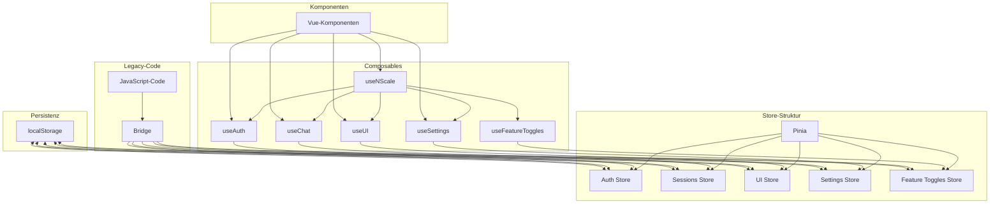
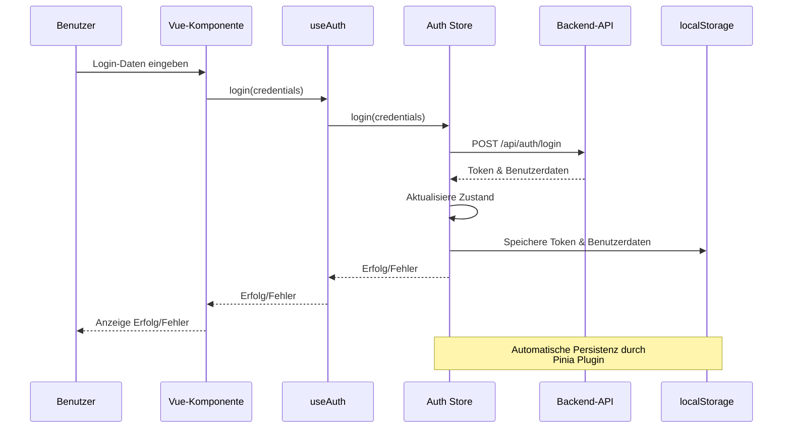
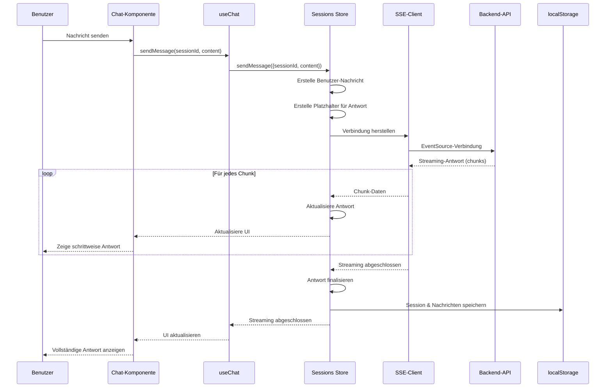
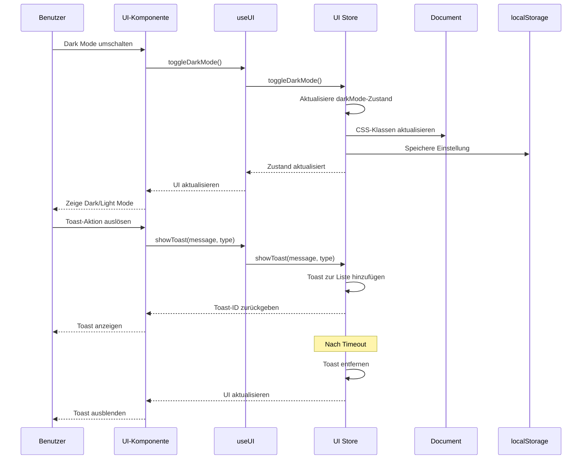
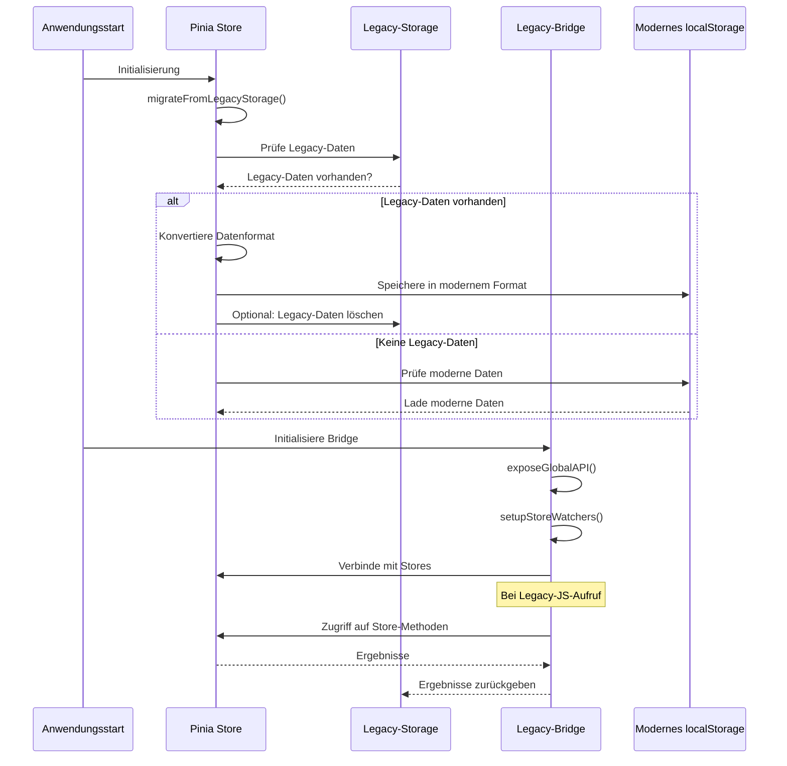
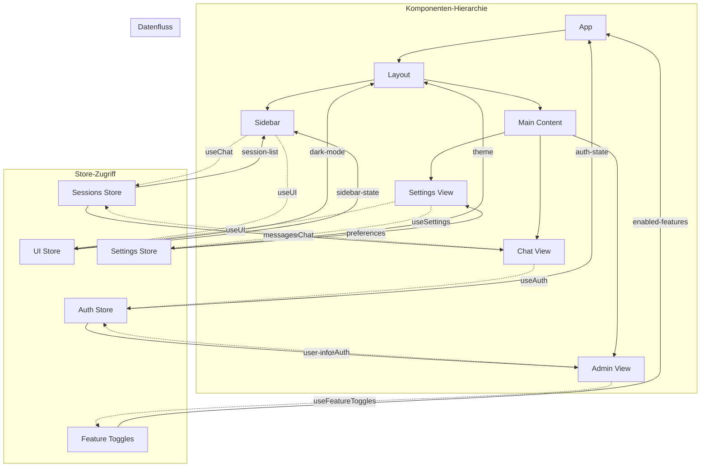
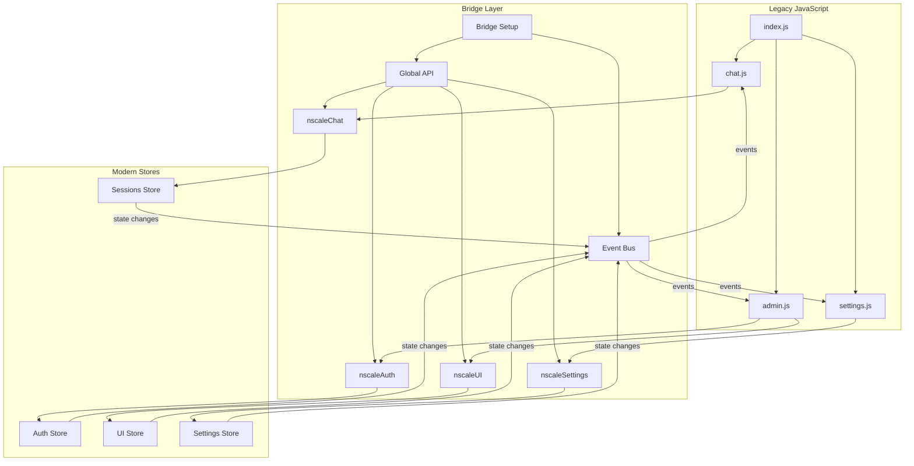
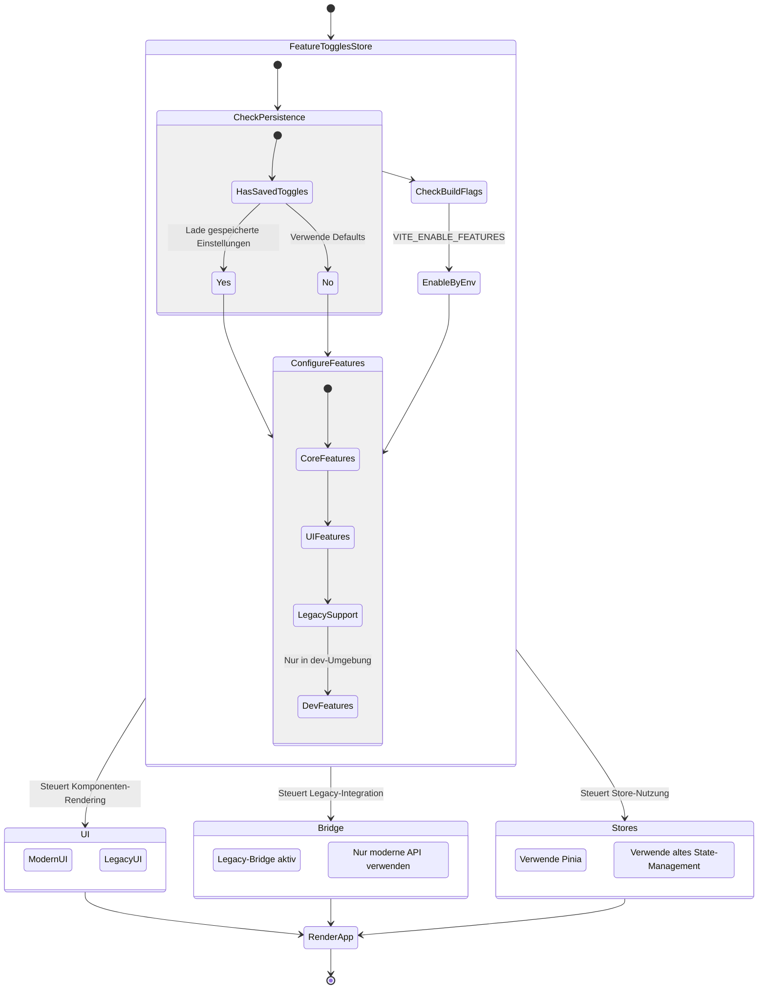

# Zustandsfluss-Diagramm für nscale DMS Assistent

Dieses Dokument zeigt die Zustandsflüsse zwischen den verschiedenen Komponenten des State-Management-Systems.

## Store-Übersicht und Interaktion

## Auth Store Flussdiagramm

## Sessions Store Flussdiagramm

## UI Store Flussdiagramm

## Migrations-Flussdiagramm

## Komponenten-Datenfluss

## Integration des Legacy-Codes

## Feature Toggle-Flussdiagramm

