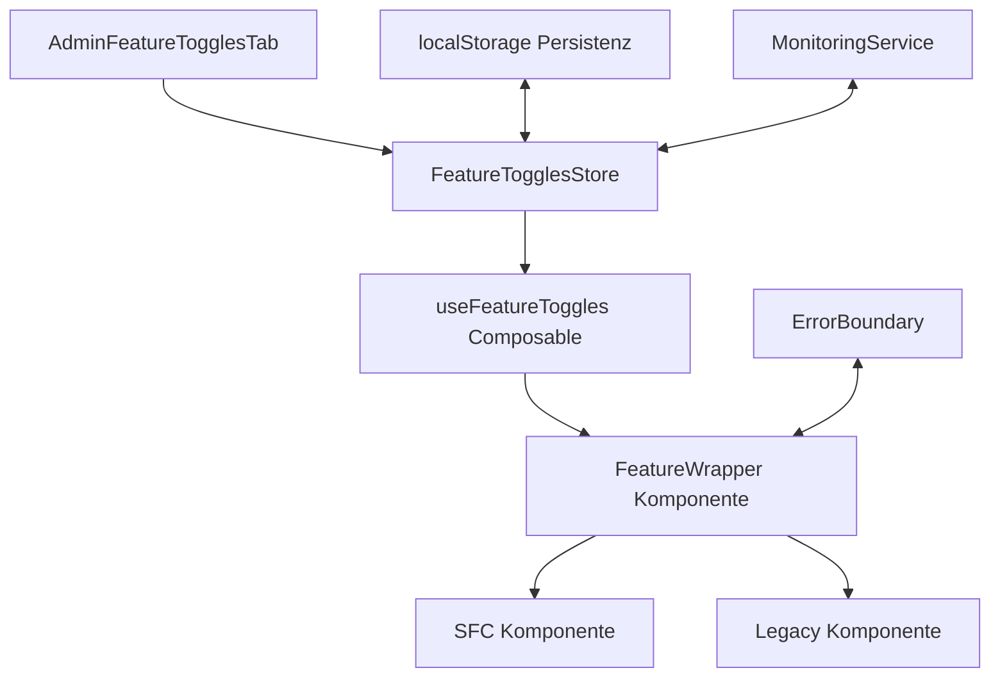
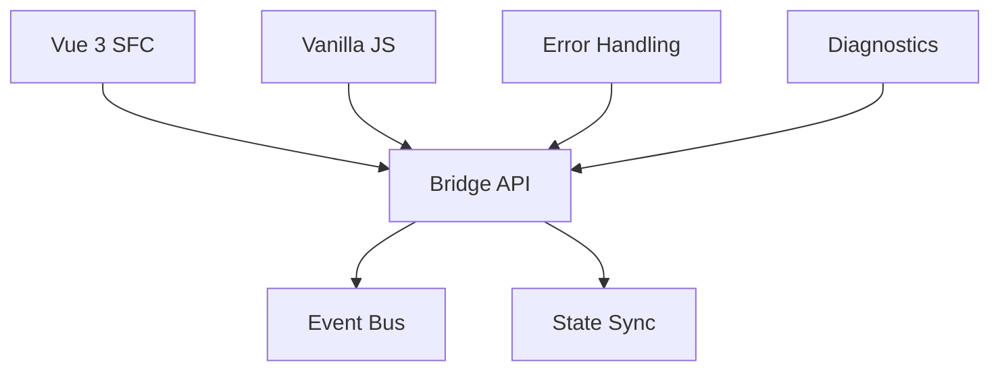
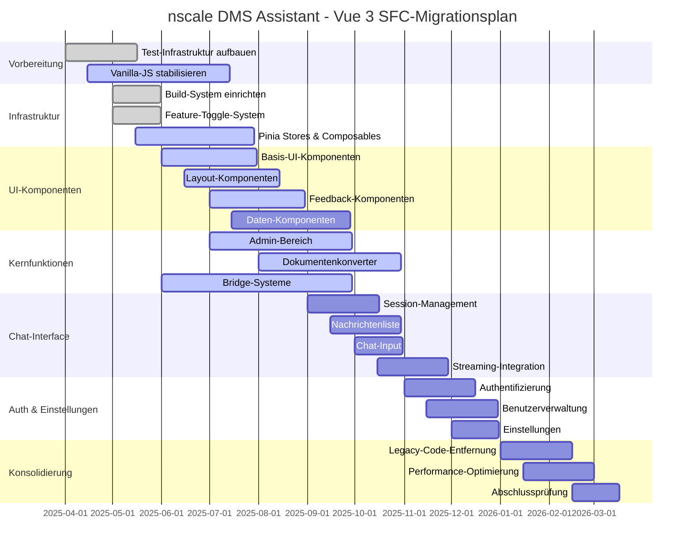
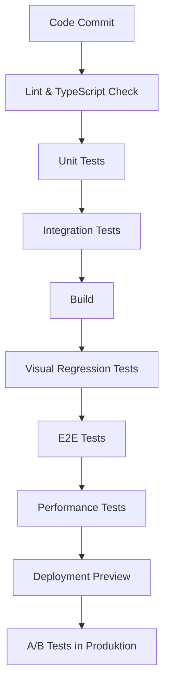
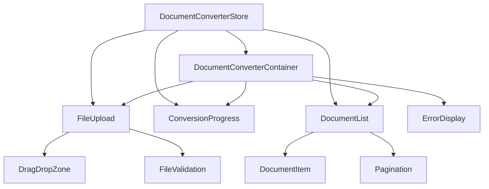
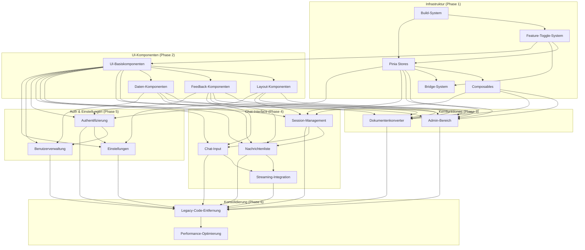
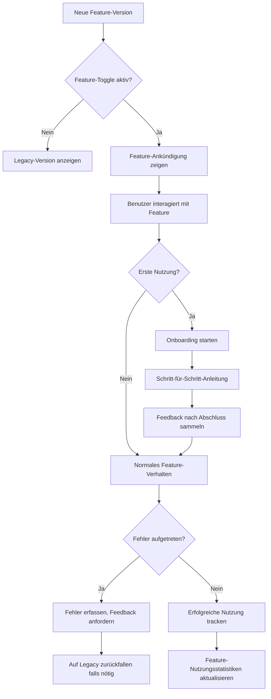

# Vollständiger Feature-Toggle-basierter Migrationsplan

> **Strategischer Migrationsplan für die vollständige Umstellung des nscale DMS Assistenten von Vanilla JS auf Vue 3 SFCs**
>
> Dokument-Version: 1.0  
> Datum: 12.05.2025  
> Status: Entwurf

## Inhaltsverzeichnis

1. [Einführung und Ziele](#1-einführung-und-ziele)
2. [Ausgangssituation und Ist-Analyse](#2-ausgangssituation-und-ist-analyse)
3. [Technische Grundlagen](#3-technische-grundlagen)
4. [Phasenplan mit Zeitrahmen](#4-phasenplan-mit-zeitrahmen)
5. [Qualitätssicherung und Teststrategien](#5-qualitätssicherung-und-teststrategien)
6. [Rollback-Mechanismen und Notfallpläne](#6-rollback-mechanismen-und-notfallpläne)
7. [Migrationsstrategie je Komponentengruppe](#7-migrationsstrategie-je-komponentengruppe)
8. [Abhängigkeitsdiagramm](#8-abhängigkeitsdiagramm)
9. [Monitoring und KPIs](#9-monitoring-und-kpis)
10. [Projektmanagement und Kommunikation](#10-projektmanagement-und-kommunikation)
11. [Ressourcen und Verantwortlichkeiten](#11-ressourcen-und-verantwortlichkeiten)

## 1. Einführung und Ziele

Der vorliegende Plan beschreibt die vollständige Migration des nscale DMS Assistenten von der aktuellen Vanilla-JavaScript-Implementierung zu einer modernen, komponentenbasierten Architektur mit Vue 3 Single File Components (SFCs).

### 1.1 Strategische Ziele

- **Technologische Modernisierung**: Nutzung moderner Frontend-Frameworks und -Praktiken
- **Verbesserte Wartbarkeit**: Strukturierte, komponentenbasierte Architektur
- **Erweiterte Funktionalität**: Grundlage für neue Features durch reaktive Komponenten
- **Optimierte Entwicklungserfahrung**: Bessere Entwicklerwerkzeuge und -workflows
- **Steigerung der Codequalität**: TypeScript-Integration, Testbarkeit, Modularität

### 1.2 Geschäftsziele

- **Reduzierung der Wartungskosten** um 30% durch verbesserte Codestruktur
- **Verkürzung der Time-to-Market** für neue Features um 40% durch modulare Komponenten
- **Steigerung der Benutzerfreundlichkeit** durch konsistentere UI/UX
- **Verbesserung der Performance** und Reaktionsfähigkeit der Anwendung
- **Reduzierung von Fehlern** durch verbesserte Testabdeckung und TypeScript

### 1.3 Kritische Erfolgsfaktoren

- Funktionale Parität zwischen Vanilla JS und Vue 3 SFCs
- Nahtlose Benutzererfahrung während der Migration
- Zuverlässige Feature-Toggle- und Fallback-Mechanismen
- Hochwertige Tests zur Validierung der Migration
- Gründliche Fehlerüberwachung und -bereinigung

## 2. Ausgangssituation und Ist-Analyse

### 2.1 Aktueller Stand der Migration

Die Migration befindet sich aktuell in einer aktiven Implementierungsphase mit einem Gesamtfortschritt von ca. 40%.

| Bereich | Fertigstellungsgrad | Status |
|---------|---------------------|--------|
| Infrastruktur & Build-System | ~95% | Nahezu abgeschlossen |
| Feature-Toggle-System | 100% | Abgeschlossen |
| Pinia Stores | ~80% | In Bearbeitung |
| Composables | ~65% | In Bearbeitung |
| UI-Basiskomponenten | ~60% | In Bearbeitung |
| Layout-Komponenten | ~50% | In Bearbeitung |
| Feedback-Komponenten | ~40% | In Bearbeitung |
| Dokumentenkonverter | ~50% | In Bearbeitung |
| Chat-Interface | ~30% | In Bearbeitung |
| Admin-Bereich | ~75% | Aktiv in Bearbeitung |
| Bridge-Mechanismen | ~85% | Größtenteils abgeschlossen |
| Tests | ~30% | In früher Bearbeitung |

### 2.2 Codeanalyse der verbleibenden Vanilla-JS-Komponenten

Basierend auf einer umfassenden Codeanalyse wurden die verbleibenden Vanilla-JS-Komponenten nach folgenden Kriterien bewertet:

| Komponente | Komplexität | Abhängigkeiten | Kritikalität | Migrationsaufwand |
|------------|-------------|----------------|--------------|-------------------|
| Chat-Kernfunktionalität | Hoch | Hoch | Sehr hoch | Hoch |
| Nachrichtenliste | Mittel | Mittel | Hoch | Mittel |
| Chat-Input | Mittel | Niedrig | Hoch | Niedrig |
| Dokumentvorschau | Hoch | Mittel | Mittel | Hoch |
| Seitennavigation | Niedrig | Niedrig | Mittel | Niedrig |
| Benutzereinstellungen | Mittel | Mittel | Niedrig | Mittel |
| Authentifizierung | Hoch | Hoch | Sehr hoch | Hoch |

### 2.3 Technische Schulden und Herausforderungen

Die folgenden technischen Schulden und Herausforderungen wurden identifiziert:

1. **Doppelte Implementierung**: Einige Komponenten haben sowohl Vue 2 als auch Vue 3-Versionen.
2. **Gemischte API-Stile**: Komponenten mit Options API und Composition API existieren parallel.
3. **Inkonsistente Typendefinitionen**: Unterschiedliche Qualität und Detailtiefe der TypeScript-Typen.
4. **Legacy-CSS-Klassen**: Abhängigkeiten zu alten CSS-Klassennamen und -Strukturen.
5. **Inkonsistente Theming-Mechanismen**: Verschiedene Ansätze für Dark Mode und Theming.
6. **Mangelhafte JSDoc-Dokumentation**: Uneinheitliche Komponenten-Dokumentation.
7. **Tiefe DOM-Manipulationen**: Direkte DOM-Zugriffe in Legacy-Code, die schwer zu migrieren sind.

## 3. Technische Grundlagen

### 3.1 Feature-Toggle-System

Das Feature-Toggle-System bildet das Herzstück der Migrationsstrategie und ermöglicht einen kontrollierten, schrittweisen Übergang.

#### 3.1.1 Architektur



#### 3.1.2 Feature-Flag-Definitionen

```typescript
// Kern-Feature-Flags
useSfcDocConverter: boolean; // Dokumentenkonverter als Vue 3 SFC
useSfcAdmin: boolean;        // Admin-Bereich als Vue 3 SFC
useSfcChat: boolean;         // Chat-Interface als Vue 3 SFC
useSfcSettings: boolean;     // Einstellungen als Vue 3 SFC
useSfcAuth: boolean;         // Authentifizierung als Vue 3 SFC
useSfcLayout: boolean;       // Layout-Komponenten als Vue 3 SFC
useSfcNavigation: boolean;   // Navigationskomponenten als Vue 3 SFC
```

#### 3.1.3 Fallback-Mechanismus

```vue
<!-- Beispiel für FeatureWrapper mit Fallback -->
<FeatureWrapper
  feature="useSfcDocConverter"
  :captureErrors="true"
  :autoFallback="true"
  @feature-error="logError"
  @feature-fallback="trackFallback"
>
  <template #default>
    <SfcDocConverterComponent />
  </template>
  <template #fallback>
    <LegacyDocConverterComponent />
  </template>
</FeatureWrapper>
```

### 3.2 Bridge-System

Das Bridge-System ermöglicht die Kommunikation zwischen Vanilla-JS- und Vue 3-Code während der Migration.

#### 3.2.1 Architektur



#### 3.2.2 Zustandssynchronisation

```typescript
// Beispiel für Bridge-Zustandssynchronisation
import { watch } from 'vue';
import { useAuthStore } from '@/stores/auth';

// Vanilla JS zu Vue (bidirektional)
export function setupAuthBridge() {
  const authStore = useAuthStore();
  
  // Von Vue zu Vanilla JS
  watch(() => authStore.user, (newUser) => {
    if (window.nscaleApp && window.nscaleApp.setUser) {
      window.nscaleApp.setUser(newUser);
    }
  });
  
  // Von Vanilla JS zu Vue
  window.addEventListener('nscale:userUpdated', (event) => {
    if (event.detail && event.detail.user) {
      authStore.syncUser(event.detail.user);
    }
  });
}
```

### 3.3 Vue 3-Komponenten-Bibliothek

Die entwickelte Komponenten-Bibliothek stellt die Grundlage für die Migration dar:

- **UI-Basiskomponenten**: Button, Input, Select, Checkbox, Radio, etc.
- **Layout-Komponenten**: Container, Row, Col, Card, etc.
- **Feedback-Komponenten**: Alert, Toast, Dialog, Progress, etc.
- **Datenkomponenten**: Table, List, Pagination, Tree, etc.
- **Spezifische nscale-Komponenten**: FeatureWrapper, ErrorBoundary, etc.

Alle Komponenten folgen den Design-Prinzipien:
- Konsistente Gestaltung
- Barrierefreiheit (WCAG 2.1 AA)
- Reaktivität und Performance
- TypeScript-Integration

## 4. Phasenplan mit Zeitrahmen

Die Migration wird in klar definierte Phasen unterteilt, um einen strukturierten Ansatz zu gewährleisten.

### 4.1 Übersicht der Migrationsphasen

| Phase | Beschreibung | Zeitrahmen | Status |
|-------|-------------|------------|--------|
| 0 | **Vorbereitungsphase**: Testinfrastruktur, Vanilla-JS-Stabilisierung | Mai-Juli 2025 | In Bearbeitung |
| 1 | **Infrastrukturphase**: Build-System, Grundlagen, Stores, Composables | Mai-Juli 2025 | Weitgehend abgeschlossen |
| 2 | **UI-Komponenten-Phase**: Basis-UI, Layout, Feedback | Juli-Sep 2025 | In Bearbeitung |
| 3 | **Kernfunktionen-Phase**: Admin-Bereich, Dokumentenkonverter | Aug-Okt 2025 | In Bearbeitung |
| 4 | **Chat-Interface-Phase**: Chat-Komponenten, Message-Handling | Sep-Nov 2025 | Begonnen |
| 5 | **Authentifizierung & Einstellungen**: Login, Benutzerverwaltung | Nov-Dez 2025 | Geplant |
| 6 | **Konsolidierungs-Phase**: Legacy-Code-Entfernung, Optimierung | Jan-März 2026 | Geplant |

### 4.2 Gantt-Diagramm



### 4.3 Meilensteine und Deliverables

| Meilenstein | Deliverables | Termin |
|-------------|--------------|--------|
| **M1: Vorbereitungsabschluss** | Test-Suite für Vanilla-JS, Stabile Legacy-Implementierung | Juli 2025 |
| **M2: UI-Komponenten** | Vollständige UI-Komponenten-Bibliothek, Dokumentation | September 2025 |
| **M3: Admin-Integration** | Vue 3 SFC Admin-Bereich mit allen Funktionen | Oktober 2025 |
| **M4: Dokumentenkonverter** | Vue 3 SFC Dokumentenkonverter-Komponente | Oktober 2025 |
| **M5: Chat-Interface** | Vue 3 SFC Chat-Interface mit allen Funktionen | November 2025 |
| **M6: Auth & Einstellungen** | Vue 3 SFC Authentifizierung und Benutzereinstellungen | Dezember 2025 |
| **M7: Legacy-Code-Entfernung** | Beseitigung aller Vanilla-JS-Komponenten, Cleanup | Februar 2026 |
| **M8: Projektabschluss** | Vollständig migrierte Anwendung, Dokumentation, Abnahme | März 2026 |

## 5. Qualitätssicherung und Teststrategien

### 5.1 Teststufen und -arten

Die Qualitätssicherung erfolgt auf mehreren Ebenen, um eine hohe Codequalität und Funktionalität sicherzustellen.

#### 5.1.1 Unit-Tests

- **Umfang**: Einzelne Komponenten, Stores, Composables, Utilities
- **Werkzeuge**: Vitest, Vue Test Utils
- **Abdeckungsziel**: Mindestens 80% Codeabdeckung für alle neuen SFC-Komponenten

```typescript
// Beispiel für Unit-Test einer Vue 3 SFC-Komponente
import { mount } from '@vue/test-utils';
import { describe, it, expect, vi } from 'vitest';
import Button from '@/components/ui/base/Button.vue';

describe('Button.vue', () => {
  it('rendert mit dem korrekten Text', () => {
    const wrapper = mount(Button, {
      slots: {
        default: 'Test Button'
      }
    });
    expect(wrapper.text()).toBe('Test Button');
  });
  
  it('emittet ein click-Event', async () => {
    const wrapper = mount(Button);
    await wrapper.trigger('click');
    expect(wrapper.emitted('click')).toBeTruthy();
  });
  
  it('ist deaktiviert, wenn die disabled-Prop gesetzt ist', () => {
    const wrapper = mount(Button, {
      props: {
        disabled: true
      }
    });
    expect(wrapper.attributes('disabled')).toBeDefined();
  });
});
```

#### 5.1.2 Integrationstests

- **Umfang**: Zusammenspiel mehrerer Komponenten, Store-Integrationen, API-Interaktionen
- **Werkzeuge**: Vitest, Vue Test Utils, Mock Service Worker
- **Abdeckungsziel**: Kritische Workflows und Funktionsbereiche

```typescript
// Beispiel für Integrationstest mit Komponenteninteraktion
import { mount } from '@vue/test-utils';
import { describe, it, expect, vi } from 'vitest';
import { createTestingPinia } from '@pinia/testing';
import DocumentConverter from '@/components/DocumentConverter.vue';
import { useDocumentConverterStore } from '@/stores/documentConverter';

describe('DocumentConverter Integration', () => {
  it('interagiert korrekt mit dem Store', async () => {
    const wrapper = mount(DocumentConverter, {
      global: {
        plugins: [
          createTestingPinia({
            createSpy: vi.fn,
            initialState: {
              documentConverter: {
                files: [],
                convertedFiles: [],
                isConverting: false
              }
            }
          })
        ]
      }
    });
    
    const store = useDocumentConverterStore();
    
    // Simuliere Dateiauswahl
    await wrapper.find('input[type="file"]').trigger('change');
    
    // Prüfe Store-Interaktion
    expect(store.uploadAndConvert).toHaveBeenCalled();
  });
});
```

#### 5.1.3 E2E-Tests

- **Umfang**: End-to-End-Workflows, vollständige Benutzerinteraktionen
- **Werkzeuge**: Cypress, Playwright
- **Abdeckungsziel**: Kritische Geschäftsprozesse, Hauptbenutzerpfade

```javascript
// Beispiel für Cypress E2E-Test
describe('Document Converter E2E', () => {
  beforeEach(() => {
    cy.visit('/document-converter');
    cy.login('testuser', 'password');
  });
  
  it('konvertiert ein Dokument erfolgreich', () => {
    // Datei hochladen
    cy.get('input[type="file"]').attachFile('test-document.pdf');
    
    // Konvertieren-Button klicken
    cy.get('button').contains('Konvertieren').click();
    
    // Fortschrittsanzeige prüfen
    cy.get('.progress-bar').should('exist');
    
    // Warten auf Abschluss und Ergebnis prüfen
    cy.get('.progress-bar', { timeout: 10000 }).should('not.exist');
    cy.get('.result-item').should('exist');
    cy.get('.success-message').should('contain', 'erfolgreich konvertiert');
  });
});
```

#### 5.1.4 Visual Regression Tests

- **Umfang**: UI-Komponenten, Layout-Konsistenz, Theming
- **Werkzeuge**: Chromatic, Playwright visual comparisons
- **Abdeckungsziel**: Alle UI-Komponenten in verschiedenen Zuständen und Themes

```javascript
// Beispiel für Storybook-basierter visueller Regressionstest
describe('Button Visual', () => {
  it('hat konsistentes Aussehen in verschiedenen Varianten', async () => {
    // Standard-Button prüfen
    await page.goto('http://localhost:6006/iframe.html?id=components-button--primary');
    await expect(page).toHaveScreenshot('button-primary.png');
    
    // Secondary-Button prüfen
    await page.goto('http://localhost:6006/iframe.html?id=components-button--secondary');
    await expect(page).toHaveScreenshot('button-secondary.png');
    
    // Disabled-Button prüfen
    await page.goto('http://localhost:6006/iframe.html?id=components-button--disabled');
    await expect(page).toHaveScreenshot('button-disabled.png');
  });
});
```

### 5.2 Automatisierte Testpipeline

Die Testautomatisierung wird in die CI/CD-Pipeline integriert, um kontinuierliche Qualitätssicherung zu gewährleisten.



#### 5.2.1 CI/CD-Konfiguration

```yaml
# .github/workflows/main.yml (Auszug)
name: CI/CD Pipeline

on:
  push:
    branches: [ main, develop ]
  pull_request:
    branches: [ main, develop ]

jobs:
  test:
    runs-on: ubuntu-latest
    steps:
      - uses: actions/checkout@v3
      - uses: actions/setup-node@v3
        with:
          node-version: '16'
      - name: Install dependencies
        run: npm ci
      - name: Lint and TypeScript check
        run: npm run lint && npm run typecheck
      - name: Run unit tests
        run: npm run test:unit
      - name: Run integration tests
        run: npm run test:integration
      - name: Build for testing
        run: npm run build
      - name: Run visual regression tests
        run: npm run test:visual
      - name: Run E2E tests
        run: npm run test:e2e
      - name: Performance tests
        run: npm run test:performance
```

### 5.3 A/B-Testmethodik

Für kritische Komponenten wird eine A/B-Teststrategie implementiert, um die neuen SFC-Komponenten mit Legacy-Komponenten zu vergleichen.

#### 5.3.1 A/B-Test-Setup

1. **Benutzergruppen**: Benutzer werden zufällig in Kontroll- (Legacy) und Testgruppe (SFC) eingeteilt
2. **Metriken**: Erfassung von Performance-Daten, Benutzerinteraktionen, Fehlerraten
3. **Auswertung**: Statistische Analyse der Unterschiede zwischen den Gruppen
4. **Rollout-Entscheidung**: Basierend auf Daten wird entschieden, ob die SFC-Version für alle Benutzer aktiviert wird

#### 5.3.2 Konfigurationsbeispiel

```typescript
// Beispiel für A/B-Test-Konfiguration
const abTestConfig = {
  testId: 'sfcChatInterface',
  variations: [
    { id: 'legacy', weight: 50 },
    { id: 'sfc', weight: 50 }
  ],
  metrics: [
    'renderTime',
    'interactionDelay',
    'errorRate',
    'userSatisfaction'
  ],
  duration: 14, // Tage
  minSampleSize: 1000
};
```

### 5.4 Fehlerberichterstattung und -analyse

Eine umfassende Fehlerberichterstattung und -analyse wird implementiert, um Probleme frühzeitig zu erkennen.

#### 5.4.1 Fehlererfassung und -monitoring

1. **Client-seitige Fehlererfassung**: Integration eines Fehlererfassungssystems (z.B. Sentry)
2. **Feature-Toggle-spezifische Fehlererfassung**: Tracking von Fehlern pro Feature
3. **Automatisches Fallback**: Bei kritischen Fehlern wird automatisch auf Legacy-Komponenten zurückgeschaltet
4. **Fehleranalyse-Dashboard**: Visualisierung von Fehlertrends, -kategorien und -häufigkeiten

```typescript
// Beispiel für Fehlererfassung im Feature-Toggle-System
try {
  // SFC-Komponente rendern oder nutzen
} catch (error) {
  // Fehler im Feature-Toggle-System erfassen
  featureToggles.reportError('useSfcDocConverter', error.message, {
    stackTrace: error.stack,
    componentName: 'DocumentConverter',
    userId: currentUser.id,
    metadata: { /* weitere Kontext-Informationen */ }
  });
  
  // Externe Fehlerberichterstattung
  Sentry.captureException(error, {
    tags: {
      feature: 'useSfcDocConverter',
      component: 'DocumentConverter'
    }
  });
  
  // Auf Legacy-Komponente zurückfallen
  featureToggles.activateFallback('useSfcDocConverter');
}
```

## 6. Rollback-Mechanismen und Notfallpläne

### 6.1 Feature-Flag-basierter Rollback

Das Feature-Toggle-System ermöglicht einen sofortigen Rollback auf Legacy-Komponenten bei Problemen.

#### 6.1.1 Automatischer Rollback

```typescript
// Automatischer Rollback bei kritischen Fehlern
function setupAutoRollback(featureName, errorThreshold = 3) {
  const featureToggles = useFeatureTogglesStore();
  
  // Beobachten der Fehlerrate
  watch(() => {
    const status = featureToggles.getFeatureStatus(featureName);
    return status.errors.length;
  }, (errorCount) => {
    if (errorCount >= errorThreshold) {
      console.warn(`Kritische Fehlerrate für ${featureName} erreicht, aktiviere Fallback`);
      featureToggles.setFallbackMode(featureName, true);
      
      // Administrator benachrichtigen
      notifyAdministrators({
        feature: featureName,
        errorCount,
        message: `Automatischer Fallback für ${featureName} wurde aktiviert`
      });
    }
  });
}
```

#### 6.1.2 Manueller Rollback im Admin-Panel

Das Admin-Panel bietet eine Oberfläche für den manuellen Rollback einzelner Features oder aller Features gleichzeitig.

```vue
<!-- AdminFeatureToggles.vue (Auszug) -->
<template>
  <div class="feature-emergency-controls">
    <h3>Notfall-Steuerung</h3>
    <p>Diese Steuerelemente ermöglichen einen sofortigen Rollback bei kritischen Problemen.</p>
    
    <div class="emergency-buttons">
      <Button 
        variant="danger" 
        @click="disableAllSfcFeatures"
        :loading="isRollbackInProgress"
      >
        Alle SFC-Features deaktivieren
      </Button>
      
      <Button 
        variant="secondary" 
        @click="resetAllFallbacks"
        :disabled="!hasActiveFallbacks"
      >
        Alle Fallbacks zurücksetzen
      </Button>
    </div>
    
    <div class="feature-status-grid">
      <!-- Status und Rollback-Optionen für einzelne Features -->
    </div>
  </div>
</template>
```

### 6.2 Deployment-Strategien mit Canary-Releases

Für kritische Komponenten werden Canary-Releases eingesetzt, um Probleme frühzeitig zu erkennen.

#### 6.2.1 Canary-Deployment-Prozess

1. **Initiale Aktivierung**: Feature wird für einen kleinen Prozentsatz der Benutzer aktiviert (z.B. 5%)
2. **Monitoring**: Eingehende Überwachung der Fehlerraten und Performance-Metriken
3. **Stufenweise Erhöhung**: Bei Erfolg wird der Prozentsatz schrittweise erhöht (10%, 25%, 50%, 100%)
4. **Automatischer Rollback**: Bei Überschreitung definierter Schwellenwerte erfolgt ein automatischer Rollback

#### 6.2.2 Konfiguration für Canary-Releases

```typescript
// Beispiel für Canary-Release-Konfiguration
const canaryConfig = {
  feature: 'useSfcChat',
  stages: [
    { percentage: 5, minDuration: '1d', successThreshold: { errorRate: 0.1 } },
    { percentage: 10, minDuration: '1d', successThreshold: { errorRate: 0.1 } },
    { percentage: 25, minDuration: '2d', successThreshold: { errorRate: 0.05 } },
    { percentage: 50, minDuration: '3d', successThreshold: { errorRate: 0.02 } },
    { percentage: 100, minDuration: '0d', successThreshold: { errorRate: 0 } }
  ],
  rollbackThreshold: {
    errorRate: 0.2,
    p95LatencyMs: 1500,
    userSatisfactionScore: 3.5
  }
};
```

### 6.3 Datenmigration und -persistenz

Bei der Migration werden spezielle Maßnahmen für die Datenpersistenz ergriffen.

#### 6.3.1 LocalStorage-Migration

Für Daten, die im localStorage gespeichert sind, wird eine Migrationsstrategie implementiert.

```typescript
// LocalStorage-Migrationsstrategie
function migrateLocalStorage() {
  try {
    // Legacy-Datenformat prüfen
    const legacyData = localStorage.getItem('nscaleAppState');
    if (!legacyData) return;
    
    const parsedData = JSON.parse(legacyData);
    
    // Migrationsmapping für Datenstrukturen
    const migratedState = {
      auth: {
        token: parsedData.token,
        user: parsedData.user
      },
      sessions: {
        items: parsedData.chatSessions?.map(session => ({
          id: session.id,
          title: session.name,
          created: new Date(session.timestamp).toISOString(),
          messages: session.messages || []
        })) || [],
        currentId: parsedData.currentSession
      },
      ui: {
        theme: parsedData.darkMode ? 'dark' : 'light',
        sidebarExpanded: parsedData.sidebarOpen !== false
      }
    };
    
    // Neue Formate speichern
    localStorage.setItem('auth', JSON.stringify(migratedState.auth));
    localStorage.setItem('sessions', JSON.stringify(migratedState.sessions));
    localStorage.setItem('ui', JSON.stringify(migratedState.ui));
    
    // Migrationsstatus speichern
    localStorage.setItem('storageMigrationCompleted', 'true');
    
    console.log('LocalStorage-Migration erfolgreich abgeschlossen');
  } catch (error) {
    console.error('Fehler bei LocalStorage-Migration:', error);
    // Migration fehlgeschlagen, Fallback auf Standardwerte
  }
}
```

#### 6.3.2 API-Schnittstellen-Kompatibilität

Sicherstellung der API-Kompatibilität zwischen Legacy- und Vue 3-Implementierungen.

```typescript
// API-Adapter für Legacy-zu-SFC-Kompatibilität
class ApiAdapter {
  // Konvertiert Legacy-API-Antworten in das neue Format
  convertLegacyResponse(legacyResponse) {
    if (legacyResponse.chat_sessions) {
      return {
        sessions: legacyResponse.chat_sessions.map(session => ({
          id: session.id,
          title: session.title || 'Unbenannte Sitzung',
          created: session.created_at,
          updated: session.updated_at,
          messageCount: session.message_count || 0
        }))
      };
    }
    
    // Weitere Konvertierungen je nach Endpunkt...
    
    return legacyResponse;
  }
  
  // Konvertiert neue API-Anfragen in das Legacy-Format
  convertNewRequest(newRequest) {
    if (newRequest.session) {
      return {
        session_id: newRequest.session.id,
        message: newRequest.session.message,
        options: {
          stream: newRequest.session.streaming || false,
          // Weitere Optionen...
        }
      };
    }
    
    // Weitere Konvertierungen je nach Endpunkt...
    
    return newRequest;
  }
}
```

## 7. Migrationsstrategie je Komponentengruppe

Die Migrationsstrategie wird für jede Komponentengruppe individuell angepasst, um den spezifischen Anforderungen und Herausforderungen gerecht zu werden.

### 7.1 UI-Basiskomponenten

Die UI-Basiskomponenten bilden das Fundament für alle anderen Komponenten und werden daher priorisiert.

#### 7.1.1 Migrationsstrategie

1. **Migrationsreihenfolge**: Button → Input → Select → Checkbox → Radio → ...
2. **Kompatibilitätsschicht**: Wrapper-Komponenten für nahtlose Integration
3. **Attributmapping**: Konsistentes Mapping zwischen Legacy- und SFC-Attributen

#### 7.1.2 Risiken und Mitigationen

| Risiko | Wahrscheinlichkeit | Auswirkung | Mitigation |
|--------|-------------------|------------|------------|
| Inkonsistentes Styling | Mittel | Hoch | Umfassende visuelle Regressionstests |
| Unterschiedliches Verhalten | Niedrig | Hoch | Verhaltensspezifische Tests, gründliche Dokumentation |
| Erhöhte Bundle-Größe | Mittel | Niedrig | Tree Shaking, Lazy Loading, Bundle-Analyse |

### 7.2 Dokumentenkonverter

Der Dokumentenkonverter ist eine komplexe Komponente mit vielen Unterkomponenten und API-Interaktionen.

#### 7.2.1 Migrationsstrategie

1. **Komponenten-Dekomposition**: Aufteilung in FileUpload, ConversionProgress, DocumentList, etc.
2. **API-Integration**: Eigener Store für API-Kommunikation
3. **Stufenweise Migration**: Unterkomponenten werden einzeln migriert und getestet

#### 7.2.2 Abhängigkeitsdiagramm



### 7.3 Admin-Bereich

Der Admin-Bereich ist weitgehend unabhängig vom restlichen Frontend und kann daher als separate Einheit migriert werden.

#### 7.3.1 Migrationsstrategie

1. **Tab-basierte Migration**: Jeder Admin-Tab wird separat migriert
2. **Lazy Loading**: Tabs werden nur bei Bedarf geladen
3. **Rollenbasierte Features**: Integration mit Berechtigungssystem

#### 7.3.2 Priorisierung der Admin-Tabs

| Tab | Priorität | Komplexität | Status |
|-----|-----------|-------------|--------|
| Dashboard | Mittel | Niedrig | Fertiggestellt (95%) |
| Benutzer | Hoch | Mittel | Fertiggestellt (95%) |
| System | Mittel | Hoch | Fertiggestellt (95%) |
| Feature-Toggles | Sehr Hoch | Mittel | Fertiggestellt (90%) |
| Feedback | Niedrig | Niedrig | In Bearbeitung (25%) |
| MOTD | Niedrig | Niedrig | In Bearbeitung (20%) |

### 7.4 Chat-Interface

Das Chat-Interface ist das Herzstück der Anwendung und erfordert besondere Aufmerksamkeit bei der Migration.

#### 7.4.1 Migrationsstrategie

1. **Kernkomponenten zuerst**: MessageList → ChatInput → SessionList
2. **Streaming-Optimierung**: Besonderer Fokus auf Streaming-Funktionalität
3. **Zustandsverwaltung**: Dedizierter Pinia-Store für Chat-Zustand

#### 7.4.2 Besondere Herausforderungen

- **Text-Streaming**: Komplexe Streaming-Funktionalität mit Zwischenzuständen
- **Inline-Markdown-Rendering**: Echtzeit-Rendering von Markdown während des Streamings
- **Virtualisierte Listen**: Effiziente Darstellung langer Nachrichtenlisten

```typescript
// Beispiel für Chat Store mit Streaming-Support
export const useChatStore = defineStore('chat', () => {
  const messages = ref([]);
  const currentStreamingMessage = ref(null);
  const isStreaming = ref(false);
  
  async function sendMessage(sessionId, text) {
    try {
      const message = {
        id: generateUUID(),
        role: 'user',
        content: text,
        timestamp: new Date().toISOString()
      };
      
      messages.value.push(message);
      
      // Streaming-Antwort initialisieren
      isStreaming.value = true;
      currentStreamingMessage.value = {
        id: generateUUID(),
        role: 'assistant',
        content: '',
        isStreaming: true,
        timestamp: new Date().toISOString()
      };
      
      messages.value.push(currentStreamingMessage.value);
      
      // Streaming-API aufrufen
      const stream = await api.chat.sendMessageStream(sessionId, text);
      
      // Stream verarbeiten
      for await (const chunk of stream) {
        if (currentStreamingMessage.value) {
          currentStreamingMessage.value.content += chunk;
        }
      }
      
      // Streaming abschließen
      if (currentStreamingMessage.value) {
        currentStreamingMessage.value.isStreaming = false;
      }
      
      isStreaming.value = false;
      currentStreamingMessage.value = null;
      
      return true;
    } catch (error) {
      console.error('Error sending message:', error);
      isStreaming.value = false;
      
      if (currentStreamingMessage.value) {
        currentStreamingMessage.value.error = true;
        currentStreamingMessage.value.errorMessage = 'Nachricht konnte nicht gesendet werden';
        currentStreamingMessage.value.isStreaming = false;
      }
      
      return false;
    }
  }
  
  // Weitere Store-Funktionen...
  
  return {
    messages,
    currentStreamingMessage,
    isStreaming,
    sendMessage
    // Weitere Exports...
  };
});
```

### 7.5 Authentifizierung und Einstellungen

Die Authentifizierung ist eine kritische Komponente mit hohen Sicherheitsanforderungen.

#### 7.5.1 Migrationsstrategie

1. **Token-Handling zuerst**: Sichere Token-Verwaltung implementieren
2. **Doppelte Validierung**: Parallele Validierung in Legacy- und SFC-Code während der Migration
3. **Berechtigungssystem**: Integration mit rollenbasierter Zugriffskontrolle

#### 7.5.2 Sicherheitsüberlegungen

- **Token-Storage**: Sichere Speicherung von Auth-Tokens
- **CSRF-Schutz**: Implementierung von CSRF-Token-Validierung
- **XSS-Prävention**: Strikte Content-Security-Policy
- **Rate Limiting**: Schutz vor Brute-Force-Angriffen

```typescript
// Beispiel für Auth Store mit Sicherheitsfeatures
export const useAuthStore = defineStore('auth', () => {
  const user = ref(null);
  const token = ref(null);
  const isLoading = ref(false);
  const error = ref(null);
  
  // Token-Validierung
  const isTokenValid = computed(() => {
    if (!token.value) return false;
    
    try {
      const payload = JSON.parse(atob(token.value.split('.')[1]));
      return payload.exp * 1000 > Date.now();
    } catch (e) {
      return false;
    }
  });
  
  // Login mit Rate-Limiting-Schutz
  async function login(credentials) {
    if (isLoading.value) return;
    
    isLoading.value = true;
    error.value = null;
    
    try {
      // Rate-Limiting-Schutz
      const rateLimiter = useRateLimiter('login', {
        maxAttempts: 5,
        windowMs: 5 * 60 * 1000 // 5 Minuten
      });
      
      if (rateLimiter.isLimited()) {
        throw new Error('Zu viele Anmeldeversuche. Bitte versuchen Sie es später erneut.');
      }
      
      // API-Aufruf
      const response = await api.auth.login(credentials);
      
      token.value = response.token;
      user.value = response.user;
      
      // Token im sessionStorage (nicht localStorage) speichern
      sessionStorage.setItem('auth_token', response.token);
      
      // CSRF-Token im Header für zukünftige Anfragen setzen
      api.setHeader('X-CSRF-Token', response.csrfToken);
      
      // Erfolgreichen Login im Bridge-System kommunizieren
      if (window.nscaleApp && window.nscaleApp.onLogin) {
        window.nscaleApp.onLogin(response.user);
      }
      
      return true;
    } catch (err) {
      error.value = err.message;
      rateLimiter.increment();
      return false;
    } finally {
      isLoading.value = false;
    }
  }
  
  // Weitere Auth-Funktionen...
  
  return {
    user,
    token,
    isLoading,
    error,
    isTokenValid,
    login
    // Weitere Exports...
  };
}, {
  // Selektive Persistierung (nur bestimmte Felder)
  persist: {
    storage: sessionStorage,
    paths: ['token']
  }
});
```

## 8. Abhängigkeitsdiagramm

Das folgende Abhängigkeitsdiagramm zeigt die Beziehungen zwischen den verschiedenen Komponenten und ihre Migrationsreihenfolge.



## 9. Monitoring und KPIs

Um den Erfolg der Migration zu messen und zu überwachen, werden spezifische Key Performance Indicators (KPIs) definiert und überwacht.

### 9.1 Technische KPIs

| KPI | Beschreibung | Zielwert | Messmethode |
|-----|-------------|----------|-------------|
| **Bundle-Größe** | Gesamtgröße der JavaScript-Bundles | < 250KB (gzipped) | Webpack Bundle Analyzer |
| **First Contentful Paint** | Zeit bis zum ersten Inhalt | < 1.5s | Lighthouse, RUM |
| **Time to Interactive** | Zeit bis zur Interaktivität | < 3.5s | Lighthouse, RUM |
| **Memory Usage** | Speicherverbrauch der Anwendung | < 100MB | Performance Monitoring |
| **Error Rate** | Fehlerrate pro Feature | < 0.1% | Error Tracking |
| **Test Coverage** | Testabdeckung des Codes | > 80% | Jest Coverage |

### 9.2 Geschäftliche KPIs

| KPI | Beschreibung | Zielwert | Messmethode |
|-----|-------------|----------|-------------|
| **User Satisfaction Score** | Benutzerzufriedenheit (1-5) | > 4.2 | In-App-Feedback |
| **Feature Usage** | Nutzungsrate neuer Features | > 60% | Analytics |
| **Task Completion Rate** | Erfolgreiche Aufgabenabschlüsse | > 95% | Analytics |
| **Support Tickets** | Anzahl der Support-Tickets | Reduktion um 30% | Ticketing-System |
| **Development Velocity** | Entwicklungsgeschwindigkeit | Steigerung um 40% | Sprint-Metriken |

### 9.3 Dashboard-Implementierung

Ein umfassendes Dashboard wird implementiert, um die Migration in Echtzeit zu überwachen.

#### 9.3.1 Monitoring-Dashboard

```vue
<!-- MonitoringDashboard.vue (Auszug) -->
<template>
  <div class="monitoring-dashboard">
    <header class="dashboard-header">
      <h1>Migration Monitoring Dashboard</h1>
      <div class="dashboard-controls">
        <DateRangePicker v-model="dateRange" />
        <RefreshButton @click="refreshData" :loading="isLoading" />
      </div>
    </header>
    
    <div class="dashboard-grid">
      <!-- Migration Overview -->
      <Card title="Migration Overview" :loading="isLoading">
        <ProgressIndicator
          :percentage="migrationProgress"
          :label="`${migrationProgress}% Completed`"
        />
        <div class="stats-grid">
          <Stat
            v-for="stat in overviewStats"
            :key="stat.id"
            :label="stat.label"
            :value="stat.value"
            :trend="stat.trend"
            :trendLabel="stat.trendLabel"
          />
        </div>
      </Card>
      
      <!-- Feature Adoption -->
      <Card title="Feature Adoption" :loading="isLoading">
        <BarChart
          :data="featureAdoptionData"
          :options="chartOptions.featureAdoption"
        />
      </Card>
      
      <!-- Error Rates -->
      <Card title="Error Rates" :loading="isLoading">
        <LineChart
          :data="errorRateData"
          :options="chartOptions.errorRate"
        />
      </Card>
      
      <!-- Performance Metrics -->
      <Card title="Performance Metrics" :loading="isLoading">
        <LineChart
          :data="performanceData"
          :options="chartOptions.performance"
        />
      </Card>
      
      <!-- User Satisfaction -->
      <Card title="User Satisfaction" :loading="isLoading">
        <GaugeChart
          :value="userSatisfaction"
          :min="0"
          :max="5"
          :thresholds="[
            { value: 2, color: 'red' },
            { value: 3.5, color: 'yellow' },
            { value: 5, color: 'green' }
          ]"
        />
      </Card>
      
      <!-- Active A/B Tests -->
      <Card title="Active A/B Tests" :loading="isLoading">
        <ABTestTable :tests="activeABTests" />
      </Card>
    </div>
  </div>
</template>
```

## 10. Projektmanagement und Kommunikation

### 10.1 Projektorganisation

Das Migrationsprojekt wird nach agilen Prinzipien organisiert, um Flexibilität und kontinuierliche Anpassung zu ermöglichen.

#### 10.1.1 Rollen und Verantwortlichkeiten

| Rolle | Verantwortlichkeiten |
|-------|----------------------|
| **Projekt-Manager** | Gesamtkoordination, Zeitpläne, Ressourcen, Reporting |
| **Technical Lead** | Technische Entscheidungen, Architektur, Code-Reviews |
| **Frontend-Entwickler** | Vue 3 SFC-Implementierung, Komponenten-Migration |
| **QA-Ingenieure** | Testplanung, Testautomatisierung, Qualitätssicherung |
| **UX-Designer** | Konsistente Benutzererfahrung, UI-Reviews |
| **Product Owner** | Anforderungen, Priorisierung, Stakeholder-Management |

#### 10.1.2 Agile Methodik

- **Sprint-Dauer**: 2 Wochen
- **Ceremonies**: 
  - Daily Stand-ups
  - Sprint Planning
  - Sprint Review
  - Sprint Retrospective
  - Backlog Refinement
- **Artefakte**:
  - Product Backlog
  - Sprint Backlog
  - Burndown Charts
  - Definition of Done

### 10.2 Kommunikationsstrategie

Eine klare Kommunikationsstrategie ist entscheidend für den Erfolg des Projekts.

#### 10.2.1 Interne Kommunikation

| Kommunikationstyp | Frequenz | Teilnehmer | Zweck |
|-------------------|----------|------------|-------|
| **Stand-up** | Täglich | Entwicklungsteam | Status, Blockaden |
| **Sprint Review** | Alle 2 Wochen | Team + Stakeholder | Fortschritt, Feedback |
| **Tech Sync** | Wöchentlich | Technisches Team | Technische Herausforderungen |
| **All-Hands** | Monatlich | Alle Beteiligten | Gesamtüberblick, Meilensteine |

#### 10.2.2 Externe Kommunikation (Benutzer)

| Kommunikationstyp | Frequenz | Zielgruppe | Zweck |
|-------------------|----------|------------|-------|
| **Release Notes** | Bei jedem Release | Alle Benutzer | Neue Features, Änderungen |
| **In-App-Hinweise** | Bei Aktivierung | Betroffene Benutzer | Feature-Ankündigungen |
| **Feedback-Anfragen** | Nach Feature-Nutzung | Testbenutzer | Qualitatives Feedback |
| **Status-Updates** | Monatlich | Key Stakeholder | Projektfortschritt |

#### 10.2.3 Dokumentation

Umfassende Dokumentation für verschiedene Zielgruppen:

- **Entwickler-Dokumentation**: Architektur, Komponenten-APIs, Migration Guidelines
- **Tester-Dokumentation**: Testpläne, Testfälle, Fehlermeldungen
- **Benutzer-Dokumentation**: Neue Features, Änderungen in der Benutzeroberfläche
- **Administrator-Dokumentation**: Feature-Toggle-Verwaltung, Monitoring

### 10.3 Change-Management

Eine strukturierte Change-Management-Strategie stellt sicher, dass Änderungen kontrolliert und mit minimalen Störungen eingeführt werden.

#### 10.3.1 Change-Management-Prozess

1. **Änderungsanfrage**: Dokumentation der geplanten Änderung
2. **Auswirkungsanalyse**: Bewertung der Auswirkungen auf Benutzer und System
3. **Risikoanalyse**: Identifikation potenzieller Risiken und Mitigationsstrategien
4. **Genehmigung**: Formale Genehmigung der Änderung
5. **Implementierung**: Umsetzung der Änderung mit entsprechender Kommunikation
6. **Validierung**: Überprüfung der erfolgreichen Implementierung
7. **Nachbereitung**: Lessons Learned, Dokumentation

#### 10.3.2 Benutzer-Onboarding für neue Features



## 11. Ressourcen und Verantwortlichkeiten

### 11.1 Team-Zusammensetzung

Für die Migration wird ein dediziertes Team mit folgenden Rollen und Verantwortlichkeiten zusammengestellt:

| Rolle | Anzahl | Hauptverantwortlichkeiten |
|-------|--------|---------------------------|
| **Frontend-Entwickler (Vue)** | 3 | Vue 3 SFC-Implementierung, Komponenten-Migration |
| **Frontend-Entwickler (Legacy)** | 1 | Legacy-Code-Wartung, Bridge-Implementierung |
| **UX-Designer** | 1 | Konsistentes Design, UX-Reviews |
| **QA-Ingenieur** | 2 | Testautomatisierung, Qualitätssicherung |
| **DevOps-Ingenieur** | 1 | CI/CD-Pipeline, Performance-Monitoring |
| **Technical Lead** | 1 | Technische Direktion, Architekturentscheidungen |
| **Projekt-Manager** | 1 | Projektkoordination, Stakeholder-Management |

### 11.2 Werkzeuge und Infrastruktur

Für die erfolgreiche Durchführung der Migration werden folgende Werkzeuge und Infrastrukturkomponenten eingesetzt:

| Kategorie | Werkzeuge/Technologien |
|-----------|------------------------|
| **Entwicklung** | Vue 3, TypeScript, Vite, Pinia, Vitest |
| **Testing** | Jest, Vue Test Utils, Cypress, Playwright |
| **CI/CD** | GitHub Actions, Docker, Jenkins |
| **Monitoring** | Sentry, Google Analytics, Custom Metrics Dashboard |
| **Dokumentation** | Storybook, VuePress, JSDoc |
| **Projektmanagement** | Jira, Confluence, GitHub Projects |
| **Kommunikation** | Slack, Microsoft Teams, Zoom |

### 11.3 Budget und Ressourcenschätzung

Die geschätzten Ressourcen für die Migration:

| Ressource | Schätzung |
|-----------|-----------|
| **Personentage** | ~800 PT |
| **Zeitrahmen** | 10 Monate |
| **Hardware** | Entwickler-Workstations, Testgeräte |
| **Software-Lizenzen** | Entwicklerwerkzeuge, Cloud-Dienste |
| **Schulung** | Vue 3, TypeScript, Test-Frameworks |

## Zusammenfassung

Dieser vollständige Migrationsplan bietet einen strukturierten Ansatz für die schrittweise Migration des nscale DMS Assistenten von Vanilla JavaScript zu Vue 3 Single File Components (SFCs). Der plan basiert auf einem robusten Feature-Toggle-System, das eine kontrollierte Umstellung ermöglicht, während die Benutzererfahrung und Systemstabilität jederzeit gewährleistet bleiben.

Die Migration wird in sechs Hauptphasen durchgeführt, beginnend mit der Stabilisierung der bestehenden Implementierung und endend mit der vollständigen Konsolidierung des Codes. Für jede Komponente werden spezifische Strategien und Maßnahmen definiert, um die Herausforderungen und Risiken der Migration zu bewältigen.

Durch umfassende Test- und Monitoring-Strategien, klare Rollback-Mechanismen und eine transparente Kommunikation wird sichergestellt, dass die Migration erfolgreich verläuft und die gesetzten Ziele erreicht werden.

---

**Dokument-Historie:**
- v1.0 (12.05.2025): Initiale Version