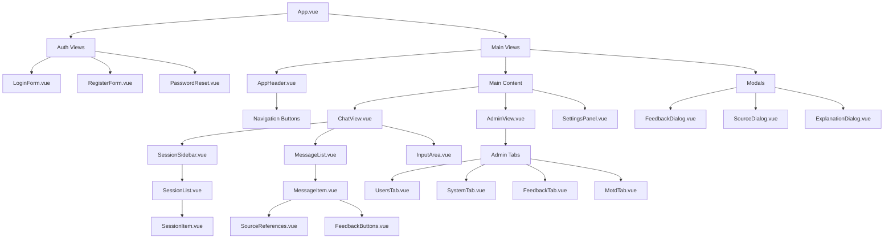
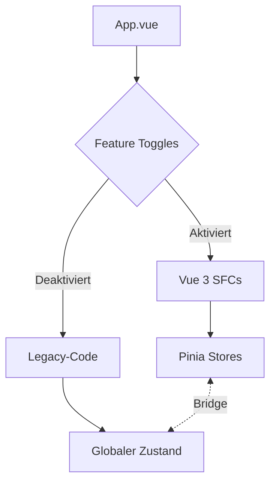

# Komponentenhierarchie des nscale DMS Assistenten

Dieses Dokument zeigt die geplante Komponentenhierarchie der Vue 3 Single-File Components (SFCs) für den nscale DMS Assistenten.

## Übersicht



## Detaillierte Beschreibung

### Hauptkomponenten

- **App.vue**: Haupteinstiegspunkt der Anwendung, verwaltet den Authentifizierungszustand
- **AppHeader.vue**: Navigationsleiste mit Buttons für verschiedene Ansichten
- **MainContent**: Container für die Hauptansichten (Chat, Admin, Einstellungen)

### Authentifizierungs-Komponenten

- **LoginForm.vue**: Anmeldeformular für Benutzer
- **RegisterForm.vue**: Registrierungsformular für neue Benutzer
- **PasswordReset.vue**: Formular zur Zurücksetzung des Passworts

### Chat-Komponenten

- **ChatView.vue**: Hauptkomponente für den Chat-Bereich
- **SessionSidebar.vue**: Seitenleiste mit Sitzungshistorie
- **SessionList.vue**: Liste aller Sitzungen
- **SessionItem.vue**: Einzelne Sitzung in der Liste
- **MessageList.vue**: Liste aller Nachrichten in der aktuellen Sitzung
- **MessageItem.vue**: Einzelne Nachricht mit Formatierung und Aktionen
- **InputArea.vue**: Eingabebereich für neue Nachrichten

### Admin-Komponenten

- **AdminView.vue**: Hauptkomponente für den Admin-Bereich
- **UsersTab.vue**: Benutzerverwaltung
- **SystemTab.vue**: Systemüberwachung und -aktionen
- **FeedbackTab.vue**: Übersicht über Benutzerfeedback
- **MotdTab.vue**: Verwaltung der Mitteilungen des Tages (MOTD)

### Einstellungs-Komponenten

- **SettingsPanel.vue**: Panel für Benutzereinstellungen

### Modal-Komponenten

- **FeedbackDialog.vue**: Dialog für detailliertes Feedback
- **SourceDialog.vue**: Dialog zur Anzeige von Quelleninformationen
- **ExplanationDialog.vue**: Dialog zur Erklärung von Antworten

### UI-Komponenten

- **NScaleButton.vue**: Wiederverwendbare Button-Komponente
- **NScaleInput.vue**: Wiederverwendbare Eingabefeld-Komponente
- **NScaleCard.vue**: Wiederverwendbare Karten-Komponente
- **NScaleAlert.vue**: Wiederverwendbare Benachrichtigungs-Komponente
- **MotdDisplay.vue**: Anzeige von Mitteilungen des Tages

## Datenfluss

```mermaid
flowchart TD
    subgraph "Stores"
        AuthStore[Auth Store]
        SessionStore[Session Store]
        UIStore[UI Store]
        FeedbackStore[Feedback Store]
        SourceStore[Source Store]
        MotdStore[MOTD Store]
    end
    
    subgraph "Composables"
        useAuth[useAuth]
        useChat[useChat]
        useSession[useSession]
        useFormatter[useFormatter]
    end
    
    subgraph "Components"
        App[App.vue]
        ChatView[ChatView.vue]
        MessageItem[MessageItem.vue]
        AdminView[AdminView.vue]
    end
    
    App --> AuthStore
    App --> UIStore
    
    ChatView --> SessionStore
    ChatView --> useChat
    
    MessageItem --> FeedbackStore
    MessageItem --> SourceStore
    MessageItem --> useFormatter
    
    AdminView --> AuthStore
    AdminView --> MotdStore
    
    useAuth --> AuthStore
    useChat --> SessionStore
    useSession --> SessionStore
</flowchart>
```

## Kompositionsfunktionen

1. **useAuth**: Verwaltet Authentifizierung und Benutzerdaten
2. **useChat**: Stellt Chat-Funktionalität bereit
3. **useSession**: Verwaltet Chat-Sitzungen
4. **useFeedback**: Verwaltet Feedback-Funktionalität
5. **useMotd**: Verwaltet MOTD-Funktionalität
6. **useSourceReferences**: Verwaltet Quellenreferenzen
7. **useFormatter**: Stellt Formatierungsfunktionen bereit

## Stores

1. **authStore**: Authentifizierungszustand und Benutzerinformationen
2. **sessionStore**: Chat-Sitzungen und Nachrichten
3. **uiStore**: UI-Zustände wie aktive Ansicht und Layout-Einstellungen
4. **feedbackStore**: Feedback-Status und -Aktionen
5. **sourceStore**: Quellenreferenzen und Erklärungen
6. **motdStore**: MOTD-Konfiguration und -Inhalt
7. **featureToggleStore**: Feature-Toggles für schrittweise Migration

## Migration und Koexistenz

Die neue Komponentenstruktur wird schrittweise eingeführt, wobei das Feature-Toggle-System die Aktivierung und Deaktivierung neuer Komponenten ermöglicht. Das Bridge-Muster wird verwendet, um den alten und neuen Code zu integrieren:



Die Bridge-Komponente stellt sicher, dass Änderungen in beiden Systemen synchronisiert werden, was eine schrittweise Migration ohne Beeinträchtigung der Funktionalität ermöglicht. Durch diesen Ansatz können wir die Vorteile der Vue 3 Single-File Components nutzen, während wir die Stabilität der Anwendung gewährleisten.